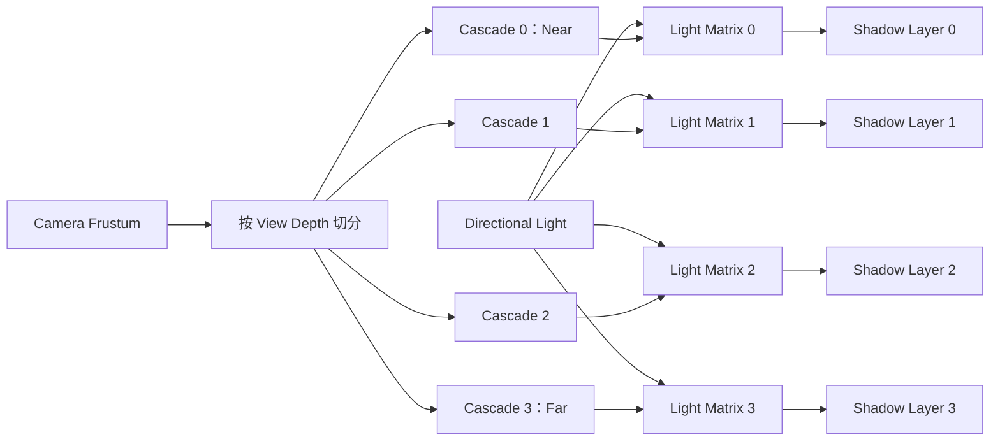

# Cascaded Shadow Maps（CSM）：技术原理、稳定化与增量更新工程设计

- 状态：技术研究与项目接入设计完成；尚未实现 CSM，尚无 CSM 正式性能数据
- 日期：2026-07-29
- 适用项目：OpenGL_Learn，OpenGL 3.3，Forward / Deferred，Directional Shadow

> 本文是设计报告，不是已经完成的性能报告。文中的结构、公式、失效规则和实验方案可以作为实现依据；任何性能百分比都必须等实现完成并按 1920×1080、三轮独立运行重新测量后再填写。

---

## 1. 一句话概括

CSM 的本质不是简单地“给太阳光多画几张 Shadow Map”，而是把 Directional Shadow 从一张覆盖整个范围、空间密度固定的深度图，改造成按相机距离分层的阴影空间 LOD：

```text
近处：小范围、高 Texel 密度、高质量
远处：大范围、低 Texel 密度、低质量
```

它主要解决大视距场景中单张 Directional Shadow Map 的透视走样问题，但代价是：

- 一盏 Directional Light 需要多个 Shadow Pass；
- Caster 可能被重复提交到多个 Cascade；
- 阴影资源和 Lighting 采样成本增加；
- Camera 进入 Shadow Cache 的依赖域；
- Cascade 边界、稳定性和失效规则需要单独设计。

因此，CSM 首先是一项质量与覆盖范围技术，不应在没有实验前直接包装成性能优化。真正的增量性能空间来自后续的：

- Per-Cascade Cache；
- Per-Cascade Caster Culling；
- Stable Projection / Texel Snapping；
- Static / Dynamic Shadow 分层；
- Dirty Region、Tile 或 Virtual Page。

---

## 2. 当前项目基线：它还不是 CSM

当前项目的每盏 `DirectionLight` 只有：

```text
1 个 FBO
1 张 2D Depth Texture
1 个 Light-Space Matrix
1 个 ShadowMapCacheState
```

主要代码位置：

- `Light.h`：`DirectionLight`、单个 `shadowFBO` 与 `shadowCache`；
- `Light.cpp`：`DirectionLight::GetLightSpaceMatrix()`；
- `Scene.cpp`：`FitDirectionalShadowToCasterBounds()`；
- `Scene.cpp`：`RenderShadowMapUpdate()` 中的 Directional Shadow Pass；
- `pbrFragment.glsl`、`phongFragment.glsl`、`deferFragment.glsl`：每盏 Directional Light 只采样一个 `sampler2D`。

当前自动拟合有两条路径：

1. 默认 Scene Sphere Fit；
2. 可选 Light-Space Caster AABB Fit。

现有实现已经具备一些可以复用到 CSM 的基础：

- 正交 Directional Shadow Projection；
- Light-Space Bounds；
- Shadow Texel Snapping；
- Per-Light Revision Cache；
- FBO / Texture / Resource Generation 校验；
- Shadow Caster Draw List；
- Light-Space Caster Culling；
- Directional Fit CPU/GPU 遥测；
- Shader、FBO、分辨率、Caster 变化的失效处理。

但当前 Directional Shadow 覆盖的是场景 Caster 范围，而不是按 Camera Frustum 分层。相机移动不会改变 Directional Shadow Matrix，因此在已经完成的 Point + Camera 实验里，Directional Shadow 可以持续 Cache Hit。

CSM 会改变这一点：Cascade 由 Camera Frustum 定义，所以 Camera Position、Direction、FOV、Aspect、Near/Far 或 Shadow Distance 变化，都可能改变 Cascade Matrix。

---

## 3. 为什么单张 Directional Shadow Map 在大场景中不够

Directional Light 使用正交投影。假设一张分辨率为 `R × R` 的 Shadow Map 在 Light-Space X 方向覆盖 `W` 个世界单位，则：

```text
worldUnitsPerTexel = W / R
```

例如：

```text
Shadow Map = 2048 × 2048
覆盖宽度   = 400 m

1 Texel ≈ 400 / 2048 = 0.195 m
```

此时一个宽度约 0.5 m 的人物肢体只覆盖两三个 Shadow Texel。即使主画面中人物离相机很近、占据大量像素，阴影图仍然只能提供很低的空间频率，于是出现：

- 阴影轮廓锯齿；
- Camera 靠近时阴影像素化；
- PCF 只能把锯齿变软，不能恢复已经不存在的几何细节；
- 为了远处覆盖范围牺牲近处分辨率。

问题的根源是相机的 Perspective Projection：

```text
近处世界空间的一小块区域
    → 会占据大量屏幕像素

远处世界空间的一大块区域
    → 只占据少量屏幕像素
```

而单张正交 Shadow Map 给每个世界空间区域分配相同密度。Shadow Texel 密度与屏幕像素需求不匹配，这就是 CSM 主要针对的 Perspective Aliasing。

---

## 4. CSM 的核心抽象：按视距划分阴影空间

设 Camera Shadow Near 为 `n`，Shadow Distance 为 `f`，Cascade 数量为 `m`。CSM 在 View-Space 深度方向设置：

```text
C0 = n
C1
C2
...
Cm = f
```

每个 Cascade 覆盖：

```text
Cascade i = [Ci, C(i+1)]
```

例如四级 CSM：

```text
Camera
  │
  ├── Cascade 0：0.1 ～ 12.8 m
  ├── Cascade 1：12.8 ～ 26.6 m
  ├── Cascade 2：26.6 ～ 46.4 m
  └── Cascade 3：46.4 ～ 100 m
```

每一级都从同一个 Directional Light 方向生成独立的正交 Shadow Map。



Lighting Pass 根据当前 Fragment 的线性 View-Space Depth 选择对应 Cascade。

### 4.1 Cascade 是视锥区间，不是 Mipmap 层

CSM 与 Mipmap 都有“Level”的概念，但 Cascade 并不是上一层 Shadow Texture 的缩小副本。

CSM 的逻辑关系是相邻的 Camera Depth 区间：

```text
Cascade 0 = [Camera Near, Split 1)
Cascade 1 = [Split 1, Split 2)
Cascade 2 = [Split 2, Split 3)
Cascade 3 = [Split 3, Shadow Distance]
```

除用于消除接缝的 Transition Band 外，各级在选择意义上主要负责不同的 Receiver 距离范围。它们不是：

```text
完整 Shadow Map
    → 缩小 1/2
        → 再缩小 1/2
```

而是：

```text
同一个 Directional Light
    → 为不同 Camera Frustum Slice
        → 分别计算 Light Matrix
            → 分别重新渲染 Shadow Depth
```

### 4.2 CSM 与 Mipmap 共享同一种 LOD 思想

二者共同遵循：

> 数据采样密度应该匹配最终屏幕真正需要的密度。

从视觉直觉上看：

```text
靠近相机
    → 屏幕占用大
        → 需要更高空间频率

远离相机
    → 屏幕占用小
        → 可以使用更低空间频率
```

因此可以把 CSM 理解为 Shadow 系统中的一种空间 LOD。但它与 Mipmap 的“Level 内容”和“选级依据”不同。

| 维度 | CSM | Mipmap |
|---|---|---|
| 被分级的对象 | Camera Frustum / Shadow Projection | 同一张纹理 |
| 每级内容 | 使用不同 Light Matrix 重新渲染 | 从上一级预过滤/降采样 |
| 主要选级依据 | Receiver 的线性 View-Space Depth | 屏幕像素的 Texture Footprint |
| 常见输入 | Fragment World Position、View Matrix、Split | UV 的 `dFdx` / `dFdy`、Texture Size |
| 每级覆盖 | 不同 Camera Depth 区间 | 相同纹理内容 |
| 解决问题 | Directional Shadow Perspective Aliasing | Texture Minification Aliasing |
| 能否增加近处原始细节 | 可以，通过更小 Shadow Projection 重绘 | 不可以，只能保留或减少已有细节 |

### 4.3 Mipmap 的选级并不直接读取相机距离

“远处使用粗糙纹理、近处使用精细纹理”是正确的常见结果，但不是 Mipmap 的严格判定规则。

GPU 更接近于计算：

```text
一个屏幕像素
    → 在纹理空间覆盖了多少原始 Texel
```

如果一个 Pixel 约覆盖：

```text
1 × 1 Texel → Mip 0
2 × 2 Texel → Mip 1
4 × 4 Texel → Mip 2
8 × 8 Texel → Mip 3
```

粗略的各向同性 LOD 可以表达为：

```text
rhoX = length(dUVdx * textureSize)
rhoY = length(dUVdy * textureSize)
rho  = max(rhoX, rhoY)
lod  = log2(rho)
```

其中 `dUVdx`、`dUVdy` 来自相邻 Fragment 的纹理坐标变化。

Camera Distance 经常让纹理在屏幕上缩小，所以它与 Mip Level 高度相关，但不是唯一因素：

- 很近但接近掠射角的地面，沿某一方向仍可能覆盖大量 Texel；
- 很远但尺寸巨大的广告牌，仍可能需要较细 Mip；
- Camera FOV、屏幕分辨率、模型缩放和 UV Tiling 都会影响 Texture Footprint；
- 各向异性表面可能在 X/Y 两个方向需要不同采样尺度。

因此更准确的描述是：

```text
Mipmap 按屏幕空间 Texture Footprint 选级；
距离只是影响 Footprint 的重要原因之一。
```

### 4.4 CSM 通常按 Receiver 的 View Depth 选级

CSM 第一版一般不使用 UV Derivative 选择 Cascade，而是使用当前正在着色的 Receiver Fragment：

```text
viewDepth = -(ViewMatrix * WorldPosition).z
```

再与 Cascade Split 比较：

```text
viewDepth < Split 1 → Cascade 0
viewDepth < Split 2 → Cascade 1
viewDepth < Split 3 → Cascade 2
otherwise           → Cascade 3
```

这里选择依据是 Receiver，不是 Caster：

- 地面 Fragment 在 8 m：采样 Near Cascade；
- 建筑 Fragment 在 70 m：采样 Far Cascade；
- Camera 外的建筑即使不可见，只要可能给该 Receiver 投影，仍需进入对应 Shadow Pass。

这也是为什么 Cascade Shader 需要当前 Fragment 的 World Position、View Depth 和对应的 Light Matrix。

### 4.5 “每一级是上一级的 1/4”什么时候成立

如果每一级 Shadow Texture 都保持相同分辨率，例如 `2048²`，但世界空间覆盖边长逐级扩大两倍：

| Cascade | 世界覆盖边长 | 覆盖面积 | Texture |
|---|---:|---:|---:|
| 0 | 20 m | 400 m² | 2048² |
| 1 | 40 m | 1,600 m² | 2048² |
| 2 | 80 m | 6,400 m² | 2048² |
| 3 | 160 m | 25,600 m² | 2048² |

则：

```text
边长扩大 2 倍
    → 面积扩大 4 倍
        → 单位面积获得的 Shadow Texel 数约变成 1/4
```

这个“1/4”描述的是单位世界面积的 Texel Density，不一定是 Shadow Texture 本身缩小到 `1/4`。

对应的线性世界精度是：

```text
worldUnitsPerTexel = worldWidth / resolution
```

边长扩大两倍时，每个 Texel 覆盖的世界长度扩大两倍，面积扩大四倍。

实际 CSM 不要求固定的两倍比例。Practical Split 会根据 Near、Shadow Distance、Cascade Count 与 Lambda 生成不均匀区间。

### 4.6 为什么 Shadow Map 的 Mipmap 不能替代 CSM

假设一张覆盖 400 m 的单张 Shadow Map，在人物附近只分配到约 10 个 Texel。

生成 Mipmap 后只能得到：

```text
Mip 0：10 个有效细节 Texel
Mip 1：约 5 个
Mip 2：约 2～3 个
Mip 3：约 1 个
```

Mipmap 能降低 Minification 时的走样，却不能把已经不存在的近景细节增加到 100 个 Texel。

CSM 的做法是为 Near Cascade 改变 Light Projection：

```text
原来 2048² 覆盖 400 m
    ↓
Near Cascade 的 2048² 只覆盖 20 m
```

因此近景从深度生成阶段就获得更多 Shadow Texel，而不是对一张低密度结果做后处理。

此外，普通 Color Texture 的 Mipmap 是对颜色做预过滤；Shadow Map 保存的是遮挡深度。简单平均深度不等价于正确阴影：

- 一个区域内可能同时存在近处 Caster 与远处背景；
- 平均深度可能代表一个现实中不存在的表面；
- Depth Compare、PCF、PCSS、Min/Max Depth Pyramid 各自需要不同的归约语义；
- Shadow Mipmap 可以服务于 Filter、Blocker Search 或层次剔除，但不能代替 Near Cascade 的独立高密度投影。

所以最准确的记忆是：

```text
Mipmap
    = 同一纹理内容的采样 LOD

CSM
    = Directional Shadow Projection 的空间 LOD
```

---

## 5. Cascade Split 怎样计算

### 5.1 Uniform Split

均匀切分：

```text
C_uniform(i) = n + (f - n) * i / m
```

优点：

- 简单；
- 每段世界空间长度一致；
- 远处分配较多空间。

缺点：

- 近处仍可能分配不足；
- 没有充分适配透视投影的非线性屏幕密度。

### 5.2 Logarithmic Split

对数切分：

```text
C_log(i) = n * (f / n)^(i / m)
```

优点：

- 更接近透视走样的理论均匀分布；
- 给近处分配更高 Shadow Texel 密度。

缺点：

- Near/Far 比值很大时，最前面的 Cascade 可能过窄；
- 远处 Cascade 可能过大；
- 实际场景容易出现近处过采样、远处不足。

### 5.3 Practical Split

常用做法是在 Uniform 与 Logarithmic 之间插值：

```text
C(i) =
    lambda * C_log(i)
    + (1 - lambda) * C_uniform(i)
```

其中：

```text
lambda = 0     → 完全 Uniform
lambda = 1     → 完全 Logarithmic
lambda ≈ 0.5   → 常见初始值
```

以：

```text
n = 0.1
f = 100
m = 4
lambda = 0.5
```

为例，近似得到：

```text
0.1, 12.8, 26.6, 46.4, 100
```

这不是通用最优值。最终参数需要结合：

- Camera Near；
- Shadow Distance；
- 场景尺度；
- Cascade 数量；
- 每级分辨率；
- 实际屏幕空间阴影误差；
- GPU 预算。

### 5.4 Shadow Distance 不应直接等于 Camera Far

Camera Far 可能是 500 m、1000 m，甚至更远，但这不代表所有区域都值得实时阴影。

应独立配置：

```text
cameraFar       = 几何可见距离
shadowDistance  = 动态 Directional Shadow 距离
```

超过 Shadow Distance 后可以：

- 不再使用实时阴影；
- 淡出到无阴影；
- 使用静态烘焙阴影；
- 使用低频远景 Cascade；
- 使用非常低分辨率的 Far Shadow。

Shadow Distance 是 CSM 质量、成本和稳定性中最敏感的参数之一。

---

## 6. 如何从 Camera Frustum 得到每级 Light Matrix

### 6.1 构造 Cascade Frustum 八个角点

先得到 Camera 整体 Frustum 在世界空间中的八个角点：

```text
Near Plane：4 个角点
Far Plane： 4 个角点
```

对于每条从 Near Corner 指向 Far Corner 的射线，根据 Cascade 的归一化深度比例插值得到该级近远平面的角点。

设：

```text
tNear = (Ci     - n) / (f - n)
tFar  = (Ci + 1 - n) / (f - n)
ray   = farCorner - nearCorner
```

则：

```text
cascadeNearCorner = nearCorner + ray * tNear
cascadeFarCorner  = nearCorner + ray * tFar
```

最终每级得到八个 World-Space Corner。

### 6.2 建立 Directional Light Basis

沿用当前项目已有的稳健 Light Basis：

```text
lightForward  = normalize(direction)
lightRight    = normalize(cross(lightForward, usableUp))
lightUp       = normalize(cross(lightRight, lightForward))
```

当 Direction 与世界 Y 轴几乎平行时，需要换用 X 轴作为 `usableUp`，避免叉积退化。

### 6.3 Fit-to-Cascade

把当前 Cascade 的八个角点变换到 Light Space，聚合：

```text
minX, maxX
minY, maxY
minZ, maxZ
```

然后构建：

```text
LightProjection = Ortho(minX, maxX, minY, maxY, nearZ, farZ)
```

优点：

- 每一级使用率高；
- 浪费的 Shadow Texel 少。

缺点：

- Camera 转动时 Frustum 在 Light Space 中的 AABB 尺寸会伸缩；
- 即使 Camera 位置不变，Shadow Projection 也可能连续变化；
- 容易产生 Shimmering；
- 缓存命中率低。

### 6.4 Stable Sphere Fit

另一种做法是使用能够包围 Cascade Frustum 的 Sphere：

```text
cascadeCenter = 8 个角点的中心
radius        = max(distance(corner, cascadeCenter))
```

然后使用正方形正交范围：

```text
[-radius, radius] × [-radius, radius]
```

优点：

- Camera 旋转时范围尺寸更稳定；
- 更容易做 Texel Snapping；
- 时间稳定性和缓存友好性更好。

缺点：

- 相比 Tight AABB 会浪费一部分 XY 面积；
- 相同分辨率下世界单位/Texel 更大。

这是典型的质量密度与时间稳定性权衡：

```text
Tight Fit
    → 更高空间利用率
    → 更容易随 Camera 抖动

Stable Sphere Fit
    → 略低空间利用率
    → 更稳定、更容易缓存
```

### 6.5 Z 范围不能只看可见 Receiver

Cascade XY 范围由当前 Receiver Frustum 决定，但 Z 范围不能简单裁到这八个角点。

原因是：

```text
一个位于 Camera 视锥外的物体
    → 仍可能沿太阳方向
    → 给视锥内的 Receiver 投下阴影
```

因此需要把潜在 Caster 纳入 Light-Space Z：

- 使用完整场景 Caster Bounds 的 Z；
- 或对 Cascade Receiver Volume 沿反光方向挤出；
- 或通过 Spatial Index 查询能影响该 Cascade 的 Caster；
- 无法可靠分类时使用保守 Scene Z Bounds。

只使用 Camera-visible Caster 会产生“屏幕外物体不投影”的错误。

---

## 7. CSM 的资源布局

### 7.1 多张独立 2D Texture

```text
Cascade 0 → Texture 0
Cascade 1 → Texture 1
Cascade 2 → Texture 2
Cascade 3 → Texture 3
```

优点：

- 最容易从当前单张 `shadowFBO` 演进；
- 每级可以使用不同分辨率；
- 调试直观。

缺点：

- 占用多个 Texture Unit；
- 当前 Shader 最多支持多盏 Directional Light，Sampler 数量会快速膨胀；
- Shader 中动态索引 Sampler Array 的兼容性不如 Texture Array 简洁。

### 7.2 Shadow Atlas

把多个 Cascade 放在一张大 Texture 的不同 Viewport：

```text
+-----------+-----------+
| Cascade 0 | Cascade 1 |
+-----------+-----------+
| Cascade 2 | Cascade 3 |
+-----------+-----------+
```

优点：

- 一个 Sampler；
- 容易做不同大小的区域；
- 可与其他 Shadow Map 共享 Atlas。

缺点：

- PCF 需要 Guard Border；
- UV Scale / Bias 更复杂；
- Filter 可能跨 Cascade 泄漏；
- Atlas 生命周期与碎片管理更复杂。

### 7.3 Texture 2D Array

推荐的第一版项目方案：

```text
GL_TEXTURE_2D_ARRAY
Layer 0 → Cascade 0
Layer 1 → Cascade 1
Layer 2 → Cascade 2
Layer 3 → Cascade 3
```

优点：

- 只占用一个 Texture Unit；
- 每层尺寸一致；
- Shader 使用 `sampler2DArrayShadow`；
- 不存在 Atlas 横向 Filter 泄漏；
- OpenGL 3.3 可以通过 Layer Attachment 逐层渲染。

缺点：

- 每一级必须使用相同分辨率和格式；
- FBO Manager 需要支持 Array Texture 与 Layer Attachment；
- 不能直接通过不同层尺寸节省 Far Cascade 显存。

### 7.4 显存模型

假设 Depth 格式按 4 Byte/Texel 统计：

```text
memory = cascadeCount * resolution² * 4
```

单张 2048²：

```text
2048² × 4 = 16 MiB
```

四级 2048²：

```text
4 × 2048² × 4 = 64 MiB
```

这意味着 CSM 可能让单盏 Directional Shadow 的深度资源从 16 MiB 增加到 64 MiB。

因此正式报告必须同时记录：

- Directional Shadow Target Bytes；
- Total Render Target Bytes；
- Texture Count；
- FBO Count；
- Resource Generation；
- 分辨率与 Cascade 数量。

不能只报告画质或 GPU 时间。

---

## 8. Shadow Pass 怎样渲染

每一帧先构建 Cascade 数据：

```text
Split Depths
    → Frustum Corners
        → Light-Space Bounds
            → Stable Snap
                → Light Matrix
```

然后逐 Cascade：

```text
for each cascade:
    bind corresponding layer
    clear depth
    cull casters against cascade light volume
    render selected casters
```

当前项目的：

```cpp
glClear(GL_DEPTH_BUFFER_BIT);
RenderScene(*shadowShader);
```

需要演进为：

```cpp
for (Cascade& cascade : cascades) {
    AttachLayer(cascade.layer);
    glClear(GL_DEPTH_BUFFER_BIT);
    RenderShadowCasters(
        shadowShader,
        cascade.lightViewProjection,
        cascadeIndex);
}
```

但不能只是机械地把当前场景画四遍。必须同步增加：

- Per-Cascade Frustum Culling；
- 每级提交 Mesh/Triangle 统计；
- 重叠提交倍率统计；
- Alpha-tested Caster 正确性；
- Cache Hit / Miss；
- 独立 GPU Zone。

---

## 9. Lighting Pass 怎样选择 Cascade

### 9.1 使用线性 View-Space Depth

不要用非线性的 Device Depth 直接与 Cascade Split 比较。

推荐使用：

```text
viewDepth = -viewSpacePosition.z
```

然后：

```text
if viewDepth < splitDepth[0] → Cascade 0
else if viewDepth < splitDepth[1] → Cascade 1
...
```

### 9.2 Interval-Based Selection

优点：

- 快；
- 与按 Camera Depth 切分的定义一致；
- 适合本项目第一版。

Shader 需要：

```glsl
uniform int cascadeCount;
uniform float cascadeSplits[MAX_CASCADES];
uniform mat4 cascadeMatrices[MAX_CASCADES];
uniform sampler2DArrayShadow cascadeShadowMap;
```

### 9.3 Map-Based Selection

另一种方法是从近到远尝试 Cascade Matrix，选择 UV 落在有效范围内的最细一级。

优点：

- Tight Fit 时更充分利用每张 Map；
- 某些 Cascade 不完全对齐时覆盖更灵活。

缺点：

- 每像素需要多次坐标变换或边界判断；
- 控制流更复杂；
- Debug 难度更高。

第一版建议使用 Interval-Based Selection。

### 9.4 Cascade Transition Blend

如果在边界处直接切换：

```text
Cascade 0 的 Texel Density
    突然变成
Cascade 1 的 Texel Density
```

可能出现明显接缝和跳变。

可以在边界设置 Blend Band：

```text
[split - blendWidth, split]
```

在 Band 内同时采样当前与下一级：

```text
shadow = lerp(shadowNear, shadowFar, blendWeight)
```

代价是边界区域需要两次 Shadow Filter。

需要记录：

- Blend Width；
- 双 Cascade 采样像素比例；
- Blend GPU 成本；
- 过渡区是否出现亮线、暗线或 Bias 不一致。

---

## 10. Bias 与 Filter 必须按 Cascade 缩放

当前项目已经依据 Directional Shadow 的 `worldUnitsPerTexel` 构造 Bias 参数。CSM 中每一级覆盖范围不同：

```text
worldUnitsPerTexel[i] =
    cascadeWorldWidth[i] / cascadeResolution[i]
```

因此不能继续给整盏 Directional Light 只使用一组 Bias。

每一级至少应维护：

```text
constantBias[i]
slopeBias[i]
normalBias[i]
worldUnitsPerTexel[i]
filterRadiusTexels[i]
```

否则可能出现：

- Near Cascade 正常，Far Cascade Acne；
- Near Cascade Peter Panning；
- Cascade 边界两侧阴影宽度不同；
- Blend Band 中两次采样结果不连续。

对于保持固定世界空间 Filter Radius 的方案：

```text
filterRadiusTexels[i] =
    desiredWorldRadius / worldUnitsPerTexel[i]
```

对于保持固定 Texel Kernel 的方案，远处阴影在世界空间中会更软。

二者必须明确选择，不能无意混用。

---

## 11. Stable CSM：为什么 Camera 一动阴影会闪

### 11.1 Shimmering 的来源

如果每帧根据当前 Frustum 做 Tight Fit：

```text
Camera 移动或转动一点
    → Light-Space Bounds 连续变化
        → World Position 对应的 Shadow UV 连续变化
            → 阴影边缘在 Shadow Texel 间游走
```

即使场景与太阳完全静止，阴影也会在屏幕上抖动。

### 11.2 Texel Snapping

设当前 Cascade 的世界空间 Texel 大小为：

```text
texelSizeX = cascadeWidth  / resolution
texelSizeY = cascadeHeight / resolution
```

将 Light-Space Center 对齐到整数 Texel：

```text
snappedX = round(centerX / texelSizeX) * texelSizeX
snappedY = round(centerY / texelSizeY) * texelSizeY
```

Camera 在小于一个 Shadow Texel 的范围内移动时，Cascade Projection 保持不动；跨过边界后只移动整数 Texel。

### 11.3 仅 Snap Center 还不够

如果 Cascade Width / Height 每帧也在变化：

```text
texelSize 本身变化
    → 即使 Center Snap
    → World-to-Shadow 映射仍然变化
```

因此 Stable CSM 通常还需要：

- 固定或量化 Cascade Extent；
- Stable Sphere Fit；
- 对分辨率变化增加 Hysteresis；
- FOV / Aspect 改变时明确全失效；
- Camera Rotation 时避免 Tight AABB 连续伸缩。

当前项目的 Scene Sphere Fit 与 Texel Snap 思想可以复用，但需要把粒度从整盏 Directional Light 下沉到每个 Cascade。

---

## 12. CSM 会改变现有 Per-Light Cache 的依赖关系

当前单张 Directional Shadow 内容可以抽象为：

```text
DirectionalShadow =
    F(
        CasterState,
        LightDirection,
        DirectionalFit,
        Shader,
        RenderTarget
    )
```

当前 Camera 不在这个函数里，所以 Camera-only 运动不应使 Directional Shadow 失效。

CSM 内容变成：

```text
CascadeShadow[i] =
    F(
        CasterState,
        LightDirection,
        CameraFrustum,
        CascadeSplits,
        CascadeFit[i],
        StableAnchor[i],
        Shader,
        RenderTargetLayer[i]
    )
```

Camera 现在是合法依赖。

这意味着已经完成的 Point + Camera Per-Light Benchmark：

```text
A：3 updates
B：1 Point update + 2 hits
```

不能直接套用到启用 CSM 的场景。启用 CSM 后，Camera 运动可能使 Directional Cascade 合法失效，正确结果可能是：

```text
Point 更新
+ 部分或全部 Directional Cascades 更新
+ Spot Hit
```

因此必须保留两个独立 Workload：

1. `timeline-point-camera`：关闭 CSM，继续证明 Per-Light Cache；
2. `timeline-csm-camera`：启用 CSM，测量 Stable Cascade 与增量更新。

不能为了维持 `3 → 1` 的漂亮数字而错误地忽略 Camera 对 CSM 的依赖。

---

## 13. Per-Cascade Cache 应该怎样设计

### 13.1 Cache Entry

建议每个 Cascade 独立维护：

```cpp
struct DirectionalCascadeCacheEntry {
    bool valid;
    bool contentSampleable;

    std::size_t logicalSignature;

    unsigned int framebufferID;
    unsigned int textureID;
    int layer;
    int resolution;
    std::uint64_t resourceGeneration;

    glm::mat4 publishedMatrix;
    float publishedSplitNear;
    float publishedSplitFar;
};
```

### 13.2 Cascade Signature

至少包含：

- Directional Light Direction；
- Cascade Count；
- 当前 Cascade Index；
- Split Near / Far；
- Camera View / Projection 的量化后依赖；
- Shadow Distance；
- Stable Fit Mode；
- Light-Space Matrix；
- XY Extent；
- Z Range；
- World Units Per Texel；
- Bias / Filter Guard 配置；
- Caster Revision 或 Cascade-Caster Revision；
- Shadow Shader Revision；
- Resolution；
- Array Texture ID；
- Layer；
- Resource Generation。

### 13.3 为什么按 Cascade 分开

如果仍然只给整盏 Directional Light 一个 Cache Entry：

```text
Near Cascade 改变
    → 整盏灯 Miss
        → 四级全部重绘
```

Per-Cascade Entry 允许：

```text
Cascade 0 Miss
Cascade 1 Hit
Cascade 2 Hit
Cascade 3 Hit
```

但只有当每级 Matrix 与 Caster 依赖确实独立稳定时，这个收益才成立。

### 13.4 Camera 运动时是否一定全部 Miss

不一定，但不能假设一定会 Hit。

可能 Hit 的条件：

- Stable Extent 没有变化；
- Snapped Center 没有跨过 Texel；
- Split 没有变化；
- Light Direction 没有变化；
- Caster 依赖没有变化；
- Target 仍是同一资源代际。

Near Cascade 的 Texel 更小，Camera 更容易跨过一个 Texel；Far Cascade 的 Texel 更大，反而可能更长时间保持同一 Snapped Matrix。

实际 Hit 分布必须通过运动轨迹统计。

---

## 14. 完整失效矩阵

| 事件 | 逻辑影响 | 推荐失效范围 | 说明 |
|---|---|---|---|
| Camera 小幅平移，未跨 Stable Texel | Matrix 不变 | 0 | 可继续命中 |
| Camera 平移跨过 Cascade Texel | Cascade Matrix 变化 | 对应 Cascade | 可能多级变化 |
| Camera 旋转 | Frustum / Fit 变化 | 受影响 Cascade | Tight Fit 通常更敏感 |
| FOV / Aspect 变化 | Frustum 变化 | 全部 Cascade | 重建 Split Bounds |
| Camera Near 变化 | Split 变化 | 全部 Cascade | Practical Split 全变 |
| Shadow Distance 变化 | Split / Coverage 变化 | 全部 Cascade | 资源也可能变化 |
| Cascade Count 变化 | 布局变化 | 全部 Cascade | 重建资源 |
| Lambda 变化 | Split 变化 | 全部 Cascade | 不能复用旧 Matrix |
| Directional Light Direction 变化 | Light Basis 变化 | 全部 Cascade | 所有深度结果变化 |
| 静态 Caster 增删/移动 | Caster 深度变化 | 重叠 Cascade | 当前可先保守全 Cascade |
| 动态 Caster 移动 | 新旧 Bounds 变化 | 新旧覆盖 Cascade | Tile 阶段再细化 |
| Alpha Test Material 变化 | Caster 轮廓变化 | 重叠 Cascade | Base Color / Alpha Cutoff |
| Roughness / Metallic 变化 | 不影响深度 | 0 | 不应误失效 |
| Shadow Shader Reload | 深度生成规则变化 | 全部 Cascade | Revision 变化 |
| Lighting Shader Reload | 采样规则变化 | 通常不重画深度 | 重新绑定 Uniform/Sampler |
| Depth Texture 重建 | 物理内容丢失 | 对应资源全部层 | Generation 变化 |
| 单层 Attachment 失败 | 该层不可发布 | 对应 Cascade | 可降级到更粗层 |
| Resolution 变化 | Texel / Target 变化 | 对应或全部 Cascade | Texture Array 通常全重建 |
| Filter Radius 增大 | Guard 可能不足 | 受影响 Cascade | 必须重新验证边界 |

当前项目第一版可以继续使用 Scene-level Caster Revision，确保正确但会保守失效全部 Cascade。后续再引入：

```text
Caster Revision
    → Cascade Overlap Mask
        → Per-Cascade Revision
            → Dirty Tile Mask
```

---

## 15. Static / Dynamic Shadow 分层

对于“大型静态环境 + 少量移动人物”，只做 Per-Cascade Cache 仍有局限：

```text
一个人物移动
    → Scene Caster Revision 改变
        → 对应 Cascade 需要重画
            → 静态建筑也被重复提交
```

可以把每级 Shadow 内容拆成：

```text
Static Cascade
    建筑、地面、静态道具

Dynamic Cascade
    人物、车辆、动态植被
```

静态层只有在下列事件发生时更新：

- Static Caster 增删；
- Static Transform 变化；
- Alpha Material 变化；
- Light Direction / Cascade Matrix 变化；
- Shader / Target 变化。

动态层根据动态 Caster 每帧或按 Dirty Region 更新。

### 15.1 Hard Shadow 怎样组合

在同一 Light-Space Texel 上：

```text
combinedDepth = min(staticDepth, dynamicDepth)
```

Fragment 与最近深度比较即可。

### 15.2 PCF 怎样组合

不能简单假设：

```text
max(PCF(static), PCF(dynamic))
```

在所有 Filter 情况下都等价于对合并深度做 PCF。

严格做法是每个 PCF Tap：

```text
depth = min(
    sampleStaticDepth(tap),
    sampleDynamicDepth(tap)
)
compare(receiverDepth, depth)
```

然后再平均 Tap。

代价是每个 Tap 需要读取两张深度图。

另一条路线是把 Dynamic Depth 合并到工作目标，再按单张图采样，但需要额外合成、复制或局部重绘。

### 15.3 分层的价值

Static / Dynamic 分层不是 Tile 的同义词。

它减少的是：

```text
动态变化时重复提交静态几何
```

Tile 减少的是：

```text
同一 Shadow Target 中不相关区域的清除和像素更新
```

二者可以独立存在，也可以组合。

---

## 16. Directional Dirty Tile：能否真正只更新一小块

答案是可以，但前提比“设置一个 Scissor”更严格。

### 16.1 Dirty Region

动态 Caster 从旧 Bounds 移动到新 Bounds：

```text
dirtyWorldBounds =
    union(previousBounds, currentBounds)
```

将旧、新 Bounds 分别投影到当前 Cascade 的 Shadow UV：

```text
dirtyUvRect =
    union(previousProjectedRect, currentProjectedRect)
```

然后按 PCF / PCSS 最大 Filter Radius 扩张：

```text
dirtyRect += filterGuardTexels
```

最后量化到 Tile：

```text
dirtyTileMask = RasterizeRectToTileGrid(dirtyRect)
```

### 16.2 为什么旧位置也要 Dirty

如果只更新人物的新位置，旧位置的 Shadow Depth 会残留。

人物离开旧位置后，Shadow Map 需要恢复：

- 后方建筑；
- 地面；
- 其他 Caster；
- Far Depth。

所以必须同时处理旧区域与新区域。

### 16.3 为什么不能只重画移动人物

如果先清除旧区域，再只绘制移动人物：

```text
旧区域后面的静态深度丢失
    → 产生漏光或错误阴影
```

正确方案二选一：

1. 清除 Dirty Tile，重画所有覆盖该 Tile 的 Caster；
2. 保留 Static Layer，只重建 Dynamic Layer。

### 16.4 OpenGL 3.3 中的局部写入

在固定 Shadow Texture 上可以：

```cpp
glEnable(GL_SCISSOR_TEST);
glScissor(x, y, width, height);
glClear(GL_DEPTH_BUFFER_BIT);
RenderCastersForDirtyRegion();
glDisable(GL_SCISSOR_TEST);
```

启用 Scissor 后，Clear 与绘制都只修改矩形区域。

但 Scissor 主要约束 Fragment / Sample 写入。如果仍然把完整场景全部提交：

- Draw Call 没有减少；
- Vertex Shader 工作可能没有减少；
- 大 Mesh 仍然需要变换；
- 只有 Raster / Depth Fill 受益。

要获得完整收益，还需要：

- Shadow Caster Spatial Index；
- Per-Tile Caster Bin；
- Mesh / Submesh 级 Bounds；
- 必要时更细的 Mesh Chunk 或 Meshlet；
- 合并相邻 Dirty Tile，避免大量小 Draw Pass。

### 16.5 Camera 移动为什么会破坏 Tile Cache

Tile Cache 假设：

```text
同一个 Shadow Texel
    → 跨帧仍表示同一条世界空间 Light Ray
```

如果 Cascade Matrix 改变，旧 Texel 与世界空间的对应关系也改变。此时即使没有 Caster 移动，旧 Tile 内容也不能直接复用。

因此：

- Stable Projection 是 Tile Cache 的前提；
- Matrix Scale / Rotation 变化通常导致整级失效；
- 整数 Texel Translation 理论上可以滚动复用重叠区域；
- 普通原地保留旧纹理不能自动完成滚动复用；
- 更进一步才是 World-Space Clipmap 或 Virtual Page。

---

## 17. CSM、Tile、Clipmap、Virtual Shadow Map 的关系

它们解决的不是同一个问题。

| 技术 | 主要解决什么 | 粒度 |
|---|---|---|
| Single Directional Map | 基础太阳阴影 | 整张 Map |
| CSM / PSSM | 不同视距的 Shadow Texel 密度 | Cascade |
| Per-Cascade Cache | 未变化级联的跨帧复用 | Cascade |
| Static / Dynamic Split | 静态与动态几何重复提交 | 几何类别 / Layer |
| Dirty Tile | 局部区域变化 | Tile |
| Shadow Clipmap | Camera 在大世界移动时复用世界空间环带 | Clip Level / Ring |
| Virtual Shadow Map | 按需分配和缓存 Shadow Page | Page |

可以形成如下演进：

```text
Single Map
    → CSM
        → Stable CSM
            → Per-Cascade Cache
                → Static / Dynamic Split
                    → Dirty Tile
                        → Virtual Page / Clipmap
```

不应一开始就同时实现全部层级。每增加一级，都要重新定义：

- Cache Key；
- 失效传播；
- 资源所有权；
- 发布协议；
- 正确性证据；
- 性能归因。

---

## 18. 每帧算法：Build、Check、Select、Render、Publish

### 18.1 Build

```text
读取 Camera / Light / Caster 版本
    → 计算 Cascade Splits
        → 计算每级 Frustum Corners
            → 生成 Stable Light Matrix
                → 构造 Cascade Signature
```

### 18.2 Check

每级检查：

```text
logicalSignature 是否一致
target texture / layer 是否一致
resourceGeneration 是否一致
contentSampleable 是否为 true
```

### 18.3 Select

```text
Hit  → 不加入 Render Selection
Miss → 加入 Render Selection
```

如果进入 Tile 阶段：

```text
Cascade Miss
    → 判断能否证明局部 Dirty
        → 能：生成 Dirty Tile Mask
        → 不能：整级更新
```

### 18.4 Render

逐选中 Cascade：

```text
Preflight Target
    → Bind Layer
        → Clear Full Layer 或 Dirty Region
            → Cull Casters
                → Render
```

### 18.5 Publish

只有满足下列条件才 Commit：

- Shader 可用；
- FBO 完整；
- Layer Attachment 正确；
- 必须 Clear 的区域已清除；
- Caster 提交路径完整结束；
- 没有资源代际变化；
- 所有 Required Tile 都有有效内容。

### 18.6 伪代码

```cpp
BuildCascadeInputs(camera, light, scene);

for (int i = 0; i < cascadeCount; ++i) {
    CascadeState& cascade = cascades[i];
    cascade.signature = BuildCascadeSignature(i);

    if (cascade.cache.IsHit(
            cascade.signature,
            cascade.target,
            cascade.layer)) {
        ++stats.cascadeHits;
        continue;
    }

    cascade.updateMode = ClassifyUpdateMode(cascade);
    selected.push_back(i);
}

for (int i : selected) {
    CascadeState& cascade = cascades[i];

    if (!PreflightCascade(cascade)) {
        cascade.cache.Invalidate();
        continue;
    }

    const bool completed =
        cascade.updateMode == Full
            ? RenderFullCascade(cascade)
            : RenderDirtyCascadeTiles(cascade);

    if (completed) {
        cascade.cache.Commit(
            cascade.signature,
            cascade.target,
            cascade.layer);
    }
    else {
        cascade.cache.Invalidate();
    }
}
```

---

## 19. 发布协议与保守降级

### 19.1 为什么不能采样半成品 Cascade

如果一个 Cascade 已经 Clear，但 Caster 渲染中途失败：

```text
Depth Texture 物理存在
    ≠ 内容完整
    ≠ 可以安全采样
```

所以仍要区分：

```text
targetReady
contentSampleable
cacheValid
```

### 19.2 Cascade 失败时的降级顺序

推荐：

```text
当前 Cascade 无效
    → 如果更粗一级有效且覆盖当前 Fragment
        → 使用更粗 Cascade
    → 否则
        → 禁用该 Directional Shadow 采样
```

不能继续采样已经部分清除或资源代际不匹配的 Layer。

### 19.3 Tile 失败时

Tile 级更新比整级更新更难发布，因为同一 Texture Layer 中可能同时存在：

- 新版本 Tile；
- 旧版本 Tile；
- 已清除但未完成的 Tile。

可选策略：

1. 每 Tile 维护 Valid / Revision；
2. Invalid Tile 在 Lighting 中回退到更粗 Cascade；
3. 使用双缓冲 Cascade，成功后整层 Swap；
4. 在高风险情况下直接整级更新。

第一版不建议直接上 Tile 级混合发布。

### 19.4 Dirty 比例过高时

如果：

```text
dirtyTileCount / totalTileCount > threshold
```

应整级重绘，避免：

- 大量 Scissor 切换；
- 重复 Caster 查询；
- Draw Call 爆炸；
- Tile 管理成本超过节省。

Threshold 必须实测，不应凭感觉固定。

---

## 20. 性能模型：CSM 为什么可能更慢

单张 Directional Shadow 的粗略成本：

```text
C_single =
    Fit
    + CasterCull
    + DrawSubmission
    + Vertex
    + RasterDepth
```

CSM：

```text
C_CSM =
    Σ CascadeFit[i]
    + Σ CascadeCull[i]
    + Σ CascadeSubmission[i]
    + Σ CascadeVertex[i]
    + Σ CascadeRaster[i]
    + LightingCascadeSelection
    + TransitionBlend
```

一个 Caster 可能跨越多个 Cascade，因此要记录几何重复倍率：

```text
duplicationRatio =
    Σ submittedTrianglesPerCascade
    / uniqueShadowCasterTriangles
```

CSM 的目标不是让这个公式天然更小，而是在可接受成本下显著改善近处阴影质量。随后再通过 Cache 和 Culling 降低时间。

### 20.1 Per-Cascade Cache 后的摊销成本

```text
C_cached =
    BuildAndCheck
    + Σ MissCascadeCost
    + LightingCost
```

如果 Camera、Light、Caster 全静止，理想状态是：

```text
4 Cascade Hits
0 Shadow Draw
```

如果只有 Near Cascade Matrix 变化：

```text
1 Miss + 3 Hits
```

但这是否发生，取决于 Stable Fit 和实际运动轨迹。

### 20.2 Tile 后的成本

```text
C_tile =
    DirtyClassification
    + SpatialQuery
    + DirtyClear
    + DirtyCasterSubmission
    + DirtyRaster
```

收益上界与 Dirty Area 相关，但如果提交仍然是整场景：

```text
Raster 下降
Vertex / Draw 不一定下降
```

所以必须把 GPU Zone 拆到能够区分：

- Cascade Fit CPU；
- Dirty Classification CPU；
- Caster Query CPU；
- Shadow Submission CPU；
- Directional Shadow GPU；
- Lighting CSM Selection GPU；
- Transition Blend GPU。

---

## 21. 正确性风险清单

### 21.1 Cascade 边界

- 硬切换产生分辨率接缝；
- Bias 不一致产生亮线或暗线；
- PCF Kernel 跨边界时采样错误；
- Blend Band 中无效 Cascade 被误采样。

### 21.2 Temporal Stability

- Camera 平移造成 Shadow Swimming；
- Camera 旋转导致 Tight Extent 伸缩；
- FOV 变化导致所有 Split 跳变；
- Resolution Hysteresis 不足导致 FBO 抖动；
- Cascade Count 动态变化导致布局重建。

### 21.3 Caster Coverage

- 屏幕外 Caster 被错误剔除；
- 大 Mesh Bounds 过粗导致重复提交；
- Skinned Mesh Bounds 陈旧；
- Alpha-tested Material Revision 漏失效；
- 动态物体跨 Cascade 时旧区域残留。

### 21.4 Sampling

- 使用非线性 Device Depth 选错 Cascade；
- View-Space 正负号不一致；
- Texture Array Layer 索引错误；
- Compare Sampler 与 Raw Depth Sampler 状态不一致；
- Far Cascade 外错误 Clamp 到最后一层。

### 21.5 Resource Lifecycle

- Texture Array 重建但旧 Cache 仍 valid；
- Layer Attachment 指向错误；
- Resolution 改变后 Bias 仍用旧 Texel Size；
- Shader Reload 后 Matrix / Split Uniform 未更新；
- FBO Complete 但该层内容尚未发布。

---

## 22. 正确性验证方案

### 22.1 Cascade Debug Overlay

主画面按 Cascade 着色：

```text
Cascade 0：红
Cascade 1：绿
Cascade 2：蓝
Cascade 3：黄
Blend Band：混合色
```

用于确认：

- Split 顺序；
- View Depth 选择；
- Camera 运动时边界位置；
- Blend Width；
- Shadow Distance。

### 22.2 Layer Debug View

UI 显示每个 Texture Array Layer：

- Depth Min/Max；
- Non-Far Pixel Count；
- Layer Hash；
- Resolution；
- Matrix；
- Split Near/Far；
- World Units Per Texel；
- Cache Valid / Sampleable；
- Last Update Frame。

### 22.3 必测场景

1. 大型开阔地形：验证近远密度；
2. 高层建筑位于 Camera 外、影子落入视野：验证 Off-screen Caster；
3. 角色跨 Cascade 边界：验证旧位置清理与 Blend；
4. Camera 连续平移：验证 Texel Snapping；
5. Camera 连续旋转：验证 Stable Extent；
6. Camera Teleport：验证全失效；
7. Sun Direction 变化：验证全部 Cascade 更新；
8. Alpha-tested 树叶：验证材质失效；
9. FBO / Texture 重建：验证资源代际；
10. Shader Hot Reload：验证 Revision；
11. 无 Caster：验证每层 Clear 与发布；
12. Cascade Layer 创建失败：验证更粗层降级。

### 22.4 A/B 图像校验

性能 A/B 必须使用相同：

- Camera Frame；
- Sun Direction；
- Caster State；
- Cascade Splits；
- Resolution；
- Filter；
- Bias；
- Shadow Distance。

建议输出：

- 1920×1080 主画面；
- A/B 并排图；
- 绝对差异热力图；
- Cascade Color Overlay；
- 每层 Depth 图；
- Transition Band 放大 ROI；
- Camera 运动序列中的固定检查帧。

### 22.5 Temporal 指标

单帧截图无法证明 Stable CSM。还应记录固定世界空间 Probe 的：

```text
Shadow UV(frame)
Shadow Factor(frame)
Cascade Index(frame)
Cascade Matrix Hash(frame)
```

静态场景、Camera 小幅移动时，可以测量：

- Shadow UV 的非整数漂移；
- Cascade Matrix 更新次数；
- 阴影因子跳变；
- 边界切换次数；
- 非预期 Cache Miss。

---

## 23. 正式性能实验设计

### 23.1 为什么不能只用 Sponza / San Miguel

Sponza 与 San Miguel 适合：

- 大量几何提交；
- Caster Culling；
- Shadow GPU 压力；
- 回归验证。

但它们是室内/建筑密集场景，不一定能充分表现 CSM 在长视距室外场景中的质量价值。

建议增加一个确定性大型场景：

- 长距离地面或 Terrain；
- 从近到远排列的人物/柱体/植被；
- 一盏稳定太阳光；
- 一名动态角色；
- Camera 沿固定轨迹平移、旋转；
- 明确的 Cascade Boundary Crossing。

### 23.2 分阶段 A/B

#### 实验 A：质量基线

```text
A：当前单张 2048² Directional Shadow
B：4-Cascade CSM
```

目的：

- 证明近处 Shadow Texel Density 改善；
- 观察边界与 Temporal Stability；
- 不把 B 更慢自动判为失败。

#### 实验 B：Per-Cascade Culling

```text
A：CSM，每级提交所有 Caster
B：CSM，每级独立 Caster Culling
```

目的：

- 隔离重复几何提交；
- 记录每级 Candidate / Culled / Draw / Triangle。

#### 实验 C：Per-Cascade Cache

```text
A：CSM 每帧全部 Cascade 重画
B：Stable CSM + Per-Cascade Cache
```

Workload：

- Camera 小幅移动；
- Camera 跨 Texel；
- Camera 旋转；
- Static Scene；
- 单动态角色。

#### 实验 D：Static / Dynamic Split

```text
A：Caster 变化使重叠 Cascade 全量重画
B：Static Cascade Cache + Dynamic Layer
```

#### 实验 E：Dirty Tile

只在 Dry-run 统计证明局部性后执行：

```text
A：重叠 Cascade 全量更新
B：Dirty Tile + Tile Caster Bin
```

### 23.3 统一正式条件

- 1920×1080；
- Release x64；
- 同一可执行文件切换 A/B；
- 每个变体三轮独立进程；
- 每轮 1,000 测量帧；
- 100 帧外部 Warm-up；
- 15 帧内部 Warm-up；
- 顺序 `A/B/B/A/A/B`；
- 固定 60 Hz 确定性 Camera / Character 轨迹；
- 相同截图帧；
- GPU Timer Query；
- CPU Zone；
- Renderer-owned Resource 统计；
- 所有失效断言通过。

### 23.4 必须输出的表格

| 指标类别 | 指标 |
|---|---|
| GPU | Directional Shadow Median/P95/P99 |
| GPU | Lighting CSM Selection / Blend |
| Frame | GPU Frame、Wall Frame |
| CPU | Cascade Build、Caster Cull、Shadow Submit |
| Work | Cascade Updates、Hits、Draw Calls、Triangles |
| Duplication | Triangle Cascade Duplication Ratio |
| Quality | 每级 World Units Per Texel |
| Stability | Matrix Changes、UV Drift、Boundary Switches |
| Memory | Directional Target、Total Render Target |
| Correctness | Pixel Diff、Layer Hash、Fallback Count |

### 23.5 不应提前写进简历的内容

在正式实验前不能写：

- “CSM 提升了 XX% 性能”；
- “Tile 只更新 XX% 区域”；
- “Camera 移动只更新一个 Cascade”；
- “显存没有增加”；
- “画面完全一致”。

当前只能写成设计或正在实现，不能写成完成结果。

---

## 24. 推荐的项目实施顺序

### Phase 0：只做遥测，不改画面

- 记录 Camera Frustum；
- 计算 Practical Split；
- 生成 Cascade Bounds；
- 统计每级 Caster Candidate；
- 统计预计重复 Triangle；
- 估算 3 / 4 Cascade 显存；
- 不创建 Shadow Resource，不改变 Lighting。

Go / No-Go：

- 近级 World Units Per Texel 是否显著改善；
- 重复 Triangle 是否可控；
- Large Scene 是否确实需要 CSM。

### Phase 1：正确的 4-Cascade Hard Shadow

- Texture 2D Array；
- 逐 Layer FBO；
- 四组 Matrix / Split；
- Interval-Based Selection；
- Hard Shadow；
- Cascade Debug Color；
- 无 Cache、每帧全更新；
- 完整 Layer Debug。

优先正确，不急着优化。

### Phase 2：Stable CSM

- Stable Sphere Fit；
- Quantized Extent；
- Per-Cascade Texel Snap；
- Camera 平移/旋转 Probe；
- Transition Blend；
- Per-Cascade Bias。

### Phase 3：Per-Cascade Cache

- Cache Entry 下沉到 Cascade；
- Matrix / Split / Target Revision；
- Check / Select / Render / Commit；
- Camera Motion Timeline；
- 更粗 Cascade 保守降级。

### Phase 4：Per-Cascade Caster Revision

- Caster 新旧 Bounds；
- Cascade Overlap Mask；
- Static / Dynamic 分类；
- 只失效重叠 Cascade。

### Phase 5：先测局部性，再决定 Tile

Dry-run 统计：

- 每帧 Dirty Cascade 数；
- 每级 Dirty Tile 比例；
- Dirty Rect 数量；
- Tile 合并后矩形数；
- 每 Tile Caster 数；
- 全级更新退化比例；
- 分类 CPU 时间。

只有统计证明：

```text
Dirty Area 小
+ Caster Query 便宜
+ 全级退化比例低
```

才实现实际局部写入。

---

## 25. 为什么不直接从 Tile 或 Virtual Shadow Map 开始

### 25.1 CSM 已经引入新的 Camera 依赖

必须先证明：

- Frustum Split 正确；
- Stable Matrix 正确；
- Cascade Selection 正确；
- Bias / Filter 连续；
- Per-Cascade Cache 正确。

如果这些基础还没稳定，Tile 只会把错误拆得更细。

### 25.2 当前项目是 OpenGL 3.3

可以做：

- Texture Array；
- Layer Attachment；
- Scissor Dirty Rect；
- CPU Spatial Query；
- Per-Cascade Draw List。

但现代 Virtual Shadow Map 常见的：

- GPU Page Allocation；
- Compute-driven Feedback；
- Indirect Draw；
- GPU Page Table；
- Sparse Residency；

不适合作为当前项目的第一步。

### 25.3 六种状态同时存在会增加验证爆炸

如果一开始同时加入：

```text
Cascade
+ Static/Dynamic
+ Tile
+ Cache
+ Blend
+ PCSS
```

任何错误都很难定位。分阶段 A/B 才能形成可信的因果证据。

---

## 26. 与其他方案的比较

### 26.1 直接把单张 Shadow Map 提升到 4096²

优点：

- 改动小；
- 没有 Cascade 接缝；
- Camera 不进入依赖。

缺点：

- 显存从约 16 MiB 增加到约 64 MiB；
- 整个范围统一加密，远处浪费；
- Shadow GPU Fill 增加；
- 仍然不是按屏幕需求分配密度。

### 26.2 保留当前 Light-Space AABB Fit

优点：

- 已有实现；
- 对完整 Caster 范围做更紧密投影；
- Camera-independent；
- Cache 友好。

缺点：

- 仍然只有一种世界单位/Texel；
- 大视距时近处质量上限不如 CSM；
- Tight Fit 可能增加深度像素覆盖和 Fit CPU。

当前正式数据已经证明：更紧的同分辨率投影是质量选项，不天然是时间优化。

### 26.3 Camera-aligned Single Shadow Map

只覆盖 Camera 附近，可以提高近景质量。

缺点：

- 远景阴影丢失；
- Camera 进入依赖；
- 仍然没有多级密度；
- 大范围移动时容易闪烁。

### 26.4 Shadow Clipmap

适合超大世界与平移 Camera：

- 多级世界空间环带；
- 固定 Texel Density；
- Camera 移动时滚动更新新暴露区域。

比 CSM 更适合大世界时间复用，但实现和资源管理更复杂。

### 26.5 Virtual Shadow Map

这里指 Virtual Shadow Map，不是 Variance Shadow Map。

它把阴影空间拆成按需 Page：

- 可见 Receiver 请求 Page；
- Dirty Caster 失效 Page；
- 未请求 Page 不生成；
- Page 可跨帧缓存。

它是 CSM/Tile 思想的更通用版本，但明显超出当前第一阶段范围。

---

## 27. 面试中如何讲十分钟

### 第 0–1 分钟：问题

> 当前项目的一盏太阳光只有一张 2D Shadow Map。它可以覆盖完整场景，但世界单位/Texel 固定；大场景为了保留远景阴影，会牺牲相机附近的阴影密度。

### 第 1–2 分钟：核心思想

> CSM 把 Camera Frustum 按 View Depth 切成多个区间，每一级从同一太阳方向生成独立正交 Shadow Map。Near Cascade 覆盖小范围，Far Cascade 覆盖大范围，本质是 Directional Shadow 的空间 LOD。

### 第 2–3 分钟：Split

> 我会用 Practical Split，把 Uniform 与 Logarithmic Split 通过 Lambda 混合，同时把 Shadow Distance 与 Camera Far 解耦。

### 第 3–4 分钟：Matrix 与 Caster

> 每级从 Frustum 八角点构建 Light-Space Bounds，但 Z 不能只看可见 Receiver，还必须保留视锥外可能投影进来的 Caster。

### 第 4–5 分钟：稳定性

> Tight Fit 提高利用率却容易随着 Camera 旋转伸缩。我会采用 Stable Extent 与 Per-Cascade Texel Snapping，避免 Shadow UV 连续漂移。

### 第 5–6 分钟：采样

> Lighting 根据线性 View Depth 选 Cascade，在边界 Band 同时采样相邻两级，并让 Bias 与 Filter 根据每级 World Units Per Texel 缩放。

### 第 6–7 分钟：缓存

> CSM 让 Camera 成为 Shadow 的真实依赖，因此不能沿用原来 Camera-only 不失效的规则。我会把 Cache Entry 下沉到每个 Cascade，只有 Matrix、Caster、Shader 和 Target Key 都一致时才命中。

### 第 7–8 分钟：增量更新

> 对静态环境和少量动态人物，先做 Static/Dynamic 分层；再根据人物新旧 Bounds 计算 Dirty Cascade。只有统计证明 Dirty Area 足够小时，才继续做 Tile。

### 第 8–9 分钟：正确性

> 我会用 Cascade Color、逐 Layer Depth/Hash、Transition ROI、Camera Motion Probe、Off-screen Caster 和资源代际注入验证，失败时回退到更粗有效 Cascade，绝不采样半成品。

### 第 9–10 分钟：性能边界

> CSM 首先是质量技术，多个 Cascade 可能更慢、也会增加显存。正式结论必须通过 1080p、三轮独立 A/B，分别隔离 Culling、Cache、Static/Dynamic 与 Tile，不能把画质提升直接包装成性能收益。

---

## 28. 90 秒精简版

> 项目当前的 Directional Shadow 是一张覆盖完整 Caster 范围的 2D Depth Map。它稳定且容易缓存，但大场景中世界单位/Texel 固定，远景覆盖会牺牲近景阴影质量。CSM 会按相机 View Depth 把 Frustum 分成多个 Cascade，每级生成独立的正交 Shadow Map，让近处获得更高 Texel 密度、远处维持覆盖范围。
>
> CSM 与 Mipmap 共享“让数据密度匹配屏幕需求”的 LOD 思想，但不是同一种层级。Mipmap 根据 UV Derivative 推导的 Texture Footprint 选择同一纹理的降采样版本；CSM 根据 Receiver 的线性 View Depth 选择使用不同 Light Matrix 重新渲染的 Shadow Layer。Shadow Mipmap 只能减少已有细节，不能替代 Near Cascade 从投影阶段增加 Shadow Texel 密度。
>
> 真正困难的不只是多画几张图，而是稳定性和依赖建模。每级需要 Practical Split、Receiver Frustum Fit、Off-screen Caster Z 扩张、Stable Extent、Texel Snapping、Per-Cascade Bias、边界 Blend，以及独立的逻辑 Signature 和 GPU Layer 代际。CSM 使 Camera 成为合法失效源，因此现有 Point + Camera 的 `3→1` Per-Light 结论不能直接套用。
>
> 工程上我会先实现正确的 4-Cascade Hard Shadow，再加入 Stable CSM、Per-Cascade Culling 与 Cache。对于大场景少量动态人物，优先采用 Static/Dynamic 分层；只有 Dry-run 数据证明 Dirty Area 很小时才进入 Tile。正式结果仍按 1920×1080、A/B 各三轮、逐层内容、主画面和资源占用联合验证。

---

## 29. 关键代码改造索引

| 当前位置 | 当前职责 | CSM 改造 |
|---|---|---|
| `Camera.h` | FOV、View、Perspective Matrix | 暴露一致的 CSM Near / Shadow Distance 输入 |
| `Light.h` | 单个 `DirectionLight::shadowFBO` | Cascade Array Resource 与 Per-Cascade Cache |
| `Light.cpp` | 单个 Directional Matrix | Per-Cascade Stable Matrix |
| `Scene.cpp::FitDirectionalShadowToCasterBounds` | 完整 Caster Bounds Fit | Cascade Frustum / Caster Z Fit |
| `Scene.cpp::RenderShadowMapUpdate` | 单次 Directional Clear/Render | 逐 Cascade Select/Render/Commit |
| `Scene.cpp::BuildShadowCasterDrawList` | Mesh 级 Caster Registry | Per-Cascade / Tile Spatial Query |
| `ShadowMapCacheState` | Per-Light 内容发布 | 扩展 Target Layer 与 Cascade Key |
| `FBO` / `FramebuffersManager` | 2D Shadow Target | Texture Array 与 Layer Attachment |
| `pbrFragment.glsl` | 单 Matrix、单 2D Sampler | Matrix/Split Array 与 Array Shadow Sampler |
| `phongFragment.glsl` | 单级 Directional Shadow | CSM Selection / Blend |
| `deferFragment.glsl` | Deferred 单级采样 | CSM Selection / Blend |
| `deferDirLightVolumeFragment.glsl` | Directional Volume 采样 | 与其他路径统一 CSM 结构 |
| `mygui.h` | Shadow 开关与分辨率 | Cascade Count、Lambda、Distance、Debug |
| `test.cpp` | Classic Scene Benchmark | CSM Timeline、Layer Hash、失效断言 |

---

## 30. 建议的第一版配置

这只是实现起点，不是最终质量参数：

```text
Cascade Count       = 4
Split Scheme        = Practical
Lambda              = 0.5
Shadow Distance     = 100 world units
Resolution          = 2048 per layer
Layout              = Texture 2D Array
Selection           = Interval-Based
Fit                 = Stable Sphere
Center              = Per-Cascade Texel Snap
Filter              = Hard Shadow first
Transition          = Debug off, correctness完成后加入
Cache               = Phase 3
Tile                = Disabled
```

第一版只允许一盏“Primary Sun”使用 CSM。当前 Shader 最多支持多盏 Directional Light，但如果每一盏都分配四级 2048²：

```text
16 lights × 4 cascades × 16 MiB
```

资源规模不可接受。其他 Directional Light 应：

- 不投影；
- 使用单张低成本 Shadow；
- 或由明确的 Shadow Budget 决定。

---

## 31. 术语边界

| 术语 | 本文含义 |
|---|---|
| CSM | Cascaded Shadow Maps，级联阴影贴图 |
| PSSM | Parallel-Split Shadow Maps，常见 CSM Split 方法 |
| Cascade | 一个 Camera Depth 区间及对应 Shadow Map |
| Mipmap | 同一纹理内容的预过滤降采样层级，通常按 Texture Footprint 选级 |
| Texture Footprint | 一个屏幕像素在纹理空间覆盖的范围 |
| Shadow Spatial LOD | 通过不同 Shadow Projection 分配空间采样密度 |
| Shadow Distance | 实时 Directional Shadow 的最远距离 |
| Stable CSM | Extent 与 Center 做稳定化/量化的 CSM |
| Texel Snapping | 将 Light-Space Projection 对齐到 Shadow Texel |
| Dirty Cascade | 逻辑依赖变化、不能复用的级联 |
| Dirty Tile | Cascade 内需要重建的局部区域 |
| Static/Dynamic Split | 静态与动态 Caster 深度分层 |
| VSM | 必须注明是 Variance Shadow Map 还是 Virtual Shadow Map |

---

## 32. 参考资料

- Microsoft Learn：[Cascaded Shadow Maps](https://learn.microsoft.com/en-us/windows/win32/dxtecharts/cascaded-shadow-maps)。覆盖 Frustum Partition、Fit-to-Scene / Fit-to-Cascade、Interval / Map Selection、Transition Blend 与 PCF 常见问题。
- NVIDIA GPU Gems 3 Chapter 10：[Parallel-Split Shadow Maps on Programmable GPUs](https://developer.nvidia.com/gpugems/gpugems3/part-ii-light-and-shadows/chapter-10-parallel-split-shadow-maps-programmable-gpus)。覆盖 PSSM、Practical Split、Light Projection 与性能问题。
- Fan Zhang 等：[Parallel-Split Shadow Maps for Large-scale Virtual Environments](https://dl.acm.org/doi/10.1145/1128923.1128975)。PSSM 原始论文。
- Khronos OpenGL Wiki：[Scissor Test](https://wikis.khronos.org/opengl/Scissor_Test)。
- Khronos OpenGL Wiki：[Framebuffer Buffer Clearing](https://wikis.khronos.org/opengl/Framebuffer#Buffer_clearing)。说明 Scissor 会限制 Framebuffer Clear 区域。
- 本项目：[Per-Light 阴影缓存与增量更新技术原理](PER_LIGHT_SHADOW_CACHE_TECHNICAL_PRINCIPLES_CN.md)。
- 本项目：[Per-Light 1080p A/B 实验报告](PER_LIGHT_SHADOW_CACHE_BENCHMARK_CN.md)。

---

## 33. 最终技术判断

CSM 最有价值的地方，是把 Directional Shadow 的空间采样密度从“整个场景统一”改成“按 Camera 观察需求分层”：

```text
Camera Depth
    → Cascade LOD
        → Stable Light Projection
            → Per-Cascade Cache
                → Per-Cascade Caster Revision
                    → Static / Dynamic
                        → Dirty Tile / Virtual Page
```

但它会主动引入 Camera 依赖、额外 Shadow Pass、几何重复提交、边界采样和显存成本。因此正确的项目路线不是：

> 先实现最复杂的 Tile/VSM，再寻找适用场景。

而是：

> 先证明单张 Directional Shadow 在目标大场景中的质量瓶颈，再实现可验证的 CSM；随后用遥测证明哪些 Cascade、Caster 和区域具有稳定局部性，只在证据支持时继续下沉缓存粒度。

这与项目现有 Per-Light Cache 的核心原则一致：

```text
明确依赖
    → 精确定位失效范围
        → 只执行必要工作
            → 成功后发布
                → 不确定时保守降级
                    → 用画面、内容、计数、时间和资源共同验证
```
