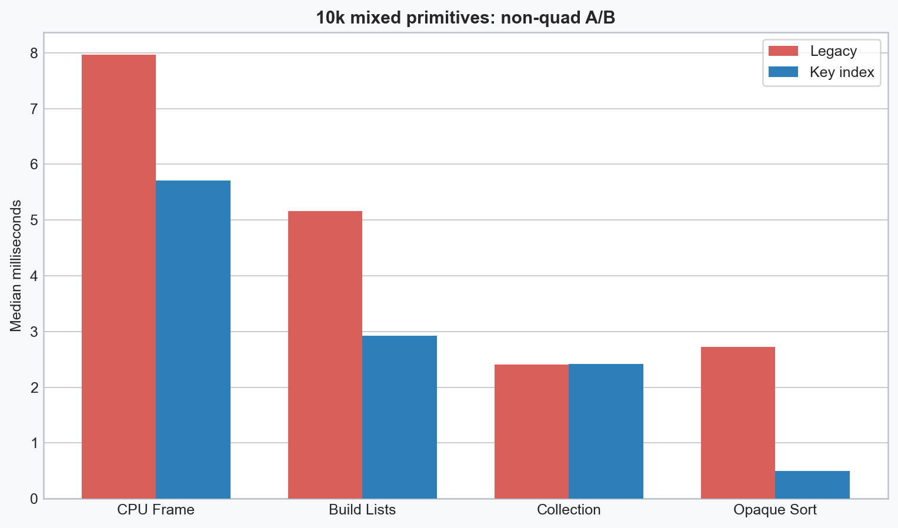

# Object-Heavy Opaque Sorting 正式实验报告

- 日期：2026-07-30T09:51:10Z
- 构建：Release x64，1920×1080，VSync 请求值 0
- 场景：30,000 个全可见不透明对象、16 材质、零灯光/阴影；20% 固定种子实际为 5,959 个动态对象
- 正式协议：每进程预热 300 帧，采样 600 帧；主 A/B 顺序 A-B-B-A-A-B
- 机器：12th Gen Intel(R) Core(TM) i7-12700KF；NVIDIA GeForce RTX 5060 Ti；驱动 32.0.15.9186
- 来源：基准提交 `12c04af1a9c8`，工作区 dirty=true；所有 A/B 使用同一 Release EXE SHA-256 `64E0C97EE8F73712620D05638EDE87B73E096995D481D1A39D63C76D8CD6C41A`
- 原始汇总：[A/B Benchmark JSON](benchmark-results/opaque-sorting/object-heavy-20260730/opaque-sorting-ab-benchmark.json)
- 运行清单：[run-manifest.json](benchmark-results/opaque-sorting/object-heavy-20260730/run-manifest.json)

> 先前约 22.84 ms 的校准只用于发现问题。本报告所有收益、图表和结论均来自本次 Release 正式采样。

## 结论

Opaque Sorting 优化成立。30k/20% dynamic 主 A/B 中，CPU Frame Median 从 23.851 ms 降到 15.258 ms，减少 8.593 ms（36.0%）；Opaque Sorting Median 从 10.158 ms 降到 1.806 ms，减少 8.353 ms（82.2%）。Draw Call、可见对象、提交签名和固定帧图像保持一致。

Retained Draw Submission 决策：**No-Go：当前证据未同时满足 Retained v1 的全部门槛。** 本 Session 到此停止，不实施 Retained v1。排序优化可以保留，但不能把剩余 Collection 写成只由静态全量重建决定。

## 主 A/B 对照

以下为三个独立进程、合计 1800 帧/变体的池化分布。降低百分比按 Median 计算；GPU 不期望因纯 CPU 排序而实质变化。

| 指标（ms） | Legacy Median | Key Index Median | B-A | 降低 |
| --- | ---: | ---: | ---: | ---: |
| CPU Frame | 23.851 | 15.258 | -8.593 | 36.0% |
| Build Draw Lists | 17.786 | 9.281 | -8.505 | 47.8% |
| Collection | 7.568 | 7.441 | -0.127 | 1.7% |
| Opaque Sorting | 10.158 | 1.806 | -8.353 | 82.2% |
| GPU Forward | 3.409 | 3.374 | -0.035 | 1.0% |

关键指标完整分布：

| 指标（ms） | 变体 | Median | P95 | P99 |
| --- | --- | ---: | ---: | ---: |
| CPU Frame | Legacy | 23.851 | 25.695 | 27.189 |
| CPU Frame | Key Index | 15.258 | 16.210 | 17.038 |
| Build Draw Lists | Legacy | 17.786 | 19.240 | 20.265 |
| Build Draw Lists | Key Index | 9.281 | 9.972 | 10.464 |
| Collection | Legacy | 7.568 | 8.199 | 8.538 |
| Collection | Key Index | 7.441 | 8.013 | 8.382 |
| Opaque Sorting | Legacy | 10.158 | 11.290 | 12.116 |
| Opaque Sorting | Key Index | 1.806 | 2.114 | 2.344 |
| GPU Forward | Legacy | 3.409 | 3.859 | 4.118 |
| GPU Forward | Key Index | 3.374 | 3.789 | 3.991 |

## 为什么选择紧凑索引

预计算 Key 后，直接排序 DrawItem 已消除了 comparator 内的哈希查询；紧凑索引路径进一步避免 `stable_sort` 在 `O(N log N)` 过程中反复移动包含 Matrix 和 Bounds 的结构，仅排序 32 位索引，最后线性物化一次。正式筛查同时保留了 `key-direct`，因此这个选择来自数据，而不是理论假设。

## Dynamic Percent

| Dynamic | CPU Frame | Motion Update | Collection | Sorting | GPU Forward |
| ---: | ---: | ---: | ---: | ---: | ---: |
| 0% | 14.706 | 0.000 | 7.004 | 1.815 | 3.437 |
| 20% | 15.258 | 0.251 | 7.441 | 1.806 | 3.374 |
| 100% | 18.075 | 1.034 | 9.408 | 1.874 | 3.367 |

Collection Median 在 0%/20%/100% 中的最大相对跨度为 30.23%。从 0% 到 100%，Collection 增加 2.404 ms（相对 0% 增加 34.3%）；这项变化发生在独立 Motion Update 之外，分项探针将它定位到 Model Matrix/Bounds/Frustum。0% 时仍有 7.004 ms 的全量成本，占 100% dynamic Collection 的 74.4%，因此真实结论是“固定全量重建占主体，同时动态 Transform 重算也显著”，不能判定为接近不变。

## Collection 根因分项

分项探针采用阶段级外层计时：每个阶段每帧只启动一次计时器，没有在 30k 内层逐对象计时。为把 Mesh Bounds 与最终 DrawItem materialization 分离，探针使用 Benchmark-only staged replay；因此用它判断组成和趋势，不用探针总时间替代生产 `Draw Item Collection`。

| Dynamic | Material Revision | Model Matrix/Bounds/Frustum | Mesh Bounds/8 corners/validation | DrawItem write | Probe total |
| ---: | ---: | ---: | ---: | ---: | ---: |
| 0% | 0.283 | 1.810 | 6.843 | 0.335 | 9.340 |
| 20% | 0.267 | 2.188 | 6.898 | 0.327 | 9.762 |
| 100% | 0.271 | 4.007 | 6.814 | 0.333 | 11.493 |

根因排序为：Mesh Bounds、8 角点变换及合法性检查占主导；Model Matrix/Model Bounds/Frustum 次之；Material Revision 的稳态检查和最终 DrawItem materialization 较小。Opaque Sort Key 构建与实际排序已由生产路径独立 zone 记录，不与 Collection 重复计数。

## 对象数量缩放

| Objects | CPU Frame | Build Draw Lists | Collection | Sorting |
| ---: | ---: | ---: | ---: | ---: |
| 1,000 | 0.964 | 0.256 | 0.213 | 0.042 |
| 5,000 | 2.823 | 1.362 | 1.136 | 0.221 |
| 10,000 | 5.318 | 2.876 | 2.375 | 0.491 |
| 30,000 | 15.258 | 9.281 | 7.441 | 1.806 |

Collection 对对象数的线性回归为 0.000250475 ms/object，R²=0.99983。1k/5k/10k/30k 均由三个独立进程复现。

## 非相同 Quad 场景

10k mixed 场景固定混合 Triangle、Quad 和 Octagon，仍保持一对象一 Draw Call。Opaque Sorting Median 从 2.721 ms 降到 0.499 ms，降低 81.7%；Collection 相对同规模 Quad 的比值为 1.018。

## 正确性

验证状态：**通过**。

- 主 A/B 的 active/visible/opaque 数量均为 30,000，Draw Call 均为 30,002；
- Forward 与 Deferred 均完成有效采样；
- 主 A/B 三个独立进程的提交签名集合一致；
- 固定帧 PPM 的 SHA-256 跨进程、跨排序路径一致；
- 像素差：0 个像素，最大通道差 0。
- 现有 Point Shadow Cache 回归通过：6 类零像素差案例及 topology ABA；[回归 manifest](benchmark-results/shadow-optimizations/opaque-sort-shadow-regression-20260730/manifest.json)。

## Retained Go/No-Go

| 门槛 | 结果 | 证据 |
| --- | --- | --- |
| 排序后 Collection 仍为主要 CPU Zone | PASS | Collection/CPU Frame=48.77%，Collection/Sorting=4.12× |
| 随总对象数而非 Dynamic 数量增长 | FAIL | Dynamic 相对跨度 30.23%，缩放 R²=0.99983 |
| 1k/5k/10k/30k 可复现 | PASS | 每点三个独立进程 |
| 不只存在于 30k 相同 Quad | PASS | 10k mixed sorting 降低 81.7% |

## 限制

- 压力场景刻意启用 Legacy Shadow Signature，Collection 数据不包含新的 Shadow Revision Hash；
- 场景全可见且全部不透明，不能外推透明物体每 View 距离排序；
- 当前 Transform、Mesh、Material 仍存在公开可变入口。Retained v1 若继续，必须先定义 Topology/Transform/Material/Geometry/Shader 生命周期与保守失效规则；
- 当前仍有约 30k 次 `glDraw*`。Retained 若把 Build Draw Lists 降下去后，下一项应评估 Instancing/Multi-Draw，而不是继续无边界堆叠缓存。
