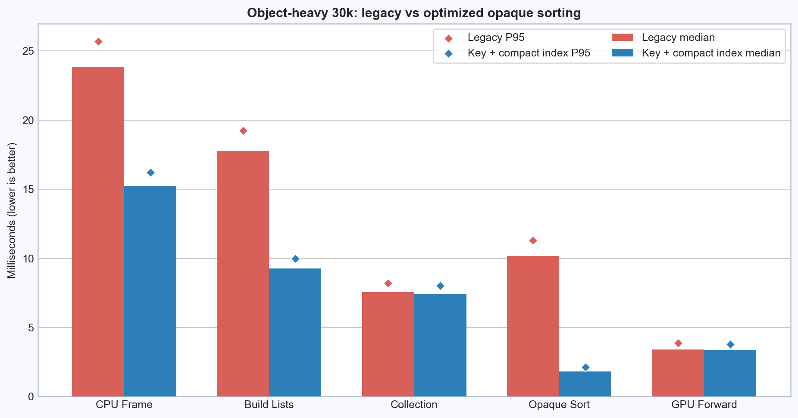
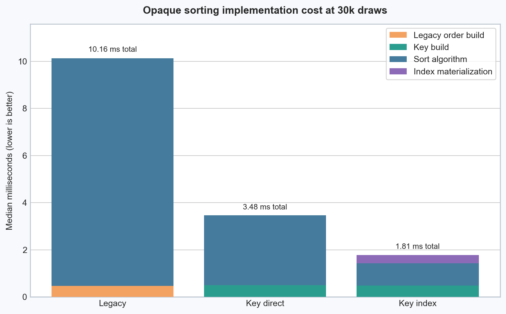
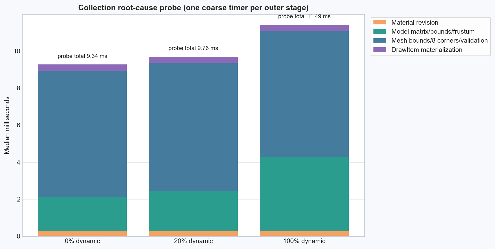
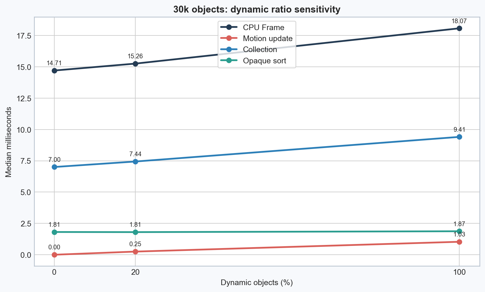
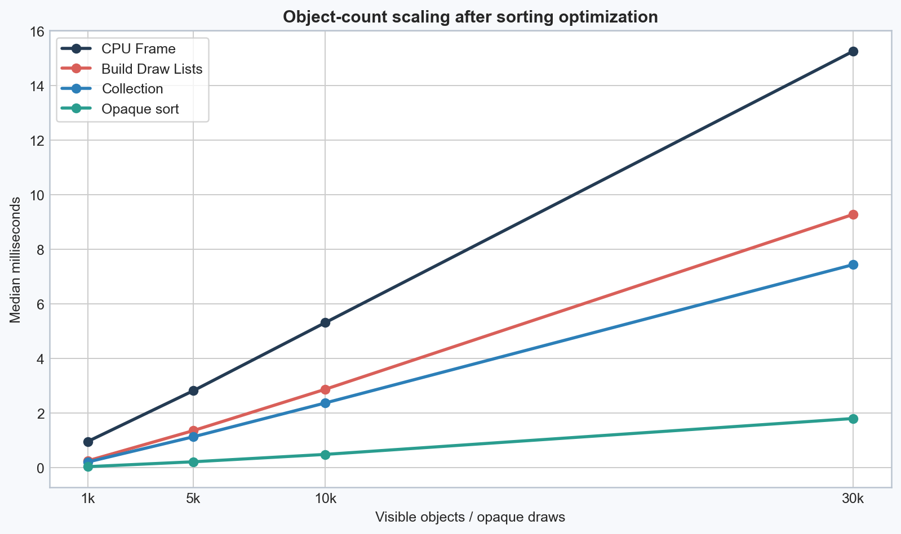
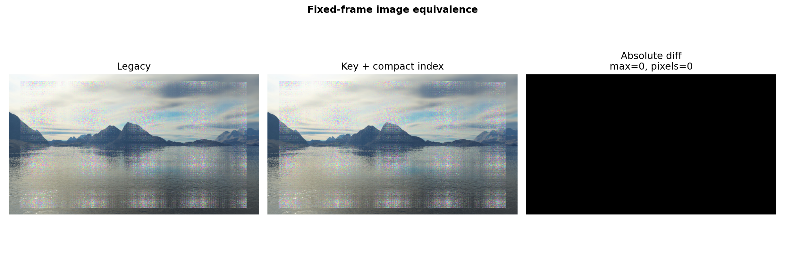

# Opaque Sorting：卡点原理、分析路径与优化实现

## 1. 现象：GPU 不慢，CPU 在提交前卡住

Object-Heavy 场景有 30,000 个可见对象，但每个对象只有低面数几何、零灯光和零阴影。Legacy 主 A/B 的 CPU Frame Median 为 23.851 ms，而 GPU Forward Median 为 3.409 ms。两者的明显间隔说明瓶颈发生在 CPU 准备和提交工作，而不是片元或顶点着色。

进一步拆分 `Build Draw Lists` 后，Legacy Collection 为 7.568 ms，Opaque Sorting 为 10.158 ms。也就是说，帧在真正进入大量 `glDraw*` 之前，已经花费了可观 CPU 时间重建和排序提交描述。

原始数据见 [A/B Benchmark JSON](benchmark-results/opaque-sorting/object-heavy-20260730/opaque-sorting-ab-benchmark.json)。

## 2. 为什么旧排序会放大

旧路径先按场景遍历的首次出现顺序建立 Shader/Material ordinal，再执行 `std::stable_sort`。问题不在排序目标，而在 comparator：

1. 排序需要 `O(N log N)` 次比较；
2. 每次比较反复执行 Shader 和 Material 的 `unordered_map::at`；
3. 比较相等时还要从 Mesh 追到 Material；
4. `stable_sort` 移动的是完整 DrawItem，其中包含 Model/Matrix、World Bounds Center、三根 OBB Axis、Radius 和有效性状态。

30k 项时，哈希查询次数和大结构移动次数一起按排序比较数量放大。场景只有 16 个材质并不能自动消除这项成本，因为旧 comparator 仍在每次比较时重新查询“这个材质排第几”。

## 3. 我们如何分析到这里

分析链条按可证伪顺序推进：

1. **CPU/GPU 分离：** CPU Frame 显著高于 GPU Forward，先把目标锁定到 CPU submission；
2. **粗粒度阶段：** `Build Draw Lists = Collection + Opaque Sorting + 少量固定开销`，确认 Sorting 是独立大区；
3. **同程序 A/B：** 保留 Legacy comparator，同时加入 Key Direct，单独验证“Comparator 哈希查询”假设；
4. **结构移动 A/B：** 在同一 Key 下比较直接排序 DrawItem 与排序 32 位索引，单独验证“大对象移动”假设；
5. **Dynamic 消融：** 0%/20%/100% 检查 Collection 是否随 Dirty Transform 数量变化；
6. **阶段探针：** 使用阶段级外层计时重放 Material、Model Bounds、Mesh Bounds 和 DrawItem write，没有在 30k 内层逐项调用计时器；
7. **对象缩放与混合几何：** 用 1k/5k/10k/30k 和 10k mixed 排除仅在单一 30k Quad 极端点成立的解释。



## 4. 方案思考与取舍

### 4.1 只优化 comparator

为每个 opaque item 预先生成 64 位 `opaqueSortKey`：

```text
high 32 bits = shader first-seen ordinal
low  32 bits = material first-seen ordinal
```

ordinal 来自确定性的 Scene traversal。哈希表只用于 Key 构建时查找 pointer 对应的 ordinal；算法从不迭代哈希表，因此 bucket 顺序和 pointer 数值不会决定排序顺序。Comparator 最终只执行一个 64 位整数比较。

这条 `key-direct` 路径把 Sorting Median 降到 3.475 ms，证明反复哈希查询确实是首要排序卡点。

### 4.2 为什么还要排序紧凑索引

Key Direct 仍让 `stable_sort` 反复移动完整 DrawItem。Key Index 路径改为：

```text
DrawItem array 保持收集顺序
→ 生成 uint32 index array
→ stable_sort(index, DrawItem[index].opaqueSortKey)
→ 按已排序 index 线性物化最终 DrawItem array
```

这样 `O(N log N)` 阶段移动 4 字节索引，完整 DrawItem 只在最后 `O(N)` 搬运一次。30k 下最终 Sorting Median 为 1.806 ms，比 Key Direct 进一步减少 1.670 ms。



### 4.3 为什么没有直接上 Retained

排序是一个边界清楚、可同程序 A/B、失效风险低的独立问题。Retained 则会改变对象增删、Active、Transform、Material 透明度、Shader 热重载和资源销毁的生命周期协议。先拿掉 Sorting 的确定成本，才能看到 Collection 是否仍值得承担 Retained 的复杂度。

## 5. Collection 的真实剩余根因



正式分项显示：

- Material Revision 稳态检查较小；
- Model Matrix、Model Bounds 与 Frustum 随 Dynamic Transform 有一定变化，但不是主体；
- Mesh local bounds、三根 world axis、8 角点变换、sphere radius 与有限性/范围合法性检查占主导；
- DrawItem 最终写入存在，但显著小于 Bounds 计算；
- Opaque Sort Key 和排序已在生产路径独立计时，不混入上述探针。

Dynamic 0%/20%/100% 的生产 Collection 相对跨度为 30.23%；0%→100% 增加 2.404 ms。对象数量缩放的 R² 为 0.99983。两组证据合在一起说明当前 Collection 同时包含稳定的 `O(N_total)` Mesh/Bounds 重建和随 Dynamic Transform 增加的矩阵/Model Bounds 成本，不能简化成纯 `O(N_total)` 或纯 `O(N_dynamic)`。





## 6. 优化了多少

30k/20% dynamic 正式主 A/B：

| 指标 | Legacy | Key Index | 减少 | 降低 |
| --- | ---: | ---: | ---: | ---: |
| CPU Frame Median | 23.851 ms | 15.258 ms | 8.593 ms | 36.0% |
| Build Draw Lists Median | 17.786 ms | 9.281 ms | 8.505 ms | 47.8% |
| Opaque Sorting Median | 10.158 ms | 1.806 ms | 8.353 ms | 82.2% |
| GPU Forward Median | 3.409 ms | 3.374 ms | 0.035 ms | 1.0% |

GPU 和 Draw Call 不应因 CPU 排序优化下降；它们在这里是“工作量未改变”的控制指标。

## 7. 正确性为什么没有被排序优化破坏

- Legacy、Key Direct、Key Index 的排序主次关系完全相同：Shader ordinal → Material ordinal；
- 使用 `stable_sort`，相同 Key 的对象保持原 Scene traversal 顺序；
- 提交签名哈希 Key、draw count 和 model matrix，不包含 pointer；
- 主 A/B 三个独立进程签名一致；
- Forward/Deferred 都完成有效运行；
- 固定帧截图逐像素完全一致。
- Point Shadow Cache 六类严格正确性案例和 topology ABA 均通过，且使用同一 Release EXE。



## 8. Retained v1 决策

结论：**No-Go：当前证据未同时满足 Retained v1 的全部门槛。**

排序后 Collection 仍是主要 CPU 区、总对象数缩放和 mixed 场景均复现；但 Dynamic 0%→100% 时 Collection 明显增加，因此“主要不随 Dynamic 数量增长”这一门槛没有通过。

若以后重新评估 Retained，应先处理两件事：

1. 把 Transform/Material/Mesh 的公开修改入口收敛为可靠 revision 或保守失效事件；
2. 用代表性实际场景重新验证静态与动态 Bounds 更新的占比。

在这两项完成并重新通过 0%/20%/100% 门槛前，不进入 `RenderProxy/StaticDrawCommand` 实现。

但当前公开可变入口仍可能绕过 revision。完成入口收敛和保守失效协议前，只能称为 retained cache 原型，不能宣称复杂度已经变成真正的 `N_dirty`。

如果 Retained 把 Collection 降下去后 CPU 主要时间落在 30k 次 `glDraw*`，下一项应是 Instancing/Multi-Draw，而不是继续增加缓存层级。
