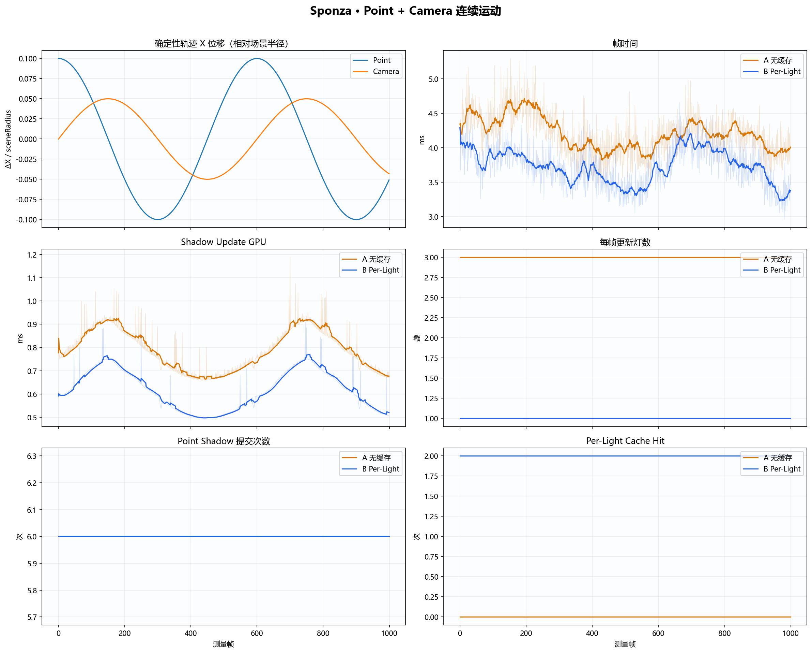
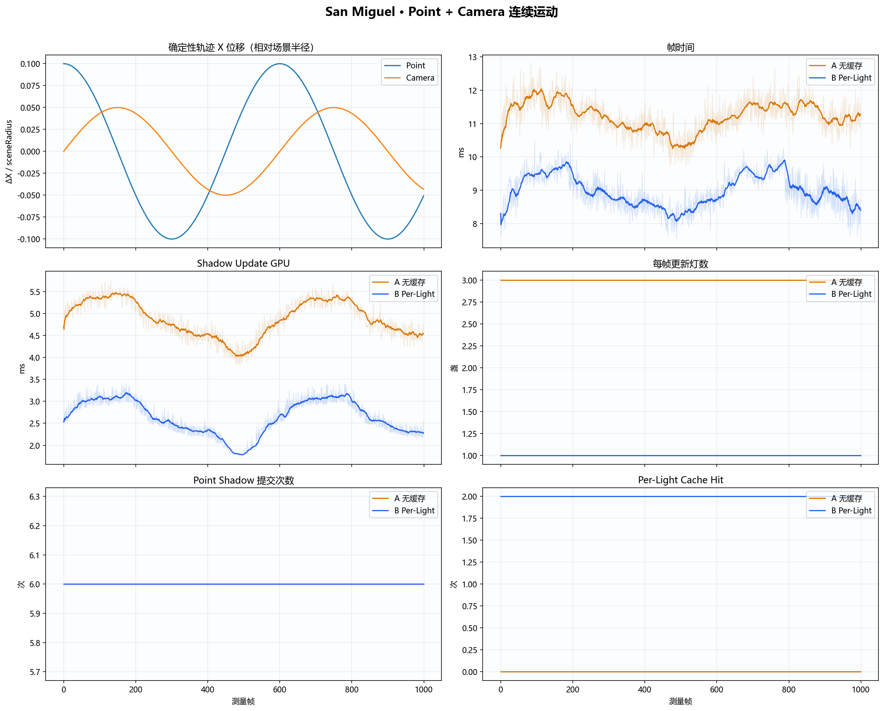

# Per-Light 阴影缓存与增量更新：实现及 1080p A/B 实验报告

状态：正式实验完成
日期：2026-07-29
正式实验 ID：

- 基础 A/B：`per-light-cache-no-cache-vs-per-light-1080p-six-face-final`
- Point + Camera 连续运动：`per-light-cache-motion-timeline-point-camera-1080p-final`

## 1. 结论

本次优化解决了初始无缓存路径“每帧重绘全部启用阴影”的问题。在同时启用一盏 Directional、一盏 Point 和一盏 Spot 阴影灯时，只移动 Point Light：

- 优化前的无缓存控制路径每帧更新 3 盏灯；
- 优化后的 Per-Light Revision Cache 每帧只更新 Point Light，Directional 与 Spot 各命中一次缓存；
- 两个场景、A/B 各三轮独立 renderer 调用、每轮 1,000 测量帧，更新量都稳定为 `3 → 1`；
- Sponza 的 Shadow Pass GPU Median 从 `0.7621 ms` 降至 `0.5977 ms`，下降 `21.57%`；
- San Miguel 的 Shadow Pass GPU Median 从 `4.8193 ms` 降至 `2.5995 ms`，下降 `46.06%`；
- 在更接近实际观察的固定轨迹中，Point Light 与相机同时运动、Caster 保持静止；Sponza / San Miguel 的 Shadow Pass GPU Median 分别下降 `21.46% / 45.76%`，更新量仍稳定为 `3 → 1`；
- 两个场景的 Shadow GPU、GPU Frame、Shadow CPU 与 Wall Frame 的 Median、P95、P99 均改善；
- 12 次正式运行的 72 个点阴影 Cubemap 面均成功读回，三组 A/B 配对共 36 个基于深度位模式的 Hash 全部一致；
- A/B 的 renderer-owned Texture、Mesh CPU、Mesh GPU、Render Target 聚合字节统计在六组配对中数值完全一致；
- 六组 1920×1080 主画面均通过预设的 `≤32` 变化像素门槛，实测最多变化 6 / 2,073,600 像素；六组均存在极少量跨进程差异，因此本文只主张“在预设量化容差内视觉等价”，不主张截图 pixel-exact。

比较范围说明：A 在当前同一二进制中设置 `OPENGL_LEARN_SHADOW_CACHE=none`，复现最初“每帧更新全部灯”的调度行为；B 使用当前 Per-Light Revision Cache。两侧保留相同 Shader、FBO、分辨率、Caster Culling 与 Six-face 点阴影，因此不会把旧提交中其他渲染功能差异混入缓存收益。

自动生成的完整性能表、图、截图与机器可读数据见：

- [技术原理、推导过程与工程权衡](PER_LIGHT_SHADOW_CACHE_TECHNICAL_PRINCIPLES_CN.md)
- [自动生成的中文详细报告](docs/benchmark-images/shadow-optimizations/per-light-cache-no-cache-vs-per-light-1080p-six-face-final/report.md)
- [机器可读报告数据](docs/benchmark-images/shadow-optimizations/per-light-cache-no-cache-vs-per-light-1080p-six-face-final/report-data.json)
- [Point + Camera 连续运动正式报告](docs/benchmark-images/shadow-motion-timeline/per-light-cache-motion-timeline-point-camera-1080p-final/report.md)
- [Point-only 隔离实验报告](docs/benchmark-images/shadow-motion-timeline/per-light-cache-motion-timeline-point-1080p-final/report.md)
- [正式实验汇总](benchmark-results/shadow-optimizations/per-light-cache-no-cache-vs-per-light-1080p-six-face-final/summary.json)
- [完整失效矩阵](benchmark-results/shadow-optimizations/per-light-cache-invalidation-matrix.json)

## 2. 问题与优化机制

### 2.1 原问题

最初的 Shadow Pass 没有缓存命中概念：每帧直接遍历全部启用阴影灯并重新生成 Shadow Map。对本实验的一盏 Directional、一盏 Point、一盏 Spot 而言，无论只有 Point Light 变化、还是场景完全静态，都会重复：

1. Directional 2D Shadow Pass；
2. Point Cubemap 的六个 Face Pass；
3. Spot 2D Shadow Pass。

真正需要更新的只有第二项。

### 2.2 Per-Light Cache

每盏阴影灯维护独立的 `ShadowMapCacheState`。缓存命中同时要求：

- 该灯的阴影输入签名一致；
- 已经存在可采样的有效内容；
- FBO 完整；
- Framebuffer ID、Texture ID、宽高与资源代际均和提交时一致。

各灯签名由共享的 Caster 状态与该灯自身输入构成：

| 输入类别 | Directional | Point | Spot |
|---|---|---|---|
| Caster 状态签名 / Revision | 是 | 是 | 是 |
| 对应 Shadow Shader Revision | 2D | Cubemap | 2D |
| Transform | Direction | Position | Position + Direction |
| 投影参数 | Center、Near/Far、Distance、Width、Fit | Near/Far、Auto Fit | Cone、Near/Far、Auto Fit |
| Shadow Resolution | 是 | 是 | 是 |
| 点阴影路径开关 | 不适用 | Adaptive/Six-face/Face Culling | 不适用 |
| 渲染目标身份与代际 | 是 | 是 | 是 |

选择更新与发布缓存内容是两步：

1. 签名或目标不匹配时，该灯进入更新列表；
2. 只有 Shader 可用、FBO 完整，并且该灯确实完成渲染或空场景深度清屏后，才提交新的签名和可采样状态。

因此，失效并不等于“旧目标仍可被采样”。资源创建、Shader 或 Face FBO 任一环节失败时，系统禁用该灯的阴影采样并保留失效状态，下一帧继续保守重试。

### 2.3 静态与动态路径

- 静态场景：无缓存 A 仍每帧更新三盏灯；Per-Light B 在冷启动完成后三盏灯全部命中；
- 只有一盏灯变化：只把这一盏灯放入更新列表；
- Caster 增删、移动或阴影相关材质变化：当前 Caster Revision 是场景级，保守更新所有相关阴影灯；
- Caster 为空：不发布未初始化纹理，而是清空对应深度目标后提交可采样内容；
- 无法可靠判断：计入 Conservative Fallback，失效并走安全重建路径。

## 3. 完整失效规则与验证矩阵

两个场景均在 1920×1080 下执行 12 种 workload。矩阵每项测量 4 帧；下表计数是 4 帧合计，Sponza 与 San Miguel 得到相同的更新/命中关系。

| Workload | 覆盖的失效条件 | A 更新灯 | B 更新灯 | B 命中 | 结果 |
|---|---|---:|---:|---:|---|
| `static-hit` | 完全静态 | 12 | 0 | 12 | 通过 |
| `move-directional` | Directional transform | 12 | 4 | 8 | 通过 |
| `move-point` | Point transform | 12 | 4 | 8 | 通过 |
| `move-spot` | Spot transform | 12 | 4 | 8 | 通过 |
| `move-caster` | Caster transform | 12 | 12 | 0 | 通过 |
| `change-caster-material` | 阴影相关材质/Alpha | 12 | 12 | 0 | 通过 |
| `toggle-caster` | Caster 启停及空场景 | 12 | 12 | 0 | 通过；每场景 6 次空清屏 |
| `reload-shadow-2d` | 2D Shadow Shader 热重载 | 12 | 8 | 4 | 通过 |
| `reload-shadow-point` | Point Shadow Shader 热重载 | 12 | 4 | 8 | 通过 |
| `resize-point-shadow` | Point Shadow 分辨率变化 | 12 | 4 | 8 | 通过 |
| `replace-point-shadow-target` | 同尺寸目标重建 / GL ID 复用风险 | 12 | 4 | 8 | 通过 |
| `force-update` | 所有启用灯输入同时变化 | 12 | 12 | 0 | 通过；这是最坏情况 workload，不是显式全局 Invalidate API |

24 条场景记录合计：

- 资源或 Shader 失败：`0`；
- 非预期 Conservative Fallback：`0`；
- 空场景清屏：`12`，全部来自预期的 `toggle-caster`；
- Point Shadow 路径：全部为已验证的 Six-face。

`replace-point-shadow-target` 专门覆盖“尺寸和潜在 GL ID 相同，但底层资源已经重建”的情况。缓存键中的 Resource Generation 防止把新目标误认为旧内容。

## 4. 点阴影六面正确性

早期 Layered Geometry Shader 路径在当前 NVIDIA 驱动上可能只留下一个有效 Face。现在 Adaptive 策略保守选择独立验证过的 Six-face 路径；显式 Layered 仅保留为诊断开关。正式实验也固定使用 Six-face，避免 A/B 任一侧通过不完整 Cubemap 获得虚假性能优势。

每个测量进程在性能采样和主画面截图之后读取 1024×1024 深度 Cubemap 的六个面，因此读回不计入性能区间。每面记录：

- `valid`；
- 64 位 FNV-1a 位哈希；
- 非远平面样本数；
- 最小/最大深度。

验收结果：

- 12 个正式进程 × 6 面 = 72 / 72 面有效；
- 2 个场景 × 3 个 A/B 配对 × 6 面 = 36 / 36 个配对面哈希完全一致；
- 每次 Point 更新均为 1 次 Six-face 更新和 6 次 Face Submission；
- Sponza 六个面均有非远平面样本；
- San Miguel 的 `+Y` 面没有 Caster，保持远平面清屏值；该面仍通过有效读回，并在 A/B 三组配对中保持完全相同的哈希和样本计数。

## 5. 正式 A/B 实验设计

| 项目 | 设置 |
|---|---|
| 配置 | Release x64 |
| 分辨率 | 1920×1080 |
| 场景 | Crytek Sponza、San Miguel 2.1 low-poly |
| GPU | NVIDIA GeForce RTX 5060 Ti |
| OpenGL Driver | NVIDIA 591.86 |
| CPU | Intel Core i7-12700KF |
| 渲染路径 | PBR Forward |
| 阴影 | Hard / Stable，Directional + Point + Spot |
| 点阴影 | Six-face，Face Culling 开启 |
| Workload | 每个测量帧交替移动同一盏 Point Light |
| A | 无缓存控制路径，每帧更新全部启用灯 |
| B | Per-Light Revision Cache 开启 |
| 外部预热 | 每场景、每变体独立 100 帧 |
| 内部预热 | 每个正式进程 15 帧 |
| 正式样本 | A × 3、B × 3；每进程 1,000 帧 |
| 顺序 | A → B → B → A → A → B |
| Wall 计时 | GPU-synchronized |
| 可执行文件 | A/B 同一 SHA-256：`1c7582a5cb49d4205f77ab1f0779a8b6ff8be7240326b33bd128b26d597400a5` |
| Source Fingerprint | `4e365aeda2b81059d46b05914634a91eb9ad221d2064992b43943bac27964891` |

这里没有直接运行多年以前的旧提交。A 使用当前代码中的无缓存控制路径，复现“每帧全量更新”的初始调度；B 使用 Per-Light。这样既满足与最初无缓存行为比较，又能确保两侧的画质算法、资源布局和正确性遥测完全相同。

Harness 对每个 A1/B1/B2/A2/A3/B3 都同步启动一个新的 native renderer，并在退出后校验 JSON、截图和日志，再启动下一次。当前 schema 17 没有把 PID/进程创建时间写入 JSON，因此“独立进程”由启动器控制流保证，不把它描述为 JSON 内的防篡改证明。

## 6. 性能结果

### 6.1 核心指标

下表的 A/B 是三个进程各自统计量的算术平均；百分比以 A 为基准。

| 场景 | 指标 | A Median | B Median | Median 变化 | P95 变化 | P99 变化 |
|---|---|---:|---:|---:|---:|---:|
| Sponza | Shadow GPU | 0.7621 ms | 0.5977 ms | **-21.57%** | -27.92% | -27.70% |
| Sponza | GPU Frame | 1.5419 ms | 1.4510 ms | **-5.90%** | -7.77% | -5.64% |
| Sponza | Shadow CPU | 0.3210 ms | 0.1862 ms | **-41.99%** | -39.99% | -35.92% |
| Sponza | Wall Frame | 3.9146 ms | 3.5211 ms | **-10.05%** | -10.81% | -10.48% |
| San Miguel | Shadow GPU | 4.8193 ms | 2.5995 ms | **-46.06%** | -41.80% | -38.07% |
| San Miguel | GPU Frame | 7.7514 ms | 5.5941 ms | **-27.83%** | -23.18% | -23.65% |
| San Miguel | Shadow CPU | 2.5313 ms | 1.2601 ms | **-50.22%** | -47.34% | -49.26% |
| San Miguel | Wall Frame | 11.2002 ms | 8.9972 ms | **-19.67%** | -17.23% | -17.03% |

### 6.2 更新量

| 场景 | 版本 | 总更新/帧 | Directional | Point | Spot | Per-Light Hit |
|---|---|---:|---:|---:|---:|---:|
| Sponza | A | 3 | 1 | 1 | 1 | 0 |
| Sponza | B | 1 | 0 | 1 | 0 | 2 |
| San Miguel | A | 3 | 1 | 1 | 1 | 0 |
| San Miguel | B | 1 | 0 | 1 | 0 | 2 |

这个计数与性能变化形成直接因果链：Point Shadow 的六面工作没有减少，减少的是与 Point 变化无关的 Directional 和 Spot Shadow Pass。

### 6.3 Point + Camera 确定性连续运动复验

为避免只依赖相邻帧两点微扰，主复验使用固定 60 Hz、600 帧一周期的确定性轨迹：Point Light 与相机 Position / Target 同时运动，Caster 保持静止。轨迹按场景半径归一化，A/B 的测量帧号与空间位置逐帧一致。实验仍为 1920×1080、两个场景、每个变体三轮独立进程、每轮 1,000 帧。

相机轨迹用于让观察视角同步变化，不应成为 Shadow Map 的失效源；因此它同时检验了“移动相机不会误伤灯光缓存”这条边界。

| 场景 | Shadow GPU Median | Shadow GPU P95 | Frame Median | Shadow CPU Median | 更新灯数 | Cache Hit | Point Face 提交 |
|---|---:|---:|---:|---:|---:|---:|---:|
| Sponza | 0.790→0.620 ms（-21.46%） | 0.990→0.757 ms（-23.50%） | 4.187→3.739 ms（-10.68%） | 0.328→0.192 ms（-41.40%） | 3→1 | 0→2 | 6→6 |
| San Miguel | 4.897→2.657 ms（-45.76%） | 5.531→3.297 ms（-40.39%） | 11.261→8.972 ms（-20.33%） | 2.524→1.212 ms（-51.97%） | 3→1 | 0→2 | 6→6 |

每轮的一个完整周期中，Point Position、Camera Position、Camera Target 各有 600 个不同样本，Caster Position 始终只有 1 个样本。Point 自身仍每帧提交六面，Per-Light 只复用 Directional 与 Spot；Sponza 截图为 0 像素差，San Miguel 仅 10 个变化像素且通过阈值，两个场景的 Cubemap 六面 Hash 与 renderer-owned 资源统计均一致。完整逐帧 CSV、A/B 截图与差异热力图见 [Point + Camera 正式报告](docs/benchmark-images/shadow-motion-timeline/per-light-cache-motion-timeline-point-camera-1080p-final/report.md)。

Point-only 隔离实验也保留为对照：

| 场景 | Shadow GPU Median | Shadow GPU P95 | Wall Median | Shadow CPU Median | 更新灯数 | Point Face 提交 |
|---|---:|---:|---:|---:|---:|---:|
| Sponza | 0.790→0.625 ms（-20.99%） | 0.946→0.789 ms（-16.55%） | 3.911→3.652 ms（-6.61%） | 0.319→0.184 ms（-42.34%） | 3→1 | 6→6 |
| San Miguel | 5.011→2.757 ms（-44.98%） | 5.731→3.400 ms（-40.69%） | 11.136→9.241 ms（-17.02%） | 2.485→1.240 ms（-50.10%） | 3→1 | 6→6 |

两套连续轨迹得到一致结论；相机运动没有改变需要更新的阴影集合，也没有引入 P95/P99 尾延迟回退。Point-only 的完整材料见 [隔离实验报告](docs/benchmark-images/shadow-motion-timeline/per-light-cache-motion-timeline-point-1080p-final/report.md)。

## 7. 画面与资源一致性

### 7.1 主画面

预设门槛为每个 1920×1080 A/B 配对最多 32 个变化像素；`maximumChannelDelta=255` 只表示不额外限制这少量变化像素的幅度。实际结果：

| 场景 | 配对 | 变化像素 | 最大通道差 | 完全一致 |
|---|---:|---:|---:|---|
| Sponza | A1/B1 | 4 | 114 | 否 |
| Sponza | A2/B2 | 3 | 88 | 否 |
| Sponza | A3/B3 | 1 | 114 | 否 |
| San Miguel | A1/B1 | 3 | 24 | 否 |
| San Miguel | A2/B2 | 3 | 21 | 否 |
| San Miguel | A3/B3 | 6 | 33 | 否 |

观察到的最大变化比例是 `6 / 2,073,600 = 0.000289%`。阴影 Cubemap 本身逐位一致，主画面的极少量差异也落在不同进程重复截图时观察到的边缘量化噪声范围内。

### 7.2 Renderer-owned 资源

以下计数在每个场景的 A1/A2/A3/B1/B2/B3 六次运行中完全相同：

| 场景 | Texture | Mesh CPU | Mesh GPU | Render Target |
|---|---:|---:|---:|---:|
| Sponza | 243,742,611 B | 0 B | 15,011,180 B | 87,609,344 B |
| San Miguel | 463,827,497 B | 0 B | 434,738,372 B | 87,609,344 B |

这支持优化没有通过增加上述被统计的 Renderer-owned 资源来换取时间。它不是资源内容的逐字节读回，也不是显卡驱动总显存的外部测量，因此本文把结论限定为“被统计资源类别的聚合字节数在 A/B 间完全一致”。

项目既有资源生命周期 smoke test 还验证了效果开关后的 FBO 回收：

| 阶段 | Busy FBO | Render Target |
|---|---:|---:|
| Forward Default | 2 | 24.72 MiB |
| Forward + Bloom | 4 | 64.27 MiB |
| Deferred + SSAO + Bloom | 6 | 114.94 MiB |
| All Effects | 9 | 158.94 MiB |
| 回收至 Forward Default | 2 | 24.72 MiB |

原始记录见 [资源生命周期结果](benchmark-results/shadow-optimizations/per-light-cache-resource-smoke-final.json)。

## 8. 安全降级

实现与测试遵循 fail-closed：

- FBO 不完整、纹理不存在、尺寸非法或资源代际不匹配：缓存不命中且禁止采样；
- Shadow Shader 不存在或程序 ID 为 0：不把本次更新记为成功，也不发布缓存内容；
- Six-face 中任一 Face FBO 创建失败：不发布半成品 Cubemap；
- 无 Caster：显式清深度后再提交，避免采样旧内容；
- Caster 状态不可靠：走保守失效/重建路径；
- Layered 点阴影在当前驱动的逐面证据不可靠：Adaptive 自动选择已验证的 Six-face。

正式 `move-point` 的 12 个进程中：

- `measuredShadowResourceFailureCount = 0`；
- `measuredConservativeShadowFallbackCount = 0`；
- `measuredEmptyShadowClearCount = 0`。

失效矩阵中的空场景路径另外产生了预期的 12 次清屏，且没有资源失败或非预期降级。

## 9. 可复现性与限制

### 9.1 可复现材料

- 原始运行目录包含每轮 JSON、1,000 个原始统计样本、日志和 1920×1080 PPM；
- `metadata.json` 固化了机器、顺序、场景、帧数、环境变量、Source Fingerprint 和可执行文件 SHA-256；
- `summary.json` 保存配对截图、逐面 Cubemap 哈希和 Renderer-owned 资源比较；
- 报告生成器从原始 JSON 和 PPM 重新生成表、图、差异图及自动门槛结果。

### 9.2 限制

- 结论来自一台 Windows/NVIDIA 机器；跨 GPU/驱动仍应复跑；
- 正式性能场景固定为 PBR Forward + Hard Shadow；PCF/PCSS、Deferred 的缓存正确性路径相同，但本报告不外推它们的具体收益百分比；
- 当前 Caster Revision 是场景级，所以 Caster 变化会保守更新全部阴影灯；未来可继续细化为 Light-Caster overlap revision；
- 主画面使用预先设定的少量变化像素门槛，不是六组截图全部逐字节相同；
- Renderer-owned 资源计数不是驱动层总显存遥测；
- 正式结果固定 Six-face；当前 Adaptive 也会保守解析为 Six-face，Layered 仅作为诊断路径保留。

## 10. 可用于简历的表述

> 针对无缓存路径每帧重绘全部阴影灯的问题，设计并实现基于光源状态、Caster Revision、Shadow Shader Revision 与渲染目标身份/资源代际的 Per-Light Dirty Cache；在固定 60 Hz 的 Point Light + Camera 连续轨迹中，将 Directional + Point + Spot 场景的每帧阴影更新由 3 盏降至 1 盏，Sponza / San Miguel 的 Shadow Pass GPU Median 分别降低 21.46% / 45.76%，Point Cubemap 仍保持每帧六面提交，画面与资源通过 1920×1080、A/B 各三轮独立运行的一致性校验。

这条表述使用确定性连续运动的正式 1080p 数据，没有沿用此前 1440×900 的初步结果。
