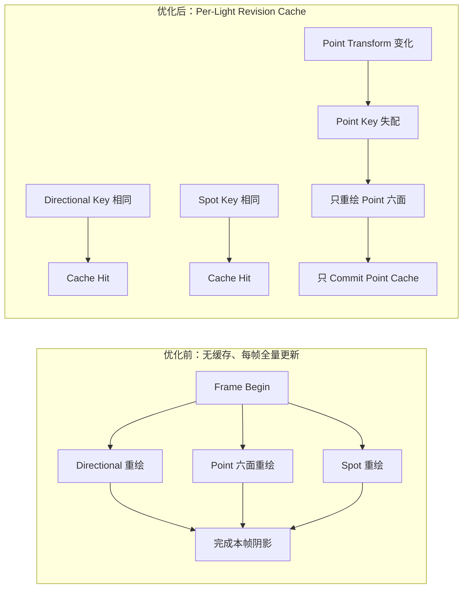
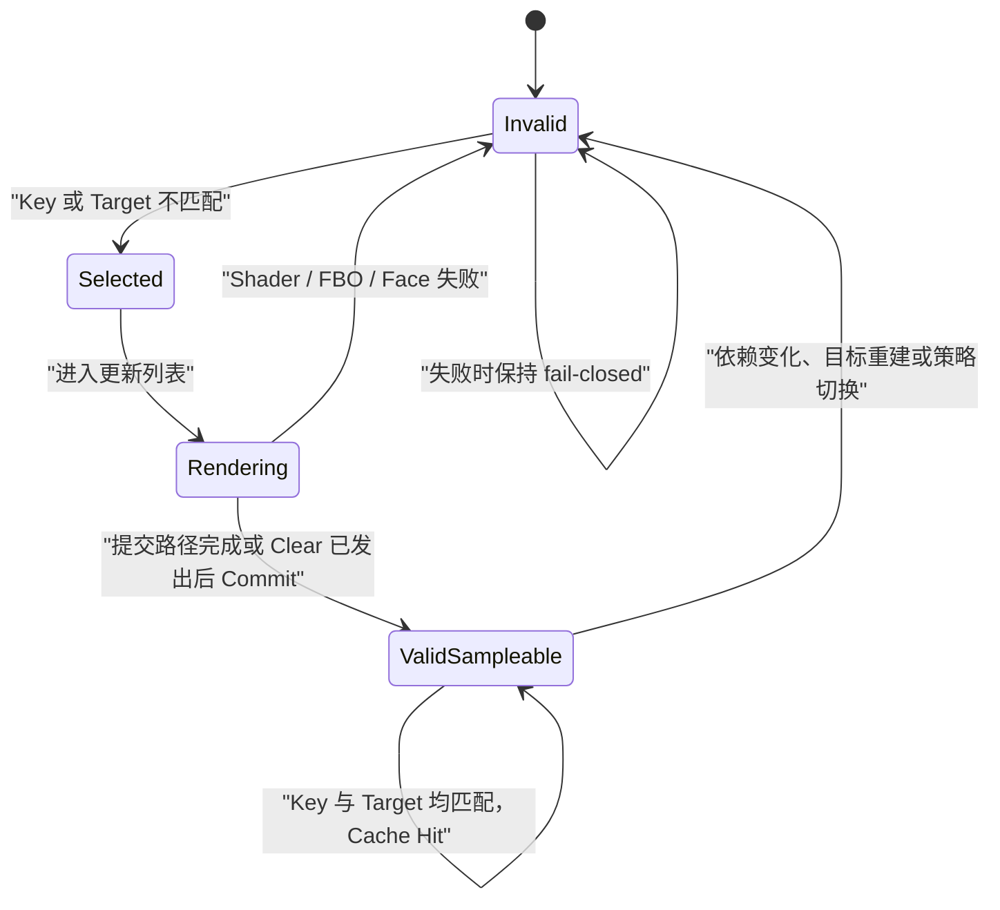
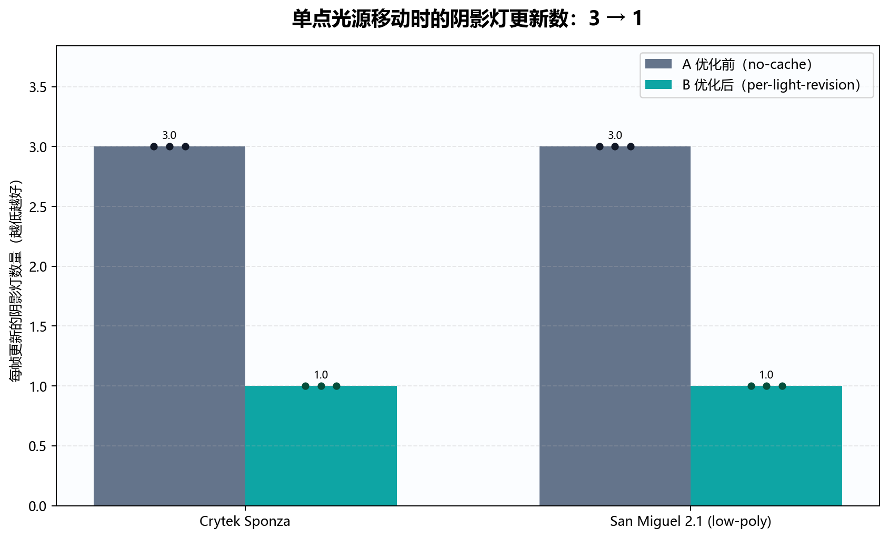
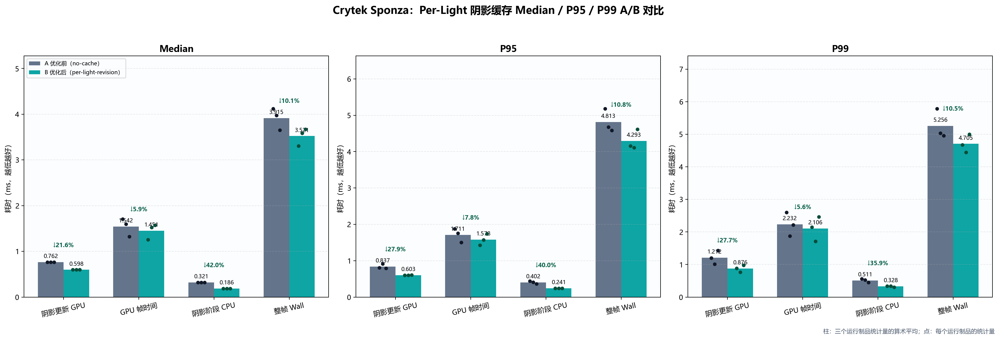
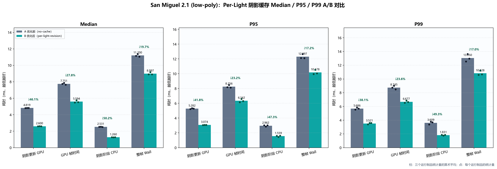
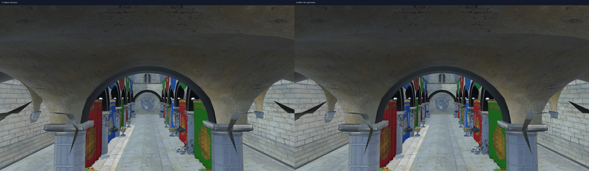
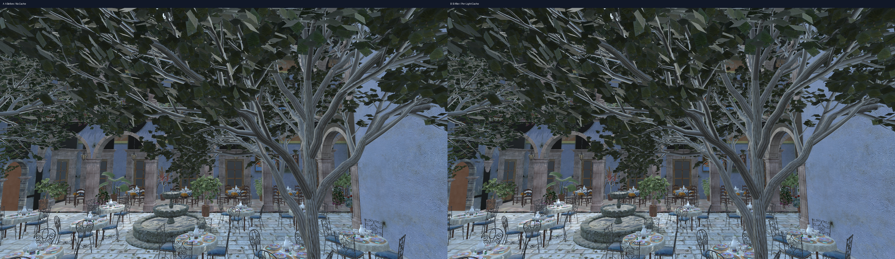
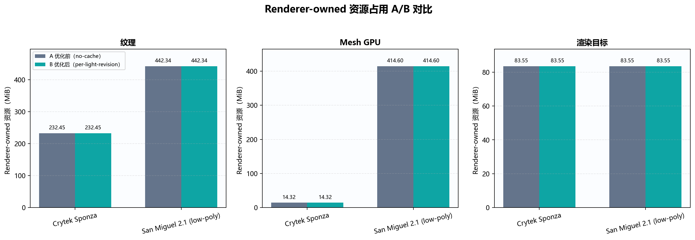

# Per-Light 阴影缓存与增量更新：技术原理、推导过程与工程权衡

状态：实现与正式实验均已完成
日期：2026-07-28
适用代码：当前工作区的 Revision Shadow Cache / Per-Light Cache 路径

相关材料：

- [正式 1080p A/B 实验报告](PER_LIGHT_SHADOW_CACHE_BENCHMARK_CN.md)
- [确定性连续运动时间轴与逐帧遥测](SHADOW_MOTION_TIMELINE_CN.md)
- [自动生成的详细数据、图表与截图报告](docs/benchmark-images/shadow-optimizations/per-light-cache-no-cache-vs-per-light-1080p-six-face-final/report.md)
- [正式实验原始汇总](benchmark-results/shadow-optimizations/per-light-cache-no-cache-vs-per-light-1080p-six-face-final/summary.json)
- [完整失效矩阵](benchmark-results/shadow-optimizations/per-light-cache-invalidation-matrix.json)

---

## 1. 一句话概括

这项优化的本质不是“少画两张 Shadow Map”，而是把阴影系统从：

> 每帧无条件重新生成全部启用灯的 Shadow Map

改造成：

> 每盏灯独立维护“逻辑依赖版本 + GPU 目标身份 + 已发布内容状态”，只重新计算真正失效的中间结果。

在 Directional、Point、Spot 三盏阴影灯同时存在、每帧只移动 Point Light 的情况下：

- 无缓存控制路径：不检查历史结果，三盏灯每帧全部重绘；
- Per-Light Revision Cache：Directional 与 Spot 命中，只有 Point 的六面 Cubemap 重绘；
- 更新灯数稳定从 `3 → 1`；
- Sponza / San Miguel 的 Shadow GPU Median 分别下降 `21.57% / 46.06%`；
- 固定 60 Hz 的 Point + Camera 连续轨迹复验中，两场景分别下降 `21.46% / 45.76%`；Caster 保持静止，Point 每帧仍提交六面；
- 点阴影六面内容、主画面与 renderer-owned 资源都通过了独立正确性门槛。

正式实验的 A 就是无缓存、每帧全量更新的控制路径，B 是当前 Per-Light Cache。两者来自同一可执行文件，使用相同的 Shader、FBO、分辨率、Caster Culling 和 Six-face 点阴影，只切换缓存策略。它复现了最初的更新行为，又避免直接运行旧提交时把其他渲染差异混入结果。

真正困难的部分是回答下面这个问题：

> 在当前建模并支持的依赖域中，怎样既不漏掉会改变阴影结果的失效条件，又不因为过度保守重新退化成全局重绘？

本文围绕这个问题展开。

---

## 2. 为什么会有这个问题

### 2.1 Shadow Map 是一个可缓存的中间结果

先把“阴影内容”和“承载这份内容的 GPU 资源”分开。一张 Shadow Map 的内容可以写成：

```text
ShadowContent_i = RenderDepth(
    ShadowCasters,
    LightState_i,
    ShadowShader_i,
    ShadowPathConfig_i
)

CacheEntry_i = {
    ShadowContent_i,
    RenderTarget_i,
    PublishedState_i
}
```

Render Target 的身份并不改变深度函数在数学上应该得到什么结果，但它决定“上一次结果现在是否仍住在这个可用资源里”。Shadow Map 不是最终画面，而是后续 Lighting Pass 使用的中间结果。只要逻辑输入没有变化、物理资源没有被替换，并且上次写入已经完整发布，重复生成同一张深度图就没有意义。因此，阴影天然适合做缓存。

项目最初的 `DrawShadowMap` 没有缓存命中逻辑。它每帧直接遍历所有启用阴影灯、清空深度目标并重新提交 Caster。即使灯、Caster、Shader 和渲染目标都没有变化，上帧结果也不会被复用。

### 2.2 物理输出是独立的，初始调度却总是全量执行

Directional、Point、Spot 实际拥有独立的 FBO 和深度纹理：

- Directional：一张 2D Depth Map；
- Point：一张六面的 Depth Cubemap；
- Spot：一张 2D Depth Map。

初始路径没有“哪一盏灯失效”这个判断阶段。每帧执行链都是：

```text
Frame Begin
    → Directional 重绘
    → Point 六面重绘
    → Spot 重绘
```

所以只移动 Point Light 时，Directional 与 Spot 的工作是重复的；场景完全静态时，三盏灯的工作也都是重复的。这不是 Shadow Mapping 或 OpenGL 的固有限制，而是初始实现尚未利用跨帧时间复用。

### 2.3 为什么这个问题在动态场景中很突出

初始全量更新在功能上直接、容易理解，但不会根据变化范围缩减工作。典型游戏场景通常是：

- 太阳光不动；
- 室内 Spot 不动；
- 玩家手电、火球或局部 Point Light 在移动；
- 大部分 Caster 静态，少量对象动态。

因此，缓存不能只回答“上一帧画过没有”，还必须回答“上一帧的哪一份结果仍然对应当前输入”。这就是为什么最终直接以 Per-Light Entry 建模。

### 2.4 这是系统固有问题，还是第一版没考虑到

最初“每帧全部重绘”确实说明当时没有考虑跨帧复用，但这不等于只加一个布尔值就能安全解决。真正固有且困难的问题是：引入缓存以后，必须完整建模所有失效来源，否则性能提升会换来陈旧阴影。

项目中间曾有过 Global Revision Cache：它能安全解决静态复用，但局部灯光变化仍会把整组阴影失效。它是有价值的过渡设计，不过本次正式 A/B 按你的要求不再使用它作为基线。

完整演进是：

```text
最初：无缓存，每帧全部重绘
    → 识别 Shadow Map 是可复用的派生数据
    → 中间：Global Revision Cache，先解决静态复用
    → 发现局部变化仍被放大
    → 最终：Per-Light Revision Cache
```

所以问题既包含“初始实现没有考虑缓存”，也包含缓存系统天然困难的失效建模。当前方案的价值在于没有停留在“有缓存”这一层，而是把缓存做成了可验证的逐灯增量协议。

---

## 3. 方案是怎样推导出来的

这里不把思路描述成一次灵光乍现，而是从无缓存路径的工作量证据出发，还原怎样一步步推导出 Per-Light Cache。

### 3.1 先证明浪费发生在哪里

第一步不是立即改代码，而是把阴影更新按灯型拆开计数：

- `directionalLightUpdateCount`；
- `pointLightUpdateCount`；
- `spotLightUpdateCount`；
- `lightCacheHitCount`；
- `updatedLightCount`；
- 分灯型 GPU Zone 与整个 `Shadow Map Update` GPU Zone。

在受控的 `move-point` workload 中，观察到无缓存基线每帧是：

```text
Directional = 1
Point       = 1
Spot        = 1
Total       = 3
```

而场景中唯一变化的输入是 Point Light 的位置。

这给出了直接结论：

> 性能问题不在 Point Shadow 本身，而在初始调度没有利用变化局部性，每帧都重新提交三盏灯。

### 3.2 观察到一个重要事实：渲染资源本来就是逐灯独立的

每盏灯已经拥有自己的：

- Shadow FBO；
- 深度纹理；
- 投影参数；
- Light Space Matrix；
- Shader 输入。

所以不需要重写 Shadow Rendering Pipeline，也不需要引入 Shadow Atlas 才能解决问题。物理结果已经具备独立缓存的基础，只是有效性记录仍放在 Scene 全局。

由此得到最小改造方向：

> 把缓存记录从 Scene 级拆到 Light 级，保留原有的实际绘制函数，只改变“哪些灯被选择执行”。

### 3.3 不能只加一个 `dirty` 布尔值

最初看起来最简单的方案是：

```cpp
light.shadowDirty = true;
```

但这个项目存在大量直接可变状态：

- Editor 直接修改 Transform；
- 材质属性通过公开 Map 被修改；
- Shader 可以热重载；
- FBO 会被池化、释放、Resize 和复用；
- Auto Fit 会在缓存检查后更新 Near/Far 或投影范围；
- 纹理内容可能在 GL Object ID 不变时被原地替换。

如果依赖所有调用方都记得手动设置 Dirty，很容易出现：

```text
数据已经变化
    但某个入口忘了 MarkDirty
        → 错误命中
            → 采样陈旧阴影
```

这类错误通常不会崩溃，而是表现成偶发的漏影、鬼影或一帧错误，因此比显式失败更难排查。

所以最终选择的是版本化依赖：

```text
对于系统可观察的字段：
    Dirty 由“当前依赖版本”和“已缓存依赖版本”比较出来。

对于无法从对象身份推断的原地内容变化：
    生产者发布 Content Revision；
    缓存仍通过版本比较传播失效，而不是由调用方逐灯 MarkDirty。
```

例如，同一个 GL Texture ID 的像素被原地替换时，必须调用 `Material::InvalidateShadowState()` 递增内容版本。当前 Mesh 签名也只观察 Active、VAO、Draw Count 和 Material 等状态；若同一 VAO/Buffer 内的几何内容原地改变，还需要额外的 Geometry Content Revision。版本化方案显著减少了逐灯漏标入口，但不会凭空观察到没有发布版本的内存或 GPU 内容变化。

### 3.4 从“缓存值”进一步推导到“缓存发布协议”

仅有 Per-Light Key 仍然不够。

考虑下面的失败序列：

```text
Key 失配
    → 开始重建 FBO
        → Shader/目标不可用，或某个 Cubemap Face FBO 不完整
            → 如果仍把 Key 标为有效，就会采样未初始化或半成品内容
```

因此缓存必须区分两个概念：

1. 逻辑 Key 是否匹配；
2. GPU 目标中是否真的存在可以安全采样的内容。

这就是 `valid` 和 `contentSampleable` 分离的来源，也是整个实现最关键的安全设计之一。这里说的是“事务式发布语义”，不是带 GPU Fence、回滚日志或逐 Draw 错误检查的严格 GPU 事务。

---

## 4. 核心抽象：逐灯依赖函数

第 `i` 盏灯的逻辑阴影内容可以抽象为：

```text
S_i(t) = F(
    C(t),
    L_i(t),
    H_i(t),
    P_i(t)
)

Entry_i(t) = {
    S_i(t),
    R_i(t),
    Published_i(t)
}
```

其中：

- `C(t)`：所有阴影 Caster 的深度相关状态；
- `L_i(t)`：第 `i` 盏灯的 Transform 与投影参数；
- `H_i(t)`：该灯使用的 Shadow Shader Revision；
- `P_i(t)`：渲染路径配置，例如 Six-face、Face Culling；
- `R_i(t)`：承载结果的 FBO/Texture 物理目标身份与资源代际；
- `Published_i(t)`：上次更新是否走完了允许消费者读取的发布路径。

无缓存路径没有 Key：

```text
Update_i(t) = true
    for every enabled shadow light i
    on every frame t
```

中间阶段的 Global Cache 相当于：

```text
K_global = Hash(C, L_1, L_2, ... L_n, H_1, ... H_n, P)

Hit_global =
    globalCache.valid
    AND globalCache.signature == K_global
    AND TargetsUnchangedAndSampleable(R)
```

Per-Light Cache 则是：

```text
K_i = Hash(C, L_i, H_i, P_i)

Hit_i =
    cache_i.valid
    AND cache_i.contentSampleable
    AND cache_i.signature == K_i
    AND cache_i.MatchesTarget(R_i)
```

注意：物理 Render Target 没有简单地混入逻辑 Hash，而是通过 `MatchesTarget` 单独验证。这样能明确区分：

- 逻辑输入是否相同；
- 缓存内容是否仍位于同一个、同一代的 GPU 资源中。

### 4.1 优化前后依赖传播



这个图揭示了优化真正改变的东西：不是每个 Pass 的内部算法，而是在执行前增加可靠的依赖判断，把“每帧全部执行”收缩为“只执行失效 Entry”。

---

## 5. `ShadowMapCacheState`：逻辑状态与物理目标的组合

逐灯缓存记录位于 [Light.h](Light.h) 的 `ShadowMapCacheState`。

它保存：

| 字段 | 含义 |
|---|---|
| `valid` | 已提交的逻辑 Signature 是否有效 |
| `contentSampleable` | GPU 目标中是否存在允许 Lighting Pass 使用的已发布内容 |
| `signature` | 该灯上次成功更新后的逻辑依赖摘要 |
| `framebufferID` | 提交时的 FBO ID |
| `textureID` | 提交时的深度纹理 ID |
| `width / height` | 提交时的目标尺寸 |
| `resourceGeneration` | FBO 本次物理实例的单调代际 |

### 5.1 为什么 `valid` 不能等于 `contentSampleable`

二者看起来相似，但含义不同：

```text
valid：
    这份内容是否对应当前逻辑输入？

contentSampleable：
    目标里是否存在完整、初始化过、允许被 Shader 读取的内容？
```

例如：

- Shader 成功 Reload 后，Program 与 Revision 同时更新，旧 Shadow Map 虽然仍是完整纹理，却已不对应新 Shader，二者都应失效；
- Shader Reload 失败时，代码保留旧 Program 和旧 Revision，因此旧缓存仍与真正运行的旧 Shader 一致，不会制造一次虚假的失效或错误发布；
- 全局控制路径完成一次成功重绘后，需要发布可采样内容，但 Per-Light Signature 可能由另一层逻辑维护；
- FBO 创建成功但渲染未完成时，目标存在，却不能发布；
- 空 Caster 场景经过显式 Depth Clear 后，没有 Draw Call，但内容仍是正确且可采样的。

把两个状态分开，可以避免用一个布尔值表达多个不同阶段。

### 5.2 为什么还需要 `resourceGeneration`

只比较 OpenGL ID 并不安全。

OpenGL 驱动可以复用已经删除的数字 ID，FBO Pool 也可能复用同一个 C++ 对象。可能出现：

```text
旧资源：FBO ID 17，Texture ID 42，1024×1024
释放
新资源：FBO ID 17，Texture ID 42，1024×1024
```

如果只比较 ID 和尺寸，新资源会被误判为旧资源仍然有效。这和并发结构中的 ABA 问题很像：表面值回到了 A，但对象已经经历过一次完整的销毁和重建。

[FramebufferManager.cpp](FramebufferManager.cpp) 在每次 `FBO::Init` 时分配新的单调 `resourceGeneration`。缓存命中必须同时满足：

```text
Framebuffer ID 相同
Texture ID 相同
尺寸相同
Resource Generation 相同
FBO 完整
```

这使“GPU 资源的逻辑生命期”可以被显式识别。

---

## 6. Caster Revision：怎样知道场景内容变了

光源只是 Shadow Map 的一部分输入。Caster 的增删、移动、Mesh 启用状态和 Alpha Test 材质也会改变深度结果。

### 6.1 同步发生在 Camera Culling 之前

[Scene.cpp](Scene.cpp) 的 `BuildMeshDrawLists` 在 Camera Frustum Culling 之前同步 Shadow Caster 状态。

原因是：

> 一个物体可以不在相机画面内，但仍然位于光源和可见接收面之间，从而投下可见阴影。

如果只同步相机可见对象，离开相机视锥的 Caster 可能继续影响画面，却不会触发缓存失效。

因此 Shadow State 的可见性定义和 Camera Visibility 不同。

### 6.2 只跟踪真正影响深度的材质字段

[Material.h](Material.h) 的 Shadow Signature 不会把整个 PBR Material 都加入缓存 Key，而只包含：

- `opacity`；
- 是否启用 Alpha Cutoff；
- `alphaCutoff`；
- Diffuse Texture ID；
- Opacity Texture ID；
- 显式 Shadow Content Revision。

Roughness、Metallic、Specular Color 等不会改变 Shadow Depth，因此不应该让 Shadow Map 失效。

这是一个重要的“不过度失效”设计：

```text
完整性要求：当前建模并支持的、会影响深度的状态都必须进入依赖；
性能要求：不影响深度的状态不能进入依赖。
```

### 6.3 Revision 的分层传播

状态变化从细到粗逐层聚合：

```text
Material Shadow State
    → Mesh Shadow Revision
        → Model Shadow Revision
            → Scene Caster Signature / Caster Revision
                → 每盏灯的 Shadow Key
```

当前 Scene Caster Revision 仍是场景级的。任何 Caster 变化都会使所有灯的 Key 变化，这是有意保留的保守边界：

- Light 变化可以安全地局部失效；
- Caster 变化是否只影响某盏灯，需要额外维护 Light-Caster Overlap Graph；
- 在没有这个图之前，全灯失效比漏掉阴影变化更安全。

这体现了优化中的一个原则：

> 对已经能够准确证明局部性的输入做增量更新；对尚不能可靠证明局部性的输入保持保守。

---

## 7. 每盏灯的 Signature 包含什么

三个灯型共享 Caster Revision，但各自只加入与自身 Shadow Output 有关的状态。

### 7.1 Directional

`BuildDirectionalShadowRevisionSignature` 包含：

- Scene Caster Signature / Revision；
- 2D Shadow Shader Revision；
- Direction；
- Shadow Center；
- Near / Far；
- Distance / Width；
- Auto Fit 及 Light-Space AABB Fit 状态；
- 请求分辨率与有效分辨率；
- Directional Fit / Density Resolution 配置。

### 7.2 Point

`BuildPointShadowRevisionSignature` 包含：

- Scene Caster Signature / Revision；
- 当前 Point Shadow Shader Revision；
- Position；
- Near / Far；
- Auto Fit；
- Shadow Resolution；
- Adaptive / Six-face 路径配置；
- Face Culling 配置。

### 7.3 Spot

`BuildSpotShadowRevisionSignature` 包含：

- Scene Caster Signature / Revision；
- 2D Shadow Shader Revision；
- Position / Direction；
- Outer Cone；
- Near / Far；
- Auto Fit；
- Shadow Resolution；
- Spot Caster Depth Fit 配置。

### 7.4 为什么 Auto Fit 后要重新计算 Signature

这是一个很容易遗漏的细节。

Cache Miss 后，系统可能根据最新 Caster Bounds 修改：

- Directional 的 Center、Width、Near/Far；
- Point 的 Far Plane；
- Spot 的 Near/Far 或投影范围。

如果仍提交 Fit 之前计算的 Signature，下一帧会发生：

```text
当前 Light State 已被 Fit 改写
    → 与上帧提交的“旧 Signature”不同
        → 再次 Miss
            → 每帧无意义重建
```

因此实现先用当前状态判断是否命中；Miss 后执行 Fit，再用 Fit 后的最终状态重新计算待提交 Signature。

这个“对派生状态重新签名”的步骤让缓存记录对应真正写入 GPU 的最终输入，而不是对应计算过程的中间状态。

---

## 8. 每帧算法：Check、Select、Render、Commit

核心路径在 [Scene.cpp](Scene.cpp) 的 `DrawShadowMapPerLight`。

它不是边检查边随意修改缓存，而是分为几个阶段。

### 8.1 阶段一：准备共同依赖

```text
同步 Model / Mesh / Material 的 Shadow State
    → 生成 Scene Caster Signature
        → 如果发生变化，递增 Caster Revision
            → 缓存最新 Caster Bounds
```

如果 Caster State 无法可靠建立：

- 禁止所有启用阴影灯的旧内容继续采样；
- 记录 `conservativeShadowFallbackCount`；
- 本帧不发布新的缓存。

### 8.2 阶段二：逐灯检查

对每盏启用的阴影灯：

1. 确保 FBO 存在且类型、尺寸、Texture Target 正确；
2. 检查对应 Shadow Shader 是否存在且 Program ID 非 0；
3. 计算该灯的当前 Signature；
4. 同时比较 Signature 和 Render Target Snapshot；
5. Hit 则跳过；
6. Miss 则立即使旧缓存失效，并加入 Selection。

禁用的灯会：

- 失效自己的缓存；
- 释放 Shadow FBO；
- 触发 FBO Pool 的未使用资源回收。

### 8.3 阶段三：只渲染 Selection

Selection 中的状态实际上形成了一个小型“事务式发布”标记：

| 状态 | 含义 |
|---:|---|
| `0` | 未选择，通常是 Cache Hit 或灯未启用 |
| `1` | 已选择更新，但 CPU 提交路径尚未完成 |
| `2` | 前置门槛通过，Draw 提交路径完整结束，或空场景 Clear 已发出；在 CPU 协议层记为 Completed |

`RenderShadowMapUpdate` 只遍历状态非 0 的灯。前置资源门槛通过且对应 CPU 提交路径走到末尾后，才把状态从 `1` 改为 `2`。

### 8.4 阶段四：只 Commit Completed 项

渲染结束后：

```text
state == 2
    → Commit(finalSignature, currentTarget)

state == 1
    → 保持 Invalid
```

所以缓存发布具有类似两阶段提交的语义：

```text
准备依赖
    → 选择更新
        → 执行 GPU 工作
            → 资源门槛通过且渲染路径完整结束
                → 一次性发布新缓存状态
```

不会出现“Key 已更新，但纹理仍是旧内容或已知半成品”的状态。需要再次强调：这里的“提交”是 CPU 侧缓存状态协议，不代表实现了 GPU Fence、逐次 `glGetError` 或可回滚的真正 GPU 事务。

### 8.5 伪代码

```cpp
syncCasterState();

for (Light& light : enabledShadowLights) {
    FBO* target = light.EnsureShadowFBO();
    Shader* shader = ResolveShadowShader(light);

    if (!casterStateReliable || !targetReady(target) || !shaderReady(shader)) {
        light.shadowCache.Invalidate();
        continue;
    }

    Key current = BuildPerLightKey(light, casterRevision, shaderRevision);

    if (light.shadowCache.IsCacheHit(current, target)) {
        ++lightCacheHits;
        continue;
    }

    light.shadowCache.Invalidate();
    FitProjectionIfNeeded(light, casterBounds);

    selection[light] = Pending;
    finalKey[light] = BuildPerLightKeyAfterFit(light);
}

RenderOnlySelectedLights(selection);

for (Light& light : selectedLights) {
    if (selection[light] == SubmissionCompletedOrClearIssued) {
        light.shadowCache.Commit(finalKey[light], light.shadowFBO);
    } else {
        light.shadowCache.Invalidate();
    }
}
```

### 8.6 状态机



---

## 9. 完整失效规则

| 变化来源 | 怎样被观察 | 影响范围 | 处理 |
|---|---|---|---|
| Directional Transform / Projection | Directional Signature | 对应 Directional | 只更新该灯 |
| Point Position / Near / Far | Point Signature | 对应 Point | 只更新该灯的六面 |
| Spot Position / Direction / Cone | Spot Signature | 对应 Spot | 只更新该灯 |
| Shadow Resolution | Signature + Target Size | 对应灯 | 重建目标并更新 |
| FBO / Texture 被替换 | ID、尺寸、Generation | 对应灯 | Target Miss |
| Shader 热重载 | Shader Revision | 使用该 Shader 的灯 | 2D 影响 Directional/Spot，Point Shader 只影响 Point |
| Caster 增删或 Active 变化 | Scene Caster Revision | 当前保守影响全部灯 | 全部更新 |
| Caster Transform | Model / Scene Revision | 当前保守影响全部灯 | 全部更新 |
| Alpha/Opacity/Shadow Texture 变化 | Material → Mesh → Model Revision | 当前保守影响全部灯 | 全部更新 |
| Roughness/Metallic 等 | 不进入 Shadow Signature | 无 | 不误失效 |
| Point Render Policy 变化 | Point Signature | Point Lights | 更新 Point |
| Cache Granularity 切换 | 显式策略同步 | 全部灯 | 清空两种策略的旧状态 |
| 灯被禁用 | Active / useShadowMap | 对应灯 | 失效并释放 FBO |
| 无 Caster | Bounds 为空 | 所有选中灯 | Clear Depth 后提交 |
| Caster State 不可靠 | Reliability Gate | 所有启用灯 | 禁止采样并保守降级 |
| Shader / FBO / Face 不完整 | Readiness Gate | 对应灯 | 不 Commit，不允许采样 |

### 9.1 为什么没有 Caster 时也不能直接跳过

正确的“无 Caster”阴影结果不是“保留上一帧”，而是：

```text
整张深度图为 Far Depth
```

如果从有 Caster 切换到无 Caster 后直接跳过渲染，旧深度仍留在纹理中，已经删除的物体会继续投影。

因此系统走 `clearOnly` 路径：

1. 确认目标完整；
2. 清为深度 1.0；
3. 将 Selection 标为成功；
4. Commit 这份正确的“空阴影”内容。

这也是为什么“没有 Draw Call”不等于“没有更新”。

### 9.2 为什么切换 No-cache / Global / Per-Light 策略必须整体失效

三种策略的有效性语义不同。若运行时切换策略却沿用旧状态，可能出现：

- No-cache 控制路径留下的内容被错误当作某个已提交 Signature；
- Global Key 有效，但某个 Per-Light Signature 从未提交；
- Per-Light 内容有效，但 Global Cache 误认为整组内容在同一事务中完成。

进入 `OPENGL_LEARN_SHADOW_CACHE=none` 时会清除 Global 与 Per-Light 有效性，并强制每帧更新；返回缓存策略时再次冷启动。`SynchronizeShadowCacheGranularity` 继续负责 Global / Per-Light 之间的状态隔离，避免跨策略污染。

---

## 10. 点光源六面阴影：一次正确性反转

Point Shadow 是这项工作的高风险部分，因为一次“Point 更新”实际包含六个视方向：

```text
+X, -X, +Y, -Y, +Z, -Z
```

### 10.1 为什么 Layered 路径看起来很有吸引力

Geometry Shader Layered Rendering 理论上可以：

- 一次提交 Caster；
- 在 Geometry Shader 中复制到六个 Cubemap Layer；
- 比六次独立 Face Submission 更便宜。

仅看 Draw Count 或 GPU 时间，这条路径非常诱人。

### 10.2 为什么最终没有盲目接受更快的数据

逐面读取 Depth Cubemap 后发现：当前驱动上的 Layered 路径可能留下五个 Face 未正确写入。

这意味着“更快”的部分收益来自少做了本应完成的工作。若继续把它当作性能结果，会得到一个错误结论：

```text
不完整渲染
    被误认为
高效渲染
```

因此当前 Adaptive 策略 fail-closed 到经过直接验证的 Six-face 路径；显式 Layered 只保留为诊断覆盖。

### 10.3 Six-face 的整体发布完整性

在真正开始更新 Point Shadow 之前，系统先获取并验证六个 Face FBO：

```text
6 / 6 Face FBO 全部完整
    → 清空整个 Cubemap
        → 分别执行六个 Face Pass
            → 标记 Point 更新成功

任意 Face FBO 失败
    → 整个 Point 更新不 Commit
```

正式实验进一步在性能采样之后读取六个 Face，记录：

- 基于深度位模式计算的 64 位内容 Hash；
- 非 Far Depth 样本数；
- Min / Max Depth；
- Face Validity。

正式运行中，每次 Point 更新都核算为 6 次 Six-face Submission；12 次正式调用读回的 72 个 Face 全部有效；在此基础上，36 个 A/B 配对 Face 哈希又全部一致。这三层证据联合支持：Per-Light 优化没有通过漏掉某个 Cubemap Face 获得收益，而且 A/B 的最终点阴影内容一致。

---

## 11. Lighting Pass 为什么不会误采样半成品

缓存安全的最后一道门位于采样侧。

Forward 和 Deferred 的 Light Uniform / Texture Binding 都使用：

```cpp
shadowCache.IsSampleable(shadowFBO)
```

只有同时满足：

- `contentSampleable == true`；
- 当前 FBO 完整；
- FBO/Texture ID 匹配；
- 尺寸匹配；
- Resource Generation 匹配；

才会把 `useShadowMap` 设为 true 并绑定真实深度纹理。

否则 Shader 收到：

```text
useShadowMap = false
```

Deferred Light Volume 也不会在采样阶段偷偷调用 `EnsureShadowFBO`。采样代码只消费已经发布的资源，不在读取阶段制造一个空目标。

这形成清晰的所有权：

```text
Update Path：创建、写入、验证、发布
Sampling Path：只读取已发布内容
```

---

## 12. 静态场景和动态场景分别怎样走

### 12.1 静态场景

无缓存 A 不检查这些条件，静态场景仍每帧更新三盏灯。Per-Light B 的冷缓存或失效后首帧需要构建 Shadow Map；完成一次成功构建并预热后，如果所有输入继续不变：

```text
Caster Revision 相同
Light Signature 相同
Shader Revision 相同
Target Snapshot 相同
```

结果：

```text
Directional Hit
Point Hit
Spot Hit
Shadow Pass 更新数 = 0
```

失效矩阵的 `static-hit` 在 4 个测量帧内得到：

```text
A 更新 12，B 更新 0，B Per-Light Hit 12
```

### 12.2 只有一盏灯移动

只移动 Point：

```text
Directional Key 相同 → Hit
Point Key 变化       → Miss
Spot Key 相同        → Hit
```

结果：

```text
无缓存 A 总更新 3，Hit 0
Per-Light B 总更新 1，Hit 2 / frame
```

移动 Directional 或 Spot 时也得到相同的局部关系。

### 12.3 Caster 变化

Caster Revision 被三盏灯共同依赖，因此：

```text
Directional Miss
Point Miss
Spot Miss
```

这不是优化失败，而是当前依赖模型的正确保守行为。要继续局部化，必须能够证明该 Caster 不在某盏灯的影响域中。

---

## 13. 性能为什么会提升

设三个 Pass 的成本为：

```text
C_D = Directional Shadow 成本
C_P = Point Six-face Shadow 成本
C_S = Spot Shadow 成本
O   = Cache Check / Selection / Commit 开销
```

只移动 Point 时：

```text
No-cache:
T_A ≈ C_D + C_P + C_S + O_uncached

Per-Light:
T_B ≈ C_P + O_per-light
```

理论节省：

```text
ΔT ≈ C_D + C_S - (O_per-light - O_uncached)
```

这也解释了两个场景的收益不同：

- Sponza 中 Point 六面本身占比较高，移除 Directional/Spot 后 Shadow GPU Median 降低 21.57%；
- San Miguel 几何更密集，两个多余 Pass 和对应 Caster Submission 更昂贵，Shadow GPU Median 降低 46.06%。

### 13.1 工作量计数形成因果证据

| 场景 | Caster Draw/帧 | Triangle-Pass/帧 | Submission CPU/帧 |
|---|---:|---:|---:|
| Sponza | 1,371.5 → 585.5（-57.31%） | 1,045,662 → 521,128（-50.16%） | 0.3169 → 0.1826 ms（-42.38%） |
| San Miguel | 4,911 → 2,207（-55.06%） | 22,089,143 → 11,774,415（-46.70%） | 2.5508 → 1.2774 ms（-49.92%） |

这些计数与 `3 → 1` 的更新数及耗时下降方向一致，强力支持主要收益来自移除两盏无关灯的 Caster Submission 和 Depth Rendering，而不只是运行波动。

### 13.2 子区域成本几乎闭合了收益归因

如果优化收益真的来自“跳过不相关的 Directional 与 Spot”，那么：

```text
实测 Shadow GPU 节省
    ≈ 被移除的 Directional 成本
      + 被移除的 Spot 成本
      + Point A/B 的小幅成本变化
```

正式数据给出了接近闭合的结果：

| 场景 | 去掉 Directional | 去掉 Spot | Point A → B | 按子区域预测的总节省 | 实测 Shadow GPU 节省 |
|---|---:|---:|---:|---:|---:|
| Sponza | 0.0969 ms | 0.0792 ms | 0.6006 → 0.6046 ms | 0.1722 ms | 0.1727 ms |
| San Miguel | 1.1215 ms | 1.0887 ms | 2.6314 → 2.6312 ms | 2.2104 ms | 2.2112 ms |

Sponza 的 Point 子区域甚至上升约 0.65%，整段 Shadow GPU 仍然下降。结合固定的分辨率与渲染配置、每次 Point 更新的六面 Submission 核算、72 个有效 Face 读回以及 36 个 A/B 配对 Hash，这强力支持收益来自被缓存命中的两盏灯，而不是降低 Point Shadow 质量或少画 Cubemap Face。

### 13.3 正式结果

| 场景 | 指标 | Median | P95 | P99 |
|---|---|---:|---:|---:|
| Sponza | Shadow GPU | **-21.57%** | -27.92% | -27.70% |
| Sponza | Shadow CPU | **-41.99%** | -39.99% | -35.92% |
| Sponza | GPU Frame | **-5.90%** | -7.77% | -5.64% |
| Sponza | Wall Frame | **-10.05%** | -10.81% | -10.48% |
| San Miguel | Shadow GPU | **-46.06%** | -41.80% | -38.07% |
| San Miguel | Shadow CPU | **-50.22%** | -47.34% | -49.26% |
| San Miguel | GPU Frame | **-27.83%** | -23.18% | -23.65% |
| San Miguel | Wall Frame | **-19.67%** | -17.23% | -17.03% |

两个场景、三轮配对中的 18 个 Shadow GPU 统计量全部为负。GPU Frame 和 Wall Frame 的改善幅度小于 Shadow Pass 本身也符合 Amdahl 定律：本次只优化了帧中的阴影更新部分，主渲染、后处理和其他 CPU 工作仍然存在。







---

## 14. 为什么这套方案“巧妙”

这里的巧妙不是某个复杂语法技巧，而是几个抽象边界恰好对齐。

### 14.1 把优化放在失效传播层，而不是牺牲画质

它没有：

- 降低 Point Cubemap 分辨率；
- 减少六个 Face；
- 降低 PCF/PCSS 样本；
- 延迟几帧更新；
- 缩短灯光范围来少画物体。

它只删除“根据依赖关系可以证明是重复的工作”。

因此性能收益不需要用画质、响应延迟或时间稳定性交换。

### 14.2 利用了已有的物理独立性，只修正逻辑耦合

每盏灯本来就有独立 Shadow Map，所以最有效的改变不是重构全部 Render Pass，而是把 Scene 级缓存拆成 Light 级记录，再用 Selection 复用原渲染函数。

这使改动集中在：

- 依赖建模；
- 缓存检查；
- 更新选择；
- 成功提交；
- 采样门控。

实际 Shadow Shader 与主要绘制代码无需为了缓存而复制一套。

### 14.3 “逻辑 Key + 物理代际”解决了两类不同陈旧问题

普通缓存只问：

```text
输入相同吗？
```

GPU 资源缓存还必须问：

```text
结果还存放在同一个有效资源里吗？
```

Signature 解决逻辑陈旧，Resource Generation 解决物理陈旧。二者缺一不可。

### 14.4 Commit 是有门槛的发布，而不是普通赋值

Selection 的 `0 / 1 / 2` 状态让系统可以区分：

- 不需要更新；
- 计划更新；
- CPU 提交路径 Completed。

只有前置门槛通过、CPU 提交路径走完的灯才发布新 Signature 和 Sampleable Content。已知失败不会污染下一帧的命中判断；GPU 输出级验证仍由专门的读回测试承担。

这和数据库事务、资源状态机的思想相似，但这里只借用了“未完成结果不可见”的发布原则：

```text
未完成的计算不能对消费者可见。
```

### 14.5 只在能证明局部性时局部化

Light Transform 的影响域天然属于单灯，所以逐灯失效。

Caster 变化目前还没有可靠的 Light-Caster 依赖图，所以继续全灯失效。

这个边界既获得了常见局部灯光变化的主要收益，又没有为了“看起来更增量”而冒险漏掉阴影。

### 14.6 正确性证据和性能证据相互约束

这项优化没有只看 GPU 时间：

- 更新计数证明少画的是哪两盏灯；
- Draw/Triangle 计数证明工作量真的减少；
- 六面 Submission 核算、逐面有效性与 A/B Hash 联合证明路径完整且内容一致；
- 主画面差异证明最终输出在预设容差内；
- Renderer-owned Bytes 证明没有用额外资源换时间；
- Failure/Fallback/Empty Clear Telemetry 证明测试没有悄悄走异常路径。

因此结论形成一个闭环：

```text
依赖模型
    → 更新数变化
        → 实际提交量变化
            → CPU/GPU 时间变化
                → 画面和资源仍满足门槛
```

### 14.7 同一二进制 A/B 避免了构建差异

无缓存行为被保留为运行时控制路径：

```text
OPENGL_LEARN_SHADOW_CACHE=none
```

正式 A 使用上述控制路径，B 使用：

```text
OPENGL_LEARN_SHADOW_CACHE=revision
OPENGL_LEARN_SHADOW_PER_LIGHT_CACHE=1
```

A/B 使用同一个可执行文件。无缓存 A 仍保留当前 Shader、FBO、安全门控、Caster Culling 和 Six-face 点阴影，只强制所有灯每帧进入更新路径。这既复现最初的调度行为，又避免旧二进制中的其他功能差异污染结论。

---

## 15. 为什么没有选择其他方案

### 15.1 停留在无缓存、每帧全部重绘

优点是控制流直接，不存在错误复用。

缺点是完全放弃跨帧时间复用：静态场景和局部动态场景都会重复提交同一批 Caster。这正是正式 A/B 的 A。

### 15.2 停留在 Global Cache

静态场景很好，但局部动态会扩大成全局 Miss。它解决了“是否变化”，没有解决“哪里变化”。

### 15.3 手工 Dirty Bool

实现初期简单，但需要每个修改入口都正确维护。面对 Editor 直接写字段、材质公开 Map、Shader 热重载和 FBO Pool，很难长期保证没有漏标。

### 15.4 给灯打 Static / Dynamic 标签

这只能描述一个粗粒度意图：

- Static Light 也会因为 Caster 或 Shader 变化而失效；
- Dynamic Light 也不是每帧所有状态都变化；
- 标签无法证明 GPU Target 是否仍是原资源。

它可以作为调度提示，但不能替代依赖版本。

### 15.5 分帧或降低更新频率

例如每两帧更新一次 Point Shadow，能够降低平均成本，但会引入：

- 阴影滞后；
- 快速移动时的 Temporal Error；
- 帧间不均匀更新尖峰。

这是预算调度方案，不是准确的增量计算。

### 15.6 先做 Shadow Atlas

Atlas 能改善资源绑定和碎片管理，但不自动解决失效粒度。即使三盏灯位于同一 Atlas 中，也仍需要知道哪个 Tile 应该重绘。

具体 Cache Entry 未必仍按灯组织，但“明确依赖、局部失效、成功后发布”的建模思想可以迁移到 Atlas、Virtual Shadow Map 或其他资源布局。

### 15.7 只相信“更快”的 Layered Point Shadow

Layered 路径在逐面证据中不完整。接受它会把错误工作量当作优化。最终选择 Six-face，是正确性优先于漂亮数字。

---

## 16. 正确性验证为什么这样设计

### 16.1 失效矩阵

12 种 workload 覆盖：

- 三类 Light Transform；
- Caster Transform；
- Caster 启用/停用（等效进出当前投影集合；未动态插入/删除 Model）；
- Shadow Material；
- 2D / Point Shader Reload；
- Point Resolution；
- 同尺寸 Render Target Replacement；
- 所有启用灯输入同时变化的最坏情况（workload 名为 `force-update`，不是调用显式全局 Invalidate API）；
- 完全静态。

这比只跑 `move-point` 更重要，因为缓存最危险的错误是某个边缘依赖没有进入 Key。矩阵可以准确称为“按依赖域覆盖当前失效契约”，但不能称为穷举了全部状态空间。

两个场景得到相同的更新关系。下面的数值是每个场景 4 个测量帧的累计值：

| 依赖域 / Workload | 优化前更新 | Per-Light 更新 | Per-Light Hit | 说明 |
|---|---:|---:|---:|---|
| `static-hit` | 12 | 0 | 12 | 无缓存 A 每帧更新；B 三盏灯 × 四帧全部命中 |
| `move-directional` | 12 | 4 | 8 | 只失效 Directional |
| `move-point` | 12 | 4 | 8 | 只失效 Point，四次更新仍各提交六面 |
| `move-spot` | 12 | 4 | 8 | 只失效 Spot |
| `reload-shadow-2d` | 12 | 8 | 4 | 2D Shader 只影响 Directional + Spot |
| `reload-shadow-point` | 12 | 4 | 8 | Cubemap Shader 只影响 Point |
| `resize-point-shadow` | 12 | 4 | 8 | Point 分辨率与目标一起更新 |
| `replace-point-shadow-target` | 12 | 4 | 8 | 同尺寸目标换代也只失效 Point |
| `move-caster` | 12 | 12 | 0 | Scene Caster Revision 保守扇出 |
| `change-caster-material` | 12 | 12 | 0 | 影响深度的材质变化保守扇出 |
| `toggle-caster` | 12 | 12 | 0 | 另记录 6 次正确的空场景 Clear |
| `force-update` | 12 | 12 | 0 | 所有启用灯输入同时变化的最坏情况 |

完整的 24 条场景记录及其底层运行文件见[失效矩阵原始数据](benchmark-results/shadow-optimizations/per-light-cache-invalidation-matrix.json)。

### 16.2 点阴影逐面证据

主画面中某个 Cubemap Face 可能恰好没有明显贡献，仅看截图不一定能发现漏 Face。因此直接读回六个 Depth Face，比只做最终画面截图更接近根因。

### 16.3 主画面截图

六组 1920×1080 A/B 截图：

- 预设门槛：变化像素 `≤32`；
- 实测最大：`6 / 2,073,600`；
- 六组都存在极少量跨进程边缘量化差异，因此不声明逐字节 Exact；
- 报告明确区分“容差通过”和“逐字节一致”。





### 16.4 资源一致性

Renderer-owned Texture、Mesh GPU、Render Target 的聚合字节统计在 A/B 六组配对中数值完全一致。这里比较的是引擎记录的资源类别字节计数，不是 Shadow Map 内容或驱动总显存的逐字节读回。

这支持本次优化没有通过增加被统计的 Renderer-owned 资源来换取时间，例如：

```text
为了少更新，悄悄保留第二份完整 Shadow Map 或大型历史 Buffer。
```



四层证据各自回答不同问题：

| 证据层 | 回答的问题 | 本次结果 |
|---|---|---|
| 控制流 | 真的只更新了应该更新的灯吗 | `3 → 1`，Point 更新与 `6 × Six-face Submission` 核算闭合 |
| 内部产物 | Cubemap 六个面是否都正确生成 | 六面 Submission 核算闭合；12 次正式调用的 72 个面有效；基于深度位模式的 36 个 A/B 配对 Hash 全部一致 |
| 最终画面 | 采样、光照合成后的结果是否可接受 | 六组 1080p 截图均在 `≤32` 变化像素门槛内，最大 6 个像素 |
| 资源 | 是否增加了引擎可统计的资源字节数 | Texture、Mesh GPU、Render Target 的聚合字节计数在六组配对中完全一致 |

只看 FPS 可能掩盖漏画；只看最终截图可能看不出某个 Cubemap Face 恰好没有贡献；只看逐面 Hash 又不能覆盖最终采样和光照合成。四层互相约束，才构成完整的正确性证据。

---

## 17. 保守降级哲学

实时渲染缓存出现不确定状态时，一般有三种选择：

1. 继续使用旧内容；
2. 使用可能未完成的新内容；
3. 禁止本次采样，并等待安全重建。

当前实现选择第三种。

其核心不是“永不失败”，而是：

> 失败时，错误不会伪装成一次成功缓存命中。

对应规则：

- Shader Program ID 为 0：不渲染、不 Commit；
- FBO 不完整：不 Commit；
- Six-face 任一 Face FBO 失败：整个 Point 不 Commit；
- Caster State 不可靠：禁用旧内容并记录 Conservative Fallback；
- Target Generation 不匹配：视为 Miss；
- 空 Caster：清屏后才 Commit；
- Sampling Path：只消费 `IsSampleable` 的内容。

Telemetry 让这些路径在 Benchmark 中可见。正式 `move-point` 测量窗口内：

```text
Shadow Resource Failure = 0
Conservative Fallback   = 0
Unexpected Empty Clear  = 0
```

这三个零证明正式性能数据来自健康路径，没有被异常回退污染；它们并不等价于“故障分支已经动态验证”。Shader 缺失、FBO 不完整、非法 Caster Bounds 等路径仍应通过专门的故障注入实验验证。

---

## 18. 当前局限与下一步演进

### 18.1 Scene 级 Caster Revision 仍然保守

当前任意 Caster 变化会让所有灯失效。下一步可以维护：

```text
Light ↔ Caster Overlap Graph
```

每个 Caster 只递增受影响灯的 Caster Subset Revision。

例如：

- Point：球形影响范围；
- Spot：光锥；
- Directional：最终 Light-Space Frustum 或 Cascade。

这会把“单灯局部增量”进一步扩展为“单 Caster 局部增量”。

### 18.2 从同步扫描转向事件驱动版本

当前为了兼容公开可变字段，会在 Frame Build 阶段同步 Shadow State。

更成熟的引擎架构可以：

- Transform Component 修改时发布 Revision；
- Material Shadow Property 修改时发布 Revision；
- Texture Content Replacement 发布 Revision；
- Scene Registry 维护增删事件。

这样可以减少每帧观察成本，同时保留版本化依赖。

### 18.3 Hash 不是密码学证明

当前 Signature 使用 `std::size_t` 聚合，工程上碰撞概率很低，但理论上不是零。

未来可以把关键版本保留为结构化 Tuple：

```text
{
    casterRevision,
    shaderRevision,
    lightRevision,
    configRevision
}
```

Hash 只用于快速比较，Debug Build 可在 Hit 时进行结构化交叉检查。

### 18.4 更新预算与平稳降级

有了准确的 Per-Light Dirty Set 后，才能安全增加：

- 每帧 Shadow Update Budget；
- 按屏幕贡献或重要性排序；
- 低优先级灯延迟一帧；
- 大更新拆分；
- Shadow Cache LRU 与显存预算。

这些调度策略的前提是 Dirty Set 本身可信，否则只是把错误随机分摊到更多帧。

### 18.5 更大规模的资源布局

未来即使迁移到：

- Shadow Atlas；
- Cascaded Shadow Maps；
- Virtual Shadow Maps；
- Cached Draw Commands；

“依赖版本 + 局部失效 + 成功后发布”的结构仍然成立，只是 Cache Entry 从“一盏灯一张纹理”变成一个 Tile、Page、Cascade 或 Command Range。

CSM 的完整数学、稳定化、缓存依赖、Dirty Tile 边界与项目接入方案见 [CSM 技术原理与增量更新工程设计](CSM_TECHNICAL_PRINCIPLES_CN.md)。

### 18.6 下一轮正确性补强

当前证据已经足以支撑本次 Per-Light 优化结论，但若要把它推进到更接近生产引擎的验证等级，优先级最高的是：

1. 注入 Shader 缺失/不可用、主 FBO/Face FBO 不完整、非法 Caster Bounds，验证缓存保持失效、采样关闭、下一帧重试和失败计数增长；
2. 为 Directional 与 Spot 的 2D Shadow Map 增加直接读回 Hash；当前严格逐位证据集中在 Point Cubemap，2D 缓存主要由最终截图间接覆盖；
3. 为同一 VAO/Buffer 内的原地几何变化和骨骼姿态引入显式 Geometry Content Revision，补齐当前签名无法自动观察的内容变化；
4. 增加多盏同类型灯、灯增删、Shadow 开关、Alpha Texture 原地更新和跨 GPU/驱动测试；
5. 在长时运行中周期性抽样 Shadow Hash；当前读回证明正式调用的最终帧，不是对 1,000 个测量帧逐帧读回；
6. 让 Benchmark Schema 记录进程 ID 和创建时间，使“三轮独立 renderer 进程”除了由 Harness 控制流保证外，也能由结果文件独立审计。

---

## 19. 面试中如何讲十分钟

### 第 0–1 分钟：背景

> 场景有 Directional、Point、Spot 三盏阴影灯。最初没有 Shadow Cache，渲染器每帧都会重新生成三盏灯的阴影，不管输入有没有变化。

### 第 1–2 分钟：问题证据

> 我做了按灯型的更新计数。只移动 Point Light 时，Directional、Point、Spot 仍然每帧各更新一次，说明初始路径没有利用变化局部性。

### 第 2–4 分钟：核心抽象

> 三盏灯物理上已经有独立 FBO，所以我把 Cache Entry 下沉到 Light。每个 Key 包含共享 Caster Revision、对应 Shadow Shader Revision、该灯的 Transform/Projection 和路径配置；GPU Target 身份则另外用 FBO、Texture、尺寸和 Resource Generation 校验。

### 第 4–6 分钟：算法

> 每帧先同步 Caster State，再逐灯 Check。Hit 的灯跳过，Miss 的灯进入 Selection。Selection 有 Pending 和 Completed 两阶段，只有资源门槛通过且渲染或正确 Clear 的路径完整结束后才 Commit。Lighting Pass 只采样已经发布的内容。这是事务式发布语义，不是带 GPU Fence 的严格事务。

### 第 6–7 分钟：最难的正确性

> 我覆盖了 Shader Reload、材质 Alpha、Caster 移动与启停、FBO Resize、同尺寸 Target Replacement 和空场景。Resource Generation 解决 GL ID 复用的 ABA 问题，空场景必须 Clear，不能简单跳过。

### 第 7–8 分钟：Point 六面陷阱

> 逐面读回发现 Layered Geometry Shader 路径在当前驱动上可能漏五个 Face，所以没有接受那组更漂亮的性能，而是 fail-closed 到 Six-face，并对每个 Face 的深度位模式计算 64 位 Hash 做 A/B 对比。

### 第 8–9 分钟：结果

> 正式 1080p、无缓存/Per-Light 各三轮、每轮 1,000 帧；固定 60 Hz 的 Point + Camera 连续轨迹中，Caster 保持静止，更新数稳定从 3 降到 1，Point 自身仍每帧提交六面。Sponza / San Miguel 的 Shadow GPU Median 分别下降 21.46% / 45.76%，P95 分别下降 23.50% / 40.39%。

### 第 9–10 分钟：权衡与下一步

> Light 变化已经局部化；Caster Revision 仍是场景级，这是保守选择。下一步会维护 Light-Caster Overlap Revision，让单个动态 Caster 也只失效真正受影响的灯。

---

## 20. 90 秒精简版

> 项目最初没有 Shadow Cache，每帧都会重绘 Directional、Point、Spot 三盏灯。我通过分灯型更新计数确认，单独移动 Point 时真正需要变化的只有 Point Cubemap。中间的 Global Cache 解决过静态复用，但正式 A/B 按无缓存初始调度与最终 Per-Light 方案比较。
>
> 解决方案是把 Cache Entry 下沉到每盏灯。每个 Key 组合 Scene Caster Revision、对应 Shadow Shader Revision、Light Transform/Projection 和渲染路径配置；同时用 FBO、Texture、尺寸和 Resource Generation 验证 GPU 目标仍是同一代资源。每帧先逐灯 Check，只把 Miss 放进 Selection；前置门槛通过且 CPU 提交路径完整结束，或空场景 Clear 已发出后才 Commit。未完成项保持 Invalid，Lighting Pass 只采样已发布内容。
>
> 我还覆盖了 Caster 移动/启停、Alpha Material、Shader 热重载、分辨率、同尺寸 FBO Replacement 和空场景。Point Shadow 用六面 Submission 核算、逐面有效性与基于深度位模式的 A/B Hash 联合验证，避免把漏 Face 的 Layered 路径误当优化。最终在 1920×1080、无缓存/Per-Light 各三轮、每轮 1,000 帧的 Point + Camera 连续轨迹中，把每帧更新灯数从 3 降到 1，Sponza / San Miguel 的 Shadow GPU Median 分别下降 21.46% / 45.76%；Point 仍保持每帧六面提交，画面与资源通过一致性校验。

---

## 21. 关键代码索引

| 主题 | 位置 |
|---|---|
| Per-Light Cache Record | [Light.h](Light.h) `ShadowMapCacheState`，约 9–85 行；三类灯的缓存成员约 99、141、188 行 |
| Target 创建、Resize 与失效 | [Light.cpp](Light.cpp) `EnsureShadowFBO`，约 42–71、120–149、255–284 行 |
| FBO 完整性与 Resource Generation | [FramebufferManager.cpp](FramebufferManager.cpp)，约 7–15、155–157、295–302 行 |
| Caster State 同步 | [Scene.cpp](Scene.cpp) `BuildMeshDrawLists` / `CommitShadowCasterState`，约 155–268、1880–1934 行 |
| Material 深度相关 Signature | [Material.h](Material.h) `ComputeShadowStateSignature`，约 298–321、404–438 行 |
| Mesh / Model Shadow Revision | [Model.cpp](Model.cpp) `SyncShadowStateRevision`，约 361–382、583–604 行 |
| 无缓存控制路径 | [Global.h](Global.h) `SHADOW_CACHE_DISABLED`、[Global.cpp](Global.cpp) 环境变量解析；[Scene.cpp](Scene.cpp) `DrawShadowMap` / `DrawShadowMapRevisionGlobal(true)`，约 3156–3400 行 |
| Global Cache 中间方案 | [Scene.cpp](Scene.cpp) `BuildShadowRevisionSignature` / `DrawShadowMapRevisionGlobal(false)`，约 1979–2060、3156–3382 行 |
| 三种 Per-Light Signature | [Scene.cpp](Scene.cpp) `Build*ShadowRevisionSignature`，约 2063–2137 行 |
| Per-Light Check / Select / Commit | [Scene.cpp](Scene.cpp) `DrawShadowMapPerLight`，约 2863–3135 行 |
| 实际 Shadow Update | [Scene.cpp](Scene.cpp) `RenderShadowMapUpdate`，约 2451–2855 行 |
| Six-face 保守路径 | [Scene.cpp](Scene.cpp) `ShouldUseSixFacePointShadow`，约 1161–1169 行 |
| Shader Revision | [Shader.cpp](Shader.cpp) `Reload`，约 237–266 行 |
| Forward 采样门控 | [Light.cpp](Light.cpp) `SetLightUniforms`，约 102–108、228–234、349–355 行 |
| Deferred 采样门控 | [DeferRenderPass.cpp](DeferRenderPass.cpp)，约 150–163 行 |
| Benchmark 与逐面证据 | [test.cpp](test.cpp) |
| 确定性运动轨迹 | [BenchmarkMotionTimeline.cpp](BenchmarkMotionTimeline.cpp) / [BenchmarkMotionTimeline.h](BenchmarkMotionTimeline.h) |
| A/B Harness | [tools/Test-ShadowOptimizations.ps1](tools/Test-ShadowOptimizations.ps1) |
| 失效矩阵 Harness | [tools/Test-PerLightShadowCache.ps1](tools/Test-PerLightShadowCache.ps1) |
| 连续运动正式入口与报告 | [tools/Test-ShadowMotionTimeline.ps1](tools/Test-ShadowMotionTimeline.ps1) / [SHADOW_MOTION_TIMELINE_CN.md](SHADOW_MOTION_TIMELINE_CN.md) |

---

## 22. 最终技术判断

这项工作的价值不只在于微扰实验获得 `21.57% / 46.06%`、Point + Camera 连续运动复验获得 `21.46% / 45.76%` 的 Shadow GPU Median 改善，而在于建立了一套可以继续扩展的增量渲染框架：

```text
明确依赖
    → 精确定位 Dirty Entry
        → 只执行必要工作
            → 成功后发布
                → 失败时不暴露半成品
                    → 用计数、内容和资源三类证据验证
```

它把一个看似普通的“阴影缓存优化”，提升为一个关于依赖图、版本化状态、GPU 资源生命期、事务式发布和保守降级的完整引擎案例。
