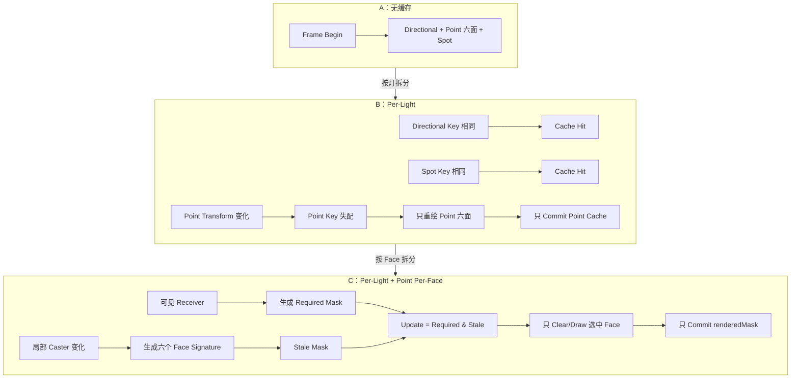
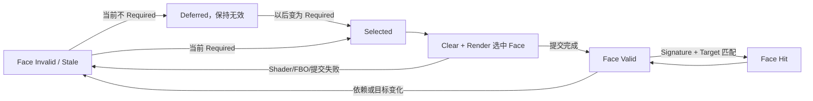

# 阴影缓存 A→B→C：从 Per-Light 到 Point Per-Face 的增量更新原理

状态：实现与正式实验均已完成
日期：2026-07-30
适用代码：当前工作区的 No-cache / Per-Light Revision Cache / Point Per-Face Cache 三档路径

相关材料：

- [当前 1080p A/B/C 三档实验报告](POINT_SHADOW_CACHE_3WAY_REPORT_CN.md)
- [当前三档数据、图表与截图汇总](docs/benchmark-images/shadow-optimizations/point-shadow-cache-3way-1080p-a298e37/point-shadow-cache-3way-summary-cn.json)
- [Point Shadow 关键失效规则与 SceneTopologyRevision 正确性审计](POINT_SHADOW_CACHE_CORRECTNESS_AUDIT_CN.md)
- [正确性审计数据、图表与截图汇总](docs/benchmark-images/shadow-optimizations/point-shadow-cache-correctness-1080p-a298e37/point-shadow-cache-correctness-summary-cn.json)
- [阶段 B 的 1080p A/B 实验报告](PER_LIGHT_SHADOW_CACHE_BENCHMARK_CN.md)
- [阶段 B 的确定性连续运动时间轴与逐帧遥测](SHADOW_MOTION_TIMELINE_CN.md)
- [完整失效矩阵](benchmark-results/shadow-optimizations/per-light-cache-invalidation-matrix.json)

---

## 1. 一句话概括

这项优化不是一次孤立的“少画两张 Shadow Map”，而是把阴影缓存粒度连续下沉了两次：

```text
A：无缓存，每帧全量重绘
    ↓ 按灯光拆分依赖
B：Per-Light Revision Cache
    ↓ 按 Cubemap Face 拆分 Point 的依赖与需求
C：Spatial Per-Light + Point Per-Face Cache
```

三档的精确定义是：

| 档位 | 缓存粒度 | 每帧行为 |
|---|---|---|
| A 全局重绘 | 无缓存控制路径 | Directional、Point、Spot 全部重绘；Point 固定提交六面 |
| B Per-Light | 每盏灯一个 Revision Cache Entry | 只更新失效灯；Point 一旦失效仍固定提交六面 |
| C Per-Light + Per-Face | 可证明局部性时使用空间 Caster Signature；Point 再维护六个 Face Entry | Point 只提交当前需要且已经失效的 Face |

C 的核心公式是：

```text
StaleMask    = FaceSignatureMissMask
RequiredMask = 当前可见 Receiver 可能采样的 Face
UpdateMask   = StaleMask ∩ RequiredMask
HitMask      = RequiredMask - UpdateMask
DeferredMask = StaleMask - RequiredMask
```

这意味着 C 不是粗暴地“每帧只画某几个固定方向”，而是：

1. 先判断每个 Face 的历史内容是否仍对应当前 Light、Caster、Shader、配置与 Render Target；
2. 再判断当前相机可见 Receiver 是否可能采样该 Face；
3. 只重建 `required & stale`；
4. 没有当前需求的陈旧 Face 保持无效，未来第一次进入 Required Mask 时先重建再使用；
5. 任何边界信息不可靠时退化到六面需求，不能以漏影换性能。

当前正式实验使用同一 Release 可执行文件、相同 Shader/FBO/分辨率/轨迹，A、B、C 每档各运行三个独立进程，每轮测量 1800 帧：

| 场景 | GPU Frame A/B/C | A→C | Point Shadow A/B/C | B→C | Point Face A/B/C |
|---|---:|---:|---:|---:|---:|
| Crytek Sponza | `1.596 / 1.467 / 1.208 ms` | **-24.32%** | `0.591 / 0.590 / 0.501 ms` | **-15.16%** | `6.00 / 4.00 / 3.10` |
| San Miguel 2.1 | `7.873 / 5.649 / 5.260 ms` | **-33.19%** | `2.715 / 2.678 / 2.004 ms` | **-25.15%** | `6.00 / 4.00 / 2.94` |

这组数据必须按两个台阶解释：

- A→B 的收益来自不再重绘未变化的 Directional 与 Spot；
- B→C 的收益来自局部 Caster 运动和相机静止/移动阶段对 Point Face 的复用；
- Point Light 自身移动会进入六个 Face Signature，因此通常仍使六面全部陈旧；如果 Receiver 又需要六面，C 会正确退化成完整六面更新。

因此当前可辩护的结论是“局部 Caster 变化下的 Point Per-Face 增量更新”，不是“所有点光源更新都只画两三个面”。

真正困难的部分是回答下面这个问题：

> 怎样把缓存粒度从 Scene 下沉到 Light，再从 Point Light 下沉到 Cubemap Face，同时保证陈旧面不会被当前可见 Receiver 采样，并在证明不了局部性时自动退回安全路径？

本文围绕这个问题展开。

---

## 2. 为什么会有这个问题

### 2.1 Shadow Map 是一个可缓存的中间结果

先把“阴影内容”和“承载这份内容的 GPU 资源”分开。一张 Shadow Map 的内容可以写成：

```text
ShadowContent_i = RenderDepth(
    ShadowCasters,
    LightState_i,
    ShadowShader_i,
    ShadowPathConfig_i
)

CacheEntry_i = {
    ShadowContent_i,
    RenderTarget_i,
    PublishedState_i
}
```

Render Target 的身份并不改变深度函数在数学上应该得到什么结果，但它决定“上一次结果现在是否仍住在这个可用资源里”。Shadow Map 不是最终画面，而是后续 Lighting Pass 使用的中间结果。只要逻辑输入没有变化、物理资源没有被替换，并且上次写入已经完整发布，重复生成同一张深度图就没有意义。因此，阴影天然适合做缓存。

项目最初的 `DrawShadowMap` 没有缓存命中逻辑。它每帧直接遍历所有启用阴影灯、清空深度目标并重新提交 Caster。即使灯、Caster、Shader 和渲染目标都没有变化，上帧结果也不会被复用。

### 2.2 物理输出是独立的，初始调度却总是全量执行

Directional、Point、Spot 实际拥有独立的 FBO 和深度纹理：

- Directional：一张 2D Depth Map；
- Point：一张六面的 Depth Cubemap；
- Spot：一张 2D Depth Map。

初始路径没有“哪一盏灯失效”这个判断阶段。每帧执行链都是：

```text
Frame Begin
    → Directional 重绘
    → Point 六面重绘
    → Spot 重绘
```

所以只移动 Point Light 时，Directional 与 Spot 的工作是重复的；场景完全静态时，三盏灯的工作也都是重复的。这不是 Shadow Mapping 或 OpenGL 的固有限制，而是初始实现尚未利用跨帧时间复用。

### 2.3 为什么这个问题在动态场景中很突出

初始全量更新在功能上直接、容易理解，但不会根据变化范围缩减工作。典型游戏场景通常是：

- 太阳光不动；
- 室内 Spot 不动；
- 玩家手电、火球或局部 Point Light 在移动；
- 大部分 Caster 静态，少量对象动态。

因此，缓存不能只回答“上一帧画过没有”，还必须连续回答三个问题：

```text
哪一盏灯的结果仍然有效？
    → 这盏 Point Light 的哪一个 Face 仍然有效？
        → 当前画面真正可能采样哪些 Face？
```

B 用 Per-Light Entry 回答第一个问题；C 用 Point Face Entry 和 Receiver Demand 回答后两个问题。

### 2.4 这是系统固有问题，还是第一版没考虑到

最初“每帧全部重绘”确实说明当时没有考虑跨帧复用，但这不等于只加一个布尔值就能安全解决。真正固有且困难的问题是：引入缓存以后，必须完整建模所有失效来源，否则性能提升会换来陈旧阴影。

项目中间曾有过 Global Revision Cache：它能安全解决静态复用，但局部灯光变化仍会把整组阴影失效。它是有价值的过渡设计，不过当前正式三档实验不把它列为独立档位：A 直接复现无缓存全量调度，B 是 Per-Light，C 是 Per-Light + Per-Face。

完整演进是：

```text
A：无缓存，每帧全部重绘
    → 识别 Shadow Map 是可复用的派生数据
    → 中间：Global Revision Cache，先解决静态复用
    → 发现局部变化仍被放大
    → B：Per-Light Revision Cache
    → 发现 Point Miss 仍把一个变化放大成六个 Face Pass
    → 验证 Caster 与 Receiver 在 Cubemap Face 上的空间局部性
    → C：Spatial Per-Light + Point Per-Face Cache
```

所以问题既包含“初始实现没有考虑缓存”，也包含缓存系统天然困难的失效建模。A→B 解决灯光级放大，B→C 解决 Point Cubemap 内部的 Face 级放大；每次下沉都增加了新的正确性义务。

---

## 3. 方案是怎样推导出来的

这里不把思路描述成一次灵光乍现，而是从无缓存路径的工作量证据出发，还原怎样先推导出 Per-Light Cache，再从 B 的剩余瓶颈推导出 Point Per-Face Cache。

### 3.1 先证明浪费发生在哪里

第一步不是立即改代码，而是把阴影更新按灯型拆开计数：

- `directionalLightUpdateCount`；
- `pointLightUpdateCount`；
- `spotLightUpdateCount`；
- `lightCacheHitCount`；
- `updatedLightCount`；
- 分灯型 GPU Zone 与整个 `Shadow Map Update` GPU Zone。

在受控的 `move-point` workload 中，观察到无缓存基线每帧是：

```text
Directional = 1
Point       = 1
Spot        = 1
Total       = 3
```

而场景中唯一变化的输入是 Point Light 的位置。

这给出了直接结论：

> 性能问题不在 Point Shadow 本身，而在初始调度没有利用变化局部性，每帧都重新提交三盏灯。

### 3.2 观察到一个重要事实：渲染资源本来就是逐灯独立的

每盏灯已经拥有自己的：

- Shadow FBO；
- 深度纹理；
- 投影参数；
- Light Space Matrix；
- Shader 输入。

所以不需要重写 Shadow Rendering Pipeline，也不需要引入 Shadow Atlas 才能解决问题。物理结果已经具备独立缓存的基础，只是有效性记录仍放在 Scene 全局。

由此得到最小改造方向：

> 把缓存记录从 Scene 级拆到 Light 级，保留原有的实际绘制函数，只改变“哪些灯被选择执行”。

### 3.3 不能只加一个 `dirty` 布尔值

最初看起来最简单的方案是：

```cpp
light.shadowDirty = true;
```

但这个项目存在大量直接可变状态：

- Editor 直接修改 Transform；
- 材质属性通过公开 Map 被修改；
- Shader 可以热重载；
- FBO 会被池化、释放、Resize 和复用；
- Auto Fit 会在缓存检查后更新 Near/Far 或投影范围；
- 纹理内容可能在 GL Object ID 不变时被原地替换。

如果依赖所有调用方都记得手动设置 Dirty，很容易出现：

```text
数据已经变化
    但某个入口忘了 MarkDirty
        → 错误命中
            → 采样陈旧阴影
```

这类错误通常不会崩溃，而是表现成偶发的漏影、鬼影或一帧错误，因此比显式失败更难排查。

所以最终选择的是版本化依赖：

```text
对于系统可观察的字段：
    Dirty 由“当前依赖版本”和“已缓存依赖版本”比较出来。

对于无法从对象身份推断的原地内容变化：
    生产者发布 Content Revision；
    缓存仍通过版本比较传播失效，而不是由调用方逐灯 MarkDirty。
```

例如，同一个 GL Texture ID 的像素被原地替换时，必须调用 `Material::InvalidateShadowState()` 递增内容版本。当前 Mesh 签名也只观察 Active、VAO、Draw Count 和 Material 等状态；若同一 VAO/Buffer 内的几何内容原地改变，还需要额外的 Geometry Content Revision。版本化方案显著减少了逐灯漏标入口，但不会凭空观察到没有发布版本的内存或 GPU 内容变化。

### 3.4 从“缓存值”进一步推导到“缓存发布协议”

仅有 Per-Light Key 仍然不够。

考虑下面的失败序列：

```text
Key 失配
    → 开始重建 FBO
        → Shader/目标不可用，或某个 Cubemap Face FBO 不完整
            → 如果仍把 Key 标为有效，就会采样未初始化或半成品内容
```

因此缓存必须区分两个概念：

1. 逻辑 Key 是否匹配；
2. GPU 目标中是否真的存在可以安全采样的内容。

这就是 `valid` 和 `contentSampleable` 分离的来源，也是整个实现最关键的安全设计之一。这里说的是“事务式发布语义”，不是带 GPU Fence、回滚日志或逐 Draw 错误检查的严格 GPU 事务。

### 3.5 B 为什么仍然浪费：Point Light 在灯内还是一个原子 Entry

B 已经把更新数从三盏灯缩到真正失效的灯，但 Point Cache Entry 仍把整个 Cubemap 当作一个不可拆分结果：

```text
Point Key Miss
    → 清空整个 Cubemap
        → +X / -X / +Y / -Y / +Z / -Z 全部提交
            → 整灯 Commit
```

这对 Point Light 自身移动是合理的：六个 Face 的 View Matrix 都以灯的位置为原点，灯一移动，六面投影关系都会改变。

但对局部 Caster 变化并不总是合理。一个位于 `+X` 方向的小物体移动，通常只改变覆盖它的一个或少数 Face；把 `-X`、`±Y`、`±Z` 一起重建，是把一个空间局部事件再次放大。

因此 B 的剩余问题不是“能否把六次 Draw Call 神奇地合成一次”，而是：

> 六个 Face 中，哪些内容真的失效；失效后哪些内容又是当前画面马上需要的？

### 3.6 从 B 推导 C：把“有效性”和“当前需求”分开

只做 Face Dirty 仍不够。假设一个背向相机的 Face 已经失效：

- 立即重建它，正确但可能浪费；
- 永远不重建它，未来相机转过去会采样陈旧内容；
- 当前延迟，未来第一次需要时先重建，才同时满足性能与正确性。

由此得到两个互相独立的集合：

```text
StaleMask：
    哪些 Face 的已缓存内容不再对应当前输入。

RequiredMask：
    当前相机可见 Receiver 可能从哪些 Face 采样阴影。
```

真正的本帧更新集合是二者交集：

```text
UpdateMask = StaleMask & RequiredMask
```

这就是 C 的关键思想。它不是把相机可见性当作缓存有效性，也不是因为某个面当前不可见就把它错误标成 Valid；它只允许非需求面保持“陈旧但未发布为当前版本”，以后按需物化。

---

## 4. 核心抽象：逐灯依赖函数

第 `i` 盏灯的逻辑阴影内容可以抽象为：

```text
S_i(t) = F(
    C(t),
    L_i(t),
    H_i(t),
    P_i(t)
)

Entry_i(t) = {
    S_i(t),
    R_i(t),
    Published_i(t)
}
```

其中：

- `C(t)`：所有阴影 Caster 的深度相关状态；
- `L_i(t)`：第 `i` 盏灯的 Transform 与投影参数；
- `H_i(t)`：该灯使用的 Shadow Shader Revision；
- `P_i(t)`：渲染路径配置，例如 Six-face、Face Culling；
- `R_i(t)`：承载结果的 FBO/Texture 物理目标身份与资源代际；
- `Published_i(t)`：上次更新是否走完了允许消费者读取的发布路径。

无缓存路径没有 Key：

```text
Update_i(t) = true
    for every enabled shadow light i
    on every frame t
```

中间阶段的 Global Cache 相当于：

```text
K_global = Hash(C, L_1, L_2, ... L_n, H_1, ... H_n, P)

Hit_global =
    globalCache.valid
    AND globalCache.signature == K_global
    AND TargetsUnchangedAndSampleable(R)
```

Per-Light Cache 则是：

```text
K_i = Hash(C, L_i, H_i, P_i)

Hit_i =
    cache_i.valid
    AND cache_i.contentSampleable
    AND cache_i.signature == K_i
    AND cache_i.MatchesTarget(R_i)
```

C 继续把 Point Light `p` 拆成六个 Face：

```text
S_p,f(t) = F(
    C_f(t),
    L_p(t),
    H_p(t),
    P_p(t),
    FaceIndex_f
)

K_p,f = Hash(
    SpatialCasterSignature_f,
    PointLightState,
    PointShaderRevision,
    PointRenderPolicy,
    FaceIndex_f
)

FaceHit_p,f =
    TargetMatches(R_p)
    AND validMask[f]
    AND cachedSignature[f] == K_p,f
```

其中 `C_f(t)` 不是全场 Caster Revision，而是与该 Cubemap Face 光锥相交的 Caster 子集及其版本。六个 Face 仍共享同一张 Depth Cubemap 和同一代 Render Target，但逻辑有效性独立。

把六个 Face Hit 组合成位掩码：

```text
AllFaceMask  = 0b11_1111
StaleMask    = AllFaceMask & ~FaceHitMask
RequiredMask = ReceiverDemand(camera, visibleReceivers, pointLight)
UpdateMask   = StaleMask & RequiredMask
```

`RequiredMask` 只控制本帧物化，不会修改 `validMask`。因此：

- 已有效但当前不需要的 Face 保留缓存；
- 已失效且当前不需要的 Face 保持失效；
- 已失效且当前需要的 Face 必须先更新；
- 冷启动或目标换代时，当前需要的 Face 必须重新生成。

注意：物理 Render Target 没有简单地混入逻辑 Hash，而是通过 `MatchesTarget` 单独验证。这样能明确区分：

- 逻辑输入是否相同；
- 缓存内容是否仍位于同一个、同一代的 GPU 资源中。

### 4.1 A→B→C 的依赖传播



这个图揭示了两次优化改变的都是失效传播边界：

- A→B：把“帧”缩成“灯”；
- B→C：把“Point Light”继续缩成“Cubemap Face”；
- 实际 Shadow Shader、分辨率和最终采样算法没有为了性能而降级。

---

## 5. 两层 Cache State：逻辑状态与物理目标的组合

逐灯缓存记录位于 [Light.h](Light.h) 的 `ShadowMapCacheState`。

它保存：

| 字段 | 含义 |
|---|---|
| `valid` | 已提交的逻辑 Signature 是否有效 |
| `contentSampleable` | GPU 目标中是否存在允许 Lighting Pass 使用的已发布内容 |
| `signature` | 该灯上次成功更新后的逻辑依赖摘要 |
| `framebufferID` | 提交时的 FBO ID |
| `textureID` | 提交时的深度纹理 ID |
| `width / height` | 提交时的目标尺寸 |
| `resourceGeneration` | FBO 本次物理实例的单调代际 |

Point Light 在 C 档额外持有 [Light.h](Light.h) 的 `PointShadowFaceCacheState`：

| 字段 | 含义 |
|---|---|
| `validMask` | 六个 bit 分别表示六个 Face 是否存在已提交 Signature |
| `signatures[6]` | 每个 Face 上次成功绘制时的逻辑依赖摘要 |
| `framebufferID / textureID` | 六面共同所属的 Cubemap 目标 |
| `width / height` | 提交时的 Cubemap 尺寸 |
| `resourceGeneration` | 物理目标代际，防止 GL ID 复用误命中 |

这里没有把 Dirty 状态保存成另一个容易失同步的布尔数组，而是每帧派生：

```text
FaceDirty[f] =
    target changed
    OR validMask[f] == 0
    OR signatures[f] != currentSignatures[f]
```

`SynchronizeTarget` 一旦发现 Cubemap 身份、尺寸或代际变化，会清空整个 `validMask`。这是必要的，因为六个逻辑 Face 虽然独立，物理上仍共享一张 Cubemap；目标换代后没有任何旧 Face 还能成立。

### 5.1 为什么同时保留整灯状态和逐面状态

C 没有删除 `ShadowMapCacheState`：

- `PointShadowFaceCacheState` 回答每个 Face 的逻辑版本是否匹配；
- `ShadowMapCacheState::contentSampleable` 回答当前 Cubemap 目标是否已经存在允许 Lighting Pass 读取的已发布内容；
- Lighting Pass 仍按 Point Light 绑定一张 Cubemap，不需要改成六次独立纹理绑定。

逐面更新成功后，系统只对 `renderedMask` 提交 Face Signature，同时用 `CommitContent` 发布目标身份；没有被绘制的陈旧 Face 仍保持 Valid Bit 缺失或 Signature 不匹配。正确性依赖 Required Mask 保守覆盖当前可见 Receiver 可能访问的所有方向。

### 5.2 为什么 `valid` 不能等于 `contentSampleable`

二者看起来相似，但含义不同：

```text
valid：
    这份内容是否对应当前逻辑输入？

contentSampleable：
    目标里是否存在完整、初始化过、允许被 Shader 读取的内容？
```

例如：

- Shader 成功 Reload 后，Program 与 Revision 同时更新，旧 Shadow Map 虽然仍是完整纹理，却已不对应新 Shader，二者都应失效；
- Shader Reload 失败时，代码保留旧 Program 和旧 Revision，因此旧缓存仍与真正运行的旧 Shader 一致，不会制造一次虚假的失效或错误发布；
- 全局控制路径完成一次成功重绘后，需要发布可采样内容，但 Per-Light Signature 可能由另一层逻辑维护；
- FBO 创建成功但渲染未完成时，目标存在，却不能发布；
- 空 Caster 场景经过显式 Depth Clear 后，没有 Draw Call，但内容仍是正确且可采样的。

把两个状态分开，可以避免用一个布尔值表达多个不同阶段。

### 5.3 为什么还需要 `resourceGeneration`

只比较 OpenGL ID 并不安全。

OpenGL 驱动可以复用已经删除的数字 ID，FBO Pool 也可能复用同一个 C++ 对象。可能出现：

```text
旧资源：FBO ID 17，Texture ID 42，1024×1024
释放
新资源：FBO ID 17，Texture ID 42，1024×1024
```

如果只比较 ID 和尺寸，新资源会被误判为旧资源仍然有效。这和并发结构中的 ABA 问题很像：表面值回到了 A，但对象已经经历过一次完整的销毁和重建。

[FramebufferManager.cpp](FramebufferManager.cpp) 在每次 `FBO::Init` 时分配新的单调 `resourceGeneration`。缓存命中必须同时满足：

```text
Framebuffer ID 相同
Texture ID 相同
尺寸相同
Resource Generation 相同
FBO 完整
```

这使“GPU 资源的逻辑生命期”可以被显式识别。

---

## 6. Caster Revision 与空间签名：怎样知道哪里变了

光源只是 Shadow Map 的一部分输入。Caster 的增删、移动、Mesh 启用状态和 Alpha Test 材质也会改变深度结果。

### 6.1 同步发生在 Camera Culling 之前

[Scene.cpp](Scene.cpp) 的 `BuildMeshDrawLists` 在 Camera Frustum Culling 之前同步 Shadow Caster 状态。

原因是：

> 一个物体可以不在相机画面内，但仍然位于光源和可见接收面之间，从而投下可见阴影。

如果只同步相机可见对象，离开相机视锥的 Caster 可能继续影响画面，却不会触发缓存失效。

因此 Shadow State 的可见性定义和 Camera Visibility 不同。

### 6.2 只跟踪真正影响深度的材质字段

[Material.h](Material.h) 的 Shadow Signature 不会把整个 PBR Material 都加入缓存 Key，而只包含：

- `opacity`；
- 是否启用 Alpha Cutoff；
- `alphaCutoff`；
- Diffuse Texture ID；
- Opacity Texture ID；
- 显式 Shadow Content Revision。

Roughness、Metallic、Specular Color 等不会改变 Shadow Depth，因此不应该让 Shadow Map 失效。

这是一个重要的“不过度失效”设计：

```text
完整性要求：当前建模并支持的、会影响深度的状态都必须进入依赖；
性能要求：不影响深度的状态不能进入依赖。
```

### 6.3 Revision 的分层传播

状态变化从细到粗逐层聚合：

```text
Material Shadow State
    → Mesh Shadow Revision
        → Model Shadow Revision
            → Scene Caster Signature / Caster Revision
                → 每盏灯的 Shadow Key
```

在 B 档，Scene Caster Revision 是场景级的。任何 Caster 变化都会使所有灯的 Key 变化，这是阶段 B 有意保留的保守边界：

- Light 变化可以安全地局部失效；
- Caster 变化是否只影响某盏灯，需要额外维护 Light-Caster Overlap Graph；
- 在没有这个图之前，全灯失效比漏掉阴影变化更安全。

C 档开始在现有 Bounds Scratch List 上计算空间子集 Signature，但仍保留 Scene Revision 作为无法可靠分类时的回退。这里不是推翻 B，而是在能够证明投影相交关系的范围内继续细化。

这体现了优化中的一个原则：

> 对已经能够准确证明局部性的输入做增量更新；对尚不能可靠证明局部性的输入保持保守。

### 6.4 SceneTopologyRevision：把 Model 容器变化纳入依赖

只同步现有 Model 的 Transform、Mesh 和 Material Revision 还不够。Model 可能被新增、删除、替换或整体 Clear；若只观察指针、模型数量或聚合内容，容器可能经历 `A → B → A` 后回到相同表象，但缓存依赖已经跨过一次完整的拓扑变化。

因此 `ModelSource` 维护单调递增的 `SceneTopologyRevision`：

| 操作 | Revision 规则 |
|---|---|
| `AddModel` | 成功加入后推进一次 |
| `DeleteModel` | 实际删除后推进一次 |
| `ReplaceModel` | 一次替换只推进一次，不拆成 Delete + Add 两次 |
| `ClearModels` | 作为显式拓扑屏障推进一次，即使容器已经为空 |

Revision 从 1 开始，回绕时跳过 0。`Scene` 在 `PrepareRenderData` 与 `DrawShadowMap` 前同步观察值；一旦发现变化，就统一失效：

- Global、Per-Light 与 Point Per-Face Cache；
- Shadow Caster 聚合状态与 Bounds/Draw List；
- 已提交的空间 Signature 和 Face Valid 状态。

`SceneTopologyRevision` 同时进入 Global、Per-Light、Spatial Caster 和 Per-Face Signature。这样正确性不依赖容器槽位、对象地址或 Model 数量是否“看起来没变”。

正式 ABA Smoke 在同一槽位替换了名称、几何、材质、变换都相同的 Model，模型数量保持 `2 → 2`；结果是 Revision `3 → 4`、缓存失效一次、Point 阴影更新一次。这个用例只做一次，目标是证明拓扑版本能关闭同槽位替换漏洞，而不是把 ABA 扩散成新的性能 workload。

### 6.5 C 档怎样生成空间 Caster Signature

每个 `ShadowCasterBoundItem` 保存：

```text
Model Identity
Caster Revision
World Bounds Center / Radius
```

`BuildSpatialShadowCasterSignature(lightViewProjection)` 先构造该投影的 Frustum，再扫描 Bounds：

```text
for each caster:
    if caster sphere intersects light frustum:
        hash(model identity)
        hash(caster revision)
        hash(center, radius)

hash(accepted caster count)
```

Directional 与 Spot 在关闭 Auto Fit 时可直接使用各自 Light Frustum 的空间 Signature。Point 的整灯空间 Signature 使用光源位置、Far Range 与 Caster Sphere 做球形范围筛选；Point Per-Face Signature 则分别使用六个 Face Frustum。

加入 `model identity` 和 `accepted caster count` 的原因是：

- 两个 Caster 即使版本值相同，也不能被视为同一个输入；
- Caster 进入或离开投影时，即使其自身 Revision 没变，子集成员关系也已经改变；
- Bounds 也进入 Hash，避免同一版本记录与空间位置不一致。

### 6.6 仍然扫描 Caster，收益在哪里

当前空间 Signature 是 `O(N_caster × projection)` 的 CPU 扫描，不是免费操作。但它把便宜的 Bounds 相交和 Hash，换成了可能昂贵得多的 GPU 工作：

```text
CPU：Sphere/Frustum 测试 + Hash
    替代
GPU/Driver：FBO 切换 + Clear + Mesh Draw + Triangle Rasterization
```

正式 C 档中：

- Sponza 的总缓存检查约 `0.0071 ms/帧`，其中需求分析 `0.0035 ms`、Face Signature `0.0016 ms`；
- San Miguel 的总缓存检查约 `0.0472 ms/帧`，其中需求分析 `0.0427 ms`、Face Signature `0.0019 ms`；
- 同时 Point Shadow 更新样本中位数相比 B 分别减少 `0.089 ms` 和 `0.674 ms`，每帧摊销分别减少 `0.105 ms` 和 `0.579 ms`。

需求分析与 Face Signature 是总缓存检查的子项，不能与总数再次相加。

因此当前两个场景中，扫描成本小于被删除的渲染成本，优化是正收益。它并不意味着线性扫描适合无限规模场景；当 Caster 数量继续扩大时，应使用 BVH、Octree、Grid 或 Light-Caster Overlap Set 把查询从全量扫描改成空间查询。

### 6.7 为什么 Auto Fit 仍保留全局依赖

Auto Fit 会用全体相关 Caster Bounds 改写投影范围。若先用“当前投影”过滤 Caster，再用过滤结果修改投影，会产生循环依赖：

```text
投影决定相关 Caster
    相关 Caster 又决定投影
```

当前实现没有假装这个问题已经解决。Directional、Spot 以及整灯 Point 的 Auto-fit Signature 仍保留全局 Caster 依赖；只有 Point Face 在完成 Fit、得到最终六个矩阵以后再构建逐面空间 Signature。

这也是为什么正式 A/B/C 中 B 与 C 的“更新阴影灯数”相同：C 的主要新增收益来自 Point 内部 Face 数下降，而不是把 Auto-fit 下的所有灯都完全局部化。

---

## 7. 每盏灯的 Signature 包含什么

三个灯型都依赖 Caster 状态，但 B 使用共享 Scene Revision，C 在可证明投影局部性时替换为空间子集 Signature；其余字段仍只加入与自身 Shadow Output 有关的状态。

### 7.1 Directional

`BuildDirectionalShadowRevisionSignature` 包含：

- B 或 Auto Fit：Scene Caster Signature / Revision；
- C 且关闭 Auto Fit：Directional Light Frustum 内的空间 Caster Signature；
- 2D Shadow Shader Revision；
- Direction；
- Shadow Center；
- Near / Far；
- Distance / Width；
- Auto Fit 及 Light-Space AABB Fit 状态；
- 请求分辨率与有效分辨率；
- Directional Fit / Density Resolution 配置。

### 7.2 Point

`BuildPointShadowRevisionSignature` 包含：

- B：Scene Caster Signature / Revision；
- C 且关闭 Auto Fit：Point Range 内的空间 Caster Signature；
- 当前 Point Shadow Shader Revision；
- Position；
- Near / Far；
- Auto Fit；
- Shadow Resolution；
- Adaptive / Six-face 路径配置；
- Face Culling 配置。

### 7.3 Point Per-Face

`BuildPointShadowFaceRevisionSignatures` 为六个 Face 分别组合：

- 该 Face Frustum 内的空间 Caster Signature；
- Point Shadow Shader Revision；
- Adaptive / Six-face / Face Culling / Per-Face 策略；
- Shadow Resolution；
- Auto Fit 状态；
- Point Position；
- Near / Far；
- Face Index。

Face Index 必须进入 Signature。即使两个方向当前恰好包含相同 Caster，它们的投影方向和纹理 Layer 语义也不同，不能因为 Hash 输入集合相似而交换缓存记录。

Point Position 也必须进入六个 Face。它解释了一个非常重要的边界：

```text
Point Light 移动
    → 六个 View Matrix 的原点同时改变
        → 六个 Face Signature 全部变化
            → 当前 Required 的 Face 全部需要更新
```

所以 C 主要优化“局部 Caster 变化”和“未变化内容复用”，不是通过忽略 Point Light 移动来制造低 Face 数。

### 7.4 Spot

`BuildSpotShadowRevisionSignature` 包含：

- B 或 Auto Fit：Scene Caster Signature / Revision；
- C 且关闭 Auto Fit：Spot Light Frustum 内的空间 Caster Signature；
- 2D Shadow Shader Revision；
- Position / Direction；
- Outer Cone；
- Near / Far；
- Auto Fit；
- Shadow Resolution；
- Spot Caster Depth Fit 配置。

### 7.5 为什么 Auto Fit 后要重新计算 Signature

这是一个很容易遗漏的细节。

Cache Miss 后，系统可能根据最新 Caster Bounds 修改：

- Directional 的 Center、Width、Near/Far；
- Point 的 Far Plane；
- Spot 的 Near/Far 或投影范围。

如果仍提交 Fit 之前计算的 Signature，下一帧会发生：

```text
当前 Light State 已被 Fit 改写
    → 与上帧提交的“旧 Signature”不同
        → 再次 Miss
            → 每帧无意义重建
```

因此实现先用当前状态判断是否命中；Miss 后执行 Fit，再用 Fit 后的最终状态重新计算待提交 Signature。

这个“对派生状态重新签名”的步骤让缓存记录对应真正写入 GPU 的最终输入，而不是对应计算过程的中间状态。

---

## 8. 每帧算法：Check、Demand、Select、Render、Commit

核心路径在 [Scene.cpp](Scene.cpp) 的 `DrawShadowMapPerLight`。

它不是边检查边随意修改缓存，而是分为几个阶段。

### 8.1 阶段一：准备共同依赖

```text
同步 Model / Mesh / Material 的 Shadow State
    → 生成 Scene Caster Signature
        → 如果发生变化，递增 Caster Revision
            → 缓存最新 Caster Bounds
```

如果 Caster State 无法可靠建立：

- 禁止所有启用阴影灯的旧内容继续采样；
- 记录 `conservativeShadowFallbackCount`；
- 本帧不发布新的缓存。

### 8.2 阶段二：逐灯检查

对每盏启用的阴影灯：

1. 确保 FBO 存在且类型、尺寸、Texture Target 正确；
2. 检查对应 Shadow Shader 是否存在且 Program ID 非 0；
3. 计算该灯的当前 Signature；
4. 同时比较 Signature 和 Render Target Snapshot；
5. Hit 则跳过；
6. Miss 则立即使旧缓存失效，并加入 Selection。

禁用的灯会：

- 失效自己的缓存；
- 释放 Shadow FBO；
- 触发 FBO Pool 的未使用资源回收。

### 8.3 C 档的 Point Face Check 与 Demand

Point Light 进入 C 路径后，不再只构造一个整灯 Signature，而是执行：

1. `SynchronizeTarget`：目标换代则六面全部失效；
2. 先完成 Point Auto Fit 并取得最终六个 Light Space Matrix；
3. 为六个 Face 构造当前 Signature；
4. 构造 `RequiredMask`；
5. 对六个 Face 计算 `StaleMask`；
6. 得到 `UpdateMask = RequiredMask & StaleMask`；
7. `UpdateMask == 0` 时整盏 Point 不进入 Render Selection。

同时记录：

```text
HitMask      = RequiredMask & ~UpdateMask
DeferredMask = StaleMask & ~RequiredMask
```

若当前有需求，但 Cubemap 目标还没有任何可采样内容，系统强制 `UpdateMask = RequiredMask`。这覆盖冷启动、目标重建和从其他策略切回 C 的第一帧。

`ShadowLightUpdateSelection` 因而不只保存“哪盏灯 Pending”，还保存：

- `pointRequiredFaceMask`；
- `pointUpdateFaceMask`；
- `pointFaceSignatures[6]`。

### 8.4 阶段四：只渲染 Selection

Selection 中的状态实际上形成了一个小型“事务式发布”标记：

| 状态 | 含义 |
|---:|---|
| `0` | 未选择，通常是 Cache Hit 或灯未启用 |
| `1` | 已选择更新，但 CPU 提交路径尚未完成 |
| `2` | 前置门槛通过，Draw 提交路径完整结束，或空场景 Clear 已发出；在 CPU 协议层记为 Completed |

`RenderShadowMapUpdate` 只遍历状态非 0 的灯。前置资源门槛通过且对应 CPU 提交路径走到末尾后，才把状态从 `1` 改为 `2`。

Point C 路径还会遍历 `pointUpdateFaceMask`：

```text
UpdateMask == 0x3f：
    绑定整张 Cubemap FBO
    一次 Clear 全部 Layer
    绘制六个 Face

UpdateMask != 0x3f：
    不允许 Clear 整张 Cubemap
    对每个选中 Face：
        绑定该 Face FBO
        只 Clear 这个 Face
        设置对应 shadowMatrix
        只提交这个 Face 的 Caster
```

这个“局部 Clear”是 C 能成立的物理前提。若部分更新前仍对 Cubemap 做整体 Clear，未失效 Face 的缓存内容会被清掉，而逻辑 Valid Bit 还保持有效，形成严重的假命中。

### 8.5 阶段五：只 Commit Completed 项

渲染结束后：

```text
state == 2 且是 Directional/Spot/B 档 Point
    → Commit(finalSignature, currentTarget)

state == 2 且是 C 档 Point
    → FaceCache.Commit(renderedMask, faceSignatures, currentTarget)
    → ShadowCache.CommitContent(currentTarget)

state == 1
    → 保持 Invalid
```

所以缓存发布具有类似两阶段提交的语义：

```text
准备依赖
    → 选择更新
        → 执行 GPU 工作
            → 资源门槛通过且渲染路径完整结束
                → 一次性发布新缓存状态
```

不会出现“Key 已更新，但纹理仍是旧内容或已知半成品”的状态。需要再次强调：这里的“提交”是 CPU 侧缓存状态协议，不代表实现了 GPU Fence、逐次 `glGetError` 或可回滚的真正 GPU 事务。

Face Commit 只更新 `renderedMask` 覆盖的 Signature 和 Valid Bit。Deferred Face 不会因为同一张 Cubemap 的其他面成功更新而被顺便标成有效。

### 8.6 统一伪代码

```cpp
syncCasterState();

for (Light& light : enabledShadowLights) {
    FBO* target = light.EnsureShadowFBO();
    Shader* shader = ResolveShadowShader(light);

    if (!casterStateReliable || !targetReady(target) || !shaderReady(shader)) {
        light.shadowCache.Invalidate();
        continue;
    }

    if (isPoint(light) && perFaceCacheEnabled) {
        light.faceCache.SynchronizeTarget(target);
        FitProjectionIfNeeded(light, casterBounds);

        FaceKeys keys = BuildPointFaceKeys(light, spatialCasters);
        FaceMask required = BuildRequiredFaceMask(camera, receivers, light);
        FaceMask stale = light.faceCache.BuildMissMask(AllFaces, keys, target);
        FaceMask update = required & stale;

        if (required != 0 && !light.shadowCache.IsSampleable(target)) {
            update = required;
        }
        if (update == 0) {
            ++lightCacheHits;
            continue;
        }

        selection[light] = Pending;
        selection.requiredMask[light] = required;
        selection.updateMask[light] = update;
        selection.faceKeys[light] = keys;
        continue;
    }

    Key current = BuildPerLightKey(
        light, casterRevision, shaderRevision);

    if (light.shadowCache.IsCacheHit(current, target)) {
        ++lightCacheHits;
        continue;
    }

    light.shadowCache.Invalidate();
    FitProjectionIfNeeded(light, casterBounds);

    selection[light] = Pending;
    finalKey[light] = BuildPerLightKeyAfterFit(light);
}

RenderOnlySelectedLights(selection);

for (Light& light : selectedLights) {
    if (selection[light] == SubmissionCompletedOrClearIssued) {
        if (isPoint(light) && perFaceCacheEnabled) {
            light.faceCache.Commit(
                selection.updateMask[light],
                selection.faceKeys[light],
                light.shadowFBO);
            light.shadowCache.CommitContent(light.shadowFBO);
        } else {
            light.shadowCache.Commit(finalKey[light], light.shadowFBO);
        }
    } else {
        light.shadowCache.Invalidate();
    }
}
```

### 8.7 分层状态机



整灯层仍保留原有 Pending/Completed 发布门槛；Face 层在其内部只提交实际完成的 Mask。两层状态机共同保证“计划更新”不会被误当成“已经更新”。

---

## 9. 完整失效规则

| 变化来源 | 观察方式 | A 全局重绘 | B Per-Light | C Per-Face |
|---|---|---|---|---|
| Directional Transform / Projection | Directional Signature | 三灯仍全画 | 只更新 Directional | 同 B |
| Spot Position / Direction / Cone | Spot Signature | 三灯仍全画 | 只更新 Spot | 同 B |
| Point Position | Point / Face Signature | 三灯全画，Point 六面 | 只更新 Point，但六面全画 | 六面 Signature 都变；只立即绘制 Required，其他面保持 Stale |
| Point Near / Far | Point / Face Signature | 全画 | Point 六面 | 当前 Required 的陈旧 Face 更新 |
| Shadow Resolution | Signature + Target Size | 全画 | 对应灯重建 | Point Target 换代使六个 Face Valid Bit 全失效 |
| FBO / Texture Replacement | ID、尺寸、Generation | 本帧重画 | 对应灯 Target Miss | Point Target Miss 使六面全部 Stale |
| 2D Shader 热重载 | Shader Revision | 全画 | Directional + Spot | 同 B |
| Point Shader 热重载 | Face Shader Revision | 全画 | Point 六面 | 六个 Face Stale，按 Required 物化；审计模式六面全重建 |
| Caster 增删 / Active / Transform | Model Revision + Spatial Signature | 全画 | Scene Revision 保守使三灯失效 | 可证明空间无关的灯/Face 命中；Auto-fit 灯仍保守 |
| Model Add / Delete / Replace / Clear | `SceneTopologyRevision` | 全画 | 拓扑变化统一失效 | 整灯、空间与六面状态统一失效；同槽位替换也不能命中旧缓存 |
| Alpha/Opacity/Shadow Texture | Material → Mesh → Model Revision | 全画 | Scene Revision 保守扇出 | 只影响包含该 Caster 的空间 Signature；Auto-fit 例外 |
| Roughness/Metallic 等 | 不进入 Shadow Signature | 仍因 A 每帧全画 | 不失效 | 不失效 |
| Camera Transform | Receiver Demand | A 仍每帧全画 | Shadow Cache 不失效 | 只改变 Required；新需求且 Stale 的 Face 先重建 |
| Point Render Policy | Point / Face Signature | 全画 | Point 六面 | 六面 Stale，按 Required 重建 |
| Cache 策略切换 | Feature State 同步 | N/A | 清空跨策略状态 | 清空整灯与逐面状态，冷启动 |
| 灯被禁用 | Active / useShadowMap | 不再绘制 | 失效并释放 FBO | 同时清空 Point Face Cache |
| 无 Caster | Bounds 为空 | Clear | Clear 后 Commit | Clear 正确空内容，不保留旧阴影 |
| Receiver Bounds 非法 | Reliability Gate | 不影响 A | 不适用 | `RequiredMask = 0x3f`，保守六面需求 |
| Caster State 不可靠 | Reliability Gate | 尝试当前帧路径 | 禁止旧内容采样 | 禁止旧内容采样并记录保守回退 |
| Shader/FBO/Face 不完整 | Readiness Gate | 不发布 | 对应灯不 Commit | Point 不发布新内容；旧 Face 不伪装成新版本 |
| Force-all 审计 | 显式配置 | 六面 | 六面 | 强制 `RequiredMask = 0x3f`，验证最终六面收敛 |

### 9.1 为什么没有 Caster 时也不能直接跳过

正确的“无 Caster”阴影结果不是“保留上一帧”，而是：

```text
整张深度图为 Far Depth
```

如果从有 Caster 切换到无 Caster 后直接跳过渲染，旧深度仍留在纹理中，已经删除的物体会继续投影。

因此系统走 `clearOnly` 路径：

1. 确认目标完整；
2. 清为深度 1.0；
3. 将 Selection 标为成功；
4. Commit 这份正确的“空阴影”内容。

这也是为什么“没有 Draw Call”不等于“没有更新”。

### 9.2 为什么切换 No-cache / Global / Per-Light / Per-Face 策略必须整体失效

不同策略的有效性语义不同。若运行时切换策略却沿用旧状态，可能出现：

- No-cache 控制路径留下的内容被错误当作某个已提交 Signature；
- Global Key 有效，但某个 Per-Light Signature 从未提交；
- Per-Light 内容有效，但 Global Cache 误认为整组内容在同一事务中完成。
- 整灯 Point 内容可采样，但六个 Face Signature 从未建立；
- 某些 Face Valid，但关闭 C 时整灯 Signature 仍是旧版本。

进入 `OPENGL_LEARN_SHADOW_CACHE=none` 时会清除 Global、Per-Light 与 Per-Face 有效性，并强制每帧更新；返回缓存策略时再次冷启动。`SynchronizeShadowCacheGranularity` 负责 Global / Per-Light 隔离，Feature State 同步负责 Spatial Caster 与 Point Per-Face 开关变化；任何粒度切换都从冷缓存开始，避免跨策略污染。

---

## 10. 点光源六面阴影：从完整重建到安全部分更新

Point Shadow 是这项工作的高风险部分，因为一次“Point 更新”实际包含六个视方向：

```text
+X, -X, +Y, -Y, +Z, -Z
```

### 10.1 为什么 Layered 路径看起来很有吸引力

Geometry Shader Layered Rendering 理论上可以：

- 一次提交 Caster；
- 在 Geometry Shader 中复制到六个 Cubemap Layer；
- 比六次独立 Face Submission 更便宜。

仅看 Draw Count 或 GPU 时间，这条路径非常诱人。

### 10.2 为什么最终没有盲目接受更快的数据

逐面读取 Depth Cubemap 后发现：当前驱动上的 Layered 路径可能留下五个 Face 未正确写入。

这意味着“更快”的部分收益来自少做了本应完成的工作。若继续把它当作性能结果，会得到一个错误结论：

```text
不完整渲染
    被误认为
高效渲染
```

因此当前 Adaptive 策略 fail-closed 到经过直接验证的 Six-face 路径；显式 Layered 只保留为诊断覆盖。

### 10.3 A/B 的 Six-face 整体发布完整性

A/B 在真正开始更新 Point Shadow 之前，先获取并验证六个 Face FBO：

```text
6 / 6 Face FBO 全部完整
    → 清空整个 Cubemap
        → 分别执行六个 Face Pass
            → 标记 Point 更新成功

任意 Face FBO 失败
    → 整个 Point 更新不 Commit
```

阶段 B 的正式实验进一步在性能采样之后读取六个 Face，记录：

- 基于深度位模式计算的 64 位内容 Hash；
- 非 Far Depth 样本数；
- Min / Max Depth；
- Face Validity。

阶段 B 正式运行中，每次 Point 更新都核算为 6 次 Six-face Submission；12 次正式调用读回的 72 个 Face 全部有效；在此基础上，36 个 A/B 配对 Face Hash 又全部一致。这三层证据支持：A→B 没有通过漏 Face 获得收益。

### 10.4 C 的部分更新为什么必须逐面 Clear

C 仍然使用经过验证的 Six-face Shader 路径，但允许一次 Point Update 的 `UpdateMask` 少于六个 bit。

完整重建可以：

```text
Bind Cubemap FBO
    → glClear(GL_DEPTH_BUFFER_BIT)
        → 绘制 6 Face
```

部分更新必须改成：

```text
for each selected face:
    Bind face-specific FBO
    Clear only this face
    Draw only this face
```

未选中的 Face 既不能被 Clear，也不能修改其 Valid/Signature。这样才真正保留 Cubemap 内其他 Face 的历史内容。

所有六个 Face FBO 仍在更新前一起验证。任一 Face Target 无法取得时，本次 Point 不进入成功发布，避免资源状态不完整时继续局部写入。

### 10.5 Required Mask 怎样计算

`ComputePointShadowRequiredFaceMask` 的目标不是预测“相机朝向哪个 Face”，而是保守覆盖当前可见 Receiver 可能产生的点阴影采样方向。

流程是：

1. 用当前 Camera View-Projection 构造相机 Frustum；
2. 遍历 Opaque 与 Transparent Receiver Draw List；
3. 用 OBB 优先、Sphere 回退判断 Receiver 是否在相机视锥内；
4. 排除完全超出 Point `far + receiverRadius` 的 Receiver；
5. 用 Receiver OBB/Sphere 与六个 Point Face Frustum 求交；
6. 相交的 Face Bit 写入 `RequiredMask`。

每个 Face 使用略大于 90° 的 FOV。扩张量根据滤波半径和 Shadow Resolution 计算：

```text
angularPadding = atan(2 * filterRadiusTexels / resolution)
faceFov        = 90.25° + 2 * angularPadding
```

这样可以覆盖 Cubemap 边界附近的 PCF/PCSS 采样足迹，减少 Receiver 位于 Face Seam 时因过紧分类而漏掉相邻 Face。

以下情况直接保守返回六面：

- 显式开启 `POINT_SHADOW_FORCE_ALL_FACES_REQUIRED`；
- 没有 Camera；
- Receiver Bounds 非法或不可验证。

没有 Receiver 时允许返回零需求；当前可见 Receiver 已覆盖六面时提前结束扫描。

### 10.6 Deferred Face 为什么不会被永久遗忘

假设 `-Z` Face 因 Caster 移动变成 Stale，但当前相机没有任何可见 Receiver 会采样 `-Z`：

```text
StaleMask    包含 -Z
RequiredMask 不包含 -Z
UpdateMask   不包含 -Z
DeferredMask 包含 -Z
```

这一帧不更新 `-Z`，但它的旧 Signature 不会被覆盖。以后相机转向该区域：

```text
-Z 进入 RequiredMask
    → 旧 Signature 仍不匹配
        → -Z 进入 UpdateMask
            → 先 Clear/Draw/Commit
                → Lighting Pass 再消费本帧发布的 Cubemap
```

为了验证延迟策略最终能够收敛，正式测试另跑 PCSS Force-all 审计，把 `RequiredMask` 强制为 `0x3f`。A/B 与 C 的六面深度 Hash 在 Sponza、San Miguel 中全部一致。

---

## 11. Lighting Pass 为什么不会误采样半成品

缓存安全的最后一道门位于采样侧。

Forward 和 Deferred 的 Light Uniform / Texture Binding 都使用：

```cpp
shadowCache.IsSampleable(shadowFBO)
```

只有同时满足：

- `contentSampleable == true`；
- 当前 FBO 完整；
- FBO/Texture ID 匹配；
- 尺寸匹配；
- Resource Generation 匹配；

才会把 `useShadowMap` 设为 true 并绑定真实深度纹理。

否则 Shader 收到：

```text
useShadowMap = false
```

Deferred Light Volume 也不会在采样阶段偷偷调用 `EnsureShadowFBO`。采样代码只消费已经发布的资源，不在读取阶段制造一个空目标。

这形成清晰的所有权：

```text
Update Path：创建、写入、验证、发布
Sampling Path：只读取已发布内容
```

C 档需要再加一条约束：

> Sampling Shader 绑定的仍是一张普通 Depth Cubemap，它不会在 Shader 内查询 CPU 的 `validMask`；因此 CPU 的 Required Mask 必须在 Lighting Pass 之前覆盖所有当前可见 Receiver 可能访问的 Face。

也就是说，Face Validity 不是靠 Shader 采样时临时兜底，而是靠更新调度保证：

```text
当前会被采样的 Face
    → 必须在 RequiredMask
        → 若 Stale，必须在本帧先更新
        → 若未更新，说明 Signature 与 Target 已命中
```

如果 Camera、Receiver Bounds 或分类依据不可用，Required Mask 退化为 `0x3f`。这个保守回退是延迟物化能够安全存在的前提。

---

## 12. 静态场景和动态场景分别怎样走

### 12.1 静态场景

无缓存 A 不检查这些条件，静态场景仍每帧更新三盏灯。

Per-Light B 的冷缓存或失效后首帧需要构建完整 Shadow Map；完成一次成功构建并预热后，如果所有输入继续不变：

```text
Caster Revision 相同
Light Signature 相同
Shader Revision 相同
Target Snapshot 相同
```

结果：

```text
Directional Hit
Point Hit
Spot Hit
Shadow Pass 更新数 = 0
```

C 冷启动时会构建 Directional、Spot 和当前 Required 的 Point Face。预热后：

```text
Directional Hit
Spot Hit
Point Required Face 全部 Hit
UpdateMask = 0
```

没有当前需求的 Point Face 可以继续保持未物化；只要相机和可见 Receiver 不需要它们，就不会产生渲染工作。

失效矩阵的 `static-hit` 在 4 个测量帧内得到：

```text
A 更新 12，B 更新 0，B Per-Light Hit 12
```

这是阶段 B 的基础门禁；当前三档长轨迹又覆盖了 C 的逐面命中。

### 12.2 只有一盏灯移动

只移动 Point 时：

```text
Directional Key 相同 → Hit
Point Key 变化       → Miss
Spot Key 相同        → Hit
```

结果：

```text
无缓存 A 总更新 3，Hit 0
Per-Light B 总更新 1，Hit 2 / frame
```

C 仍然只更新 Point，但 Point Position 出现在六个 Face Signature 中，因此六面都变成 Stale：

```text
StaleMask  = 0x3f
UpdateMask = RequiredMask
```

如果 Required Mask 是六面，C 与 B 一样提交六面；如果当前 Receiver 只可能采样五面，剩下一面延迟。不能把这一段包装成 C 的稳定主收益。

移动 Directional 或 Spot 时，B/C 都得到相同的灯光级局部关系。

### 12.3 Caster 变化

B 的 Scene Caster Revision 被三盏灯共同依赖，因此：

```text
Directional Miss
Point Miss
Spot Miss
```

C 会为非 Auto-fit 投影构造空间 Caster Signature，并为 Point 构造六个 Face Signature。局部 Caster 只会改变覆盖它的 Face：

```text
Point Face +X：Signature Miss
Point Face -X：Signature Hit
Point Face ±Y：视 Bounds 是否跨界
Point Face ±Z：视 Bounds 是否跨界
```

当前正式配置中的 Directional/Spot/整灯 Point 使用 Auto Fit，所以灯光级 Caster 依赖仍会保守；C 的主要收益体现在 Point 内部只更新约 2～3 个受影响 Face，而不是声称三盏灯都已经拥有完全局部的 Caster 图。

### 12.4 只有相机移动

在当前非 CSM 阴影路径中，Camera 不进入 B 的 Shadow Content Key：

```text
A：仍然每帧全画
B：三盏灯全部 Hit
C：Light/Caster Signature 不变，只重新计算 RequiredMask
```

C 若发现所有新需求 Face 都已有效，`UpdateMask = 0`；若相机第一次暴露一个此前 Deferred 的 Stale Face，只更新该 Face。这是按需物化，而不是 Camera 使全部 Shadow Map 失效。

### 12.5 正式三阶段轨迹为什么这样设计

统一 1800 帧周期分成三个各 600 帧的阶段：

1. `Point + Camera`：验证 A→B 的灯光级局部性，也暴露 Point 移动通常六面 Stale 的边界；
2. `Local Caster + Camera`：验证 B→C 的逐面空间局部性；
3. `Camera-only`：验证有效 Face 复用和 Deferred Face 的按需物化。

局部 Caster 是独立的小球，而不是移动整座 Sponza/San Miguel。否则所有场景 Bounds 都变化，实验会天然把六面同时污染，无法测量 Per-Face Cache 真正想解决的工作负载。

---

## 13. 性能为什么会提升

设三个灯光 Pass 的成本为：

```text
C_D = Directional Shadow 成本
C_S = Spot Shadow 成本
C_P,f = Point Face f 的成本
C_P,6 = Σ(f=0..5) C_P,f
O_B   = Per-Light Check / Select / Commit 开销
O_C   = Spatial Signature + Receiver Demand + Face Commit 开销
```

A 每帧的近似成本是：

```text
T_A ≈ C_D + C_P,6 + C_S
```

B 在只有 Point 失效时：

```text
T_B ≈ C_P,6 + O_B
```

C 对某一帧：

```text
U = RequiredFaces ∩ StaleFaces
T_C ≈ Σ(f ∈ U) C_P,f + O_C
```

所以两层收益来源不同：

```text
A→B：
    删除未失效灯光的 Pass。

B→C：
    在已经选中的 Point Light 内，
    删除未需求或未失效 Face 的 Pass。
```

### 13.1 为什么统一轨迹里 B 平均是四个 Point Face

1800 帧轨迹的三个阶段等长，每段 600 帧：

```text
Point + Camera       → Point 更新
Local Caster + Camera→ Point 更新
Camera-only          → Point 不更新
```

所以 B 的 Point 更新频率约为 `2/3 次/帧`，每次固定六面：

```text
2/3 × 6 = 4.00 Face/帧
```

C 保持同样的 Point 更新事件，只减少每次事件内部的 Face 数。这使 A/B/C 的工作量关系可以直接核算，不会把“不更新整盏 Point”和“Point 内少更新 Face”混在一起。

### 13.2 当前正式 A/B/C 结果

实验条件：

- `1920×1080`；
- Release、PBR Forward、Hard Shadow 性能隔离；
- A/B/C 每档三个独立进程；
- 每轮外部预热 300 帧、内部预热 300 帧、测量 1800 帧；
- 交错顺序固定为 `A-B-B-A-A-B`，VSync 请求值为 Off（swap interval 0）；
- Sponza 与 San Miguel 使用同一确定性三阶段轨迹；
- Point 使用相同 Six-face Shader、FBO、分辨率与逐面 Caster Culling；
- 被测 Commit 为 `a298e37e953310364376b631e85840ee2ef353ff`，全部元数据 `gitDirty=false`；
- Release 可执行文件 SHA-256 为 `a0a07672d367fcc74a9a6ec16b6003f821fee69bc062a95fe5fc49514949dd38`。

| 场景 | 指标 | A | B | C | A→B | B→C | A→C |
|---|---|---:|---:|---:|---:|---:|---:|
| Sponza | GPU Frame Median | 1.596 ms | 1.467 ms | 1.208 ms | -8.06% | **-17.68%** | **-24.32%** |
| Sponza | Shadow Update GPU Median | 0.765 ms | 0.755 ms | 0.524 ms | -1.26% | **-30.67%** | **-31.55%** |
| Sponza | Point Shadow GPU Median | 0.591 ms | 0.590 ms | 0.501 ms | -0.12% | **-15.16%** | **-15.27%** |
| San Miguel | GPU Frame Median | 7.873 ms | 5.649 ms | 5.260 ms | **-28.25%** | **-6.88%** | **-33.19%** |
| San Miguel | Shadow Update GPU Median | 5.014 ms | 4.148 ms | 2.689 ms | -17.26% | **-35.18%** | **-46.37%** |
| San Miguel | Point Shadow GPU Median | 2.715 ms | 2.678 ms | 2.004 ms | -1.38% | **-25.15%** | **-26.18%** |

工作量进一步闭合了因果关系：

| 场景 | 指标 | A | B | C |
|---|---|---:|---:|---:|
| Sponza | 更新阴影灯/帧 | 3.00 | 1.33 | 1.33 |
| Sponza | Point Face/帧 | 6.00 | 4.00 | **3.10** |
| Sponza | Face Hit/帧 | 0.00 | 0.00 | **2.90** |
| Sponza | Caster Draw/帧 | 1376.50 | 653.84 | **534.36** |
| Sponza | Triangle-Pass/帧 | 1,046,303.19 | 520,261.52 | **408,839.77** |
| San Miguel | 更新阴影灯/帧 | 3.00 | 1.33 | 1.33 |
| San Miguel | Point Face/帧 | 6.00 | 4.00 | **2.94** |
| San Miguel | Face Hit/帧 | 0.00 | 0.00 | **2.90** |
| San Miguel | Caster Draw/帧 | 4917.49 | 2369.16 | **1884.81** |
| San Miguel | Triangle-Pass/帧 | 22,288,885.35 | 11,365,055.68 | **8,751,856.85** |

`更新阴影灯/帧` 在 B/C 相同，而 Point Face、Draw 和 Triangle 继续下降，证明 B→C 的收益确实发生在 Point Light 内部，而不是偷偷改变轨迹或少触发一次整灯更新。

### 13.3 三阶段怎样揭示收益与退化边界

| 场景 / 阶段 | B Point GPU 摊销 (ms/帧) | C Point GPU 摊销 (ms/帧) | C Rendered Face | C Hit Face | 解释 |
|---|---:|---:|---:|---:|---|
| Sponza / Point+Camera | 0.607 | 0.610 | 6.00 | 0.00 | Point 自身移动，C 正确退化到六面 |
| Sponza / Local Caster+Camera | 0.605 | 0.288 | 3.29 | 2.71 | 逐面空间 Signature 产生主要收益 |
| Sponza / Camera-only | 0.000 | 0.000 | 0.00 | 6.00 | 阴影内容复用，只重算需求 |
| San Miguel / Point+Camera | 2.627 | 2.621 | 5.53 | 0.00 | 当前 Receiver 需要约 5～6 面，几乎无 B→C 收益 |
| San Miguel / Local Caster+Camera | 2.706 | 0.977 | 3.29 | 2.71 | 局部变化把六面更新压到约三面 |
| San Miguel / Camera-only | 0.000 | 0.000 | 0.00 | 6.00 | 六个 Required Face 全部命中 |

这张表解释了为什么不能只报告整段平均值：C 不是让 Point Light 移动本身变便宜，而是在局部 Caster 与静态阴影内容复用时删除 Face 工作。Point+Camera 阶段就是明确的退化边界。


### 13.4 C 的 CPU 代价

| 场景 | Required Face/帧 | Rendered Face/帧 | Cache Check | Demand | Face Signature |
|---|---:|---:|---:|---:|---:|
| Sponza | 6.000 | 3.097 | 0.0071 ms | 0.0035 ms | 0.0016 ms |
| San Miguel | 5.844 | 2.941 | 0.0472 ms | 0.0427 ms | 0.0019 ms |

Demand 和 Face Signature 是 Cache Check 的内部子项，表中三列不能相加。

Sponza 几乎总需要六面，San Miguel 通常需要五面左右。这证明仅靠 Camera Demand 并不会自动产生大收益；C 的有效部分是“需求面中仍有约 2.94 面命中缓存”，尤其来自局部 Caster 和 Camera-only 阶段。

CPU 扫描成本已经显式计入数据，没有被隐藏。当前场景中它小于 GPU 与 Draw Submission 的节省；更大规模场景仍需要空间索引。


---

## 14. 为什么这套方案“巧妙”

这里的巧妙不是某个复杂语法技巧，而是几个抽象边界恰好对齐。

### 14.1 把优化放在失效传播层，而不是牺牲画质

它没有：

- 降低 Point Cubemap 分辨率；
- 删除 Cubemap 的任何方向；
- 降低 PCF/PCSS 样本；
- 延迟几帧更新；
- 缩短灯光范围来少画物体。

它只删除“根据依赖关系可以证明是重复的工作”。C 仍保留完整六面 Cubemap，只是允许某一帧不重画内容仍有效或当前没有需求的 Face。

因此性能收益不需要用画质、响应延迟或时间稳定性交换。

### 14.2 利用了已有的物理独立性，只修正逻辑耦合

每盏灯本来就有独立 Shadow Map，所以 A→B 不需要重构全部 Render Pass，只需把 Scene 级缓存拆成 Light 级记录。

Point Cubemap 本来又有六个可独立绑定的 Face FBO，所以 B→C 继续复用同一张纹理，只增加逐面 Signature、Mask 和局部 Clear。物理资源层次与逻辑缓存层次正好对齐：

```text
Scene
    → Light
        → Point Cubemap Face
```

这使改动集中在：

- 依赖建模；
- 缓存检查；
- 更新选择；
- 成功提交；
- 采样门控。

实际 Shadow Shader 与主要绘制代码无需为了缓存而复制一套。

### 14.3 “逻辑 Key + 物理代际”解决了两类不同陈旧问题

普通缓存只问：

```text
输入相同吗？
```

GPU 资源缓存还必须问：

```text
结果还存放在同一个有效资源里吗？
```

Signature 解决逻辑陈旧，Resource Generation 解决物理陈旧。二者缺一不可。

### 14.4 Commit 是有门槛的发布，而不是普通赋值

Selection 的 `0 / 1 / 2` 状态让系统可以区分：

- 不需要更新；
- 计划更新；
- CPU 提交路径 Completed。

只有前置门槛通过、CPU 提交路径走完的灯才发布新 Signature 和 Sampleable Content。已知失败不会污染下一帧的命中判断；GPU 输出级验证仍由专门的读回测试承担。

这和数据库事务、资源状态机的思想相似，但这里只借用了“未完成结果不可见”的发布原则：

```text
未完成的计算不能对消费者可见。
```

### 14.5 把“陈旧”和“暂时不需要”建模成两个正交维度

一个 Face 可以同时处于：

- Valid + Required：直接命中；
- Valid + Not Required：保留历史内容；
- Stale + Required：本帧必须更新；
- Stale + Not Required：延迟物化。

如果只用一个 Dirty Bool，很难表达第四种状态；如果把 Not Required 直接当成 Valid，又会在相机转向时产生陈旧采样。两个 Mask 的交集恰好表达了这个二维状态空间。

### 14.6 只在能证明局部性时局部化

Light Transform 的影响域天然属于单灯，所以 B 逐灯失效。

局部 Caster 与 Point Face 的相交关系可以由 Bounds 和 Face Frustum 保守证明，所以 C 逐面失效。

Auto Fit 的投影依赖还不能完全局部闭合，所以继续使用全局 Caster 依赖；非法 Receiver Bounds 则直接要求六面。这个边界获得了已经证明的局部收益，又没有为了“看起来更增量”而冒险漏影。

### 14.7 正确性证据和性能证据相互约束

这项优化没有只看 GPU 时间：

- 更新计数证明少画的是哪两盏灯；
- Draw/Triangle 计数证明工作量真的减少；
- 六面/部分 Face Submission 核算证明实际工作量与 Mask 闭合；
- Force-all 六面 Hash 证明 Deferred Face 最终能收敛到完整基准；
- 主画面 A/B、B/C 与重复运行均通过严格 0 像素差门禁；
- Renderer-owned Bytes 证明没有用额外资源换时间；
- Failure/Fallback/Empty Clear Telemetry 证明测试没有悄悄走异常路径。

因此结论形成一个闭环：

```text
依赖模型
    → 更新数变化
        → 实际提交量变化
            → CPU/GPU 时间变化
                → 画面和资源仍满足门槛
```

### 14.8 同一二进制 A/B/C 避免了构建差异

无缓存行为被保留为运行时控制路径：

```text
OPENGL_LEARN_SHADOW_CACHE=none
```

正式 A 使用上述控制路径，B 使用：

```text
OPENGL_LEARN_SHADOW_CACHE=revision
OPENGL_LEARN_SHADOW_PER_LIGHT_CACHE=1
```

C 在 B 基础上增加：

```text
OPENGL_LEARN_SHADOW_SPATIAL_CASTER_CACHE=1
OPENGL_LEARN_POINT_SHADOW_PER_FACE_CACHE=1
OPENGL_LEARN_POINT_SHADOW_FORCE_ALL_REQUIRED=0
```

A/B/C 使用同一个可执行文件。三档保留相同 Shader、FBO、安全门控、Caster Culling、分辨率和运动轨迹，只切换缓存策略。这既复现最初调度行为，也避免旧二进制或其他画质配置污染结论。

---

## 15. 为什么没有选择其他方案

### 15.1 停留在无缓存、每帧全部重绘

优点是控制流直接，不存在错误复用。

缺点是完全放弃跨帧时间复用：静态场景和局部动态场景都会重复提交同一批 Caster。这正是当前正式 A/B/C 的 A。

### 15.2 停留在 Global Cache

静态场景很好，但局部动态会扩大成全局 Miss。它解决了“是否变化”，没有解决“哪里变化”。

### 15.3 手工 Dirty Bool

实现初期简单，但需要每个修改入口都正确维护。面对 Editor 直接写字段、材质公开 Map、Shader 热重载和 FBO Pool，很难长期保证没有漏标。

### 15.4 给灯打 Static / Dynamic 标签

这只能描述一个粗粒度意图：

- Static Light 也会因为 Caster 或 Shader 变化而失效；
- Dynamic Light 也不是每帧所有状态都变化；
- 标签无法证明 GPU Target 是否仍是原资源。

它可以作为调度提示，但不能替代依赖版本。

### 15.5 分帧或降低更新频率

例如每两帧更新一次 Point Shadow，能够降低平均成本，但会引入：

- 阴影滞后；
- 快速移动时的 Temporal Error；
- 帧间不均匀更新尖峰。

这是预算调度方案，不是准确的增量计算。

### 15.6 先做 Shadow Atlas

Atlas 能改善资源绑定和碎片管理，但不自动解决失效粒度。即使三盏灯位于同一 Atlas 中，也仍需要知道哪个 Tile 应该重绘。

具体 Cache Entry 未必仍按灯组织，但“明确依赖、局部失效、成功后发布”的建模思想可以迁移到 Atlas、Virtual Shadow Map 或其他资源布局。

### 15.7 只相信“更快”的 Layered Point Shadow

Layered 路径在逐面证据中不完整。接受它会把错误工作量当作优化。最终选择 Six-face，是正确性优先于漂亮数字。

### 15.8 只根据相机方向少画 Face

“相机朝前，所以只画 Point 的前方 Face”是不充分的。可见 Receiver 可能分布在多个 Cubemap 方向，滤波还会跨越 Face Seam；只用 Camera Forward 会漏掉边缘和侧面的阴影采样。

C 因此基于可见 Receiver Bounds 与六个 Face Frustum 求交，并加入滤波角度 Padding。Camera 只决定哪些 Receiver 候选当前相关，不直接替代 Receiver 分类。

### 15.9 只有 Required Mask，没有 Face Signature

如果只画当前 Required Face，却不记录每面的输入版本，会出现：

```text
Face 当前不需要 → 跳过
Caster 在该方向变化
相机后来转向 → 不知道旧内容已经陈旧
```

所以 Demand 只能决定“何时物化”，不能决定“内容是否有效”。Per-Face Signature 是延迟更新不变成漏更新的必要条件。

### 15.10 直接进入 Tile/Page 或 Virtual Shadow Map

把 1024² Face 再切成 Tile，理论上可以把局部性继续下沉。但当前正式数据先说明：

- Sponza 通常需要六个 Face；
- San Miguel 通常需要约五个 Face；
- 还没有证据证明每个 Required Face 内只使用很小的像素区域。

Tile 化会额外引入 Page Table、Tile Residency、局部 Raster Region、滤波边界扩张、分配与回收策略。当前先完成 Face 粒度，是用更低复杂度验证“空间失效 + 延迟物化”收益；只有后续统计证明 Face 内利用率长期稀疏，Tile/Page 才是有证据的下一步。

### 15.11 点光源移动后分帧更新六面

可以按优先级把六面分散到多帧，但 Point Position 改变后旧六面在数学上都对应旧光源位置。继续采样会产生时间误差和阴影滞后。

这可以作为显式 Shadow Update Budget 下的平稳降级策略，却不能包装成精确缓存命中。当前 C 保持精确语义：Required 且 Stale 的 Face 本帧必须完成，否则禁用采样。

---

## 16. 正确性验证为什么这样设计

### 16.1 失效矩阵

阶段 B 的 12 种 workload 覆盖：

- 三类 Light Transform；
- Caster Transform；
- Caster 启用/停用（等效进出当前投影集合；未动态插入/删除 Model）；
- Shadow Material；
- 2D / Point Shader Reload；
- Point Resolution；
- 同尺寸 Render Target Replacement；
- 所有启用灯输入同时变化的最坏情况（workload 名为 `force-update`，不是调用显式全局 Invalidate API）；
- 完全静态。

这比只跑 `move-point` 更重要，因为缓存最危险的错误是某个边缘依赖没有进入 Key。矩阵可以准确称为“按依赖域覆盖当前失效契约”，但不能称为穷举了全部状态空间。

两个场景得到相同的更新关系。下面的数值是每个场景 4 个测量帧的累计值：

| 依赖域 / Workload | 优化前更新 | Per-Light 更新 | Per-Light Hit | 说明 |
|---|---:|---:|---:|---|
| `static-hit` | 12 | 0 | 12 | 无缓存 A 每帧更新；B 三盏灯 × 四帧全部命中 |
| `move-directional` | 12 | 4 | 8 | 只失效 Directional |
| `move-point` | 12 | 4 | 8 | 只失效 Point，四次更新仍各提交六面 |
| `move-spot` | 12 | 4 | 8 | 只失效 Spot |
| `reload-shadow-2d` | 12 | 8 | 4 | 2D Shader 只影响 Directional + Spot |
| `reload-shadow-point` | 12 | 4 | 8 | Cubemap Shader 只影响 Point |
| `resize-point-shadow` | 12 | 4 | 8 | Point 分辨率与目标一起更新 |
| `replace-point-shadow-target` | 12 | 4 | 8 | 同尺寸目标换代也只失效 Point |
| `move-caster` | 12 | 12 | 0 | Scene Caster Revision 保守扇出 |
| `change-caster-material` | 12 | 12 | 0 | 影响深度的材质变化保守扇出 |
| `toggle-caster` | 12 | 12 | 0 | 另记录 6 次正确的空场景 Clear |
| `force-update` | 12 | 12 | 0 | 所有启用灯输入同时变化的最坏情况 |

完整的 24 条场景记录及其底层运行文件见[失效矩阵原始数据](benchmark-results/shadow-optimizations/per-light-cache-invalidation-matrix.json)。

在此基础上，C 档再以 B 的固定 Six-face 路径为 Oracle，补了会直接威胁 Face Cache 正确性的关键事件：

| 用例 | 场景数 | C 的预期行为 | 正式结果 |
|---|---:|---|---|
| Deferred Face 后续变为 Required | 1 | 进入 Required 的同一帧先重建再采样 | `+X → -X` 时序通过 |
| Point Light 移动 | 2 | 当前需求六面全部重建 | 画面与六面 Hash 一致 |
| 局部 Caster 移动 | 2 | 只重建受影响 Face，其余 Face 命中 | 平均 1 面绘制、5 面命中 |
| Point Shadow FBO Resize | 2 | Target Generation 变化，六面失效 | 六面全部重建并收敛 |
| Point Shadow FBO Replace | 2 | 即使尺寸相同也不能复用旧目标 | 六面全部重建并收敛 |
| Point Shadow Shader Reload | 2 | Shader Revision 使六面失效 | 六面全部重建并收敛 |

这 11 组 B/C 独立进程比较全部满足：

- 最终画面严格 `0` 变化像素；
- Point Cubemap 六面逐面 Hash 完全一致；
- Renderer-owned Texture、Mesh CPU/GPU、Render Target 字节统计一致；
- Resource Failure 与 Conservative Fallback 都为 0。

另执行一次同槽位 Model Replace 的 ABA Smoke：Revision `3 → 4`、失效一次、Model 数量 `2 → 2`、Point 更新一次。详细截图、Face 工作量和 Deferred 时序见 [Point Shadow Cache 正确性审计报告](POINT_SHADOW_CACHE_CORRECTNESS_AUDIT_CN.md)。

### 16.2 C 档的 Mask 不变量

C 的逐帧遥测记录：

- `RequiredFaceMask`；
- `UpdateFaceMask`；
- Required / Rendered / Hit / Deferred Face Count；
- Face Signature Build Count 与 CPU 时间；
- 部分更新 / 完整更新次数；
- Six-face Submission Count。

应持续满足：

```text
UpdateMask ⊆ RequiredMask
HitMask    = RequiredMask & ~UpdateMask
Deferred   = StaleMask & ~RequiredMask
RenderedFaceCount = popcount(UpdateMask)
SubmissionPassCount 与 RenderedFaceCount 闭合
```

同时，若目标换代或策略切换，六个 Face Valid Bit 必须一起清零；若 `UpdateMask != 0x3f`，只允许逐面 Clear，不能整张 Cubemap Clear。

这些不变量回答“系统是否真的按设计减少了 Face 工作”，但还不能单独证明深度内容正确，所以仍需要逐面读回和最终截图。

### 16.3 点阴影逐面证据

主画面中某个 Cubemap Face 可能恰好没有明显贡献，仅看截图不一定能发现漏 Face。因此直接读回六个 Depth Face，比只做最终画面截图更接近根因。

阶段 B 的 A/B Six-face 验证证明完整重建路径没有漏 Face。C 再增加两层：

1. 性能模式读取当前 Required Face，验证实际使用内容；
2. 独立 PCSS Force-all 审计强制六面全部物化，把 C 与 B 的六面深度 Hash 逐面比较。

Sponza 与 San Miguel 的 Force-all 六面 Hash 全部一致，证明 C 的 Deferred Face 在被要求物化后能够收敛到 Six-face 基准。

### 16.4 主画面截图

当前 1920×1080 三档截图门禁：

- A/B：严格 `0` 变化像素；
- B/C：严格 `0` 变化像素；
- B 独立重复运行：严格 `0` 变化像素；
- 没有通过放宽容差掩盖 C 的错误。

三档审计过程中还发现并修复了一个与缓存无关的可重复性问题：Opaque Draw 原先按 Shader/Material 指针地址排序，不同进程会改变少量共面边缘像素的覆盖次序；改为场景首次出现顺序的稳定批次键后，跨进程截图达到严格一致。这个修复没有计入阴影缓存收益。


### 16.5 资源一致性

Renderer-owned Texture、Mesh GPU、Render Target 的聚合字节统计在 A/B/C 中完全一致：

| 场景 | Texture A/B/C | Mesh GPU A/B/C | Render Target A/B/C |
|---|---:|---:|---:|
| Sponza | `243742611 / 243742611 / 243742611` | `15135820 / 15135820 / 15135820` | `87609344 / 87609344 / 87609344` |
| San Miguel | `463827497 / 463827497 / 463827497` | `434863012 / 434863012 / 434863012` | `87609344 / 87609344 / 87609344` |

C 额外保存的只是 CPU 侧六个 Signature、Valid Mask 和遥测字段，没有创建第二份 Shadow Cubemap 或大型历史 Buffer。这里比较的是引擎记录的资源类别字节计数，不是驱动总显存读回。

四层证据各自回答不同问题：

| 证据层 | 回答的问题 | 本次结果 |
|---|---|---|
| 控制流 | 真的只更新了应该更新的灯和 Face 吗 | A/B/C 更新灯与 Face Count 闭合；C Rendered = `popcount(UpdateMask)` |
| 内部产物 | Deferred Face 最终能否得到正确六面内容 | PCSS Force-all 中两场景六面 Hash 全部一致 |
| 最终画面 | 采样、光照合成结果是否一致 | A/B、B/C、B Repeat 均严格 0 变化像素 |
| 资源 | 是否增加 Renderer-owned GPU 资源 | Texture、Mesh GPU、Render Target 三档完全一致 |

只看 FPS 可能掩盖漏画；只看最终截图可能看不出某个 Cubemap Face 恰好没有贡献；只看 Force-all Hash 又不能证明性能模式每帧的 Required Mask 调度正确。控制流、内部产物、最终画面和资源四层互相约束，才构成完整证据。

---

## 17. 保守降级哲学

实时渲染缓存出现不确定状态时，一般有三种选择：

1. 继续使用旧内容；
2. 使用可能未完成的新内容；
3. 禁止本次采样，并等待安全重建。

当前实现选择第三种。

其核心不是“永不失败”，而是：

> 失败时，错误不会伪装成一次成功缓存命中。

对应规则：

- Shader Program ID 为 0：不渲染、不 Commit；
- FBO 不完整：不 Commit；
- Six-face 任一 Face FBO 失败：整个 Point 不 Commit；
- Point Target 换代：六个 Face Valid Bit 一起清空；
- Receiver Bounds 非法或 Camera 缺失：Required Mask 退化为六面；
- 部分更新：只 Commit 实际 `renderedMask`，不能把 Deferred Face 标为有效；
- Caster State 不可靠：禁用旧内容并记录 Conservative Fallback；
- Target Generation 不匹配：视为 Miss；
- 空 Caster：清屏后才 Commit；
- Sampling Path：只消费 `IsSampleable` 的内容。

Telemetry 让这些路径在 Benchmark 中可见。阶段 B 的正式 `move-point` 和当前 A/B/C 正式测量窗口内，资源失败与保守回退都保持为零；三档结果没有被异常路径污染。

阶段 B 的健康计数示例：

```text
Shadow Resource Failure = 0
Conservative Fallback   = 0
Unexpected Empty Clear  = 0
```

这三个零证明正式性能数据来自健康路径，没有被异常回退污染；它们并不等价于“故障分支已经动态验证”。Shader 缺失、FBO 不完整、非法 Caster Bounds 等路径仍应通过专门的故障注入实验验证。

---

## 18. 当前局限与下一步演进

### 18.1 Auto-fit 的灯光级 Caster 依赖仍然保守

C 已经能对非 Auto-fit 投影和 Point Face 生成空间 Caster Signature，但 Auto Fit 会让“投影范围”和“相关 Caster”互相依赖。当前 Directional、Spot 与整灯 Point 的 Auto-fit 路径仍使用全局 Caster 状态。

下一步可以维护稳定的：

```text
Light ↔ Caster Overlap Graph
```

并把 Fit 输入定义成可增量维护的 Caster Set，而不是每帧从最终投影反推。每个 Caster 只递增受影响灯或 Cascade 的 Subset Revision。

例如：

- Point：球形影响范围；
- Spot：光锥；
- Directional：最终 Light-Space Frustum 或 Cascade。

这会把“单灯局部增量”进一步扩展为“单 Caster 局部增量”。

### 18.2 Point Light 移动仍通常使六面 Stale

六个 Face 的 View Matrix 共享 Point Position。灯移动后，旧深度对应旧光源原点，因此六面 Signature 全部变化是正确行为。

若要进一步减少移动 Point 的成本，需要引入不同性质的技术：

- 基于运动幅度和误差界限的 Shadow Reprojection；
- 显式更新预算和跨帧调度；
- 允许短暂陈旧内容的质量策略；
- 更细粒度的 Page/Tile 重投影。

这些方案都会引入时间误差、复杂遮挡验证或更大的状态空间，不能再被称为“无损精确缓存命中”。当前实现选择准确性优先。

### 18.3 空间 Signature 仍是线性扫描

`BuildSpatialShadowCasterSignature` 和 Receiver Demand 当前扫描 Bounds List。在 Sponza/San Miguel 上成本可接受且已有正式计数，但复杂度仍近似：

```text
O(Caster × LightProjection)
O(VisibleReceiver × 6 PointFaces)
```

下一步应让 Scene BVH、Loose Octree、Grid 或动态 AABB Tree 同时服务：

- Shadow Caster 子集查询；
- Receiver Face Demand；
- Light-Caster Overlap 更新。

这样优化的不只是 Hash 速度，也能避免每盏灯重复遍历全场。

### 18.4 从同步扫描转向事件驱动版本

当前为了兼容公开可变字段，会在 Frame Build 阶段同步 Shadow State。

更成熟的引擎架构可以：

- Transform Component 修改时发布 Revision；
- Material Shadow Property 修改时发布 Revision；
- Texture Content Replacement 发布 Revision；
- Scene Registry 维护增删事件。

这样可以减少每帧观察成本，同时保留版本化依赖。

### 18.5 Hash 不是密码学证明

当前 Signature 使用 `std::size_t` 聚合，工程上碰撞概率很低，但理论上不是零。

未来可以把关键版本保留为结构化 Tuple：

```text
{
    casterRevision,
    shaderRevision,
    lightRevision,
    configRevision
}
```

Hash 只用于快速比较，Debug Build 可在 Hit 时进行结构化交叉检查。

### 18.6 更新预算与平稳降级

有了准确的 Per-Light 和 Per-Face Dirty Set 后，才能安全增加：

- 每帧 Shadow Update Budget；
- 按屏幕贡献、Required 状态或重要性排序；
- 低优先级灯延迟一帧；
- 六面大更新拆分；
- Shadow Cache LRU 与显存预算。

这些调度策略必须显式定义允许的时间误差。当前精确路径仍要求 Required + Stale 在 Lighting Pass 前完成；以后若允许延迟，需要作为可观察的降级策略，而不是伪装成 Hit。

### 18.7 更大规模的资源布局与 Tile 门槛

未来即使迁移到：

- Shadow Atlas；
- Cascaded Shadow Maps；
- Virtual Shadow Maps；
- Cached Draw Commands；

“依赖版本 + 局部失效 + 成功后发布”的结构仍然成立，只是 Cache Entry 从“一盏灯一张纹理”变成一个 Tile、Page、Cascade 或 Command Range。

是否进入 Tile/Page，应该先增加以下遥测：

- 每个 Required Face 的 Receiver 投影覆盖率；
- Dirty Caster 在 Face 内的屏幕包围区域；
- 滤波 Padding 后的 Dirty Tile 数；
- Tile 管理 CPU 与显存成本；
- Page 命中率与最坏更新尖峰。

只有“经常需要 5～6 个 Face，但每面只覆盖很小区域”被数据确认后，Tile 化才有充分收益依据。

CSM 的完整数学、稳定化、缓存依赖、Dirty Tile 边界与项目接入方案见 [CSM 技术原理与增量更新工程设计](CSM_TECHNICAL_PRINCIPLES_CN.md)。

### 18.8 下一轮正确性补强

当前证据已经足以支撑 A→B→C 结论，但若要推进到更接近生产引擎的验证等级，优先级最高的是：

1. 注入 Shader 缺失/不可用、主 FBO/Face FBO 不完整、非法 Caster Bounds，验证缓存保持失效、采样关闭、下一帧重试和失败计数增长；
2. 对 Cubemap Seam、超大 Receiver OBB、透明 Receiver 和 PCSS 最大滤波半径增加专门 Required Mask 边界用例；
3. 为 Directional 与 Spot 的 2D Shadow Map 增加直接读回 Hash；当前严格逐位证据集中在 Point Cubemap；
4. 为同一 VAO/Buffer 内的原地几何变化和骨骼姿态引入显式 Geometry Content Revision；
5. 增加多盏同类型灯、灯增删、Shadow 开关、Alpha Texture 原地更新和跨 GPU/驱动测试；
6. 在长时运行中周期性抽样 Required Face Hash，而不只验证正式调用的最终帧；
7. 在 Benchmark Schema 中记录进程 ID、创建时间和每阶段 Face Mask 分布，使独立进程和三段行为能由结果文件直接审计。

---

## 19. 面试中如何讲十分钟

### 第 0–1 分钟：背景

> 场景有 Directional、Point、Spot 三盏阴影灯。最初没有 Shadow Cache，渲染器每帧都会重新生成三盏灯的阴影；Point 一次更新又固定包含六个 Cubemap Face Pass。

### 第 1–2 分钟：问题证据

> 我先做按灯型更新计数。只移动 Point Light 时仍然是 3 盏灯更新，证明存在灯光级放大。完成 Per-Light 后又发现：Point 只要 Miss，仍固定提交六面；局部 Caster 明明只影响少数方向，灯内还有第二层放大。

### 第 2–4 分钟：A→B

> 三盏灯物理上已有独立 FBO，所以我把 Cache Entry 从 Scene 下沉到 Light。Key 包含 Caster Revision、Shadow Shader Revision、Light Transform/Projection 和路径配置；GPU Target 另外用 FBO、Texture、尺寸与 Resource Generation 校验。每帧先 Check，只有 Miss 进入 Selection，成功完成才 Commit。

### 第 4–6 分钟：B→C

> Point 又有六个可独立绑定的 Face FBO，所以我继续为每面维护 Valid Bit 和 Signature。每面 Signature 只 Hash 与该 Face Frustum 相交的 Caster。另从当前相机可见 Receiver 生成 Required Mask，最终 Update Mask 等于 Required 与 Stale 的交集。非需求的陈旧面不伪装成有效，只延迟到未来第一次需要时重建。

### 第 6–7 分钟：部分更新算法

> 全六面更新可以一次 Clear 整张 Cubemap；部分更新绝不能这样做，否则会清掉缓存面。我为选中 Face 绑定独立 FBO，只 Clear 和 Draw 该面，完成后只 Commit renderedMask。目标换代会让六个 Valid Bit 一起失效。

### 第 7–8 分钟：正确性与降级

> Required Mask 用 Camera-visible Receiver OBB/Sphere 与六个带滤波 Padding 的 Face Frustum 求交。Bounds 或 Camera 不可靠就强制六面。逐面读回曾发现 Layered 路径会漏五面，所以生产路径继续使用 Six-face。C 另外用 PCSS Force-all 把六面全部物化，与 B 做逐面 Hash。

### 第 8–9 分钟：结果

> 正式 1080p、A/B/C 每档三个独立进程、每轮 1800 帧。Sponza 的 GPU Frame A→C 降低 24.32%，San Miguel 降低 33.19%；B→C 的 Point Shadow GPU 分别下降 15.16% 和 25.15%。Point Face 从 6.00/4.00 降到 3.10 和 2.94，屏幕严格 0 像素差，Force-all 六面 Hash 与 Renderer-owned 资源统计一致。

### 第 9–10 分钟：权衡与下一步

> Point Light 自身移动仍会让六个 Face Signature 变化，Sponza 的 Receiver Demand 也经常需要六面，所以我不会声称所有 Point 更新都降到两三面。当前主要收益是局部 Caster 与 Camera-only 复用。下一步先用 BVH/Overlap Graph 降低空间扫描，再根据 Face 内覆盖率决定是否值得上 Tile/Page。

---

## 20. 90 秒精简版

> 项目最初没有 Shadow Cache，每帧都会重绘 Directional、Point、Spot，Point 又固定绘制六个 Cubemap Face。我把优化拆成 A→B→C 两步：A 是无缓存全量重绘；B 把 Cache Entry 下沉到每盏灯；C 再把 Point 下沉到六个 Face。
>
> B 的每灯 Key 组合 Caster、Shader、Light Transform/Projection 和路径配置，并用 FBO、Texture、尺寸与 Resource Generation 验证 GPU 目标。只有 Miss 进入 Selection，提交完成后才发布。它解决了“移动 Point 却连 Directional 和 Spot 一起重画”的问题，但 Point 一旦 Miss 仍固定六面。
>
> C 为每个 Face 保存 Valid Bit 和空间 Caster Signature，再用可见 Receiver 生成 Required Mask；本帧只更新 `Required & Stale`。部分更新只 Clear 选中 Face，并只 Commit renderedMask；非需求陈旧面延迟到未来第一次需要时重建。Bounds 不可靠则强制六面，PCSS Force-all 审计验证六面最终与基准完全一致。
>
> 正式 1920×1080、A/B/C 每档三个独立进程、每轮 1800 帧。Sponza/San Miguel 的 GPU Frame A→C 分别降低 24.32%/33.19%，B→C 的 Point Shadow GPU 降低 15.16%/25.15%，Point Face 平均从 A 的 6.00、B 的 4.00 降到 3.10/2.94。屏幕严格 0 像素差，六面 Hash 与 Renderer-owned 资源一致。边界是 Point Light 自身移动仍通常使六面 Stale，主要收益来自局部 Caster 和缓存 Face 复用。

---

## 21. 关键代码索引

| 主题 | 位置 |
|---|---|
| Per-Light Cache Record | [Light.h](Light.h) `ShadowMapCacheState` |
| Point Per-Face Cache Record | [Light.h](Light.h) `PointShadowFaceCacheState` / `PointLight::shadowFaceCache` |
| Target 创建、Resize 与失效 | [Light.cpp](Light.cpp) 三类灯的 `EnsureShadowFBO` |
| FBO 完整性与 Resource Generation | [FramebufferManager.cpp](FramebufferManager.cpp) `FBO::Init` / `GetResourceGeneration` / Cubemap Face FBO |
| Caster State 与 Bounds 同步 | [Scene.cpp](Scene.cpp) `BuildMeshDrawLists` / `CommitShadowCasterState` |
| Model 容器拓扑版本 | [Scene.h](Scene.h) `ModelSource::SceneTopologyRevision`、`AddModel` / `DeleteModel` / `ReplaceModel` / `ClearModels` |
| Topology Revision 同步与缓存失效 | [Scene.cpp](Scene.cpp) `SynchronizeSceneTopologyRevision` |
| Material 深度相关 Signature | [Material.h](Material.h) `ComputeShadowStateSignature` / `InvalidateShadowState` |
| Mesh / Model Shadow Revision | [Model.cpp](Model.cpp) `SyncShadowStateRevision` |
| A 无缓存控制路径 | [Global.h](Global.h) `SHADOW_CACHE_DISABLED`；[Scene.cpp](Scene.cpp) `DrawShadowMapRevisionGlobal(true)` |
| Global Cache 中间方案 | [Scene.cpp](Scene.cpp) `BuildShadowRevisionSignature` / `DrawShadowMapRevisionGlobal(false)` |
| B 三种 Per-Light Signature | [Scene.cpp](Scene.cpp) `BuildDirectional/Point/SpotShadowRevisionSignature` |
| C 空间 Caster Signature | [Scene.cpp](Scene.cpp) `BuildSpatialShadowCasterSignature` |
| C Point Face Signature | [Scene.cpp](Scene.cpp) `BuildPointShadowFaceRevisionSignatures` |
| C Receiver Demand | [Scene.cpp](Scene.cpp) `ComputePointShadowRequiredFaceMask` |
| B/C Check、Select、Commit | [Scene.cpp](Scene.cpp) `DrawShadowMapPerLight` |
| Six-face 与局部 Face Clear/Draw | [Scene.cpp](Scene.cpp) `RenderShadowMapUpdate` |
| 策略切换整体失效 | [Scene.cpp](Scene.cpp) `DrawShadowMapRevision` / `SynchronizeShadowCacheGranularity` |
| Six-face 保守路径 | [Scene.cpp](Scene.cpp) `ShouldUseSixFacePointShadow` |
| Shader Revision | [Shader.cpp](Shader.cpp) `Reload` |
| Forward 采样门控 | [Light.cpp](Light.cpp) 三类灯的 `SetLightUniforms` |
| Deferred 采样门控 | [DeferRenderPass.cpp](DeferRenderPass.cpp) |
| Benchmark、Face Mask 与逐面证据 | [test.cpp](test.cpp) |
| 三阶段确定性轨迹 | [BenchmarkMotionTimeline.cpp](BenchmarkMotionTimeline.cpp) / [EditorMotionTimeline.cpp](EditorMotionTimeline.cpp) |
| UI 三档切换与实时遥测 | [mygui.h](mygui.h) |
| A/B/C 正式 Harness | [tools/Test-PointShadowCache3Way.ps1](tools/Test-PointShadowCache3Way.ps1) |
| 通用 A/B Harness | [tools/Test-ShadowOptimizations.ps1](tools/Test-ShadowOptimizations.ps1) |
| 失效矩阵 Harness | [tools/Test-PerLightShadowCache.ps1](tools/Test-PerLightShadowCache.ps1) |
| 三档报告生成 | [tools/generate_point_shadow_cache_3way_report.py](tools/generate_point_shadow_cache_3way_report.py) |
| 关键正确性 Harness | [tools/Test-PointShadowCacheCorrectness.ps1](tools/Test-PointShadowCacheCorrectness.ps1) |
| 正确性报告生成 | [tools/generate_point_shadow_cache_correctness_report.py](tools/generate_point_shadow_cache_correctness_report.py) |
| 当前正式结果 | [POINT_SHADOW_CACHE_3WAY_REPORT_CN.md](POINT_SHADOW_CACHE_3WAY_REPORT_CN.md) |
| 当前正确性审计 | [POINT_SHADOW_CACHE_CORRECTNESS_AUDIT_CN.md](POINT_SHADOW_CACHE_CORRECTNESS_AUDIT_CN.md) |

---

## 22. 最终技术判断

这项工作的价值不只在于 Sponza/San Miguel 的 GPU Frame A→C 分别下降 `24.32% / 33.19%`，或 Point Shadow B→C 分别下降 `15.16% / 25.15%`，而在于完成了两次有证据支撑的缓存粒度下沉：

```text
A：帧级全量调度
    → B：Light Entry
        → C：Point Face Entry
            → Required & Stale
                → 局部 Clear / Draw / Commit
                    → Deferred Face 按需物化
                        → 不可靠时回退六面
```

它把一个看似普通的“阴影缓存优化”，提升为一个关于依赖图、版本化状态、空间关联、需求驱动物化、GPU 资源生命期、事务式发布和保守降级的完整引擎案例。

最重要的工程判断是保持结论边界：

- A→B 已经稳定解决未变化灯光的重复重绘；
- B→C 已经在局部 Caster 工作负载中稳定减少 Point Face；
- Point Light 自身移动仍通常需要重建当前需求的 5～6 面；
- 当前数据还不足以直接证明 Tile/Page 化值得；
- 任何无法证明局部性的状态继续保守失效。

因此它既有可量化收益，也没有把实验中没有发生的能力写进结论。
