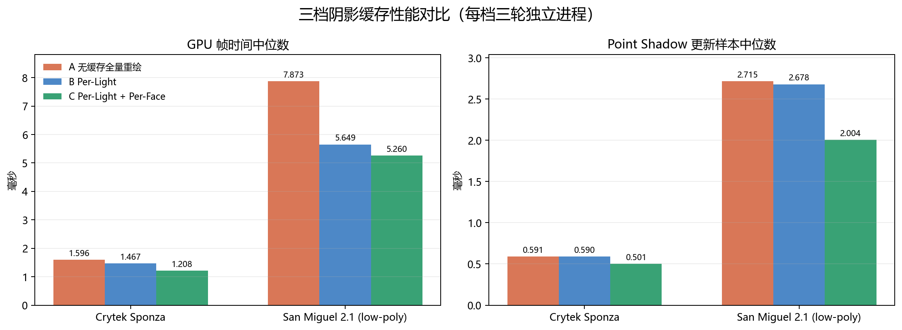
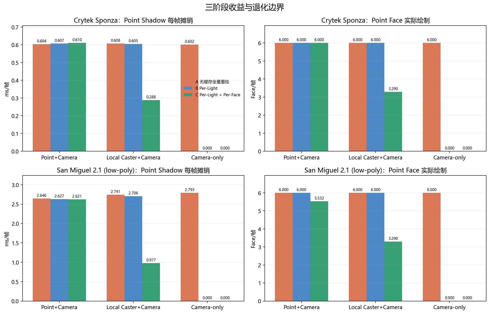
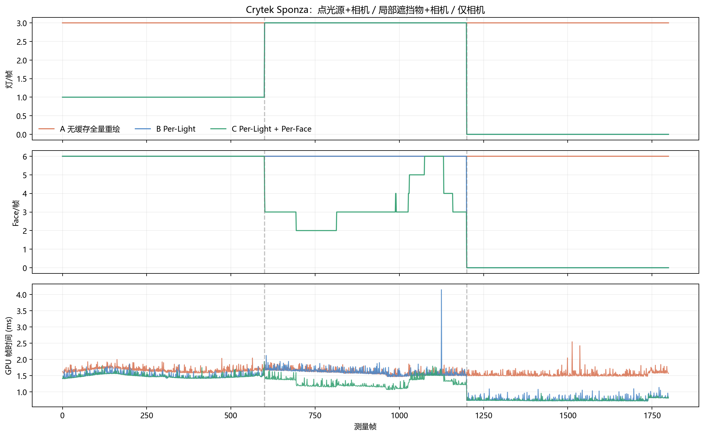
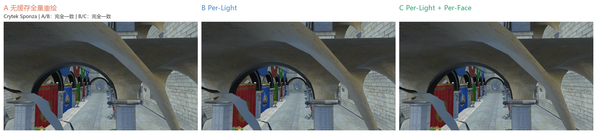
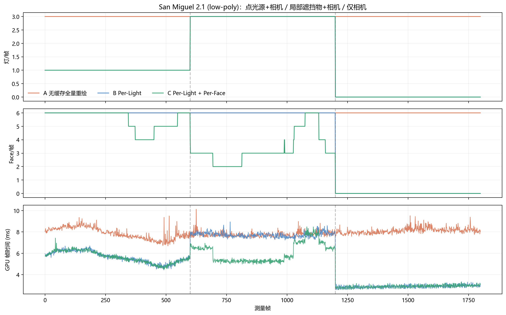
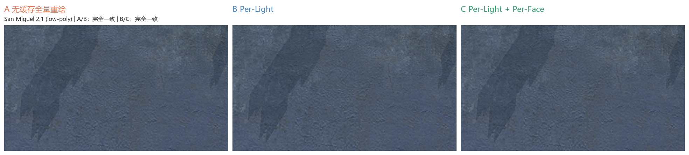
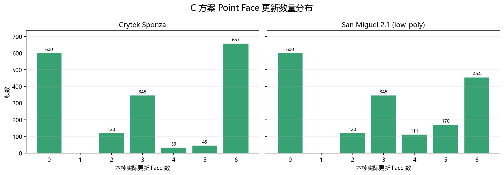
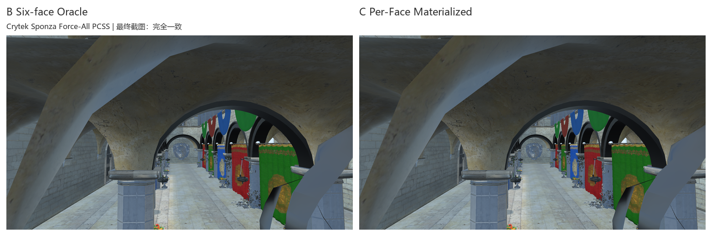
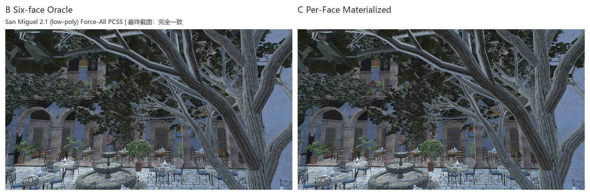

# Point Light 空间关联与 Per-Face 阴影缓存三档实验报告

> 本报告由同一 Release 可执行文件自动生成。三档仅切换阴影缓存策略；场景、Shader、FBO、阴影分辨率、运动轨迹及渲染路径保持一致。

配套原理文档：[阴影缓存 A→B→C：从 Per-Light 到 Point Per-Face 的增量更新原理](PER_LIGHT_SHADOW_CACHE_TECHNICAL_PRINCIPLES_CN.md)。

## 1. 实验结论

- **Crytek Sponza**：Point Shadow 更新样本 GPU 中位数 `0.591 → 0.590 → 0.501 ms`；每帧摊销 `0.605 → 0.404 → 0.299 ms`；Point Face 提交 `6.00 → 4.00 → 3.10 次/帧`。
- **San Miguel 2.1 (low-poly)**：Point Shadow 更新样本 GPU 中位数 `2.715 → 2.678 → 2.004 ms`；每帧摊销 `2.726 → 1.778 → 1.199 ms`；Point Face 提交 `6.00 → 4.00 → 2.94 次/帧`。

这组数据应按两层优化解读：A→B 消除未变化灯光的重绘；B→C 保留 Point Cubemap 未失效的 Face。Receiver Demand 在部分场景仍会覆盖 5～6 面，因此 C 的主要收益来自局部 Caster 运动阶段，而不是假设相机永远只需要一两个面。






## 2. 三档定义与统一轨迹

| 档位 | 缓存粒度 | 典型行为 |
|---|---|---|
| A 无缓存全量重绘 | 无缓存控制路径 | 每帧更新 Directional、Point、Spot；Point 固定 6 Face |
| B Per-Light | 当前灯光级 Revision Cache | Point 移动时只更新 Point，但仍固定 6 Face；Caster Revision 仍可能使多灯失效 |
| C Per-Light + Per-Face | 空间 Caster 签名、Face Dirty/Valid/Required Mask | Point 只绘制 `required & stale` 的 Face，未需求 Face 延迟物化 |

确定性周期分为三段：`Point+Camera`、`Local Caster+Camera`、`Camera-only`。独立运动 Caster 使用同一小球模型和固定轨迹，避免移动整座 Sponza/San Miguel 导致所有 Face 天然失效。

## 3. 正式性能结果

### Crytek Sponza

| 指标 | A 无缓存全量重绘 | B Per-Light | C Per-Face | A→B | B→C | A→C |
|---|---:|---:|---:|---:|---:|---:|
| GPU 帧时间中位数 (ms) | 1.596 | 1.467 | 1.208 | -8.06% | -17.68% | -24.32% |
| GPU 帧时间 P95 (ms) | 1.924 | 1.745 | 1.559 | -9.34% | -10.65% | -19.00% |
| GPU 帧时间 P99 (ms) | 2.150 | 2.113 | 1.789 | -1.73% | -15.30% | -16.76% |
| Shadow Update 样本中位数 (ms) | 0.765 | 0.755 | 0.524 | -1.26% | -30.67% | -31.55% |
| Shadow Update 样本 P95 (ms) | 0.924 | 0.873 | 0.776 | -5.54% | -11.08% | -16.00% |
| Shadow Update 样本 P99 (ms) | 1.056 | 0.961 | 0.875 | -8.99% | -8.97% | -17.16% |
| Point Shadow 更新样本中位数 (ms) | 0.591 | 0.590 | 0.501 | -0.12% | -15.16% | -15.27% |
| Point Shadow 更新样本 P95 (ms) | 0.747 | 0.747 | 0.741 | +0.00% | -0.78% | -0.78% |
| Point Shadow 更新样本 P99 (ms) | 0.851 | 0.864 | 0.841 | +1.44% | -2.57% | -1.16% |
| 整帧墙钟时间中位数 (ms) | 4.125 | 3.775 | 3.725 | -8.47% | -1.32% | -9.68% |
| 整帧墙钟时间 P95 (ms) | 4.880 | 5.171 | 4.436 | +5.96% | -14.21% | -9.10% |
| 整帧墙钟时间 P99 (ms) | 5.827 | 6.005 | 4.823 | +3.06% | -19.69% | -17.23% |

| 工作量（每帧） | A | B | C |
|---|---:|---:|---:|
| 更新阴影灯 | 3.00 | 1.33 | 1.33 |
| Point 更新次数 | 1.00 | 0.67 | 0.67 |
| Point Face 提交 | 6.00 | 4.00 | 3.10 |
| Point Face 实际绘制 | 6.00 | 4.00 | 3.10 |
| Point Face 缓存命中 | 0.00 | 0.00 | 2.90 |
| Shadow GPU 摊销 (ms/帧) | 0.78 | 0.46 | 0.36 |
| Point GPU 摊销 (ms/帧) | 0.60 | 0.40 | 0.30 |
| Caster Draw | 1376.50 | 653.84 | 534.36 |
| Caster Triangle | 1046303.19 | 520261.52 | 408839.77 |

#### 三阶段拆分

| 阶段/档位 | GPU Median | GPU P95 | GPU P99 | Shadow GPU 摊销 | Point GPU 摊销 | Required | Rendered | Hit | Cache Check CPU | Demand CPU | Face Signature CPU |
|---|---:|---:|---:|---:|---:|---:|---:|---:|---:|---:|---:|
| Point+Camera / A | 1.645 | 1.892 | 2.187 | 0.782 | 0.604 | 0.00 | 6.00 | 0.00 | 0.0015 | 0.0000 | 0.0000 |
| Point+Camera / B | 1.471 | 1.746 | 2.040 | 0.610 | 0.607 | 0.00 | 6.00 | 0.00 | 0.0012 | 0.0000 | 0.0000 |
| Point+Camera / C | 1.466 | 1.642 | 1.803 | 0.613 | 0.610 | 6.00 | 6.00 | 0.00 | 0.0066 | 0.0035 | 0.0016 |
| Local Caster+Camera / A | 1.584 | 1.845 | 2.120 | 0.785 | 0.608 | 0.00 | 6.00 | 0.00 | 0.0013 | 0.0000 | 0.0000 |
| Local Caster+Camera / B | 1.592 | 1.945 | 2.163 | 0.785 | 0.605 | 0.00 | 6.00 | 0.00 | 0.0027 | 0.0000 | 0.0000 |
| Local Caster+Camera / C | 1.207 | 1.519 | 2.036 | 0.468 | 0.288 | 6.00 | 3.29 | 2.71 | 0.0079 | 0.0036 | 0.0016 |
| Camera-only / A | 1.493 | 1.748 | 1.984 | 0.779 | 0.602 | 0.00 | 6.00 | 0.00 | 0.0014 | 0.0000 | 0.0000 |
| Camera-only / B | 0.731 | 0.982 | 1.274 | 0.000 | 0.000 | 0.00 | 0.00 | 0.00 | 0.0013 | 0.0000 | 0.0000 |
| Camera-only / C | 0.730 | 0.840 | 0.994 | 0.000 | 0.000 | 6.00 | 0.00 | 6.00 | 0.0066 | 0.0034 | 0.0015 |





### San Miguel 2.1 (low-poly)

| 指标 | A 无缓存全量重绘 | B Per-Light | C Per-Face | A→B | B→C | A→C |
|---|---:|---:|---:|---:|---:|---:|
| GPU 帧时间中位数 (ms) | 7.873 | 5.649 | 5.260 | -28.25% | -6.88% | -33.19% |
| GPU 帧时间 P95 (ms) | 8.814 | 8.045 | 7.074 | -8.72% | -12.07% | -19.74% |
| GPU 帧时间 P99 (ms) | 9.367 | 8.427 | 7.834 | -10.03% | -7.04% | -16.37% |
| Shadow Update 样本中位数 (ms) | 5.014 | 4.148 | 2.689 | -17.26% | -35.18% | -46.37% |
| Shadow Update 样本 P95 (ms) | 5.701 | 5.273 | 4.555 | -7.51% | -13.62% | -20.11% |
| Shadow Update 样本 P99 (ms) | 6.341 | 5.614 | 5.074 | -11.47% | -9.63% | -19.99% |
| Point Shadow 更新样本中位数 (ms) | 2.715 | 2.678 | 2.004 | -1.38% | -25.15% | -26.18% |
| Point Shadow 更新样本 P95 (ms) | 3.228 | 3.317 | 3.245 | +2.77% | -2.17% | +0.54% |
| Point Shadow 更新样本 P99 (ms) | 3.492 | 3.516 | 3.478 | +0.69% | -1.08% | -0.40% |
| 整帧墙钟时间中位数 (ms) | 12.513 | 9.926 | 9.792 | -20.67% | -1.35% | -21.74% |
| 整帧墙钟时间 P95 (ms) | 14.313 | 12.905 | 11.944 | -9.83% | -7.45% | -16.55% |
| 整帧墙钟时间 P99 (ms) | 16.528 | 14.214 | 12.665 | -14.00% | -10.90% | -23.37% |

| 工作量（每帧） | A | B | C |
|---|---:|---:|---:|
| 更新阴影灯 | 3.00 | 1.33 | 1.33 |
| Point 更新次数 | 1.00 | 0.67 | 0.67 |
| Point Face 提交 | 6.00 | 4.00 | 2.94 |
| Point Face 实际绘制 | 6.00 | 4.00 | 2.94 |
| Point Face 缓存命中 | 0.00 | 0.00 | 2.90 |
| Shadow GPU 摊销 (ms/帧) | 5.01 | 2.52 | 1.95 |
| Point GPU 摊销 (ms/帧) | 2.73 | 1.78 | 1.20 |
| Caster Draw | 4917.49 | 2369.16 | 1884.81 |
| Caster Triangle | 22288885.35 | 11365055.68 | 8751856.85 |

#### 三阶段拆分

| 阶段/档位 | GPU Median | GPU P95 | GPU P99 | Shadow GPU 摊销 | Point GPU 摊销 | Required | Rendered | Hit | Cache Check CPU | Demand CPU | Face Signature CPU |
|---|---:|---:|---:|---:|---:|---:|---:|---:|---:|---:|---:|
| Point+Camera / A | 7.892 | 8.790 | 9.144 | 4.894 | 2.646 | 0.00 | 6.00 | 0.00 | 0.0020 | 0.0000 | 0.0000 |
| Point+Camera / B | 5.649 | 6.470 | 6.679 | 2.630 | 2.627 | 0.00 | 6.00 | 0.00 | 0.0017 | 0.0000 | 0.0000 |
| Point+Camera / C | 5.633 | 6.485 | 6.688 | 2.625 | 2.621 | 5.53 | 5.53 | 0.00 | 0.0495 | 0.0457 | 0.0018 |
| Local Caster+Camera / A | 7.687 | 8.377 | 8.974 | 5.005 | 2.741 | 0.00 | 6.00 | 0.00 | 0.0020 | 0.0000 | 0.0000 |
| Local Caster+Camera / B | 7.703 | 8.322 | 8.685 | 4.967 | 2.706 | 0.00 | 6.00 | 0.00 | 0.0031 | 0.0000 | 0.0000 |
| Local Caster+Camera / C | 5.624 | 7.785 | 8.232 | 3.222 | 0.977 | 6.00 | 3.29 | 2.71 | 0.0449 | 0.0395 | 0.0019 |
| Camera-only / A | 8.010 | 8.776 | 9.294 | 5.089 | 2.793 | 0.00 | 6.00 | 0.00 | 0.0021 | 0.0000 | 0.0000 |
| Camera-only / B | 2.839 | 3.260 | 3.422 | 0.000 | 0.000 | 0.00 | 0.00 | 0.00 | 0.0015 | 0.0000 | 0.0000 |
| Camera-only / C | 2.879 | 3.253 | 3.378 | 0.000 | 0.000 | 6.00 | 0.00 | 6.00 | 0.0457 | 0.0416 | 0.0019 |





## 4. Face 行为与 CPU 代价



| 场景 | C 需求 Face/帧 | C 实际绘制 Face/帧 | Face 命中/帧 | 缓存检查 CPU | 需求分析 CPU | Face 签名 CPU |
|---|---:|---:|---:|---:|---:|---:|
| Crytek Sponza | 6.000 | 3.097 | 2.903 | 0.0071 ms | 0.0035 ms | 0.0016 ms |
| San Miguel 2.1 (low-poly) | 5.844 | 2.941 | 2.903 | 0.0472 ms | 0.0427 ms | 0.0019 ms |

## 5. 正确性与资源一致性

性能模式允许未被当前 Receiver 采样的 Face 暂时保留旧内容，但这些 Face 带有无效签名，未来进入 Required Mask 时必须先重建。报告同时运行独立 PCSS 审计：强制六面全部物化，验证 Per-Face 路径最终与 Six-face 基准路径完全收敛。

Deferred→Required、Point 移动、局部 Caster、FBO Resize/Replace、Shader Reload 与 SceneTopologyRevision/ABA 的逐项证据见 [Point Shadow Cache 正确性与失效规则审计报告](POINT_SHADOW_CACHE_CORRECTNESS_AUDIT_CN.md)。

独立进程截图审计还暴露并修复了一个与阴影缓存无关的可重复性问题：Opaque 批次原先按 Shader/Material 内存地址排序，不同进程可能改变少量共面像素的先后覆盖。现在改为按场景首次出现顺序生成稳定批次键，以下屏幕比较继续使用严格 `0` 像素差门禁，没有放宽容差。

| 场景 | A/B 屏幕像素 | B/C 屏幕像素 | B 重复运行截图 | Force-All PCSS 最终截图 | PCSS 六面深度 Hash |
|---|---|---|---|---|---|
| Crytek Sponza | 完全一致 | 完全一致 | 完全一致 | 完全一致 | 六面完全一致 |
| San Miguel 2.1 (low-poly) | 完全一致 | 完全一致 | 完全一致 | 完全一致 | 六面完全一致 |





| 场景 | B 主实验 GPU 帧中位数 | B 独立重测 | 重测差异 |
|---|---:|---:|---:|
| Crytek Sponza | 1.467 ms | 1.463 ms | -0.28% |
| San Miguel 2.1 (low-poly) | 5.649 ms | 5.648 ms | -0.01% |

| 场景 | Working Set A/B/C | Private A/B/C | 纹理 A/B/C | Mesh GPU A/B/C | Render Target A/B/C |
|---|---:|---:|---:|---:|---:|
| Crytek Sponza | 150040576/145907712/145813504 | 728104960/723398656/722411520 | 243742611/243742611/243742611 | 15135820/15135820/15135820 | 87609344/87609344/87609344 |
| San Miguel 2.1 (low-poly) | 593575936/591278080/594436096 | 2099855360/2107179008/2102677504 | 463827497/463827497/463827497 | 434863012/434863012/434863012 | 87609344/87609344/87609344 |

## 6. 实验条件

- 分辨率：`1920×1080`。
- 每档独立进程：`3` 轮；每轮测量 `1800` 帧。
- 预热：外部独立预热 `300` 帧，进程内预热 `300` 帧。
- 配对顺序：`A-B-B-A-A-B`；VSync 请求值：`Off (swap interval 0)`。
- 渲染：Release、PBR Forward、Hard Shadow 性能隔离；另以 PCSS 执行完整六面正确性审计。
- Point Shadow：显式 Six-face 路径、逐面 Caster Culling；三档使用相同 Shader、FBO 与分辨率。
- GPU：`NVIDIA Corporation / NVIDIA GeForce RTX 5060 Ti/PCIe/SSE2`；OpenGL `3.3.0 NVIDIA 591.86`。
- 被测源码 Commit：`a298e37e953310364376b631e85840ee2ef353ff`；`gitDirty=false`。
- Release 可执行文件 SHA-256：`a0a07672d367fcc74a9a6ec16b6003f821fee69bc062a95fe5fc49514949dd38`。
- 两组性能实验来源一致性：`通过`。
- 已提交数据汇总：[point-shadow-cache-3way-summary-cn.json](docs/benchmark-images/shadow-optimizations/point-shadow-cache-3way-1080p-a298e37/point-shadow-cache-3way-summary-cn.json)。

## 7. UI 手动验证与一键复现

- 打开 `Motion Timeline`，点击 `Prepare 3-light test`。它会临时建立一组 Directional/Point/Spot 阴影灯和一个红色局部运动 Caster；退出测试时可恢复原场景。
- `Profile` 选择 `Cache 3-way phases` 后，轨迹依次执行“点光源+相机 / 局部遮挡物+相机 / 仅相机”。右侧实时显示 Required、Rendered、Face hits 与 Deferred。
- 顶部 A/B/C 按钮分别切换无缓存全量重绘、Per-Light、Per-Light + Per-Face。正式测试仍以脚本的独立进程数据为准。

```powershell
.\tools\Test-PointShadowCache3Way.ps1 -SkipBuild -BatchId point-shadow-cache-3way-1080p-final -Width 1920 -Height 1080 -MeasuredFrames 1800 -ExternalWarmupFrames 300 -InternalWarmupFrames 300 -FormalRunsPerVariant 3 -TimelineCycleFrames 1800 -SceneIds sponza,san-miguel
```

## 8. 边界与结论

1. 当前场景的 Receiver Demand 并不稀疏：Sponza 常需六面，San Miguel 常需五面。仅靠 Camera Demand 不能保证大收益。
2. 局部 Caster 运动时，Per-Face Signature 能稳定把 Point 更新从六面压到约 2～3 面；这才是 C 档的主要案例。
3. Directional/Spot/Point 的 Auto-fit 投影仍保留全局 Caster 依赖，空间 Per-Light 失效会保守退化；报告不会把这部分包装成已经完成的局部化收益。
4. C 档不增加 Shadow Texture 或 Render Target；额外状态只有 CPU 侧 Face Mask、签名和版本数据。
5. Layered Geometry Shader 仍仅保留诊断用途；当前驱动上曾出现五面未写入，因此生产路径继续使用已验证的 Six-face。

最终判断：这项优化值得保留，但应把简历结论写成“局部 Caster 变化下的 Point Per-Face 增量更新”，而不是笼统声称所有 Point Light 更新都会从六面降到一面。
