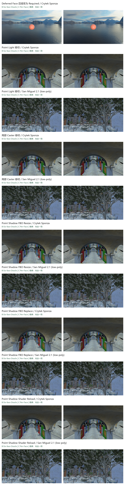
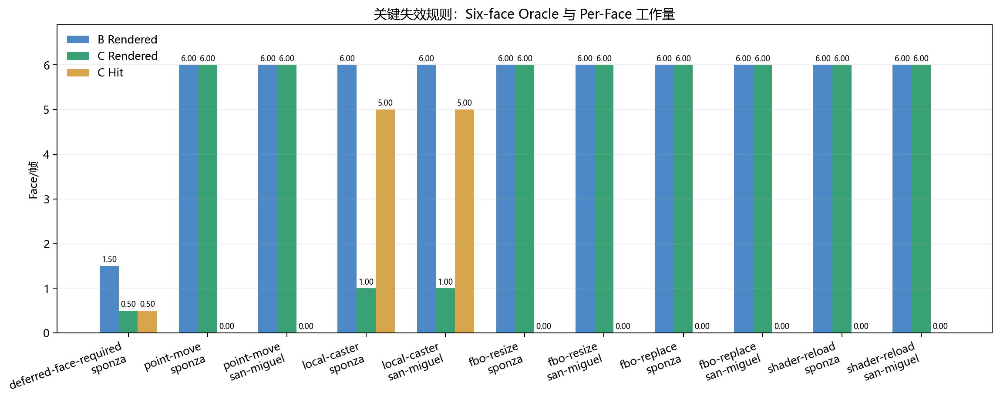
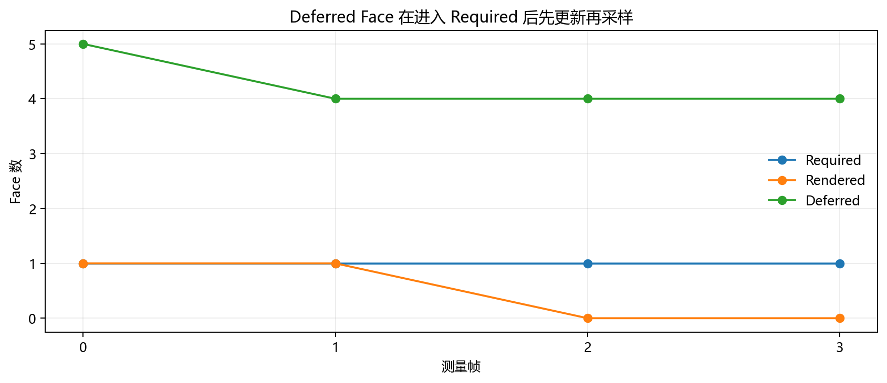
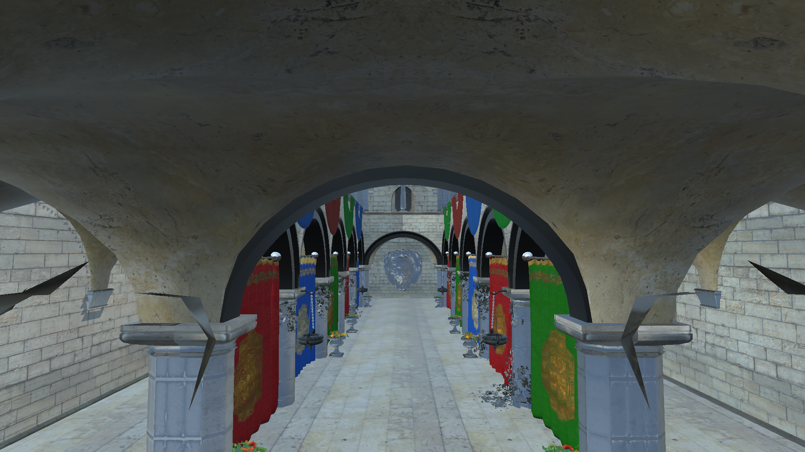

# Point Shadow Cache 正确性与失效规则审计报告

> 本报告验证 C（Per-Light + Point Per-Face）在关键失效事件下与 B（Per-Light、固定 Six-face）Oracle 收敛。所有屏幕比较使用 0 像素差，Cubemap 比较使用六面逐面 bitwise hash。

## 1. 审计结论

- 关键规则矩阵：`全部通过`。
- 严格最终截图：`11/11` 组完全一致。
- Point Cubemap：每组最终六面 Hash 全部一致。
- Renderer-owned Texture、Mesh CPU/GPU、Render Target：B/C 完全一致。
- ABA 形态只执行一次同槽位 Model 替换 Smoke；Revision 增量、失效次数和模型数量均通过门禁。

## 2. 关键正确性矩阵

| 用例 | 场景 | 屏幕像素 | 六面 Hash | 资源 | B Rendered | C Required | C Rendered | C Hit | C Deferred | Failure/Fallback |
|---|---|---|---|---|---:|---:|---:|---:|---:|---:|
| Deferred Face 后续变为 Required | Crytek Sponza | 完全一致 | 六面一致 | 一致 | 1.50 | 1.00 | 0.50 | 0.50 | 4.25 | 0/0 |
| Point Light 移动 | Crytek Sponza | 完全一致 | 六面一致 | 一致 | 6.00 | 6.00 | 6.00 | 0.00 | 0.00 | 0/0 |
| Point Light 移动 | San Miguel 2.1 (low-poly) | 完全一致 | 六面一致 | 一致 | 6.00 | 6.00 | 6.00 | 0.00 | 0.00 | 0/0 |
| 局部 Caster 移动 | Crytek Sponza | 完全一致 | 六面一致 | 一致 | 6.00 | 6.00 | 1.00 | 5.00 | 0.00 | 0/0 |
| 局部 Caster 移动 | San Miguel 2.1 (low-poly) | 完全一致 | 六面一致 | 一致 | 6.00 | 6.00 | 1.00 | 5.00 | 0.00 | 0/0 |
| Point Shadow FBO Resize | Crytek Sponza | 完全一致 | 六面一致 | 一致 | 6.00 | 6.00 | 6.00 | 0.00 | 0.00 | 0/0 |
| Point Shadow FBO Resize | San Miguel 2.1 (low-poly) | 完全一致 | 六面一致 | 一致 | 6.00 | 6.00 | 6.00 | 0.00 | 0.00 | 0/0 |
| Point Shadow FBO Replace | Crytek Sponza | 完全一致 | 六面一致 | 一致 | 6.00 | 6.00 | 6.00 | 0.00 | 0.00 | 0/0 |
| Point Shadow FBO Replace | San Miguel 2.1 (low-poly) | 完全一致 | 六面一致 | 一致 | 6.00 | 6.00 | 6.00 | 0.00 | 0.00 | 0/0 |
| Point Shadow Shader Reload | Crytek Sponza | 完全一致 | 六面一致 | 一致 | 6.00 | 6.00 | 6.00 | 0.00 | 0.00 | 0/0 |
| Point Shadow Shader Reload | San Miguel 2.1 (low-poly) | 完全一致 | 六面一致 | 一致 | 6.00 | 6.00 | 6.00 | 0.00 | 0.00 | 0/0 |

这些用例覆盖：Point transform、局部 Caster transform、Point Shadow Shader revision、FBO 尺寸变化、FBO 释放后重建，以及 Deferred Face 再次进入 Receiver Demand。

## 3. Deferred → Required 时序证明

预热阶段先强制物化六面；测量第 0 帧只需求 +X，同时隐藏侧 Caster 变化使其余 Face 进入 Deferred；相机随后转向 -X，第 1 帧的 `Required & Update` 包含此前 Deferred 的 -X，证明旧内容没有被直接采样。

| 测量帧 | Required Mask | Update Mask | Deferred Face 数 |
|---:|---|---|---:|
| 0 | +X (`0x01`) | +X (`0x01`) | 5 |
| 1 | -X (`0x02`) | -X (`0x02`) | 4 |
| 2 | -X (`0x02`) | — (`0x00`) | 4 |
| 3 | -X (`0x02`) | — (`0x00`) | 4 |

## 4. SceneTopologyRevision / ABA Smoke

| 检查项 | 结果 |
|---|---:|
| 测量起始 Revision | 3 |
| 替换后 Revision | 4 |
| Revision 增量 | 1 |
| 缓存失效次数 | 1 |
| Model 数量（前/后） | 2 / 2 |
| Point 阴影更新次数 | 1 |

这个 Smoke 保持 Model 数量、名称、几何、材质和变换不变，只替换容器槽位中的对象。即使指针/内容形态可能回到相同状态，单调递增的 SceneTopologyRevision 仍强制缓存失效，因此不依赖地址签名规避 ABA。

## 5. 实验条件与证据定位

- 分辨率：`1920×1080`。
- 进程内预热：`12` 帧；每个矩阵用例各运行 B/C 独立进程一次。
- 渲染：Release x64、PBR Forward、Hard Shadow、Point Six-face、VSync Off。
- 截图阈值：最大通道差 `0`、变化像素 `0`。
- 源码 Commit：`a298e37e953310364376b631e85840ee2ef353ff`；`gitDirty=false`。
- 可执行文件 SHA-256：`a0a07672d367fcc74a9a6ec16b6003f821fee69bc062a95fe5fc49514949dd38`。
- 已提交数据汇总：[point-shadow-cache-correctness-summary-cn.json](docs/benchmark-images/shadow-optimizations/point-shadow-cache-correctness-1080p-a298e37/point-shadow-cache-correctness-summary-cn.json)。

结论：关键失效路径均能让 C 在采样前完成必要更新，并最终与 B 的屏幕结果、六面深度内容和 Renderer-owned 资源占用完全一致；未观察到资源失败或保守 fallback。
