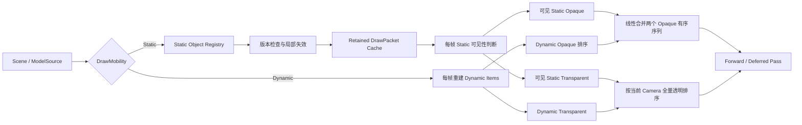

# Static / Dynamic Retained Draw Submission：技术原理、问题推导与实验计划

- 状态：设计与接入方案已完成；功能尚未实现；正式性能数据待补
- 日期：2026-07-29
- 适用项目：OpenGL_Learn，OpenGL 3.3，Forward / Deferred

> 本文当前是一份实现前技术设计，不是已经完成的性能报告。所有性能数值、收益百分比和最终结论均以 `TBD` 占位。功能实现并按项目性能协议完成正式 A/B 后，再用真实数据替换占位内容。

相关材料：

- [项目性能优化实验协议](PERFORMANCE_OPTIMIZATION_PROTOCOL.md)
- [运行时 Benchmark 使用说明](RUNTIME_BENCHMARK.md)
- [Unreal Engine Mesh Drawing Pipeline](https://dev.epicgames.com/documentation/en-us/unreal-engine/mesh-drawing-pipeline-in-unreal-engine)

---

## 1. 一句话概括

这项优化重点解决的不是“GPU 不会画得足够快”，而是：

> 场景中绝大多数对象没有变化，CPU 却仍然每帧重新把它们转换成 Draw Item、重新分类、重新排序，再交给各个 Render Pass。

我们希望把当前的全量即时重建路径：

```text
每帧：
    遍历全部 Model
    → 收集全部 Mesh
    → 重新生成 Draw Item
    → 重新建立 opaque / transparent 帧列表
    → 重新排序
    → 提交给 Forward / Deferred Pass
```

改造成静态缓存与动态重建并存的 Retained Submission：

```text
静态对象：
    状态变化时构建 DrawPacket
    → 跨帧复用 Shader / Material / RenderState / Sort Key
    → 每帧只做可见性判断和可见 Packet 收集

动态对象：
    每帧重新生成 Draw Item
    → 按当前状态排序

最终：
    合并静态与动态 opaque 序列
    → 对全部透明项按当前相机重新排序
    → 交给现有 Render Pass
```

它利用的是实时场景中的时间一致性：

> 相邻两帧之间，真正发生变化的对象通常远少于场景中的对象总数。

---

## 2. 这项优化重点解决什么痛点

### 2.1 CPU Render Submission 随场景规模增长

一次 Draw Call 真正到达 `glDrawElements` 之前，CPU 需要先回答很多问题：

- 这个对象是否启用；
- 是否在相机视锥内；
- 它使用哪个 Mesh；
- 它使用哪个 Shader；
- 它使用哪个 Material；
- Material 对应什么深度、混合和剔除状态；
- 它属于 opaque 还是 transparent；
- 它应该排在提交序列中的什么位置；
- Forward、Deferred、透明、轮廓和阴影等 Pass 应该怎样消费它。

这些工作属于 Draw Submission，而不是 GPU Shader 执行。

当前 `Scene::BuildMeshDrawLists()` 每帧都会清空本帧列表，遍历 Scene 中的 Model，再将可见 Mesh 重新写入：

- `m_opaqueMeshList`；
- `m_transparentMeshList`；
- `m_visibleModels`。

随后：

- opaque 按 Shader 和 Material 排序；
- transparent 按相机距离从远到近排序。

当场景只有十几个对象时，这部分成本很小；当对象数扩大到 1,000、5,000、10,000 时，即使每个对象只有一个低面数 Mesh，CPU 仍然需要重复处理数千到上万个提交元素。

### 2.2 重复工作的输入实际上没有变化

固定场景中的大部分数据通常是稳定的：

- Mesh 几何没有变化；
- Mesh 与 Material 的绑定没有变化；
- Model 使用的 Shader 没有变化；
- Material 的 RenderState 没有变化；
- opaque / transparent 分类没有变化；
- opaque 的 Shader / Material 排序关系没有变化。

真正每帧变化的通常只有：

- Camera；
- 少量动态对象的 Transform；
- 少量动画或交互状态；
- 透明对象相对 Camera 的距离；
- 偶发的对象增删、材质切换或 Shader 热重载。

因此，当前问题不是某个算法写得特别慢，而是：

> 系统没有区分“跨帧不变的数据”和“必须每帧重新计算的数据”。

### 2.3 尾延迟比平均值更值得关注

Draw List 构建不只是影响 CPU 平均帧时间，也可能放大 P95 / P99：

- Scene 容器扩容；
- 大量元素排序；
- Material 热重载导致全量分类刷新；
- 对象集中增删；
- Cache Miss 后批量重建；
- 其他 Editor 或资源任务与 Draw Submission 在同一帧叠加。

所以正式实验不能只看平均 FPS，而要重点记录：

- Build Draw Lists CPU Median；
- Build Draw Lists CPU P95；
- Build Draw Lists CPU P99；
- CPU Frame Median / P95 / P99；
- 每帧排序元素数量；
- Cache 命中与失效；
- Submission 容器分配次数。

### 2.4 这不是 Draw Call 数量优化

Retained Draw Submission 和 Instancing 解决的不是同一个问题。

Instancing 主要处理：

> 大量对象共享同一 Mesh、Material 和 Shader 时，怎样减少实际 Draw Call。

Retained Draw Submission 主要处理：

> 无论最终有多少 Draw Call，CPU 怎样避免每帧重复构造、分类和排序那些没有变化的提交描述。

因此，即使 Draw Call 数保持不变，Build Draw Lists CPU 仍然可能明显下降。反过来，仅调用一次 `glDrawElementsInstanced` 并不能解决：

- 异构 Mesh / Material 的提交；
- 静态与动态对象生命周期；
- Shader 热重载；
- Material 状态失效；
- transparent 每帧排序；
- 对象增删后的缓存一致性。

---

## 3. 为什么当前项目会遇到这个问题

### 3.1 第一版架构采用了易理解的 Immediate Rebuild

项目最初的优先级是先得到正确画面。最直接的实现方式就是每帧从 Scene 当前状态重新生成提交列表：

```cpp
void Scene::BuildMeshDrawLists()
{
    m_visibleModels.clear();
    m_opaqueMeshList.clear();
    m_transparentMeshList.clear();

    for (auto& model : modelSource.models) {
        // active、transform、bounds、frustum
        // shader、opaque mesh、transparent mesh
        // 生成本帧 MeshDrawItem
    }

    std::sort(m_opaqueMeshList.begin(), m_opaqueMeshList.end(), ...);
    std::sort(m_transparentMeshList.begin(), m_transparentMeshList.end(), ...);
}
```

这种路径具有几个明显优点：

- 数据始终来自 Scene 当前状态；
- 没有历史缓存，不会出现陈旧 Packet；
- 对象增删后下一帧自然生效；
- 易于调试和理解；
- 适合对象数量较少的学习型项目。

它的问题是在规模扩大后，成本始终由场景总量决定，而不是由变化量决定。

### 3.2 项目原本没有 Static / Dynamic 语义

当前 `Model` 没有明确表达：

- 这个对象长期不动，可以走缓存路径；
- 这个对象持续变化，应该走动态路径。

当系统不知道对象的变化频率时，只能采用最保守策略：

> 假设所有对象都可能变化，因此每帧重新读取和生成。

要建立 Retained Path，第一步不是写缓存，而是给对象补上清晰的生命周期语义：

```cpp
enum class DrawMobility {
    Static,
    Dynamic
};
```

### 3.3 当前可变入口会绕过缓存通知

引入缓存以后，最大的正确性风险不是排序，而是漏失效。

当前项目存在一些直接可变入口：

- `ModelSource::models` 可以直接增删；
- `Model::GetMeshes()` 返回可变容器；
- `Mesh::material_ptr` 是公开指针；
- Model 的 Transform 字段可被 Editor 直接修改；
- Material Inspector 可以通过 mutable property map 直接改值；
- Shader 和 Material 支持热重载。

在每帧全量重建路径中，这些公开修改通常会在下一次遍历时被重新读取。切换到 Retained Path 后，如果修改没有递增版本或发布失效事件，缓存会继续使用旧数据。

例如，Material 的 `opacity` 从 `1.0` 改成 `0.5` 时，系统必须完成：

```text
Material 属性变化
    → opaque / transparent 分类变化
    → 原 opaque Packet 失效
    → Packet 迁移到 transparent 集合
    → 本帧重新参与透明距离排序
```

如果只更新 Shader Uniform，却没有刷新 DrawPacket 分类，画面就会错误。

### 3.4 当前已有局部缓存，但还不是 Retained Submission

这里需要准确区分两件事。

`Model::BuildMeshLists()` 已经缓存了 Model 内部的 opaque / transparent MeshEntry；Material 全局 revision 没变化时，不会每帧重新解析所有 opacity 规则。

但是 Scene 仍然每帧：

- 遍历这些 MeshEntry；
- 重新构造 Scene 级 `MeshDrawItem`；
- 重新填充本帧 opaque / transparent vector；
- 重新排序整个 opaque 列表。

所以现状不是“所有 Material 分类逻辑都从零计算”，而是：

> Model 内部分类已有缓存，但 Scene 级 Draw Submission 仍然是全量即时重建。

### 3.5 阴影状态同步也在放大同一类成本

当前 `BuildMeshDrawLists()` 还会同步 Shadow Caster 状态。新的 Revision Shadow Cache 为了检查变化，会遍历 Model 及其 Mesh / Material 状态。

如果主 Draw List 使用 retained cache，但阴影同步仍在同一个 CPU zone 中逐 Mesh 扫描，那么 10,000 对象下：

- 主列表构建减少了；
- Shadow State Sync 仍保持全量扫描；
- 最终 `"Build Draw Lists"` 收益会被掩盖。

因此这项优化不能只在主列表旁边加一个缓存，还需要让主提交与阴影提交共享同一套显式版本协议。

---

## 4. 我们为什么会想到这样解决

### 4.1 从每帧输出反推真正的依赖

一个 opaque Draw Item 可以抽象为：

```text
OpaqueDrawItem = f(
    Model,
    Transform,
    Mesh,
    Shader,
    Material,
    RenderState,
    PassConfig
)
```

其中并不是所有输入都以相同频率变化：

| 输入 | 常见变化频率 | 是否适合缓存 |
| --- | --- | --- |
| Mesh 几何与 VAO | 极低 | 是 |
| Material 身份 | 低 | 是 |
| Shader 身份 | 低 | 是 |
| RenderState | 低 | 是 |
| opaque Sort Key | 低 | 是 |
| Static Transform | 低 | 是，变化时局部刷新 |
| Dynamic Transform | 每帧 | 否 |
| Camera Frustum | 每帧可能变化 | 否 |
| transparent 距离顺序 | 随 Camera 变化 | 否 |

这张依赖表给出了直接结论：

> 应该缓存 view-independent、低频变化的 Packet 数据，把 view-dependent 和高频变化的数据留在每帧路径。

### 4.2 从场景总量驱动改成变化量驱动

旧路径的主要工作量近似为：

```text
N  = Model 数
M  = Mesh / Draw Item 数
O  = opaque item 数
T  = transparent item 数

Legacy ≈ O(N + M + O log O + T log T)
```

Retained Path 的稳态成本近似为：

```text
Ns = Static Model 数
Nd = Dynamic Model 数
Md = Dynamic Draw Item 数
Os = 可见 Static opaque Packet 数
Od = Dynamic opaque item 数
T  = 全部可见 transparent item 数

Retained ≈
    O(Ns)                 // active、transform revision、frustum
    + O(Os)               // 收集可见静态 Packet
    + O(Nd + Md)          // 动态重建
    + O(Od log Od)        // 只排序动态 opaque
    + O(Os + Od)          // 合并两个有序序列
    + O(T log T)          // 透明仍然完整排序
```

这项优化不会消除所有 `O(N)` 工作，因为可见性判断仍然必须发生；它移除的是：

- 静态 Mesh Packet 的重复构造；
- 静态 opaque 元素的重复全量排序；
- 静态 Material / Shader / RenderState 的重复解析；
- 不必要的 per-Mesh Shadow State 扫描。

### 4.3 为什么不是简单换一个更快的排序算法

当前 `std::sort` 的平均复杂度已经是 `O(N log N)`。即使换成 radix sort 或预分桶，也仍然在回答错误的问题：

> 为什么对完全没有变化的 8,000 个静态元素，每帧还要再排序一次？

更根本的办法是：

> 静态排序关系只在 Sort Key 变化时重建，稳态直接复用上一次的有序结果。

### 4.4 为什么不能直接缓存最终列表

缓存整张最终 Draw List 看起来更简单，但会马上遇到：

- Camera 移动后可见对象变化；
- Dynamic Transform 每帧变化；
- Static Transform 偶尔被 Editor 修改；
- transparent 顺序随 Camera 改变；
- Material 可能在 opaque / transparent 间切换；
- 对象可能删除，旧裸指针可能悬空；
- Shader 热重载会替换 OpenGL program；
- Forward 和 Deferred 对 Item 的消费信息不同。

因此正确的缓存单位不是“最终帧列表”，而是：

> 一个不依赖当前 Camera、可以独立验证依赖版本的 DrawPacket。

---

## 5. 技术原理

### 5.1 DrawPacket 与 Frame Draw Item 分离

拟引入的静态 `DrawPacket` 只保存低频数据：

```cpp
struct DrawPacket {
    StaticObjectHandle object;
    Mesh* mesh;
    Material* material;
    Shader* shader;
    std::uint64_t opaqueSortKey;
    std::uint8_t pipelineFlags;
};
```

对象级、多个 Mesh 共享的数据放在 `StaticObjectRecord`：

```cpp
struct StaticObjectRecord {
    std::shared_ptr<Model> owner;
    glm::mat4 modelMatrix;
    glm::vec3 worldBoundsCenter;
    float worldBoundsRadius;

    std::uint64_t transformRevision;
    std::uint64_t submissionRevision;
    bool visibleThisFrame;
};
```

这样 Static Transform 发生变化时，只需要更新一次对象矩阵和包围球，不需要修改每个 Packet 的 Sort Key。

最终供 Render Pass 消费的 `MeshDrawItem` 仍然包含：

- Model；
- Mesh；
- Shader；
- 当前 Model Matrix；
- 当前世界包围中心；
- Sort Key。

因此 Forward / Deferred Pass 不需要被重写成另一套渲染器。

### 5.2 Static Cached Path 与 Dynamic Rebuild Path

整体数据流如下：



Static Path 的关键不是“永远不更新”，而是：

> 没有依赖变化时复用；任何真实依赖变化时，在使用旧 Packet 之前准确失效。

Dynamic Path 保持当前行为：

- 每帧读取当前 Transform；
- 每帧生成 MeshDrawItem；
- 每帧参与排序和合并。

### 5.3 Opaque Sort Key

当前 opaque 使用 `Shader*`、`Material*` 指针顺序排序。Retained Path 拟改成稳定的 64 位主 Sort Key：

```text
| Shader Stable ID | RenderState Bits | Material Stable ID | Pass Flags |
|      16 bit      |       8 bit      |       32 bit       |    8 bit   |
```

RenderState Bits 至少包含：

- depth test；
- depth write；
- stencil；
- blend mode；
- cull mode。

主 Key 相同的 Packet 再使用稳定的 Model ID / Mesh Index 作次级排序，保证：

- Static 与 Dynamic 可以使用相同比较器；
- 两个有序序列可以线性合并；
- Shader / Material 聚类稳定；
- Pointer 地址变化不会让结果依赖进程内存布局。

### 5.4 为什么 Static 和 Dynamic 仍要合并

一种看似简单的做法是先画所有 Static，再画所有 Dynamic：

```text
Static List
Dynamic List
```

但这可能导致同一 Shader / Material 被切换两次：

```text
Static Shader A
Static Shader B
Dynamic Shader A
Dynamic Shader B
```

因此两个路径必须按同一 Sort Key 输出有序序列，再执行线性 merge：

```text
Static Sorted  ─┐
                ├─→ Global Opaque Sorted
Dynamic Sorted ─┘
```

合并复杂度为 `O(Os + Od)`，不需要重新对全部 opaque item 做一次 `std::sort`。

### 5.5 透明对象为什么不能缓存最终顺序

透明混合通常要求从远到近提交：

```text
distance = lengthSquared(cameraPosition - worldBoundsCenter)
```

即使透明对象本身完全静止，只要 Camera 移动，它们的相对顺序就可能变化。

因此：

- Static transparent 可以缓存 Mesh、Material、Shader 和不随相机变化的元数据；
- 不能缓存上一帧的最终透明顺序；
- Static 与 Dynamic transparent 必须在本帧合并；
- 所有可见透明项必须按当前 Camera 重新排序。

透明项是 Retained Submission 的明确边界，不应为了提高 Cache Hit 而牺牲混合正确性。

### 5.6 版本化失效

缓存正确性依赖一个明确规则：

> DrawPacket 构建时读取的任何数据，都是它的缓存依赖；依赖变化时必须在下一次消费前失效。

计划建立以下 revision：

| Revision | 触发条件 | 处理 |
| --- | --- | --- |
| Scene topology | Model 增、删、Clear、替换 | 重建 Static Registry，先移除潜在悬空引用 |
| Model submission | Shader、Mesh active、Mesh material、mobility 变化 | 重建该 Model 的 Packet |
| Transform | position、rotation、scale 变化 | 更新矩阵和 bounds；opaque Key 不变时不重排 |
| Material pipeline | Shader 名、RenderState、透明分类变化 | 失效所有依赖该共享 Material 的 Packet |
| Shader revision | 成功热重载 | 刷新依赖版本；禁止缓存旧 program ID |
| Shadow content | Caster、Transform、alpha-test 相关状态变化 | 推进 Shadow Caster revision |

### 5.7 共享依赖需要反向索引

一个 Material 可能被多个 Model / Mesh 共享。Material 变化时，只给当前选中的 Model 标 dirty 是错误的。

Scene 需要维护：

```text
Material* → [StaticObjectHandle...]
Shader*   → [StaticObjectHandle...]
```

每帧只检查唯一 Material / Shader 的 revision。当某个依赖变化时，通过反向索引找到所有受影响的 Static Object，再批量重建相关 Packet。

这样既避免：

- 每帧逐 Packet 比较 Material revision；

也避免：

- 任意一个 Material 改动就重建整个 Scene。

### 5.8 Shader 热重载为什么不能缓存 Program ID

当前 Shader 热重载会在同一个 `Shader` 对象上：

1. 编译新的 OpenGL program；
2. 删除旧 program；
3. 更新 `Shader::ID`；
4. 递增 Shader revision；
5. 清理 Uniform Location Cache。

因此：

- `Shader*` 身份保持稳定；
- `Shader::ID` 会变化。

DrawPacket 应缓存 `Shader*` 和稳定 Shader ID，不能复制保存构建时的 OpenGL program ID。成功热重载后，Packet 下一次调用 `shader->use()` 就会使用新 program；编译失败时 revision 不增长，旧 program 继续有效。

### 5.9 Material 修改必须经过受控 API

Retained Path 不能继续依赖任意代码直接修改 property map。

计划将修改入口统一成：

```cpp
SetShaderName(...)
SetRenderState(...)
SetProperty(...)
RemoveProperty(...)
ReplaceDefinition(...)
```

Setter 先比较新旧值，只有真实变化才递增 revision。这个比较非常重要，因为 Editor UI 可能每帧读取并写回相同 RenderState；如果相同值也递增版本，展开 Inspector 就会导致每帧 Cache Miss。

Material 普通颜色、roughness 等只影响 Draw 时读取的 Uniform，未必需要重建 Packet。只有会改变 Packet 身份、分类、Shader 或 pipeline state 的修改才递增 pipeline revision。

### 5.10 对象 Active 与 Packet 生命周期分离

Model Active 切换是高频可见性门控，不必销毁 Packet：

```text
Active = false
    → 本帧不收集 Packet
    → Packet 仍保留

Active = true
    → 下一帧重新收集已有 Packet
```

Mesh Active 不同，因为它改变一个 Model 实际拥有的 Draw Packet 集合，因此需要递增 Model submission revision。

### 5.11 与阴影缓存共享失效协议

主 Draw Submission 与 Shadow Caster Submission 都依赖：

- Model 生命周期；
- Transform；
- Mesh active；
- Material alpha-test / opacity；
- Shader revision。

Retained Path 完成后，Shadow Cache 不应再为了安全每帧遍历所有 Mesh 计算签名，而应复用同一组显式 revision：

```text
Draw / Shadow 相关 setter
    → 推进对应 revision
    → Scene Cache Sync 消费变化
    → 主 DrawPacket 或 Shadow Caster List 局部失效
```

这既减少重复检查，也让两个缓存系统对“什么变化会影响渲染”使用同一套定义。

---

## 6. 预计怎样实现

> 本节描述已经确定的实现路径。代码完成后，应把“预计、计划、拟”改成实际类名、字段和调用位置，并补充最终差异。

### 6.1 第一阶段：先建立失效契约

先完成正确性基础，再编写缓存：

1. 为 Model 增加 Static / Dynamic mobility；
2. 为 ModelSource 增加 topology revision；
3. 为 Model 增加 submission revision；
4. 为 Material 增加 pipeline revision；
5. 将 Model / Mesh / Material 的修改迁移到受控 API；
6. 保留 Transform revision 兼容现有 Editor 修改；
7. 让 Shadow Caster 使用相同 revision。

如果没有这一步，后面的 Cache Hit 数再高也没有意义，因为系统无法证明 Packet 仍然正确。

### 6.2 第二阶段：建立 Static Registry 与 Packet Cache

Scene 为每个 Static Model 建立对象记录，并在 Packet 槽池中保存其 Mesh Packet。

对象第一次加入 Scene 时：

```text
Model Added
    → 创建 StaticObjectRecord
    → Refresh Material Driven State
    → 遍历有效 Mesh
    → 生成 DrawPacket
    → 建立 Material / Shader 反向依赖
    → 构建 Static Opaque 排序索引
```

对象的 Shader、Material 或 Mesh 集合变化时，只重建该对象 Packet。任何 Packet Key 或分类变化后，再统一刷新静态 opaque 排序索引，避免一次热重载过程中重复排序多次。

### 6.3 第三阶段：替换每帧 Build 流程

新的 `BuildMeshDrawLists()` 预计拆成：

```text
Build Draw Lists
    ├─ Submission Cache Sync
    ├─ Static Visibility
    ├─ Static Packet Gather
    ├─ Dynamic Draw Build
    ├─ Dynamic Opaque Sort
    ├─ Opaque Merge
    ├─ Transparent Sort
    └─ Submission Stats Commit
```

外部 Render Pass 暂时继续消费原来的 Scene 列表接口，从而控制改动规模。

### 6.4 第四阶段：加入 Legacy 对照与遥测

保留 benchmark / debug 专用控制路径：

```text
legacy   = 当前每帧全量 Build + Sort
retained = Static Cache + Dynamic Rebuild
```

两条路径必须共享：

- 相同 Scene；
- 相同 Camera；
- 相同 Render Pass；
- 相同 Shader / Material；
- 相同 Frustum Culling；
- 相同统计代码。

这样 A/B 的差异才只来自 Draw Submission 策略。

### 6.5 第五阶段：收紧稳态分配

为 Draw Submission 容器使用专用 counting allocator 或 memory resource，逐帧记录：

- allocation count；
- allocated bytes；
- capacity growth；
- cache rebuild frame allocation。

这里不使用全局 `operator new` 作为主指标，因为 Editor、文件系统、ImGui 和其他模块的分配会污染结果。

当前 vector 在 `clear()` 后会保留 capacity，因此控制路径在充分预热后也可能是零分配。正式结论应以数据为准：

- 如果 A 非零、B 为零，可以写“消除稳态 Submission 分配”；
- 如果 A、B 都为零，只能写“保持稳态零分配”，不能制造不存在的收益。

---

## 7. 正确性边界与失败模式

### 7.1 必须覆盖的失效场景

| 场景 | 预期行为 |
| --- | --- |
| 静态场景无变化 | Packet 全部命中；无 rebuild / invalidation |
| Camera 移动 | Static Packet 不失效；重新判断可见性；透明重新排序 |
| Dynamic Transform | 仅 Dynamic 每帧重建 |
| Static Transform | 更新对象矩阵与 bounds；不必要时不重建 Sort Key |
| Model Shader 切换 | 重建该 Model Packet，并更新 opaque 顺序 |
| Shader 成功热重载 | 使用同一 Shader 对象的新 program |
| Shader 热重载失败 | 保持旧 program 和旧 Packet 可用 |
| Material RenderState 修改 | 失效所有共享依赖 |
| opacity 变为透明 | Packet 同帧从 opaque 迁移到 transparent |
| alpha cutoff 变为 cutout | 保持 opaque，但更新 pipeline / shadow 依赖 |
| Mesh active 切换 | 重建该 Model Packet 集合 |
| Model active 切换 | 只改变本帧收集；主 Packet 可保留 |
| Model 增删 / Clear | topology revision 先刷新，不能解引用旧对象 |
| Forward / Deferred 切换 | 两条路径消费结果一致 |
| Shadow 开启 | Caster revision 与主 submission 变化一致 |

### 7.2 不能因为缓存而改变的行为

- Draw Call 数不能凭空减少或增加；
- submitted triangle / vertex 数必须一致；
- opaque / transparent 分类必须一致；
- transparent 必须继续从远到近排序；
- Forward 和 Deferred 画面必须与 Legacy 一致；
- outline / normal-line 使用的 `m_visibleModels` 必须继续正确；
- Deferred 仍需保留原始 Shader 信息来判断 PBR Material；
- 对象删除后不能留下悬空 `Model*`、`Mesh*` 或 `Material*`。

### 7.3 Retained Path 不解决什么

本次 v1 明确不包含：

- Instancing；
- Multi-Draw Indirect；
- GPU-driven rendering；
- Occlusion Culling；
- BVH / Octree 空间索引；
- Render Thread 并行化；
- OpenGL Command List；
- 自动 Static / Dynamic 升降级；
- Order-Independent Transparency。

这些可以作为后续独立实验，不能混入本次 A/B。

---

## 8. 实验设计

### 8.1 核心问题

正式实验需要回答：

1. Static Packet 是否真的跨帧复用；
2. 80% Static / 20% Dynamic 时，Build Draw Lists 是否随 Dynamic 数量而不是总对象数扩展；
3. 透明对象是否仍然每帧完整排序；
4. Cache Sync 自身是否比旧全量构建更便宜；
5. P95 / P99 是否改善，而不只是平均值；
6. Draw Call、Shader / Material 切换和画面是否保持一致；
7. 稳态 Submission 是否存在动态分配。

### 8.2 程序化场景

主实验使用共享低面数 MeshGeometry，避免模型加载和 GPU 三角数量掩盖 CPU Submission：

- Object Count：1,000 / 5,000 / 10,000；
- Static：80%；
- Dynamic：20%；
- Shader：固定 4 个；
- Material：固定 16 个；
- Transparent：主实验为 0%，专项实验为 10%；
- Random Seed：固定；
- Frustum Culling：开启，主场景对象全部可见；
- Dynamic Transform：每帧执行确定性更新；
- Primary Render Path：Forward；
- Regression：Deferred；
- Primary Shadow：关闭以隔离 Submission；
- Shadow Regression：开启并验证失效；
- Build：Release x64；
- Resolution：1440 × 900；
- Warm-up：300 帧；
- Samples：1,200 帧；
- Process Order：`A / B / B / A / A / B`。

补充诊断场景：

- 10,000 全 Static：观察缓存收益上界；
- 10,000 全 Dynamic：确认 retained 路径不会制造明显额外开销；
- 10,000、10% Transparent：确认透明排序没有被错误缓存；
- 10,000、部分视锥外：确认可见性收集与计数正确。

### 8.3 采集指标

主指标：

- Build Draw Lists Median / P95 / P99；
- CPU Frame Median / P95 / P99。

解释性指标：

- Static Packet Reuse / Hit；
- Packet Rebuild；
- Invalidation Count，按原因分类；
- Dynamic Draw Item Count；
- Opaque Sort Elements；
- Transparent Sort Elements；
- Opaque Merge Elements；
- Submission Allocation Count / Bytes；
- Draw Calls；
- Shader Binds；
- Material Binds / Cache Hits；
- Render State Changes / Cache Hits；
- visible / culled Model 与 Mesh。

正确性指标：

- Legacy / Retained Draw Item Oracle 对比；
- Forward / Deferred 截图；
- Draw / triangle / vertex 数一致；
- transparent 顺序；
- Shader 热重载；
- Material opaque / transparent 迁移；
- Model 增删和 Clear；
- Shadow Caster Cache 失效。

---

## 9. 正式性能结果占位

> 功能尚未实现，以下所有表格均为占位。不得将 `TBD` 改成推测值。

### 9.1 实验环境

| 项目 | 值 |
| --- | --- |
| 测试日期 | TBD |
| Control Commit | TBD |
| Candidate Commit | TBD |
| Build | Release x64 |
| OS | TBD |
| CPU | TBD |
| GPU | TBD |
| Driver | TBD |
| OpenGL Version | TBD |
| Resolution | 1440 × 900 |
| Warm-up / Samples | 300 / 1,200 |
| Run Order | A / B / B / A / A / B |

### 9.2 1,000 Object，80% Static / 20% Dynamic

| Metric | Legacy A | Retained B | Absolute Delta | Relative Delta | Assessment |
| --- | ---: | ---: | ---: | ---: | --- |
| Build Draw Lists Median | TBD ms | TBD ms | TBD | TBD | TBD |
| Build Draw Lists P95 | TBD ms | TBD ms | TBD | TBD | TBD |
| Build Draw Lists P99 | TBD ms | TBD ms | TBD | TBD | TBD |
| CPU Frame Median | TBD ms | TBD ms | TBD | TBD | TBD |
| CPU Frame P95 | TBD ms | TBD ms | TBD | TBD | TBD |
| Submission Allocations / Frame | TBD | TBD | TBD | TBD | TBD |
| Opaque Sort Elements / Frame | TBD | TBD | TBD | TBD | TBD |
| Shader Binds / Frame | TBD | TBD | TBD | TBD | TBD |
| Material Binds / Frame | TBD | TBD | TBD | TBD | TBD |

### 9.3 5,000 Object，80% Static / 20% Dynamic

| Metric | Legacy A | Retained B | Absolute Delta | Relative Delta | Assessment |
| --- | ---: | ---: | ---: | ---: | --- |
| Build Draw Lists Median | TBD ms | TBD ms | TBD | TBD | TBD |
| Build Draw Lists P95 | TBD ms | TBD ms | TBD | TBD | TBD |
| Build Draw Lists P99 | TBD ms | TBD ms | TBD | TBD | TBD |
| CPU Frame Median | TBD ms | TBD ms | TBD | TBD | TBD |
| CPU Frame P95 | TBD ms | TBD ms | TBD | TBD | TBD |
| Submission Allocations / Frame | TBD | TBD | TBD | TBD | TBD |
| Opaque Sort Elements / Frame | TBD | TBD | TBD | TBD | TBD |
| Shader Binds / Frame | TBD | TBD | TBD | TBD | TBD |
| Material Binds / Frame | TBD | TBD | TBD | TBD | TBD |

### 9.4 10,000 Object，80% Static / 20% Dynamic

| Metric | Legacy A | Retained B | Absolute Delta | Relative Delta | Assessment |
| --- | ---: | ---: | ---: | ---: | --- |
| Build Draw Lists Median | TBD ms | TBD ms | TBD | TBD | TBD |
| Build Draw Lists P95 | TBD ms | TBD ms | TBD | TBD | TBD |
| Build Draw Lists P99 | TBD ms | TBD ms | TBD | TBD | TBD |
| CPU Frame Median | TBD ms | TBD ms | TBD | TBD | TBD |
| CPU Frame P95 | TBD ms | TBD ms | TBD | TBD | TBD |
| CPU Frame P99 | TBD ms | TBD ms | TBD | TBD | TBD |
| Submission Allocations / Frame | TBD | TBD | TBD | TBD | TBD |
| Opaque Sort Elements / Frame | TBD | TBD | TBD | TBD | TBD |
| Static Packet Hit Rate | N/A | TBD | TBD | TBD | TBD |
| Packet Rebuild / Frame | N/A | TBD | TBD | TBD | TBD |
| Shader Binds / Frame | TBD | TBD | TBD | TBD | TBD |
| Material Binds / Frame | TBD | TBD | TBD | TBD | TBD |

### 9.5 扩展趋势

| Object Count | Legacy Build P95 | Retained Build P95 | Legacy CPU P95 | Retained CPU P95 | Static Hit Rate |
| ---: | ---: | ---: | ---: | ---: | ---: |
| 1,000 | TBD | TBD | TBD | TBD | TBD |
| 5,000 | TBD | TBD | TBD | TBD | TBD |
| 10,000 | TBD | TBD | TBD | TBD | TBD |

计划在完成实验后补充：

- Object Count 与 Build P95 曲线；
- Object Count 与 CPU Frame P95 曲线；
- 每帧 Sort Elements 曲线；
- Static Hit / Rebuild / Invalidation 图；
- A/B 同相机截图和差异图。

### 9.6 A/B 原始运行占位

| Order | Variant | Build Median | Build P95 | Build P99 | CPU P95 | Notes |
| ---: | --- | ---: | ---: | ---: | ---: | --- |
| 1 | A | TBD | TBD | TBD | TBD | TBD |
| 2 | B | TBD | TBD | TBD | TBD | TBD |
| 3 | B | TBD | TBD | TBD | TBD | TBD |
| 4 | A | TBD | TBD | TBD | TBD | TBD |
| 5 | A | TBD | TBD | TBD | TBD | TBD |
| 6 | B | TBD | TBD | TBD | TBD | TBD |

### 9.7 正确性结果占位

| 验证项 | 结果 | 证据 |
| --- | --- | --- |
| Legacy / Retained Item Oracle | TBD | TBD |
| Forward 画面一致 | TBD | TBD |
| Deferred 画面一致 | TBD | TBD |
| Transparent Camera Sort | TBD | TBD |
| Static / Dynamic Transform | TBD | TBD |
| Shader 成功 / 失败热重载 | TBD | TBD |
| Shared Material Invalidation | TBD | TBD |
| Opaque ↔ Transparent 迁移 | TBD | TBD |
| Model Add / Delete / Clear | TBD | TBD |
| Shadow Caster Invalidation | TBD | TBD |
| Release x64 Build | TBD | TBD |

### 9.8 最终实验结论占位

```text
Decision: TBD（retained / rejected）

主要结果：
- Build Draw Lists P95：TBD ms → TBD ms（TBD%）
- Build Draw Lists P99：TBD ms → TBD ms（TBD%）
- CPU Frame P95：TBD ms → TBD ms（TBD%）
- Opaque Sort Elements：TBD → TBD
- Submission Allocations：TBD → TBD
- Static Packet Hit Rate：TBD%

正确性：
- TBD

限制：
- TBD
```

只有满足以下条件才能判定 retained：

- 5,000 和 10,000 Object 的 Build P95 收益超过同条件自然波动；
- Build P99 没有实质回退；
- CPU Frame 没有不可接受的回退；
- Draw / triangle / visible 数一致；
- Forward / Deferred / transparent / shadow 正确性通过；
- 稳态无异常 invalidation 或 rebuild；
- 资源与对象生命周期没有悬空访问。

---

## 10. 简历表述占位

功能和正式实验完成前，不应填写具体百分比。

建议最终写法：

```text
针对静态场景每帧全量遍历、Draw Item 重建与状态排序造成的 CPU 提交开销，
设计 Static DrawPacket Cache 与 Dynamic Rebuild 分流路径，通过版本化失效维护
Shader、Material、RenderState、对象生命周期及透明排序一致性；在 10,000 物体、
80% Static / 20% Dynamic 场景中，将 Build Draw Lists P95 从 TBD ms 降至
TBD ms（TBD%），Opaque 每帧排序元素由 TBD 降至 TBD，并保持 Forward /
Deferred 输出一致。
```

关于分配的句子必须按最终数据二选一：

```text
如果 Legacy 每帧有分配、Retained 为零：
“将 Draw Submission 稳态每帧分配从 TBD 次降为 0 次。”

如果 Legacy 和 Retained 都为零：
“通过容量复用与受控 Packet 存储保持 Draw Submission 稳态零分配。”
```

---

## 11. 这项工作的工程价值

这项优化的价值不只是一张性能表，而是建立一套可继续扩展的提交基础：

- Scene 对象拥有明确的 Static / Dynamic 语义；
- Draw 数据从每帧临时描述升级为可验证的 retained packet；
- Shader、Material、RenderState 和对象生命周期拥有统一失效协议；
- 主 Draw Submission 与 Shadow Submission 可以共享 revision；
- 后续可以在同一 Packet 基础上继续研究：
  - Instancing Batch；
  - Multi-Draw；
  - Pass-specific Packet；
  - Spatial Visibility Structure；
  - Parallel Draw Preparation；
  - GPU-driven Submission。

真正需要解决的核心问题不是“怎样少调用一次 `std::sort`”，而是：

> 怎样在复用跨帧结果的同时，仍然证明每个被提交的 Packet 与当前 Scene 状态一致。

这也是 Retained Draw Submission 比单次 Instancing API 调用更能体现引擎设计能力的原因。
