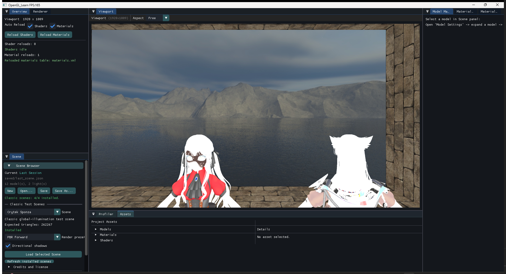
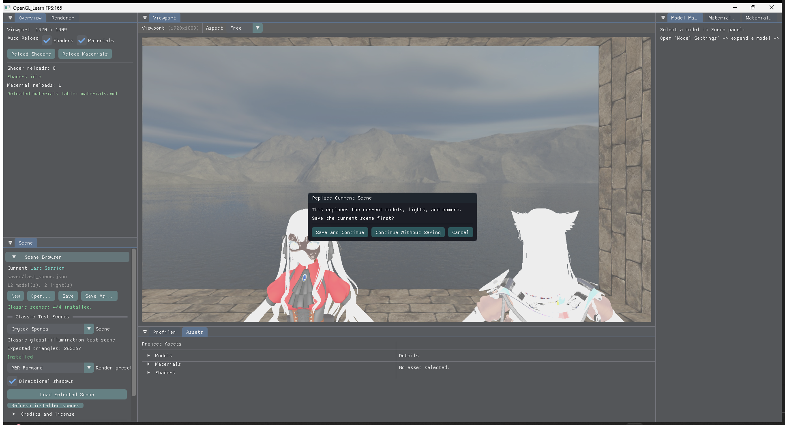
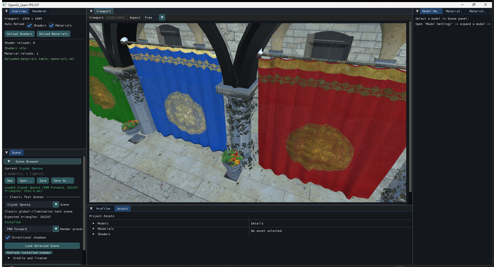
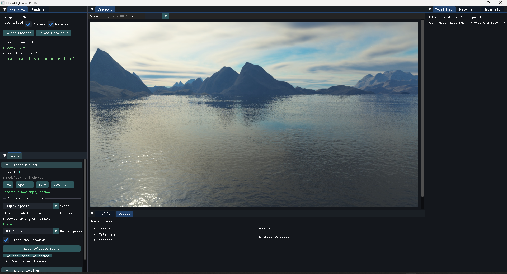

# Scene Browser Validation

Date: 2026-07-24
Configuration: Release x64
Window: 1920 x 1009 viewport inside a maximized editor window

## What was added

- A `Scene Browser` section at the top of the existing `Scene` panel.
- `New`, `Open`, `Save`, and `Save As` scene-file operations.
- A classic-scene selector backed by `classic-scenes.manifest.json`.
- PBR/Phong and forward/deferred render presets.
- An option to enable directional shadows when loading a classic scene.
- A save confirmation before replacing the current scene.
- Complete replacement semantics for models, lights, camera, pending asynchronous
  loads, selected material state, shadow-cache state, and per-light shadow targets.
- One-time classic-scene catalog and availability checks. Filesystem scanning is
  repeated only when the user presses `Refresh installed scenes`.

## How to use it

1. Start the renderer normally.
2. Press `M` if the mouse cursor is captured by the viewport.
3. Open `Scene` -> `Scene Browser`.
4. Select a classic scene and render preset.
5. Choose whether directional shadows should be enabled.
6. Press `Load Selected Scene`.
7. Save the current scene, continue without saving, or cancel when prompted.

The renderer still writes the last editor session to `saved/last_scene.json` on a
normal exit. A named scene can be saved and reopened with `Save As` and `Open`.

## Acceptance results

| Check | Result |
| --- | --- |
| Release x64 build | Passed |
| `--resource-smoke-test` | Passed |
| `--pbr-smoke-test` | Passed; forward/deferred MAE 0.000585 |
| Classic catalog discovery | 4/4 scenes installed |
| Save-before-replace confirmation | Passed |
| Load Crytek Sponza from the UI | Passed |
| Sponza triangle count | 262,267; matches the manifest |
| Interactive Sponza load time | 1,111.6 ms; one cache-backed functional sample |
| Loaded Sponza scene state | 1 model, 1 directional light |
| Replace Sponza with New Scene | Passed |
| New Scene state | 0 models, 1 directional light |
| Old model/shadow cleanup | Passed without a crash or stale scene entries |
| Preserve the user's last session during validation | Passed; the test process was stopped before autosave |

The load time above is an acceptance observation, not a controlled A/B performance
benchmark. This change is an editor feature rather than a renderer optimization.
The catalog is cached to keep its steady-state filesystem overhead at zero.

## Screenshots

### Scene Browser and installed-scene discovery

### Save confirmation before replacement

### Crytek Sponza loaded through the UI

### New Scene after clearing Sponza

