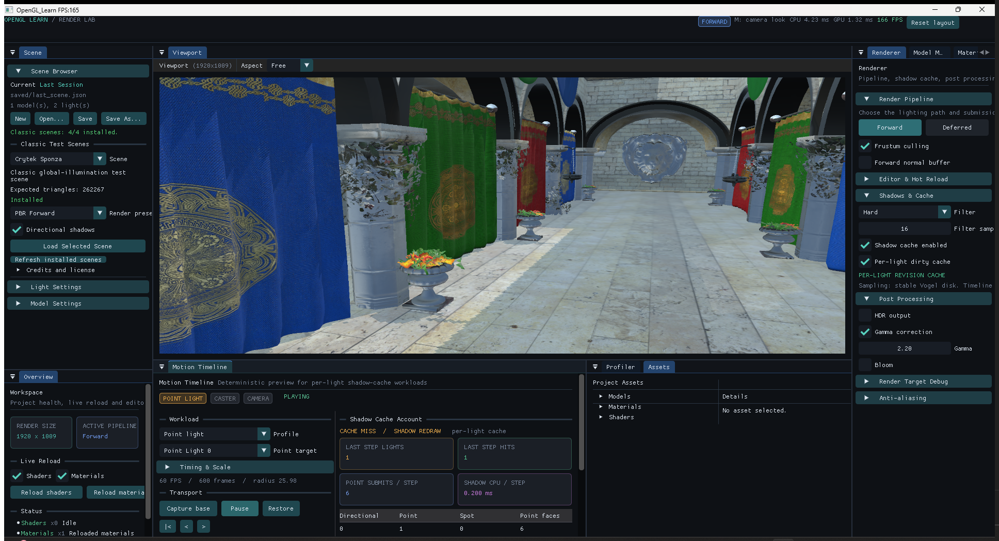

# Shadow Benchmark 确定性运动时间轴

状态：实现完成；Point 主案例正式实验完成；四类路径均通过运行时烟测

## 1. 为什么保留两套 workload

原有 `move-point`、`move-caster` 等 workload 继续使用相邻帧两点微扰。它们的职责是把输入变量压缩到一个，精确验证某条 Cache 失效规则。

新增 Timeline workload 用于连续运动实验。它们共享同一套固定帧时间轴和归一化场景尺度，适合观察逐帧性能曲线、P95/P99、Cache Hit、更新灯数和 Point 六面提交数。

两者不是替代关系：

- 微扰 workload 回答“该不该失效”；
- Timeline workload 回答“连续运动时成本如何变化”。

## 2. 时间轴定义

- 默认固定频率：60 Hz；
- 默认周期：600 帧，即 10 秒；
- 时间只由测量帧号计算，不读取 `deltaTime`；
- 测量区间第一个样本固定对应 Timeline Frame 0，不会因 Warm-up 帧数改变而平移；
- 轨迹振幅按 `sceneRadius` 归一化，Sponza 与 San Miguel 使用相同的相对运动尺度；
- A/B 变体按相同帧号采样，因此最终截图与逐帧数据可直接配对。

## 3. 四种轨道组合

| Workload | Point | Caster | Camera | 主要用途 |
|---|---:|---:|---:|---|
| `timeline-point` | 开 | 关 | 关 | Per-Light Cache 的主收益案例 |
| `timeline-camera` | 关 | 关 | 开 | 验证 Camera-only 不误使阴影失效 |
| `timeline-caster` | 关 | 开 | 关 | 验证 Caster Revision 的保守全灯失效 |
| `timeline-mixed` | 开 | 开 | 开 | 连续运动压力与平稳退化路径 |

在 Directional、Point、Spot 各一盏、Point 使用 Six-Face 路径时，每帧预期账户如下：

| Workload | 无缓存更新灯数 | Per-Light 更新灯数 | Per-Light Cache Hit | Per-Light Point 提交 |
|---|---:|---:|---:|---:|
| `timeline-point` | 3 | 1 | 2 | 6 |
| `timeline-camera` | 3 | 0 | 3 | 0 |
| `timeline-caster` | 3 | 3 | 0 | 6 |
| `timeline-mixed` | 3 | 3 | 0 | 6 |

这张表也说明了优化边界：Point 移动时仍需更新完整 Cubemap；Per-Light Cache 节省的是没有失效的 Directional 与 Spot。Caster 移动影响三盏灯时，系统应自然退化到全灯更新。

## 4. 逐帧遥测

每个 Timeline 结果 JSON 都包含 `motionTimeline`：

- `fixedFramesPerSecond`、`cycleFrames`、`trackMask`；
- 每帧的 Timeline Frame、Cycle Frame、固定时间与归一化相位；
- Point、Caster、Camera Position 和 Camera Target；
- Wall Frame 时间；
- Shadow Update CPU 时间；
- Update Count、Cache Hit、Light Cache Hit；
- Directional / Point / Spot 更新数；
- Point Shadow Submission Pass；
- Caster Bounds Rebuild Count。

测试入口会验证逐帧计数之和与原有聚合计数完全一致，并验证 Timeline 样本与 Profiler Wall Frame 样本逐帧对齐。

## 5. 编辑器 Motion Timeline UI

UI 用于交互预览和诊断，不参与正式 A/B 计时。启动编辑器后，默认布局底部会直接显示 `Motion Timeline`；如果仍在使用旧布局，点击顶部工具栏右侧的 `Reset layout` 即可恢复新布局。

推荐操作顺序：

1. 在 `Scene` 面板加载场景，并确认至少存在一盏 Point Light；
2. 在 `Renderer > Shadows & Cache` 中启用 `Shadow cache enabled` 和 `Per-light dirty cache`；
3. 在 `Motion Timeline` 中选择 `Point light` Profile 和目标光源；如果面板提示该灯未开启阴影，点击提示旁的 `Enable`；
4. 点击 `Capture base` 保存光源、Caster 与相机的初始状态；
5. 点击 `Play` 开始固定帧轨迹，也可以暂停后拖动 `Frame` 精确查看任意一帧；
6. 观察右侧 `Shadow Cache Account`：
   - `LAST STEP LIGHTS`：最近一次固定时间轴步进中真正重画阴影的灯数；
   - `LAST STEP HITS`：最近一次步进中复用已有 Shadow Map 的灯数；
   - `POINT SUBMITS / STEP`：最近一次步进的 Point Cubemap 面提交数，完整更新通常为 6；
   - `SHADOW CPU / STEP`：最近一次步进的阴影更新 CPU 时间；
   - Directional / Point / Spot 表格：逐灯类型拆分账户；
7. 点击 `Restore` 停止预览并恢复捕获前的场景状态。

UI 与正式测试共用 `BenchmarkMotionTimeline` 的固定帧采样函数，因此相同 Profile、帧号、周期和场景半径会得到相同轨迹。区别是 UI 按实时 `deltaTime` 推进播放，正式测试直接按测量帧号取样；后者不会受到窗口交互、Dock 布局或 ImGui 开销干扰。

编辑器渲染帧率可能高于默认 60 Hz 时间轴，所以两个时间轴步进之间会出现纯 Cache Hit 的渲染帧。四张主卡片固定保留“最近一次真实步进”的账户，下面的 `Current render` 则显示当前渲染帧，避免数字在 0 和 1 之间闪烁而造成误判。

预览期间如果场景被替换、目标对象被增删或引用失效，控制器会保守停播并要求重新 `Capture base`，不会继续写入可能已经变化的对象。

实际播放截图（Point 轨迹、Per-Light Cache、单灯更新与六面提交账户）：



## 6. 一键正式实验

在项目目录运行：

```powershell
.\tools\Test-ShadowMotionTimeline.ps1
```

默认配置：

- 1920×1080；
- Sponza 与 San Miguel；
- A 无缓存、B Per-Light Revision Cache；
- 每个变体三轮独立进程；
- 每轮 1,000 个测量帧；
- 100 帧外部 Warm-up、15 帧内部 Warm-up；
- Point、Camera、Caster、Mixed 四种 Profile；
- 自动生成中文 Markdown 报告、汇总 CSV、逐帧 CSV、曲线图、A/B 截图和差异热力图。

只运行主案例：

```powershell
.\tools\Test-ShadowMotionTimeline.ps1 -Profiles point
```

快速烟测：

```powershell
.\tools\Test-ShadowMotionTimeline.ps1 `
    -SkipBuild `
    -Width 640 `
    -Height 360 `
    -MeasuredFrames 4 `
    -ExternalWarmupFrames 4 `
    -InternalWarmupFrames 4 `
    -FormalRunsPerVariant 1 `
    -SkipExternalWarmup `
    -SceneIds sponza
```

正式结果默认写入：

- 原始实验：`benchmark-results/shadow-optimizations/`；
- 中文报告：`docs/benchmark-images/shadow-motion-timeline/<BatchId>/report.md`。

## 7. Point 主案例正式结果

正式实验 ID：`per-light-cache-motion-timeline-point-1080p-final`

实验条件：

- 1920×1080；
- Sponza 与 San Miguel；
- A 无缓存、B Per-Light Revision Cache；
- 每个变体三轮独立进程，顺序为 A/B/B/A/A/B；
- 每轮 1,000 个测量帧；
- 100 帧外部 Warm-up、15 帧内部 Warm-up；
- 60 Hz 固定时间轴、600 帧一周期；
- Directional、Point、Spot 各一盏，Point 使用 Six-Face 路径。

| 场景 | Shadow GPU Median | Shadow GPU P95 | 帧时间 Median | Shadow CPU Median | 更新灯数 | Point 提交 |
|---|---:|---:|---:|---:|---:|---:|
| Sponza | 0.790→0.625 ms（-20.99%） | 0.946→0.789 ms（-16.55%） | 3.911→3.652 ms（-6.61%） | 0.319→0.184 ms（-42.34%） | 3→1 | 6→6 |
| San Miguel | 5.011→2.757 ms（-44.98%） | 5.731→3.400 ms（-40.69%） | 11.136→9.241 ms（-17.02%） | 2.485→1.240 ms（-50.10%） | 3→1 | 6→6 |

正式数据再次确认：Per-Light Cache 没有减少正在移动的 Point Cubemap 六面提交，而是持续复用没有失效的 Directional 与 Spot。场景的 Directional/Spot 阴影成本越高，收益越明显。

像素校验：

- Sponza：2 个变化像素，最大通道差 60；
- San Miguel：5 个变化像素，最大通道差 64；
- 均低于正式阈值 32 个变化像素，Point Cubemap 六面有效性与提交账户校验通过。

完整中文报告、曲线、表格、逐帧 CSV 与截图：

- [确定性连续运动正式报告](docs/benchmark-images/shadow-motion-timeline/per-light-cache-motion-timeline-point-1080p-final/report.md)
- [Sponza 逐帧曲线](docs/benchmark-images/shadow-motion-timeline/per-light-cache-motion-timeline-point-1080p-final/timeline-point-sponza.png)
- [San Miguel 逐帧曲线](docs/benchmark-images/shadow-motion-timeline/per-light-cache-motion-timeline-point-1080p-final/timeline-point-san-miguel.png)

## 8. 四类路径烟测结论

640×360、Sponza、每变体 4 帧的工程烟测已覆盖四种 Profile，所有运行、计数校验、逐帧对齐、报告生成和像素对比均通过。四组 A/B 截图的最大通道差和变化像素均为 0。

其中 Camera、Caster、Mixed 的数据只用于证明实现与实验管线正确；目前只有 Point 主案例完成了 1920×1080、三轮独立运行的正式性能实验。
