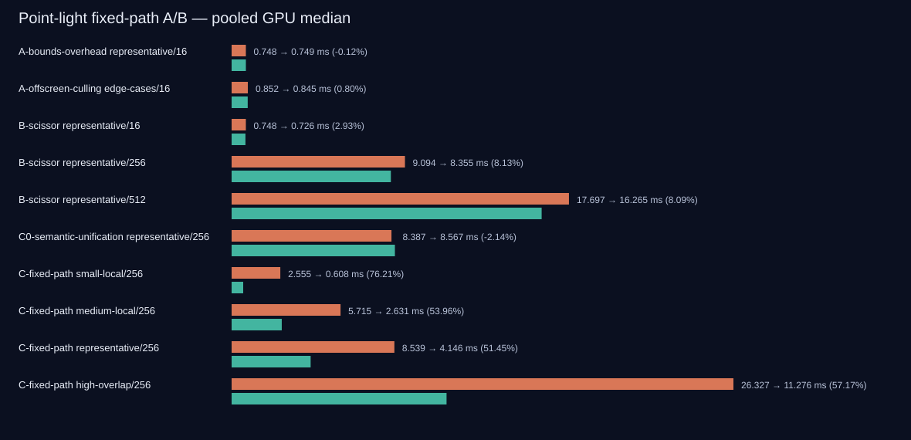

# Deferred 点光源 Screen Bounds / Scissor / Analytic Screen 正式实验报告

- 日期：2026-08-04
- 项目：OpenGL_Learn
- GPU：NVIDIA GeForce RTX 5060 Ti，驱动 591.86
- API：OpenGL 3.3
- 正式 A/B EXE SHA-256：`643C90CCCCFE8B3B90ECD54DFB775513F9A5994CFE6CC947F926F2CFB91A6135`
- 最终默认值 Release EXE SHA-256：`EA40321A9CDE239AE223C1FBFFD43DCDE560CEC562B982CD4EF8069B4DBB4BB6`
- 数据集状态：`valid=true`，聚合错误数 0

## 1. 最终结论

| 方案 | 决策 | 依据 |
|---|---|---|
| Conservative Bounds / Telemetry | Go | 分类、guard band、Fallback、Resize/宽高比、stable light-id/radius 均通过；代表 16 灯 Bounds CPU 中位数 0.0050 ms |
| 独立 Offscreen Culling | No-Go，默认关闭 | edge-cases/16 只改善 0.0068 ms / 0.80%，低于 3% 门槛；虽然 5/5 同向且五对截图完全一致 |
| Scissored Coalesced Volume | **Go** | representative/256、512 点光 GPU 分别改善 0.7394 ms / 8.13%、1.4321 ms / 8.09%，均 5/5 同向且逐像素一致 |
| 固定 Analytic Screen | **Go，成为默认** | 四档 256 灯 coverage 相对统一 Analytic Volume 改善 51.45%～76.21%，均 5/5 同向；对 Fullscreen Oracle 逐像素完全一致 |
| Adaptive Selector | **Not-Implemented / No-Go** | small/medium/representative/high-overlap 全部由 Screen 胜出，没有稳定交叉点；按预设门槛停止，没有强行实现选择器 |

Adaptive 相对最佳固定路径的增益为 **N/A**：没有满足实现 Adaptive 的前置交叉点，因此没有 Adaptive Candidate、没有混合场景 A/B，也不能填写 0.10 ms / 3% 门槛的“通过”数据。

正常 Deferred 默认值已设为 `analytic-screen`。以下显式复现模式全部保留：

- `coalesced-volume` + `coalesced-n-plus-one`；
- `coalesced-volume` + `legacy-2n`；
- `bounds-volume`；
- `scissored-volume`；
- `analytic-volume-full`；
- `analytic-volume`；
- `analytic-screen`；
- `analytic-fullscreen` Oracle。

## 2. 实验协议

正式性能进程统一使用：

- Release x64，1920×1080；
- 固定 Sponza、相机 `(-6.0, -1.5, 0.0) → (6.0, -0.8, 0.0)`、FOV 55°；
- seed `0x21D3F3A5`；
- Phong Deferred，显式 `gPosition`；
- VSync 请求 0；
- SSAO、Bloom、点光阴影关闭；
- 每进程 300 帧预热 + 600 帧采样；
- A/B 以 AB/BA 平衡块交错启动；
- 所有 Render Mode、Clear Mode、Culling Mode 均显式写入参数和 JSON；
- 质量进程与性能进程分离；
- RenderDoc marker、Bounds 详细记录和 Stencil readback 不进入正式时序路径。

三进程初判后，Bounds、Culling、16 灯 Scissor 和语义统一的关键差异小于 3%，Bounds 方向为 2/3。按预先冻结的规则，整个正式矩阵平衡扩展到五个独立进程。最终产物包括 100 个正式进程和 28 个独立质量/宽高比进程。

完整统计口径：

- [`per-process.csv`](per-process.csv)：每进程 CPU Frame、GPU Frame、点光 GPU/CPU、Bounds/Selector、Volume/Screen 子阶段的 Median/P95/P99；
- [`aggregate.csv`](aggregate.csv)：每配置 pooled 样本统计与进程中位数范围；
- [`aggregate.json`](aggregate.json)：完整嵌套统计、机制计数、签名、决策和正确性；
- [`launch-order.jsonl`](launch-order.jsonl)：128 个进程的真实启动顺序和时间；
- [`manifest.json`](manifest.json)：协议、正式 EXE 哈希和全部进程路径。

## 3. 实现事实

### 3.1 PointLightScreenProxy

每盏 Active Light 只计算一次有效半径，然后由 Bounds、代理 Scale、Shader `radiusSquared` 和遥测共同消费。Proxy 记录：

- stable light id（名称 + source index 的稳定 FNV-1a）；
- source index；
- radius；
- `Outside / ConservativeRect / FullscreenFallback`；
- pixel rect 与 coverage ratio；
- CameraInside、NearPlaneIntersection、InvalidRadius、InvalidProjection fallback reason。

半径必须 finite、`>0` 且 `<=1,000,000`；无效或极端值不会 Skip，而是 Fullscreen fallback。普通分支使用透视投影球的解析切线边界，向外 `floor/ceil` 后额外增加 1 pixel guard band，再 clamp 到 viewport。Camera-inside、Near-plane 相交、非有限矩阵/位置和退化投影都走 Fullscreen fallback。

Screen Rect 只生成保守候选像素和 coverage。最终受光判断始终读取或重建 G-Buffer 中的实际三维世界坐标，并执行：

```glsl
dot(fragPos - light.position, fragPos - light.position) <= radiusSquared
```

实现没有使用 `gl_FragCoord` 到投影圆心的二维距离作为最终受光判定。

### 3.2 代理球语义统一

当前点光代理实际来自 `models/sphere/sphere.obj`：

- 顶点半径最小 0.9999984、最大 1.0000007；
- 960 个三角形的最小面平面半径 0.99043723；
- 理论外包比例 `1 / 0.99043723 = 1.0096551`。

`Global.h` 中半径 0.5 的内建球不参与这条路径，不能混用。首次使用理论 1.0096551 时，representative/16 的 Analytic Volume 对 Oracle 仍出现 1 个像素、最大通道误差 5；加入光栅规则/精度 guard 后，最终代理 Scale 固定为 1.02，并在 Fragment 中执行同一个三维球 predicate，误差降为 0。

旧 Coalesced/Scissored Control 保留原三角球边界，未被偷偷改写。`C0-semantic-unification` 单独比较旧 Scissored Volume 与统一 Analytic Volume。

### 3.3 共用 Lighting 与 GL 状态

`shaders/pointLightLighting.glsl` 被 Volume、Screen 与 Fullscreen Oracle 共用，严格对齐：

- G-Buffer position validity；
- Normal、Albedo、Material；
- Diffuse、Specular、Attenuation；
- SSAO Ambient；
- Point Shadow CubeMap；
- Bloom BrightColor 与 HDR 输出。

Screen 仍逐灯绑定 Uniform/Shadow CubeMap并保持原灯序；未做批处理、Instancing 或 Uniform cache。透明物体不属于 Deferred G-Buffer，本轮没有扩展其受光范围。

`GLStateCache` 新增 Scissor Test 与 Scissor Box 跟踪。点光阶段保存并恢复进入前的 Scissor 状态；出口恢复 Blend/Depth/Cull/Stencil 契约。诊断 readback 和详细 telemetry 均默认关闭。

## 4. Phase A：Bounds / Telemetry

### 4.1 16 灯 coverage 分布

| Coverage | Rect / Outside / Fullscreen | Fallback reason | Coverage Median / P95 / Mean |
|---|---:|---|---:|
| small-local | 10 / 6 / 0 | none=16 | 0.032566 / 0.427344 / 0.106937 |
| medium-local | 7 / 2 / 7 | camera-inside=3，near-plane=4 | 0.503358 / 1.000000 / 0.566208 |
| representative | 7 / 0 / 9 | camera-inside=8，near-plane=1 | 1.000000 / 1.000000 / 0.752990 |
| high-overlap | 3 / 0 / 13 | camera-inside=13 | 1.000000 / 1.000000 / 0.993620 |
| edge-cases | 6 / 1 / 9 | camera-inside=8，near-plane=1 | 1.000000 / 1.000000 / 0.744054 |

edge-cases 明确覆盖了 Near Plane 相交、相机位于光体内和完全离屏灯。1280×720、1280×1024、3440×1440 各生成 16 个 Proxy；所有 rect 均位于对应 viewport，Resize 后 stable id/radius 不变。各 Routed Mode 的 stable id/radius 序列也完全一致。

原始证据：[`bounds-telemetry.json`](bounds-telemetry.json)、[`bounds-aspect-telemetry.json`](bounds-aspect-telemetry.json)。

### 4.2 Telemetry-only 开销

representative/16，Control=`coalesced-volume`，Candidate=`bounds-volume`，渲染命令和 17 次点光 Clear 不变：

| 指标 | Control | Bounds | 变化 | 进程方向 |
|---|---:|---:|---:|---:|
| 点光 GPU Median | 0.7476 ms | 0.7486 ms | -0.0009 ms / -0.12% | 2/5 Candidate 更快 |
| 点光 CPU Median | 0.0247 ms | 0.0307 ms | +0.0060 ms / +24.29% | — |
| Bounds CPU Median | 0 | 0.0050 ms | +0.0050 ms | — |
| Selector CPU Median | 0 | 0.0008 ms | +0.0008 ms | — |

GPU 差异属于噪声；CPU 相对增幅明显但绝对值约 0.006 ms。Coalesced Control 的点光 CPU 五进程中位数范围为 0.0241～0.0254 ms，与上一轮 cleanup 后约 0.0241 ms 的证据一致。

### 4.3 Offscreen Culling 隔离 A/B

edge-cases/16 仅改变 `--point-light-offscreen-culling off/on`：

- submitted 16→15，culled 0→1；
- 总 Draw 428→426；
- 点光 Clear 17→16，总 Stencil Clear 20→19；
- 点光 GPU 0.8515→0.8447 ms，改善 0.0068 ms / 0.80%，5/5 同向；
- 点光 CPU 0.0303→0.0291 ms，改善 0.0012 ms / 3.96%；
- 五对最终截图逐像素完全一致。

绝对收益和相对收益均不足以支持默认启用，结论为 No-Go / 显式实验开关保留。

## 5. Phase B：Scissored Coalesced Volume

唯一变量是将每灯 Stencil Draw、Lighting Draw 和灯后 Clear 限制在保守 rect。首个 Coalesced Initial Clear 仍为全屏；不启用 offscreen culling，灯序、双 Draw、Uniform、光照和 `N+1` Clear 数量不变。

### 5.1 正式性能

点光 GPU 为应用内 Timer Query，格式为 `Median / P95 / P99`：

| 灯数 | Coalesced GPU | Scissored GPU | 进程 Median 范围（C → S） | 改善 | 方向 |
|---:|---:|---:|---:|---:|---:|
| 16 | 0.7476 / 1.1856 / 1.2704 | 0.7257 / 1.1624 / 1.2246 | 0.7467～0.7544 → 0.7248～0.7266 | 0.0219 ms / 2.93% | 5/5 |
| 256 | 9.0943 / 9.6396 / 9.8559 | 8.3548 / 8.8974 / 9.1057 | 9.0863～9.1154 → 8.2538～8.3964 | 0.7394 ms / 8.13% | 5/5 |
| 512 | 17.6971 / 18.5990 / 18.8962 | 16.2650 / 17.1145 / 17.4022 | 17.6526～17.7651 → 16.2436～16.3036 | 1.4321 ms / 8.09% | 5/5 |

CPU 代价来自 Bounds/Selector：

| 灯数 | 点光 CPU Median C → S | Bounds CPU | Selector CPU |
|---:|---:|---:|---:|
| 16 | 0.0244 → 0.0307 ms | 0.0049 ms | 0.0008 ms |
| 256 | 0.3121 → 0.3859 ms | 0.0640 ms | 0.0048 ms |
| 512 | 0.6134 → 0.7547 ms | 0.1235 ms | 0.0062 ms |

### 5.2 机制计数

| 灯数 | Draw（C = S） | 点光 Clear（C = S） | 总 Clear（C = S） | Clear Pixel Area C → S | 面积减少 |
|---:|---:|---:|---:|---:|---:|
| 16 | 428 | 17 | 20 | 35,251,200 → 27,056,010 | 23.25% |
| 256 | 908 | 257 | 260 | 532,915,200 → 269,445,181 | 49.44% |
| 512 | 1,420 | 513 | 516 | 1,063,756,800 → 535,077,517 | 49.70% |

16/256/512 的 submitted、scene signature、submission signature、Stencil Draw 和 Lighting Volume Draw 均相同。Clear 次数不变，只改变受影响面积。约一半的 Clear Pixel Area 最终只带来约 8.1% 点光 GPU 改善，证明“面积”是机制证据而不是 GPU 时间估算；不能把旧 RenderDoc 的 10.324 ms Clear 直接按比例套用。

所有五档 coverage 的 Coalesced 与 Scissored 截图逐像素完全一致，Stencil 出口为全零。Phase B 判定 Go。

## 6. C0：代理语义统一是独立变量

旧 Control 与理想球 Oracle 的差异：

| Coverage | Max | Mean | P95 | 不同像素 | 比例 |
|---|---:|---:|---:|---:|---:|
| small-local | 34 | 0.041674 | 0 | 7,169 | 0.345727% |
| medium-local | 41 | 0.099158 | 0 | 47,453 | 2.288436% |
| representative | 39 | 0.070459 | 0 | 50,108 | 2.416474% |
| high-overlap | 2 | 0.005060 | 0 | 14,983 | 0.722560% |
| edge-cases | 29 | 0.042993 | 0 | 41,284 | 1.990934% |

representative/256 在相同 Bounds、Scissor、双 Draw 和 `N+1` Clear 下：

- Scissored old semantics：点光 GPU 8.3870 ms；
- Analytic Volume unified semantics：8.5665 ms；
- 统一语义成本为 0.1795 ms / 2.14%，五个进程均由旧语义更快；
- 点光 CPU 0.3839→0.3965 ms。

因此 Phase C 的 Screen Control 不是更快但边界不同的旧 Scissored Volume，而是图像可与 Screen 切换的统一 Analytic Volume。Screen 收益没有夹带这项语义变化。

## 7. Phase C：固定 Analytic Screen

AllVolume=`analytic-volume`：每灯保守外包球 Stencil Draw + Lighting Draw、共享三维 predicate、Scissor 和 `N+1` Clear。

AllScreen=`analytic-screen`：每灯一次 Quad Draw、rect Scissor、先验证 G-Buffer position，再做同一个三维 predicate，最后调用共用 Lighting；本灯不写 Stencil，也没有本灯 Clear。

### 7.1 点光 GPU / CPU

| Coverage / 256 | Volume GPU M/P95/P99 | Screen GPU M/P95/P99 | 进程 Median 范围 V → S | GPU 改善 | 方向 |
|---|---:|---:|---:|---:|---:|
| small-local | 2.5553 / 2.9111 / 3.0674 | 0.6080 / 1.0606 / 1.1090 | 2.5420～2.5718 → 0.6062～0.6084 | 1.9474 ms / 76.21% | 5/5 |
| medium-local | 5.7146 / 6.1753 / 6.3348 | 2.6308 / 3.0310 / 3.2065 | 5.6786～5.7396 → 2.6193～2.6776 | 3.0837 ms / 53.96% | 5/5 |
| representative | 8.5391 / 9.1047 / 9.3188 | 4.1458 / 4.5183 / 4.6772 | 8.5110～8.5573 → 4.1330～4.1622 | 4.3933 ms / 51.45% | 5/5 |
| high-overlap | 26.3267 / 27.6149 / 27.9918 | 11.2762 / 12.2506 / 12.7463 | 26.2735～26.3941 → 11.0641～11.8380 | 15.0506 ms / 57.17% | 5/5 |

| Coverage / 256 | Volume Point CPU M/P95/P99 | Screen Point CPU M/P95/P99 | CPU 改善 |
|---|---:|---:|---:|
| small-local | 0.3885 / 0.4652 / 0.5467 | 0.2642 / 0.3233 / 0.3933 | 0.1243 ms / 31.99% |
| medium-local | 0.3948 / 0.4804 / 0.5643 | 0.2696 / 0.3351 / 0.4298 | 0.1252 ms / 31.71% |
| representative | 0.3975 / 0.4931 / 0.5884 | 0.2751 / 0.3439 / 0.4300 | 0.1224 ms / 30.79% |
| high-overlap | 0.3981 / 0.5058 / 0.6172 | 0.2766 / 0.3479 / 0.4455 | 0.1215 ms / 30.52% |

### 7.2 CPU Frame / GPU Frame

| Coverage / 256 | Volume CPU Frame M/P95/P99 | Screen CPU Frame M/P95/P99 | Volume GPU Frame M/P95/P99 | Screen GPU Frame M/P95/P99 |
|---|---:|---:|---:|---:|
| small-local | 3.3015 / 3.8382 / 4.0819 | 1.3827 / 1.8811 / 2.1049 | 3.3497 / 3.6585 / 3.8212 | 1.3003 / 1.7685 / 1.8496 |
| medium-local | 6.4695 / 7.0231 / 7.2817 | 3.4327 / 3.9179 / 4.1242 | 6.4584 / 6.9410 / 7.1188 | 3.4687 / 3.7968 / 3.9809 |
| representative | 9.2606 / 9.9367 / 10.3097 | 4.8705 / 5.3729 / 5.5712 | 9.2805 / 9.8570 / 10.0548 | 4.8683 / 5.3091 / 5.4959 |
| high-overlap | 27.0367 / 28.4341 / 28.9077 | 12.0457 / 13.0434 / 13.6243 | 27.0757 / 28.3625 / 28.8036 | 12.0495 / 13.0395 / 13.5426 |

### 7.3 机制计数

四档均满足：

| 机制 | Analytic Volume | Analytic Screen |
|---|---:|---:|
| submitted / culled | 256 / 0 | 256 / 0 |
| 总 Draw | 908 | 652 |
| Point Volume Count | 256 | 0 |
| Point Screen Count | 0 | 256 |
| Stencil Draw / Lighting Volume Draw / Screen Draw | 256 / 256 / 0 | 0 / 0 / 256 |
| 点光 Clear / fixed Clear / total Clear | 257 / 3 / 260 | 0 / 3 / 3 |
| 点光 Stencil Clear Pixel Area | 依 coverage 为 49,097,470～520,932,600 | 0 |

scene signature、submission signature、灯序和提交灯数相同；Draw 数减少 256 是设计变量，因为 Screen 明确把每灯双 Draw 改为单 Draw。Volume/Screen GPU 子阶段中位数分别与各自的 Deferred Point Lights GPU 一致，未将 RenderDoc Duration 混入 Timer Query 结果。



## 8. 交叉点与 Adaptive 门控

预设条件要求：小覆盖 Screen 稳定更快、大覆盖 Volume 稳定更快，图像切换一致，随后才允许实现 Adaptive + hysteresis/stable id。实际四档结果为：

```text
small-local     Screen +76.21%
medium-local    Screen +53.96%
representative  Screen +51.45%
high-overlap    Screen +57.17%
```

大覆盖没有 Volume 反转，且各组均 5/5 同向。不存在可拟合的交叉点，也就不存在不拍脑袋的 coverage threshold。按门控规则：

- 固定 Screen Go；
- Adaptive 未实现；
- hysteresis、lastSelectedPath 和 mixed-coverage Adaptive A/B 不执行；
- 相对最佳固定路径的 Adaptive 增益为 N/A；
- 不将 Adaptive 写入默认值、报告亮点或简历事实。

## 9. 正确性

### 9.1 Oracle 与逐像素比较

质量矩阵为 5 个 coverage × 5 个显式模式，1920×1080 固定相机。`analytic-fullscreen` 是 per-light Fullscreen Oracle：读取实际 G-Buffer 三维位置，使用与候选完全相同的 predicate 和 Lighting。

- Coalesced vs Scissored：5/5 coverage 全部 `max=mean=P95=0`，不同像素 0；
- Fullscreen Oracle vs Analytic Volume：5/5 全部完全一致；
- Fullscreen Oracle vs Analytic Screen：5/5 全部完全一致；
- Analytic Volume vs Analytic Screen：5/5 全部完全一致；
- Offscreen Culling off/on：5 个独立进程截图全部完全一致。

差异原始数据和 30 张 diff：[`image-diff.json`](image-diff.json)、[`images`](images/)。

### 9.2 签名、状态与日志

- 除显式 culling A/B 的 submitted 16→15 外，所有正式配对的 scene signature、submission signature 和 submitted count 相同；
- Scissor 和统一语义 A/B 的总 Draw 完全相同；Screen 的 Draw 由每灯 2 次按设计降为 1 次；
- high-overlap/16 与 edge-cases/16 的 Volume/Screen/Oracle 截图一致；
- Near-plane、camera-inside、完全离屏灯均走预期分类；
- 所有质量 lifecycle readback 退出时 Stencil 非零像素为 0；
- 128 个进程日志未发现 GL/shader error。

### 9.3 RenderDoc 机制证据

最终 representative/512 `analytic-screen` 捕获成功并独立 replay：

- RDC：[`renderdoc/captures/representative-0512-analytic-screen_capture.rdc`](renderdoc/captures/representative-0512-analytic-screen_capture.rdc)，342,477,517 bytes；
- Replay：[`renderdoc/replay/representative-0512-analytic-screen-replay.json`](renderdoc/replay/representative-0512-analytic-screen-replay.json)；
- Light marker：512；
- LightingScreenDraw：512；
- StencilVolumeDraw：0；
- LightingVolumeDraw：0；
- 点光 Stencil Clear：0；
- 应用计数：submitted=512、culled=0、fixed clear=3、Stencil exit clean；
- capture open、replay、fatal status 均为 Success；
- Replay debug messages：0。

Replay 只做事件/状态机制验证，没有把单次 RenderDoc Duration 当成稳定性能结论。

## 10. Stencil 生命周期解释

Volume 路径不能只在整个点光阶段清一次。第 `i` 盏灯留下的非零 Stencil 如果不在下一盏灯前被清理，第 `i+1` 盏灯的 `NOTEQUAL 0` 会读取两盏灯累积的 mask，产生错误受光区域。

Coalesced 的安全最小生命周期仍是：首次 Volume 前一次 Initial Clear，每盏 Volume 后一次 Clear。最后一次 Clear 是必要的，因为它保证离开点光阶段时 Stencil 为 0，不把内部临时 mask 泄漏到后续 Pass。

Analytic Screen 完全不写 Stencil，所以本灯既不需要 Initial/After Clear，也不需要最后点光 Clear；它只保留外围固定的 3 次场景级 Clear。

## 11. 最终 Release 与回归

最终默认值改动后重新 Release x64 构建成功。[`final-smoke/manifest.json`](final-smoke/manifest.json) 记录最终 EXE 哈希和 8 个退出码为 0 的 smoke：

- 无显式 Render Mode 的正常 Deferred 实际记录 `analytic-screen`；
- 显式 Coalesced/16：17 次点光 Clear，16/16 双 Draw，Stencil exit clean；
- 显式 Legacy2N/16：32 次点光 Clear，16/16 双 Draw，Stencil exit clean；
- Analytic Screen high-overlap/16、edge-cases/16：16 Screen Draw、0 点光 Clear、Stencil exit clean；
- Resource smoke：Forward → Bloom → Deferred+SSAO+Bloom+阴影 → Resize → 恢复，最终 texture/mesh/render-target bytes 全为 0；
- PBR Sponza Forward 与 Deferred 均 `success=true`，输出非黑且没有 GL/shader error。

注意：PBR smoke 是“没有回归”的证据，不表示本轮 Phong Deferred Point-Light Screen 路径扩展到了透明 Forward 或新的 PBR Lighting Backend。

## 12. 复现命令

正式 A/B：

```powershell
powershell -ExecutionPolicy Bypass -File .\tools\run_point_light_screen_routing.ps1 `
  -Mode Formal `
  -RunDirectory .\benchmark-results\point-light-screen-routing\screen-bounds-scissor-analytic-20260804 `
  -FormalRuns 5 -WarmupFrames 300 -SampleFrames 600 `
  -SkipBuild -Resume `
  -PythonExecutable C:\Users\Link\.cache\codex-runtimes\codex-primary-runtime\dependencies\python\python.exe
```

重新聚合：

```powershell
C:\Users\Link\.cache\codex-runtimes\codex-primary-runtime\dependencies\python\python.exe `
  .\tools\analyze_point_light_screen_routing.py `
  --run-dir .\benchmark-results\point-light-screen-routing\screen-bounds-scissor-analytic-20260804
```

最终 RenderDoc：

```powershell
powershell -ExecutionPolicy Bypass -File .\tools\capture_point_light_screen_renderdoc.ps1 `
  -RunDirectory .\benchmark-results\point-light-screen-routing\screen-bounds-scissor-analytic-20260804 `
  -WarmupFrames 30 -SampleFrames 5 -SkipBuild
```

最终 smoke：

```powershell
powershell -ExecutionPolicy Bypass -File .\tools\run_point_light_screen_final_smoke.ps1 `
  -RunDirectory .\benchmark-results\point-light-screen-routing\screen-bounds-scissor-analytic-20260804
```

## 13. 限制与适用边界

- 结论来自 RTX 5060 Ti / NVIDIA 591.86 / 1920×1080，不外推其他 GPU/驱动；
- 主时序固定 Explicit gPosition、SSAO/Bloom/Point Shadow off；其他开关只做 correctness smoke；
- Near-plane 与 camera-inside 使用安全但昂贵的 Fullscreen fallback；尚未实现 clipped-sphere 更紧边界；
- Offscreen Culling 保留显式开关但默认关闭；
- 默认固定 Screen，不存在 Adaptive/hysteresis 运行时状态；
- 透明物体不在 Deferred G-Buffer 范围内；
- 没有实现 Tiled/Clustered、Instancing、灯光批处理、G-Buffer 压缩或 Uniform cache；
- 旧 Coalesced/Scissored Volume 的离散代理语义与理想球 Oracle 不同，只用于旧基准复现，不能与统一路径的画质结果混淆。

## 14. 当前数据允许的简历事实

可以陈述：构建保守投影球 Screen Rect 与共享三维球内光照判定，以每灯一次 Analytic Screen Draw 替代两次 Stencil Volume Draw；在 1080p 固定 Sponza 的 256 灯四档 coverage 中，点光 GPU Median 相对统一 Analytic Volume 降低 51.45%～76.21%，五个独立进程全部同向，并对 Fullscreen per-light Oracle 达到逐像素完全一致。

不能陈述：已实现 Adaptive Selector、Tiled/Clustered、Instancing，或该结果跨 GPU 普遍成立。
