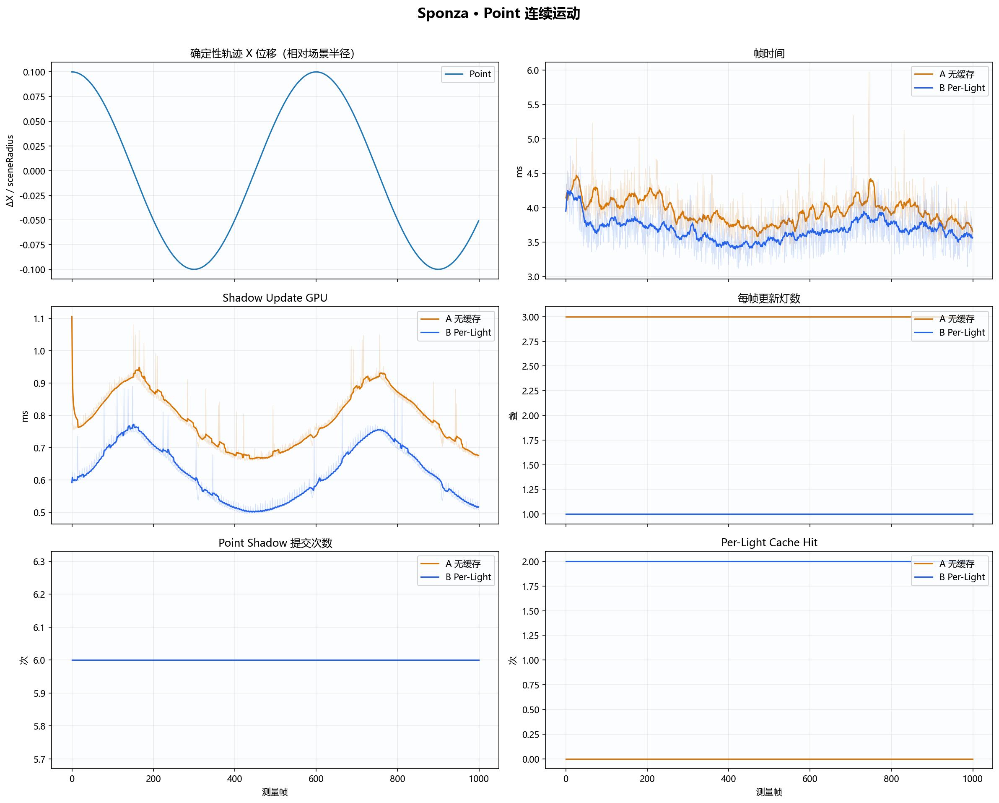
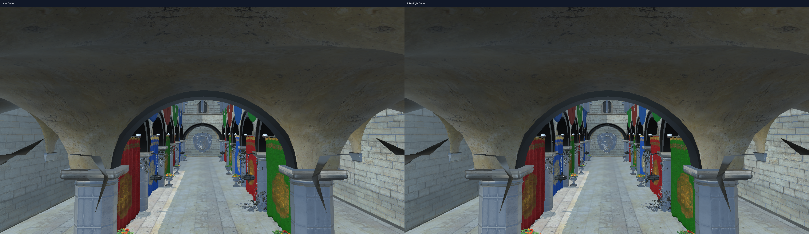
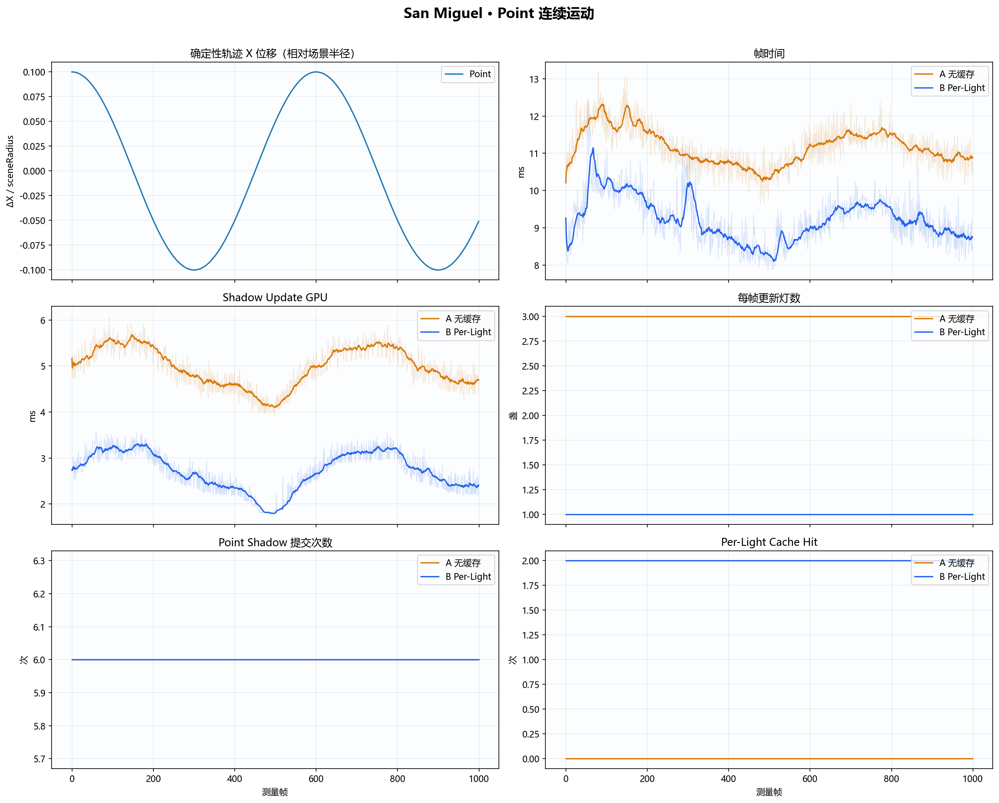
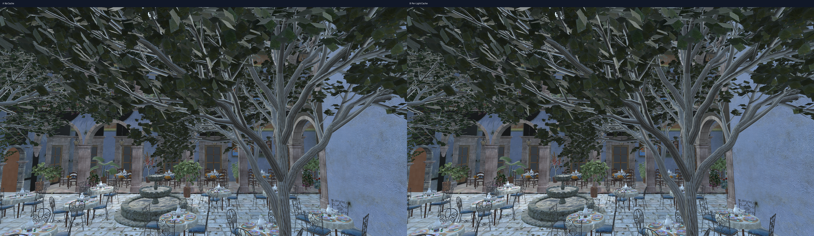

# 确定性 Shadow Motion Timeline A/B 实验报告

- 批次：`per-light-cache-motion-timeline-point-1080p-final`
- 日期（UTC）：`2026-07-28T15:06:16.4978444Z`
- 源码提交：`36a601af13babc35b4d234d41fade2b7893ce6ca`（dirty=true，source SHA-256=`1f4856f37a7eebbde7b276daad6eb8aa95a28d5651f4220d7574b8707efbc376`）
- 构建：Release x64
- 分辨率：1920×1080
- CPU：12th Gen Intel(R) Core(TM) i7-12700KF
- OpenGL GPU：NVIDIA GeForce RTX 5060 Ti/PCIe/SSE2；OpenGL：3.3.0 NVIDIA 591.86
- 每个变体独立运行：3 轮
- 正式顺序：`A/B/B/A/A/B`
- 每轮测量帧：1000
- Warm-up：外部 100 帧，内部 15 帧
- 时间轴：60 Hz，600 帧一周期
- A：无缓存；B：Per-Light Revision Cache

统计口径：每轮独立进程先计算 Median/P95/P99，再对同一变体各轮统计值取算术平均。逐帧曲线取各轮同帧中位数。

## 汇总结论表

| 场景 | 轨迹 | Shadow GPU Median A→B | 帧时间 Median A→B | 更新灯数 A→B | Point 提交 A→B |
|---|---|---:|---:|---:|---:|
| Sponza | Point 连续运动 | 0.790→0.625 ms (-20.99%) | 3.911→3.652 ms (-6.61%) | 3.00→1.00 | 6.00→6.00 |
| San Miguel | Point 连续运动 | 5.011→2.757 ms (-44.98%) | 11.136→9.241 ms (-17.02%) | 3.00→1.00 | 6.00→6.00 |

## 分场景逐帧证据

### Sponza · Point 连续运动

启用轨道：`point`。

| 指标 | A Median / P95 / P99 | B Median / P95 / P99 | Median 变化 |
|---|---:|---:|---:|
| 帧时间 | 3.911 / 4.801 / 5.672 ms | 3.652 / 4.391 / 5.241 ms | -6.61% |
| Shadow Update GPU | 0.790 / 0.946 / 1.070 ms | 0.625 / 0.789 / 0.906 ms | -20.99% |
| Shadow Update CPU | 0.319 / 0.427 / 0.536 ms | 0.184 / 0.250 / 0.334 ms | -42.34% |
| 更新灯数 | 3.00 / 3.00 / 3.00 盏/帧 | 1.00 / 1.00 / 1.00 盏/帧 | -66.67% |
| Point 提交次数 | 6.00 / 6.00 / 6.00 次/帧 | 6.00 / 6.00 / 6.00 次/帧 | +0.00% |
| Per-Light Cache Hit | 0.00 / 0.00 / 0.00 次/帧 | 2.00 / 2.00 / 2.00 次/帧 | N/A |

| 配对 | A Shadow GPU Median | B Shadow GPU Median | B 相对 A |
|---|---:|---:|---:|
| A1/B1 | 0.795 ms | 0.627 ms | -21.14% |
| A2/B2 | 0.790 ms | 0.624 ms | -21.00% |
| A3/B3 | 0.786 ms | 0.622 ms | -20.83% |

画面校验：最大通道差 `60`，变化像素 `2`。

逐帧原始表：[point-sponza.csv](csv/point-sponza.csv)

### San Miguel · Point 连续运动

启用轨道：`point`。

| 指标 | A Median / P95 / P99 | B Median / P95 / P99 | Median 变化 |
|---|---:|---:|---:|
| 帧时间 | 11.136 / 12.379 / 13.284 ms | 9.241 / 10.714 / 11.929 ms | -17.02% |
| Shadow Update GPU | 5.011 / 5.731 / 6.118 ms | 2.757 / 3.400 / 3.553 ms | -44.98% |
| Shadow Update CPU | 2.485 / 2.964 / 3.747 ms | 1.240 / 1.824 / 2.209 ms | -50.10% |
| 更新灯数 | 3.00 / 3.00 / 3.00 盏/帧 | 1.00 / 1.00 / 1.00 盏/帧 | -66.67% |
| Point 提交次数 | 6.00 / 6.00 / 6.00 次/帧 | 6.00 / 6.00 / 6.00 次/帧 | +0.00% |
| Per-Light Cache Hit | 0.00 / 0.00 / 0.00 次/帧 | 2.00 / 2.00 / 2.00 次/帧 | N/A |

| 配对 | A Shadow GPU Median | B Shadow GPU Median | B 相对 A |
|---|---:|---:|---:|
| A1/B1 | 5.009 ms | 2.767 ms | -44.76% |
| A2/B2 | 5.013 ms | 2.712 ms | -45.90% |
| A3/B3 | 5.010 ms | 2.791 ms | -44.29% |

画面校验：最大通道差 `64`，变化像素 `5`。

逐帧原始表：[point-san-miguel.csv](csv/point-san-miguel.csv)

## 解释边界

- `timeline-point` 用于衡量“只动 Point”时其余灯的缓存收益；Point Cubemap 仍应每个失效帧提交六面。
- `timeline-camera` 用于证明仅相机运动不会误使阴影缓存失效。
- `timeline-caster` 是所有受影响阴影灯都必须更新的保守路径。
- `timeline-mixed` 是持续运动压力测试，不应被包装成 Per-Light 的最佳案例。
