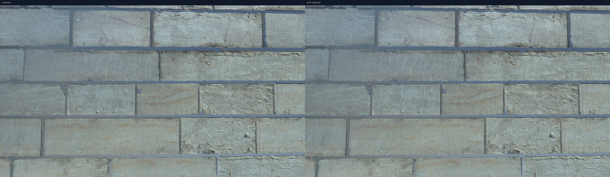
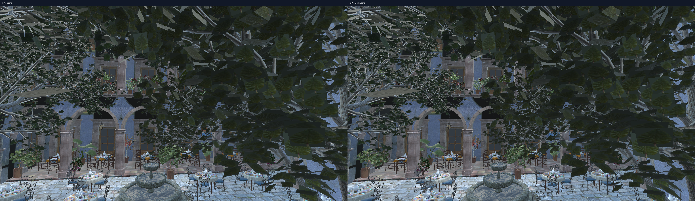

# 确定性 Shadow Motion Timeline A/B 实验报告

- 批次：`per-light-cache-motion-timeline-point-camera-1080p-final`
- 日期（UTC）：`2026-07-28T18:23:51.3945051Z`
- 源码提交：`2f3cdce1b618fd9b59a7dfe0967be853eee49669`（dirty=true，source SHA-256=`732479cc8535da89a256e6e1ba18ca73ec4a5410aff6d56cb0f9e82719e699f3`）
- 构建：Release x64
- 分辨率：1920×1080
- CPU：12th Gen Intel(R) Core(TM) i7-12700KF
- OpenGL GPU：NVIDIA GeForce RTX 5060 Ti/PCIe/SSE2；OpenGL：3.3.0 NVIDIA 591.86
- 每个变体独立运行：3 轮
- 正式顺序：`A/B/B/A/A/B`
- 每轮测量帧：1000
- Warm-up：外部 100 帧，内部 15 帧
- 时间轴：60 Hz，600 帧一周期
- A：无缓存；B：Per-Light Revision Cache

统计口径：每轮独立进程先计算 Median/P95/P99，再对同一变体各轮统计值取算术平均。逐帧曲线取各轮同帧中位数。

## 汇总结论表

| 场景 | 轨迹 | Shadow GPU Median A→B | 帧时间 Median A→B | 更新灯数 A→B | Point 提交 A→B |
|---|---|---:|---:|---:|---:|
| Sponza | Point + Camera 连续运动 | 0.790→0.620 ms (-21.46%) | 4.187→3.739 ms (-10.68%) | 3.00→1.00 | 6.00→6.00 |
| San Miguel | Point + Camera 连续运动 | 4.897→2.657 ms (-45.76%) | 11.261→8.972 ms (-20.33%) | 3.00→1.00 | 6.00→6.00 |

## 分场景逐帧证据

### Sponza · Point + Camera 连续运动

启用轨道：`point, camera`。

| 指标 | A Median / P95 / P99 | B Median / P95 / P99 | Median 变化 |
|---|---:|---:|---:|
| 帧时间 | 4.187 / 4.862 / 5.275 ms | 3.739 / 4.386 / 4.828 ms | -10.68% |
| Shadow Update GPU | 0.790 / 0.990 / 1.123 ms | 0.620 / 0.757 / 0.896 ms | -21.46% |
| Shadow Update CPU | 0.328 / 0.407 / 0.521 ms | 0.192 / 0.248 / 0.326 ms | -41.40% |
| 更新灯数 | 3.00 / 3.00 / 3.00 盏/帧 | 1.00 / 1.00 / 1.00 盏/帧 | -66.67% |
| Point 提交次数 | 6.00 / 6.00 / 6.00 次/帧 | 6.00 / 6.00 / 6.00 次/帧 | +0.00% |
| Per-Light Cache Hit | 0.00 / 0.00 / 0.00 次/帧 | 2.00 / 2.00 / 2.00 次/帧 | N/A |

| 配对 | A Shadow GPU Median | B Shadow GPU Median | B 相对 A |
|---|---:|---:|---:|
| A1/B1 | 0.789 ms | 0.621 ms | -21.27% |
| A2/B2 | 0.789 ms | 0.619 ms | -21.53% |
| A3/B3 | 0.791 ms | 0.621 ms | -21.57% |

画面校验：最大通道差 `0`，变化像素 `0`。

逐帧原始表：[point-camera-sponza.csv](csv/point-camera-sponza.csv)

### San Miguel · Point + Camera 连续运动

启用轨道：`point, camera`。

| 指标 | A Median / P95 / P99 | B Median / P95 / P99 | Median 变化 |
|---|---:|---:|---:|
| 帧时间 | 11.261 / 12.361 / 12.981 ms | 8.972 / 10.022 / 10.532 ms | -20.33% |
| Shadow Update GPU | 4.897 / 5.531 / 5.789 ms | 2.657 / 3.297 / 3.438 ms | -45.76% |
| Shadow Update CPU | 2.524 / 3.034 / 3.560 ms | 1.212 / 1.554 / 1.829 ms | -51.97% |
| 更新灯数 | 3.00 / 3.00 / 3.00 盏/帧 | 1.00 / 1.00 / 1.00 盏/帧 | -66.67% |
| Point 提交次数 | 6.00 / 6.00 / 6.00 次/帧 | 6.00 / 6.00 / 6.00 次/帧 | +0.00% |
| Per-Light Cache Hit | 0.00 / 0.00 / 0.00 次/帧 | 2.00 / 2.00 / 2.00 次/帧 | N/A |

| 配对 | A Shadow GPU Median | B Shadow GPU Median | B 相对 A |
|---|---:|---:|---:|
| A1/B1 | 4.901 ms | 2.651 ms | -45.92% |
| A2/B2 | 4.892 ms | 2.650 ms | -45.83% |
| A3/B3 | 4.899 ms | 2.669 ms | -45.53% |

画面校验：最大通道差 `49`，变化像素 `10`。

逐帧原始表：[point-camera-san-miguel.csv](csv/point-camera-san-miguel.csv)

## 解释边界

- `timeline-point` 用于衡量“只动 Point”时其余灯的缓存收益；Point Cubemap 仍应每个失效帧提交六面。
- `timeline-point-camera` 在 Point 运动的同时移动相机，Caster 保持静止；相机运动不应额外使 Shadow Map 失效。
- `timeline-camera` 用于证明仅相机运动不会误使阴影缓存失效。
- `timeline-caster` 是所有受影响阴影灯都必须更新的保守路径。
- `timeline-mixed` 是持续运动压力测试，不应被包装成 Per-Light 的最佳案例。
