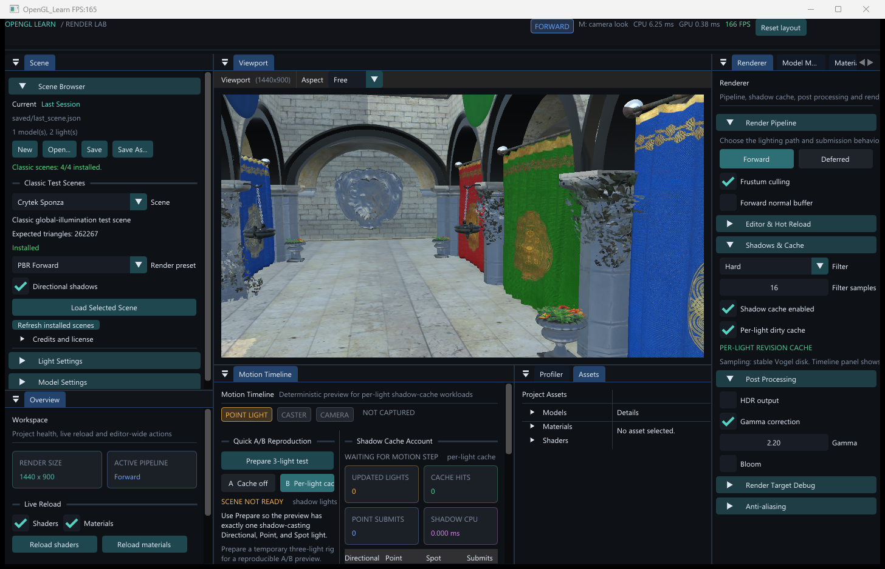

# OpenGL Learn · Render Lab

一个基于 **OpenGL 3.3 / C++17** 的交互式渲染实验室。项目已经不只是教程代码集合：它同时包含可操作的渲染编辑器、Forward / Deferred 渲染器、经典大场景导入，以及带截图、GPU 计时和资源遥测的可重复实验工具。



## 项目定位

这个仓库主要用于三类工作：

- **实时渲染实现**：PBR、IBL、多光源、阴影、SSAO、Bloom、MSAA 等功能；
- **编辑器内调试**：场景、材质、光源、FBO Attachment、Profiler 和确定性运动时间轴；
- **可复现实验**：固定相机与工作负载、独立进程采样、CPU/GPU Zone、P95/P99、截图和资源生命周期验收。

## 核心能力

### 渲染管线

- 可在运行时切换 **Forward** 与 **Deferred**；
- Deferred Geometry / Lighting / Forward Composite 多 Pass 架构；
- 点光源模板光体积与全屏/体积光照路径；
- Frustum Culling、不透明物体排序与 GL 状态缓存；
- 多 Render Target 调试，可直接检查 GBuffer、SSAO 和后处理结果。

### 光照、材质与后处理

- Directional、Point、Spot 三类光源；
- Metallic-Roughness PBR：Cook-Torrance、GGX、Smith、Schlick；
- IBL：Irradiance Cubemap、Prefilter Cubemap、BRDF LUT；
- Phong、PBR、Mirror、Explode 等材质/着色路径；
- HDR、Gamma、Bloom、MSAA；
- SSAO Full Resolution，以及实验性的 Half Resolution + Bilateral Upsample；
- Assimp OBJ/MTL 导入，支持 Base Color、Normal、Metallic、Roughness、AO、Emissive 和 Alpha Cutout；
- 已适配 Sponza 的独立 `map_d` 遮罩，以及 Amazon Bistro 的 BC5 Normal、Packed ORM、Emissive 和 BaseColor Alpha 植被材质约定。

### 阴影系统

- Directional / Spot 2D Shadow Map 与 Point Cubemap Shadow；
- Hard、PCF、PCSS 过滤；
- Per-Light Dirty Cache；
- Point Light 空间关联与 Per-Face 增量缓存；
- 完整失效规则、资源释放遥测和确定性 Motion Timeline A/B 工作负载。

### 编辑器

- ImGui Docking 布局与中文字体回退；
- Scene Browser：新建、打开、保存、另存为和 Last Session 恢复；
- Classic Scene 安装检测与一键载入；
- Renderer、Model、Material Inspector；
- Shader / Material 热重载；
- Assets Browser：Models、Materials、Shaders；
- Profiler：Frame、Zones、Render、Memory；
- Motion Timeline：预览阴影缓存命中、更新和 Point Face 提交。

### 性能与验收基础设施

- 无交互 Runtime Benchmark，固定 warm-up/sample 并自动退出；
- CPU/GPU Frame 与 Zone 原始样本、Median、P95、P99；
- Draw、Triangle、Uniform、状态切换、缓存命中等渲染计数；
- Process Working Set / Private Bytes，以及 Texture、Mesh、Render Target 资源遥测；
- Classic Scene、Shadow、SSAO、Opaque Sorting 等自动化实验脚本；
- 画面截图、差分图、JSON、CSV 和 HTML 报告。

## 快速开始

### 环境要求

- Windows 10/11 x64；
- Visual Studio 2022，安装“使用 C++ 的桌面开发”和 v143 工具集；
- 支持 OpenGL 3.3 的 GPU 与驱动；
- C++17；
- PowerShell 5.1+；
- 运行 Classic Scene 准备流程时需要 Python + Pillow，以及 Assimp CLI。

### 第三方依赖

仓库没有完整提交本地二进制依赖。当前工程默认使用以下布局：

```text
workspace/
├── OpenGL_Learn/                 # 本仓库
│   ├── includes/                 # GLAD / GLFW / GLM / Assimp 头文件
│   ├── libs/                     # GLFW / Assimp 库与 DLL
│   └── OpenGL_Learn/
│       └── OpenGL_Learn.vcxproj
└── imgui-docking/                # Dear ImGui docking 分支
```

当前链接名称：

- Debug：`glfw3d.lib`、`assimp-vc143-mtd.lib`；
- Release：`glfw3.lib`、`assimp-vc143-mt.lib`；
- 系统库：`opengl32.lib`。

> 新机器首次构建前，请检查 [`OpenGL_Learn.vcxproj`](OpenGL_Learn/OpenGL_Learn.vcxproj) 中的 Include、Library、`glad.c` 和 `imgui-docking` 路径。工程仍包含本机相对路径约定，并不是开箱即用的包管理配置。

### 编译

在 **Developer PowerShell for VS 2022** 中，可以直接构建已跟踪的 Visual C++ Project：

```powershell
msbuild .\OpenGL_Learn\OpenGL_Learn.vcxproj `
  /m /p:Configuration=Release /p:Platform=x64
```

也可以在 Visual Studio 中打开 `OpenGL_Learn/OpenGL_Learn.vcxproj`，或将它加入本地 Solution 后构建。

> 仓库目前没有跟踪根目录的 `OpenGL_Learn.sln`，但现有自动化脚本仍默认从该 Solution 构建，并使用根目录 `x64/Release/`。若要直接运行这些脚本，请先在仓库根目录创建同名 Solution，再加入 `OpenGL_Learn/OpenGL_Learn.vcxproj`。后续应将这个构建入口清理并纳入版本控制。

### 运行

资源路径以 `OpenGL_Learn/` 为工作目录。直接构建 vcxproj 时可以这样启动：

```powershell
Set-Location .\OpenGL_Learn
.\x64\Release\OpenGL_Learn.exe
```

如果通过仓库根目录的本地 Solution 构建，输出可能位于根目录 `x64/`；此时仍应保持 `OpenGL_Learn/` 为工作目录，再按实际输出路径启动程序。

### 基本操作

- `M`：进入/退出摄像机控制；
- `W/A/S/D`：移动摄像机；
- 鼠标：在摄像机控制模式下调整视角；
- `Esc`：退出。

## 经典场景

经典场景资源不提交到 Git。来源、哈希、相机和预期三角形数量记录在 [`classic-scenes.manifest.json`](OpenGL_Learn/classic-scenes.manifest.json)。

| 场景 | 预期三角形 | 用途 |
|---|---:|---|
| Crytek Sponza | 262,267 | 经典全局光照/材质测试 |
| Amazon Lumberyard Bistro Exterior | 2,832,120 | 制作级室外场景 |
| Amazon Lumberyard Bistro Interior | 1,046,609 | 制作级室内场景 |
| San Miguel 2.1 Low-Poly | 5,617,451 | 大型研究场景 |

从 `OpenGL_Learn/` 目录运行完整准备与验收：

```powershell
powershell -NoProfile -ExecutionPolicy Bypass `
  -File .\tools\Test-ClassicScenes.ps1
```

首次运行会下载并校验官方归档、准备 Bistro OBJ/纹理、构建 Release x64，并为每个场景生成截图与 JSON 报告。生成的资源、缓存和 `benchmark-results/` 均被 Git 忽略。详细协议见 [`CLASSIC_SCENE_VALIDATION.md`](OpenGL_Learn/CLASSIC_SCENE_VALIDATION.md)。

## Runtime Benchmark

已有 `saved/last_scene.json` 时，可在 `OpenGL_Learn/` 下运行：

```powershell
.\x64\Release\OpenGL_Learn.exe `
  --performance-benchmark `
  --benchmark-label local-check `
  --benchmark-output benchmark-results\local-check.json
```

默认执行 300 帧 warm-up 和 1200 帧采样。它会冻结输入、请求 `glfwSwapInterval(0)`、排空 GPU Timestamp Query、写入完整 JSON 后自动退出。正式优化结论必须遵循 [`PERFORMANCE_OPTIMIZATION_PROTOCOL.md`](OpenGL_Learn/PERFORMANCE_OPTIMIZATION_PROTOCOL.md) 的平衡 A/B 流程，不能只比较一次 FPS。

## 项目结构

```text
OpenGL_Learn/
├── README.md
└── OpenGL_Learn/
    ├── OpenGL_Learn.vcxproj
    ├── test.cpp                       # 程序入口与自动化参数
    ├── Scene.* / Model.* / Light.*
    ├── ForwardRenderPass.*
    ├── DeferRenderPass.*
    ├── SSAORenderPass.*
    ├── PostprocessRenderPass.*
    ├── EditorSceneManager.*
    ├── EditorMotionTimeline.*
    ├── shaders/
    ├── materials/
    ├── models/
    ├── tools/                         # 自动化与报告脚本
    ├── docs/                          # 截图和实验证据
    └── classic-scenes.manifest.json
```

## 文档导航

| 主题 | 文档 |
|---|---|
| 架构概览 | [`architecture_overview.html`](OpenGL_Learn/architecture_overview.html) |
| 编辑器布局与交互 | [`EDITOR_UI_REDESIGN_CN.md`](OpenGL_Learn/EDITOR_UI_REDESIGN_CN.md) |
| PBR / IBL | [`PBR_IBL.md`](OpenGL_Learn/PBR_IBL.md) |
| 经典场景验收 | [`CLASSIC_SCENE_VALIDATION.md`](OpenGL_Learn/CLASSIC_SCENE_VALIDATION.md) |
| Runtime Benchmark | [`RUNTIME_BENCHMARK.md`](OpenGL_Learn/RUNTIME_BENCHMARK.md) |
| 性能实验规范 | [`PERFORMANCE_OPTIMIZATION_PROTOCOL.md`](OpenGL_Learn/PERFORMANCE_OPTIMIZATION_PROTOCOL.md) |
| Per-Light 阴影缓存 | [`PER_LIGHT_SHADOW_CACHE_TECHNICAL_PRINCIPLES_CN.md`](OpenGL_Learn/PER_LIGHT_SHADOW_CACHE_TECHNICAL_PRINCIPLES_CN.md) |
| Point Per-Face 缓存 | [`POINT_SHADOW_CACHE_3WAY_REPORT_CN.md`](OpenGL_Learn/POINT_SHADOW_CACHE_3WAY_REPORT_CN.md) |
| 阴影运动时间轴 | [`SHADOW_MOTION_TIMELINE_CN.md`](OpenGL_Learn/SHADOW_MOTION_TIMELINE_CN.md) |
| 内存基准 | [`MEMORY_BENCHMARK.md`](OpenGL_Learn/MEMORY_BENCHMARK.md) |
| SSAO RenderDoc 验收 | [`SSAO_RENDERDOC_ACCEPTANCE_20260731.md`](OpenGL_Learn/docs/SSAO_RENDERDOC_ACCEPTANCE_20260731.md) |

## 已知限制

- 当前是 Windows / Visual Studio 工程，尚未提供 CMake 或跨平台构建；
- Directional Shadow 仍是单张 Shadow Map；CSM 目前只有设计文档，尚未作为完成特性；
- Classic Scene 验收覆盖静态几何与材质，不覆盖动画、蒙皮、LOD、Streaming 和 Occlusion；
- 经典场景使用确定性的测试灯光，不复刻原项目的 Lightmap、Probe 和制作级后处理；
- Bistro DDS 目前会被转换并以未压缩纹理上传。Exterior 的纹理估算约 **4.2 GiB**，Debug 进程的 Private Bytes 可达到约 **5–6 GiB**；这是当前资源管线限制，不代表模型文件损坏；
- 性能数据只对记录的硬件、驱动、分辨率、提交与实验协议有效。

## 资源与许可

本仓库用于个人图形学习与实验，目前没有单独提交代码许可证。GLFW、GLM、Assimp、Dear ImGui、stb 等第三方组件遵循各自许可证。

Sponza、San Miguel 和 Amazon Lumberyard Bistro 不随仓库分发；下载来源、署名、许可说明和 SHA-256 均记录在 [`classic-scenes.manifest.json`](OpenGL_Learn/classic-scenes.manifest.json)。
